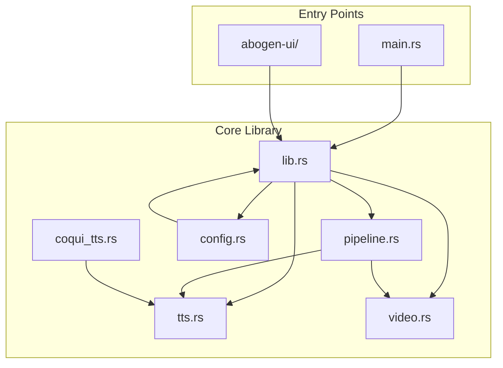
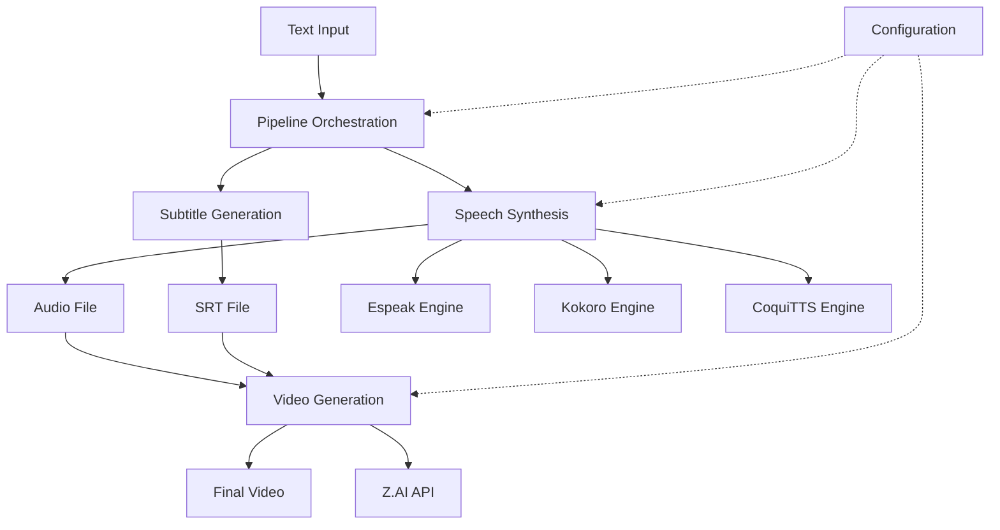
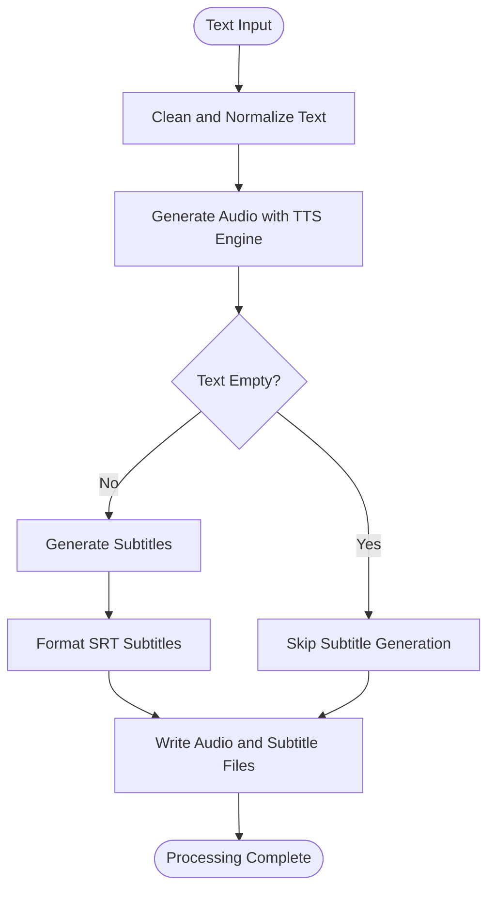
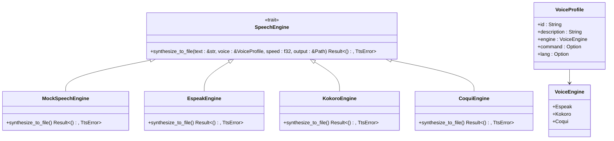
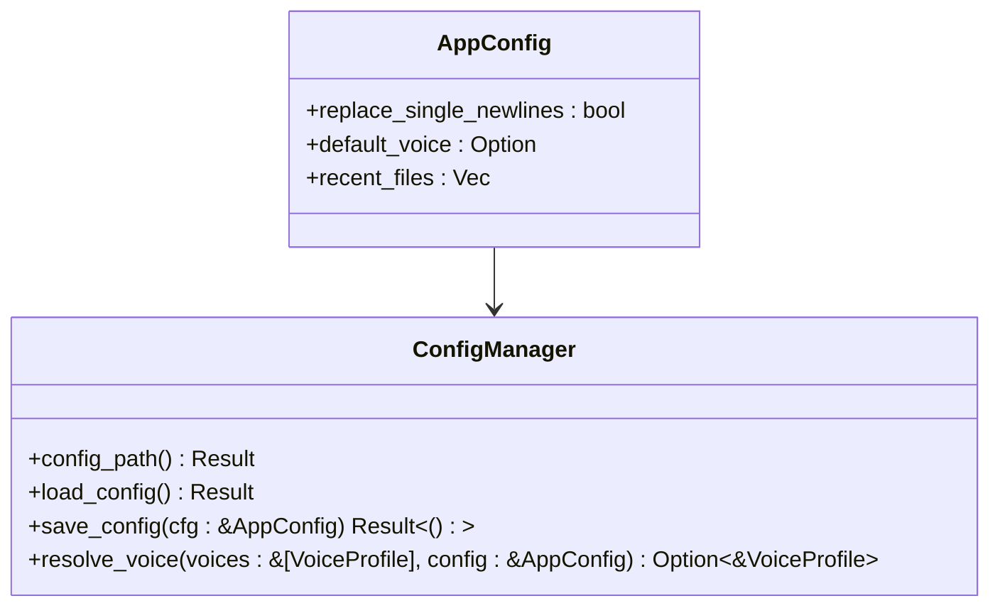
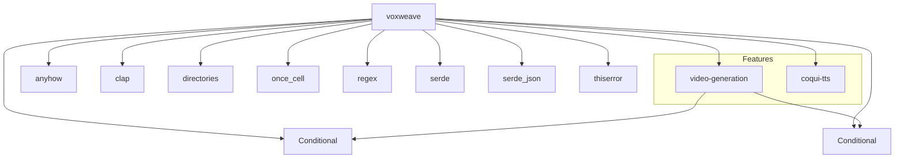

# Core Library

<cite>
**Referenced Files in This Document**   
- [src/lib.rs](file://src/lib.rs)
- [src/pipeline.rs](file://src/pipeline.rs)
- [src/tts.rs](file://src/tts.rs)
- [src/video.rs](file://src/video.rs)
- [src/config.rs](file://src/config.rs)
- [src/coqui_tts.rs](file://src/coqui_tts.rs)
- [src/main.rs](file://src/main.rs)
</cite>

## Table of Contents
1. [Introduction](#introduction)
2. [Project Structure](#project-structure)
3. [Core Components](#core-components)
4. [Architecture Overview](#architecture-overview)
5. [Detailed Component Analysis](#detailed-component-analysis)
6. [Dependency Analysis](#dependency-analysis)
7. [Performance Considerations](#performance-considerations)
8. [Troubleshooting Guide](#troubleshooting-guide)
9. [Conclusion](#conclusion)

## Introduction
The VoxWeave core library serves as the shared business logic layer for both CLI and UI applications, providing a unified interface for text-to-speech processing, video generation, and pipeline orchestration. This documentation details the architectural design, component relationships, and data flow within the core library, focusing on its role as the central API that enables consistent functionality across different entry points.

## Project Structure
The project follows a modular Rust crate structure with clear separation of concerns. The core functionality resides in the `src/` directory, where each module handles a specific aspect of the text-to-speech and video generation pipeline. The library exposes its API through `src/lib.rs`, which re-exports key components for external consumption.



**Diagram sources **
- [src/lib.rs](file://src/lib.rs#L1-L13)
- [src/pipeline.rs](file://src/pipeline.rs#L1-L139)
- [src/tts.rs](file://src/tts.rs#L1-L522)
- [src/video.rs](file://src/video.rs#L1-L461)
- [src/config.rs](file://src/config.rs#L1-L117)
- [src/coqui_tts.rs](file://src/coqui_tts.rs#L1-L115)
- [src/main.rs](file://src/main.rs#L1-L423)

**Section sources**
- [src/lib.rs](file://src/lib.rs#L1-L13)
- [src/pipeline.rs](file://src/pipeline.rs#L1-L139)
- [src/tts.rs](file://src/tts.rs#L1-L522)
- [src/video.rs](file://src/video.rs#L1-L461)
- [src/config.rs](file://src/config.rs#L1-L117)
- [src/coqui_tts.rs](file://src/coqui_tts.rs#L1-L115)
- [src/main.rs](file://src/main.rs#L1-L423)

## Core Components
The VoxWeave core library is organized into several key components that work together to provide text-to-speech and video generation functionality. The central API is exposed through `src/lib.rs`, which serves as the entry point for both CLI and UI applications. This module re-exports the pipeline functionality and conditionally includes the video generation module based on feature flags.

The library's modular design separates concerns into distinct components: `pipeline.rs` handles processing orchestration, `tts.rs` provides speech synthesis abstraction, `video.rs` manages AI video generation via the Z.AI API, and `config.rs` handles configuration management. This separation allows for independent development and testing of each component while maintaining a cohesive API surface.

**Section sources**
- [src/lib.rs](file://src/lib.rs#L1-L13)
- [src/pipeline.rs](file://src/pipeline.rs#L1-L139)
- [src/tts.rs](file://src/tts.rs#L1-L522)
- [src/video.rs](file://src/video.rs#L1-L461)
- [src/config.rs](file://src/config.rs#L1-L117)

## Architecture Overview
The VoxWeave core library follows a layered architecture with clear separation between the API interface, business logic, and external integrations. At the center is the pipeline module, which orchestrates the text-to-speech and video generation workflow by coordinating between the TTS engine, subtitle generator, and video generation service.



**Diagram sources **
- [src/pipeline.rs](file://src/pipeline.rs#L1-L139)
- [src/tts.rs](file://src/tts.rs#L1-L522)
- [src/video.rs](file://src/video.rs#L1-L461)
- [src/config.rs](file://src/config.rs#L1-L117)

## Detailed Component Analysis

### Pipeline Orchestration
The pipeline component serves as the central orchestrator for the text-to-speech and video generation workflow. It coordinates the processing of text input through audio generation, subtitle creation, and video synthesis. The `convert_path` function handles the core processing flow, taking a text file as input and producing audio and subtitle outputs.



**Diagram sources **
- [src/pipeline.rs](file://src/pipeline.rs#L1-L139)

**Section sources**
- [src/pipeline.rs](file://src/pipeline.rs#L1-L139)

### Text-to-Speech Abstraction
The TTS component provides a trait-based abstraction for speech synthesis, enabling multiple TTS engines to be integrated through a common interface. The `SpeechEngine` trait defines the contract for audio generation, while concrete implementations exist for espeak-ng, Kokoro, and CoquiTTS engines.



**Diagram sources **
- [src/tts.rs](file://src/tts.rs#L1-L522)
- [src/coqui_tts.rs](file://src/coqui_tts.rs#L1-L115)

**Section sources**
- [src/tts.rs](file://src/tts.rs#L1-L522)
- [src/coqui_tts.rs](file://src/coqui_tts.rs#L1-L115)

### Video Generation Service
The video component provides AI video generation functionality using the Z.AI API. It handles the complete workflow from audio upload to video download, including subtitle embedding. The service is conditionally compiled based on the `video-generation` feature flag, allowing for flexible deployment options.

```mermaid
sequenceDiagram
participant Client as "Client Application"
participant Service as "VideoGenerationService"
participant ZAI as "Z.AI API"
Client->>Service : generate_video(audio_path, subtitle_path, config)
Service->>Service : Upload audio file
Service->>ZAI : POST /upload
ZAI-->>Service : File URL
Service->>Service : Create video generation job
Service->>ZAI : POST /video/generate
ZAI-->>Service : Job ID
Service->>Service : Poll job status
loop Every 1 second
Service->>ZAI : GET /video/status/{job_id}
ZAI-->>Service : Status update
alt Job completed
break
end
end
Service->>Service : Download generated video
Service->>ZAI : GET video_url
ZAI-->>Service : Video data
Service->>Service : Embed subtitles (if provided)
Service-->>Client : Video file path
```

**Diagram sources **
- [src/video.rs](file://src/video.rs#L1-L461)

**Section sources**
- [src/video.rs](file://src/video.rs#L1-L461)

### Configuration Management
The configuration component handles application settings persistence and retrieval. It manages user preferences such as default voice selection, newline handling, and recent file history. Configuration is stored in a JSON file in the platform-specific application directory.



**Diagram sources **
- [src/config.rs](file://src/config.rs#L1-L117)

**Section sources**
- [src/config.rs](file://src/config.rs#L1-L117)

## Dependency Analysis
The core library has a well-defined dependency structure with clear boundaries between components. The `Cargo.toml` file specifies the required dependencies and feature flags that control conditional compilation of video generation capabilities.



**Diagram sources **
- [Cargo.toml](file://Cargo.toml#L1-L26)

**Section sources**
- [Cargo.toml](file://Cargo.toml#L1-L26)

## Performance Considerations
The library leverages async processing with tokio for I/O-bound operations, particularly in the video generation component which interacts with external APIs. The TTS engines use synchronous processing for audio synthesis, but the pipeline can be executed in a blocking task when used in async contexts.

Feature flags are used to conditionally compile video generation capabilities, reducing binary size and dependencies when this functionality is not needed. The mock TTS engine provides a fast alternative for testing and development, avoiding the overhead of actual audio synthesis.

The architecture supports parallel processing through the use of async/await patterns and tokio's runtime, allowing multiple operations to proceed concurrently when appropriate. Error handling is comprehensive, with detailed error types and context propagation using the anyhow crate.

## Troubleshooting Guide
Common issues with the core library typically relate to missing dependencies, configuration problems, or API key requirements. For TTS functionality, ensure that the required backend (espeak-ng, Python with Kokoro, or CoquiTTS) is properly installed and accessible.

For video generation, verify that the ZAI_API_KEY environment variable is set when the video-generation feature is enabled. The library provides detailed error messages and logging to help diagnose issues, with progress callbacks available for long-running operations like video generation.

Configuration issues can be resolved by checking the config.json file in the application directory or by setting the VOXWEAVE_CONFIG_DIR environment variable to specify a custom configuration location.

**Section sources**
- [src/video.rs](file://src/video.rs#L1-L461)
- [src/tts.rs](file://src/tts.rs#L1-L522)
- [src/config.rs](file://src/config.rs#L1-L117)

## Conclusion
The VoxWeave core library provides a robust, modular foundation for text-to-speech and video generation applications. Its trait-based design enables flexible integration of multiple TTS engines, while the pipeline orchestration ensures consistent processing across different entry points. The conditional compilation of video generation capabilities allows for flexible deployment options, and the comprehensive error handling provides a reliable foundation for both CLI and UI applications.

The library's architecture demonstrates effective separation of concerns, with clear boundaries between components and well-defined interfaces. This design enables independent development and testing of each component while maintaining a cohesive API surface for external consumers.