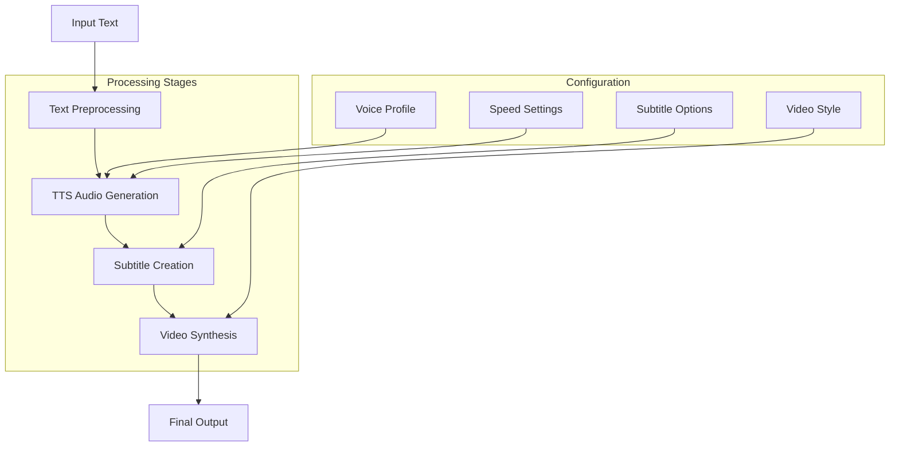
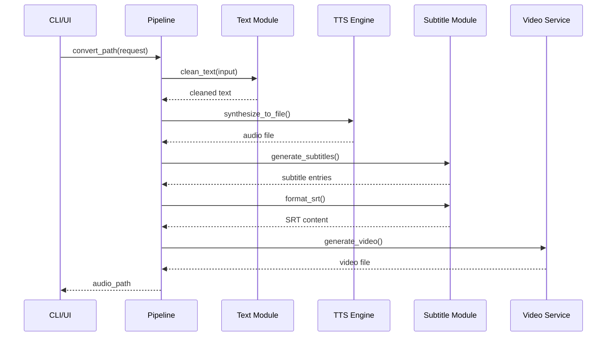
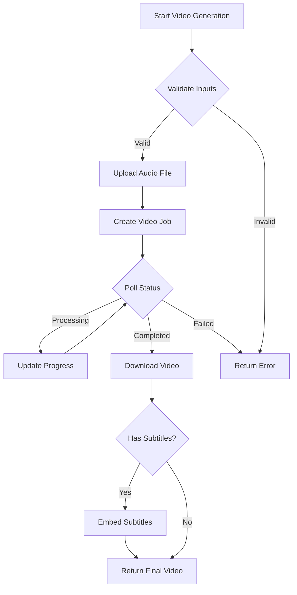
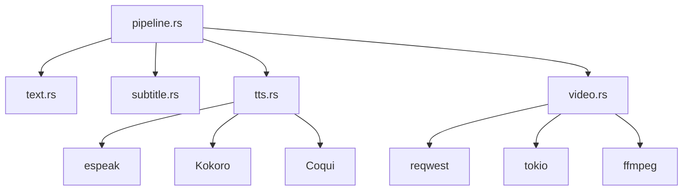

# Pipeline Orchestration

<cite>
**Referenced Files in This Document**  
- [pipeline.rs](file://src/pipeline.rs)
- [tts.rs](file://src/tts.rs)
- [video.rs](file://src/video.rs)
- [queue.rs](file://src/queue.rs)
- [main.rs](file://src/main.rs)
- [text.rs](file://src/text.rs)
- [subtitle.rs](file://src/subtitle.rs)
- [lib.rs](file://src/lib.rs)
</cite>

## Table of Contents
1. [Introduction](#introduction)
2. [Core Components](#core-components)
3. [Architecture Overview](#architecture-overview)
4. [Detailed Component Analysis](#detailed-component-analysis)
5. [Dependency Analysis](#dependency-analysis)
6. [Performance Considerations](#performance-considerations)
7. [Troubleshooting Guide](#troubleshooting-guide)
8. [Conclusion](#conclusion)

## Introduction
The VoxWeave pipeline orchestration system provides a comprehensive text-to-video conversion workflow that coordinates text preprocessing, audio generation, subtitle creation, and video synthesis. Built as a modular Rust library, the pipeline enables both CLI and UI applications to transform text content into synchronized multimedia outputs with professional-quality narration and visual elements. The system is designed with clean interfaces between components, robust error handling through the anyhow crate, and flexible configuration options for voice, speed, and video styling. This document details the architecture and implementation of the pipeline, focusing on its role in coordinating the end-to-end conversion process.

## Core Components

The pipeline system consists of several interconnected components that handle different stages of the text-to-video conversion process. The core orchestration logic resides in `pipeline.rs`, which coordinates the workflow by integrating text processing, TTS synthesis, and video generation services. The system uses the `anyhow` crate for unified error propagation across all stages, ensuring consistent error handling throughout the pipeline. Text preprocessing is handled by the `text` module, which cleans and normalizes input text before processing. Subtitle generation is managed by the `subtitle` module, which creates timed captions synchronized with the audio output. The TTS functionality is abstracted through the `SpeechEngine` trait, allowing multiple backend implementations including espeak, Kokoro, and Coqui. For video synthesis, the system integrates with external APIs through the `VideoGenerationService`, supporting various visual styles and resolutions.

**Section sources**
- [pipeline.rs](file://src/pipeline.rs#L1-L140)
- [tts.rs](file://src/tts.rs#L1-L523)
- [video.rs](file://src/video.rs#L1-L462)
- [queue.rs](file://src/queue.rs#L1-L157)

## Architecture Overview

The VoxWeave pipeline follows a sequential orchestration pattern where each stage processes the output of the previous stage, creating a cohesive text-to-video conversion workflow. The architecture is designed with clear separation of concerns, allowing each component to be developed and tested independently while maintaining integration through well-defined interfaces.

**Diagram sources**  
- [pipeline.rs](file://src/pipeline.rs#L1-L140)
- [text.rs](file://src/text.rs#L1-L71)
- [subtitle.rs](file://src/subtitle.rs#L1-L157)
- [video.rs](file://src/video.rs#L1-L462)

## Detailed Component Analysis

### Pipeline Orchestration Analysis
The pipeline module serves as the central coordinator for the text-to-video conversion process, implementing two primary functions: `convert_path` for single-file processing and `convert_queue` for batch operations. The `ConvertRequest` struct encapsulates all configuration parameters needed for conversion, including source path, output directory, voice profile, speed settings, and subtitle options. The pipeline follows a sequential execution model where text is first cleaned and normalized, then converted to speech audio, followed by subtitle generation, and finally video synthesis when enabled. Error handling is implemented consistently using the `anyhow` crate, with contextual information added at each stage to facilitate debugging. The modular design allows the pipeline to work with any TTS engine that implements the `SpeechEngine` trait, promoting flexibility and extensibility.

**Diagram sources**  
- [pipeline.rs](file://src/pipeline.rs#L1-L140)
- [text.rs](file://src/text.rs#L1-L71)
- [subtitle.rs](file://src/subtitle.rs#L1-L157)
- [video.rs](file://src/video.rs#L1-L462)

**Section sources**
- [pipeline.rs](file://src/pipeline.rs#L1-L140)
- [text.rs](file://src/text.rs#L1-L71)
- [subtitle.rs](file://src/subtitle.rs#L1-L157)

### TTS Engine Integration
The TTS system is designed with a trait-based architecture that abstracts the underlying speech synthesis engine, allowing multiple implementations to coexist within the same application. The `SpeechEngine` trait defines a common interface for audio generation, enabling the pipeline to work with different backends without modification. Currently supported engines include espeak for basic text-to-speech, Kokoro for neural voice synthesis, and Coqui for advanced voice cloning capabilities. Each engine implementation handles its specific configuration requirements while presenting a unified interface to the pipeline. The `VoiceProfile` struct encapsulates engine-specific settings, including voice identifiers, language codes, and command-line parameters. This abstraction layer allows users to switch between different TTS technologies based on their quality requirements, language support, and performance constraints.

**Section sources**
- [tts.rs](file://src/tts.rs#L1-L523)
- [pipeline.rs](file://src/pipeline.rs#L1-L140)

### Video Generation Service
The video generation component integrates with external AI video services through a REST API interface, transforming audio and subtitle inputs into synchronized video outputs with various visual styles. The `VideoGenerationService` manages the complete lifecycle of video creation, from uploading source assets to polling job status and downloading the final output. The service supports multiple visual styles including cyberpunk, biotech, cinematic, and educational themes, each with distinct aesthetic characteristics. Video resolution can be configured at 720p, 1080p, or 4K, with output formats including MP4, MOV, and WebM. The system handles API authentication through environment variables and implements robust error handling for network failures and service timeouts. When subtitles are available, they are embedded into the video using ffmpeg, or provided as external files if ffmpeg is not available.

**Diagram sources**  
- [video.rs](file://src/video.rs#L1-L462)
- [pipeline.rs](file://src/pipeline.rs#L1-L140)

**Section sources**
- [video.rs](file://src/video.rs#L1-L462)
- [pipeline.rs](file://src/pipeline.rs#L1-L140)

## Dependency Analysis

The pipeline system has a well-defined dependency structure that promotes loose coupling between components while maintaining clear integration points. The core dependency chain flows from the pipeline module, which depends on text processing, TTS, and subtitle generation modules, with optional integration to the video generation service. The TTS system has minimal dependencies, primarily relying on standard library components and external command-line tools for audio synthesis. The video generation service depends on async networking libraries (reqwest and tokio) for API communication, with ffmpeg as an optional dependency for subtitle embedding. Configuration is managed through a separate module that handles loading and saving user preferences. The use of feature flags allows conditional compilation of components like Coqui TTS and video generation, enabling lightweight builds when advanced features are not required.

**Diagram sources**  
- [lib.rs](file://src/lib.rs#L1-L14)
- [pipeline.rs](file://src/pipeline.rs#L1-L140)
- [tts.rs](file://src/tts.rs#L1-L523)
- [video.rs](file://src/video.rs#L1-L462)

**Section sources**
- [lib.rs](file://src/lib.rs#L1-L14)
- [pipeline.rs](file://src/pipeline.rs#L1-L140)
- [tts.rs](file://src/tts.rs#L1-L523)
- [video.rs](file://src/video.rs#L1-L462)

## Performance Considerations
The pipeline is designed to handle long-running operations efficiently through asynchronous processing and resource management strategies. For video generation tasks, the system uses tokio's async runtime to manage network I/O and polling operations without blocking the main thread. The TTS engines are implemented to stream audio data directly to disk, minimizing memory usage during synthesis. Text processing is optimized for performance using regex caching with the `once_cell` crate, ensuring that pattern compilation occurs only once. The queue system allows batch processing of multiple files, enabling efficient resource utilization when converting large collections of text content. For UI applications, progress callbacks provide real-time feedback on operation status, while log callbacks deliver detailed information about processing stages. The system implements retry logic for network-dependent operations like video generation, with configurable timeout limits to prevent indefinite waiting.

## Troubleshooting Guide
Common pipeline failures typically stem from missing dependencies, configuration issues, or API connectivity problems. For TTS failures, verify that the required speech engine (espeak, Python for Kokoro/Coqui) is installed and accessible in the system PATH. When using neural TTS engines, ensure that the appropriate Python environment is configured with the required packages. For video generation errors, confirm that the ZAI_API_KEY or OPENAI_API_KEY environment variable is set correctly, or ALIBABA_API_KEY for the wan2.5-t2v-preview model. Network connectivity issues may require checking firewall settings or proxy configurations. If subtitle embedding fails, verify that ffmpeg is installed and accessible. The system provides detailed error messages through the anyhow crate, with contextual information about the failing operation. For debugging, enable verbose logging to trace the execution flow and identify the specific stage where failures occur.

**Section sources**
- [pipeline.rs](file://src/pipeline.rs#L1-L140)
- [tts.rs](file://src/tts.rs#L1-L523)
- [video.rs](file://src/video.rs#L1-L462)
- [main.rs](file://src/main.rs#L1-L424)

## Conclusion
The VoxWeave pipeline orchestration system provides a robust and flexible framework for converting text content into synchronized audio-visual outputs. By coordinating text preprocessing, TTS synthesis, subtitle creation, and video generation through a modular architecture, the system enables high-quality multimedia production with minimal user intervention. The clean separation of concerns between components, combined with consistent error handling and flexible configuration options, makes the pipeline suitable for both automated batch processing and interactive UI applications. The integration with external AI services for video generation expands the system's capabilities beyond simple audio output, enabling the creation of professional-quality videos with diverse visual styles. Future enhancements could include support for additional TTS engines, improved subtitle formatting options, and enhanced video post-processing capabilities.