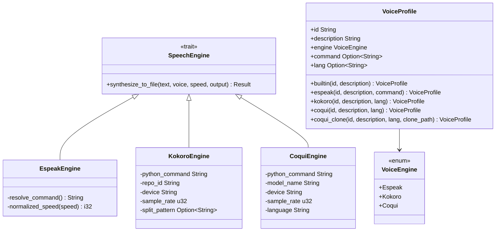
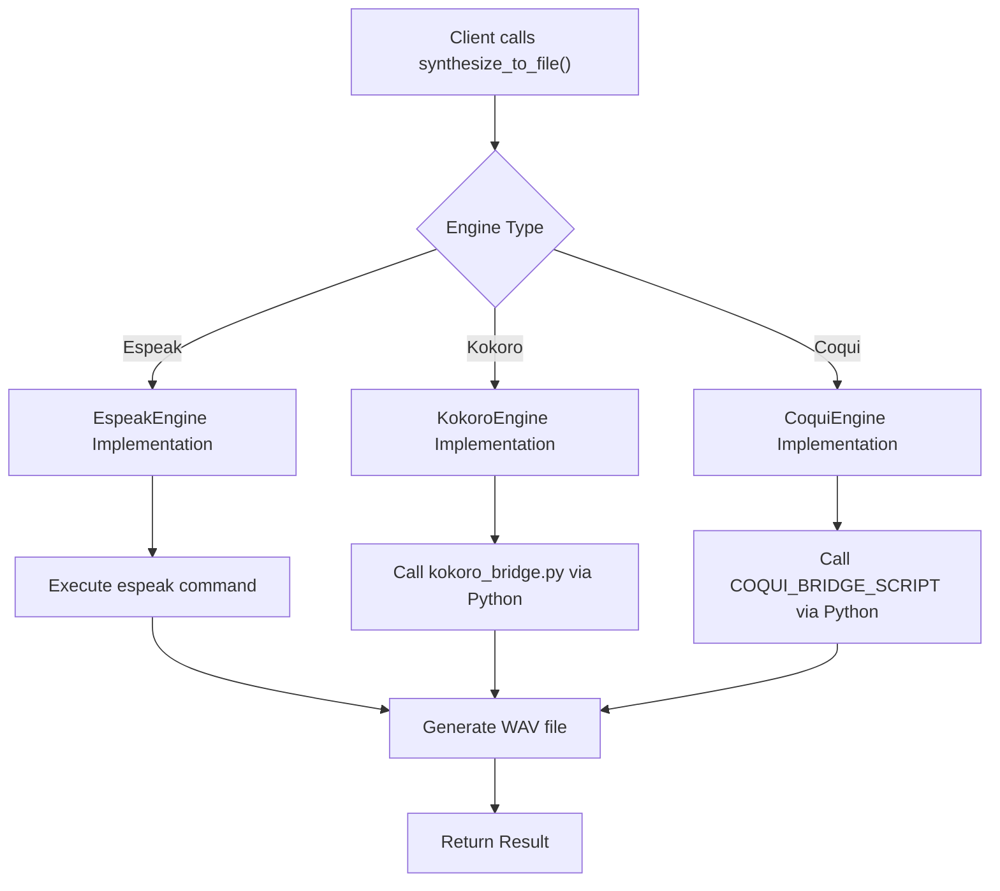
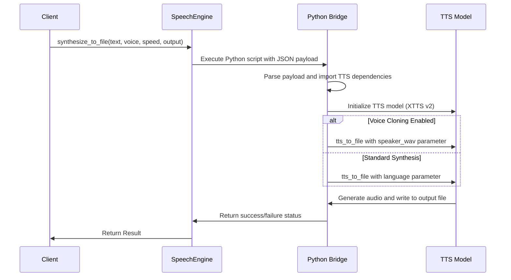
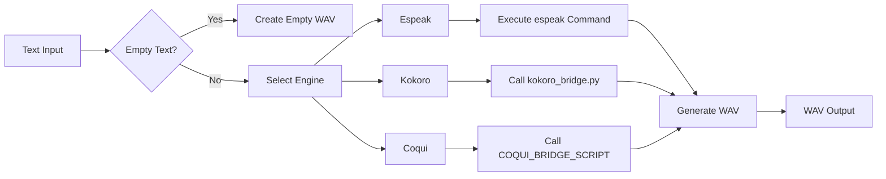

# TTS Engine Abstraction

<cite>
**Referenced Files in This Document**   
- [tts.rs](file://src/tts.rs)
- [coqui_tts.rs](file://src/coqui_tts.rs)
- [kokoro_bridge.py](file://python/kokoro_bridge.py)
- [tts_service.rs](file://abogen-ui/crates/ui/services/tts_service.rs)
</cite>

## Table of Contents
1. [Introduction](#introduction)
2. [Core Components](#core-components)
3. [Engine Trait Interface](#engine-trait-interface)
4. [Engine Implementations](#engine-implementations)
5. [Voice Profile System](#voice-profile-system)
6. [Audio Processing Pipeline](#audio-processing-pipeline)
7. [Integration and Usage](#integration-and-usage)
8. [Common Issues and Troubleshooting](#common-issues-and-troubleshooting)
9. [Performance Optimization](#performance-optimization)

## Introduction
The TTS engine abstraction layer in VoxWeave provides a unified interface for multiple text-to-speech engines, enabling seamless integration of espeak-ng, Kokoro, and CoquiTTS. This document details the trait-based design that standardizes interaction across these diverse TTS systems, focusing on the implementation in src/tts.rs. The abstraction layer allows applications to switch between different TTS engines without modifying client code, while providing specialized functionality for advanced features like voice cloning.

**Section sources**
- [tts.rs](file://src/tts.rs#L1-L50)

## Core Components

The TTS engine abstraction consists of several key components that work together to provide a flexible and extensible text-to-speech system. At the core is the `SpeechEngine` trait, which defines a common interface for all TTS engines. Three concrete implementations—`EspeakEngine`, `KokoroEngine`, and `CoquiEngine`—provide engine-specific functionality while adhering to this common interface. The `VoiceProfile` struct encapsulates voice configuration across all engines, and the factory pattern in `new_engine()` selects the appropriate engine based on configuration.

The system leverages external processes for TTS generation, with Python bridges for more complex engines like Kokoro and CoquiTTS. This architecture allows the Rust application to maintain control over the TTS workflow while delegating the actual speech synthesis to specialized tools that may have complex dependencies or require different runtime environments.

**Diagram sources**
- [tts.rs](file://src/tts.rs#L100-L300)
- [coqui_tts.rs](file://src/coqui_tts.rs#L10-L50)

## Engine Trait Interface

The `SpeechEngine` trait defines the contract that all TTS engines must implement, providing a consistent API for text-to-speech synthesis. The primary method, `synthesize_to_file`, takes text input, a voice profile, speed adjustment, and an output path, returning a Result indicating success or failure. This trait-based approach enables polymorphism, allowing the application to work with any engine that implements the interface without knowing the specific engine type at compile time.

The trait is designed to be simple yet flexible, focusing on the essential functionality needed for TTS generation. Error handling is standardized through the `TtsError` enum, which provides descriptive error messages for various failure modes including unsupported voices, command execution failures, and audio backend issues. This consistent error handling makes it easier for client code to manage failures regardless of which engine is being used.

**Diagram sources**
- [tts.rs](file://src/tts.rs#L100-L150)
- [tts.rs](file://src/tts.rs#L190-L250)
- [coqui_tts.rs](file://src/coqui_tts.rs#L50-L80)

**Section sources**
- [tts.rs](file://src/tts.rs#L100-L150)

## Engine Implementations

### EspeakEngine
The `EspeakEngine` provides a straightforward implementation that directly invokes the espeak command-line tool. It handles voice selection by mapping the voice ID to espeak's voice naming convention and adjusts speech speed by calculating a rate parameter based on a base rate of 175 words per minute. The engine pipes text input to espeak's stdin, allowing for efficient processing of large text inputs without temporary files.

### KokoroEngine
The `KokoroEngine` implementation uses a Python bridge script (kokoro_bridge.py) to interface with the Kokoro TTS system. It passes configuration parameters and text input to the Python script via JSON payload over stdin, leveraging Python's capabilities for more complex TTS models. The engine supports configurable parameters including repository ID, device (CPU/GPU), sample rate, and text splitting patterns, making it adaptable to different deployment scenarios.

### CoquiEngine
The `CoquiEngine` implements voice cloning capabilities through the CoquiTTS XTTS model. Like KokoroEngine, it uses a Python bridge but with additional functionality for speaker adaptation. When a voice profile includes a reference audio path in its command field, the engine enables voice cloning mode, allowing the synthesis of speech in the voice of the speaker from the reference audio. This implementation demonstrates how the abstraction layer can support advanced features while maintaining the same interface as simpler engines.

**Diagram sources**
- [tts.rs](file://src/tts.rs#L190-L300)
- [coqui_tts.rs](file://src/coqui_tts.rs#L50-L100)
- [kokoro_bridge.py](file://python/kokoro_bridge.py#L1-L90)

**Section sources**
- [tts.rs](file://src/tts.rs#L150-L300)
- [coqui_tts.rs](file://src/coqui_tts.rs#L10-L100)

## Voice Profile System

The `VoiceProfile` struct serves as a unified representation of voice configurations across different TTS engines. Each voice profile includes an ID, description, engine type, optional command parameter, and optional language code. The struct provides constructor methods for each engine type, making it easy to create properly configured voice profiles. For espeak, the command field stores the voice name used by espeak; for Coqui voice cloning, it stores the path to the reference audio file.

The system includes predefined voice profiles for espeak and Kokoro engines, with the ability to extend support to additional voices. The `default_voice_profiles()` function returns a comprehensive list of available voices, while `find_voice()` allows clients to lookup a specific voice by ID. This design enables the application to present a unified voice selection interface to users, regardless of the underlying engine technology.

**Section sources**
- [tts.rs](file://src/tts.rs#L50-L100)

## Audio Processing Pipeline

The audio processing pipeline begins with text input and ends with a WAV output file, with several processing stages in between. For all engines, empty text input results in an empty WAV file with proper headers, ensuring consistent behavior. The pipeline handles speed adjustment differently for each engine: espeak uses a rate parameter, while Kokoro and Coqui pass speed as a parameter to their respective Python bridges.

For CoquiTTS, the pipeline includes voice cloning when a reference audio path is provided in the voice profile. The Python bridge script checks for the presence of the speaker_wav parameter and uses it to adapt the voice model to match the speaker in the reference audio. The bridge also handles model loading, device selection (CPU/GPU), and audio format conversion, ensuring the output is a standard WAV file with the specified sample rate.

Silence padding is handled implicitly by the underlying TTS engines, with the abstraction layer ensuring consistent audio quality across different engines. The pipeline also includes error handling for common issues such as missing dependencies, failed model loading, and audio device errors, providing meaningful error messages to aid in troubleshooting.

**Diagram sources**
- [tts.rs](file://src/tts.rs#L200-L300)
- [kokoro_bridge.py](file://python/kokoro_bridge.py#L50-L80)
- [tts.rs](file://src/tts.rs#L450-L520)

## Integration and Usage

The TTS engine abstraction is integrated into the application through the `tts_service.rs` file in the UI layer. The service uses `tokio::task::spawn_blocking` to run TTS synthesis in separate threads, preventing UI freezing during potentially long-running synthesis operations. The service determines which engine to use based on the voice profile's engine field, creating the appropriate engine instance and calling its `synthesize_to_file` method.

For CoquiTTS integration, the system requires Python dependencies (TTS, torch, numpy) to be installed in the Python environment. The `COQUI_USAGE_GUIDE.md` provides detailed instructions for setting up the Python environment and testing the installation. Voice cloning is enabled by creating a `VoiceProfile` using the `coqui_clone` constructor, which stores the path to the reference audio file in the command field.

Environment variables allow configuration of engine behavior without code changes:
- `VOXWEAVE_ESPEAK_COMMAND`: Path to espeak executable
- `VOXWEAVE_KOKORO_PYTHON`: Python command for Kokoro bridge
- `VOXWEAVE_COQUI_PYTHON`: Python command for Coqui bridge
- `VOXWEAVE_COQUI_MODEL`: CoquiTTS model name
- `VOXWEAVE_COQUI_DEVICE`: Device for CoquiTTS (cpu/cuda)

**Section sources**
- [tts_service.rs](file://abogen-ui/crates/ui/services/tts_service.rs#L200-L300)
- [tts.rs](file://src/tts.rs#L1-L50)

## Common Issues and Troubleshooting

### Python Environment Setup
The most common integration issue is an improperly configured Python environment for Kokoro and Coqui engines. Ensure that Python 3 is available and that the required packages (TTS, torch, numpy) are installed. Use the `test_coqui.py` script to verify the Python installation. If using a virtual environment, ensure the `VOXWEAVE_COQUI_PYTHON` environment variable points to the correct Python executable.

### Model Loading Failures
CoquiTTS may fail to load models due to insufficient disk space, network issues during model download, or incompatible hardware. The first run downloads the model (approximately 2GB for XTTS v2), so ensure adequate storage and stable internet connection. For GPU acceleration, verify CUDA compatibility and install appropriate PyTorch version.

### Audio Quality Optimization
For optimal audio quality, use high-quality reference audio for voice cloning (16kHz or higher, minimal background noise). Adjust the speed parameter to match natural speech patterns (0.8-1.2 typically works well). For CoquiTTS, ensure the reference audio is at least 3-5 seconds of clear speech for effective voice cloning.

**Section sources**
- [tts.rs](file://src/tts.rs#L450-L520)
- [kokoro_bridge.py](file://python/kokoro_bridge.py#L1-L20)
- [COQUI_TTS_IMPLEMENTATION.md](file://COQUI_TTS_IMPLEMENTATION.md#L1-L50)

## Performance Optimization

For batch processing of large texts, consider the following optimizations:
- Process multiple items concurrently using separate engine instances
- Pre-load frequently used voices to avoid repeated initialization
- Use appropriate chunking for very long texts to manage memory usage
- Cache synthesized audio for frequently used phrases

Memory usage can be optimized by:
- Using CPU instead of GPU for CoquiTTS when memory is constrained
- Processing one item at a time in memory-limited environments
- Monitoring Python process memory when using the bridge scripts
- Using the default 24kHz sample rate instead of higher rates when audio quality requirements allow

The abstraction layer's design supports these optimizations by keeping engine instances lightweight and stateless, allowing multiple instances to run concurrently without interference.

**Section sources**
- [tts.rs](file://src/tts.rs#L1-L50)
- [coqui_tts.rs](file://src/coqui_tts.rs#L1-L20)
- [tts_service.rs](file://abogen-ui/crates/ui/services/tts_service.rs#L200-L300)