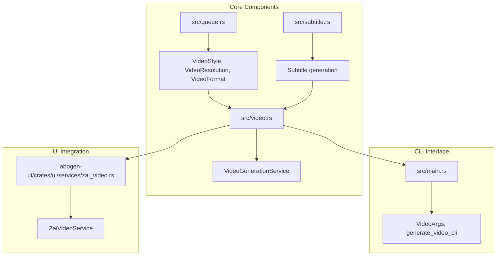
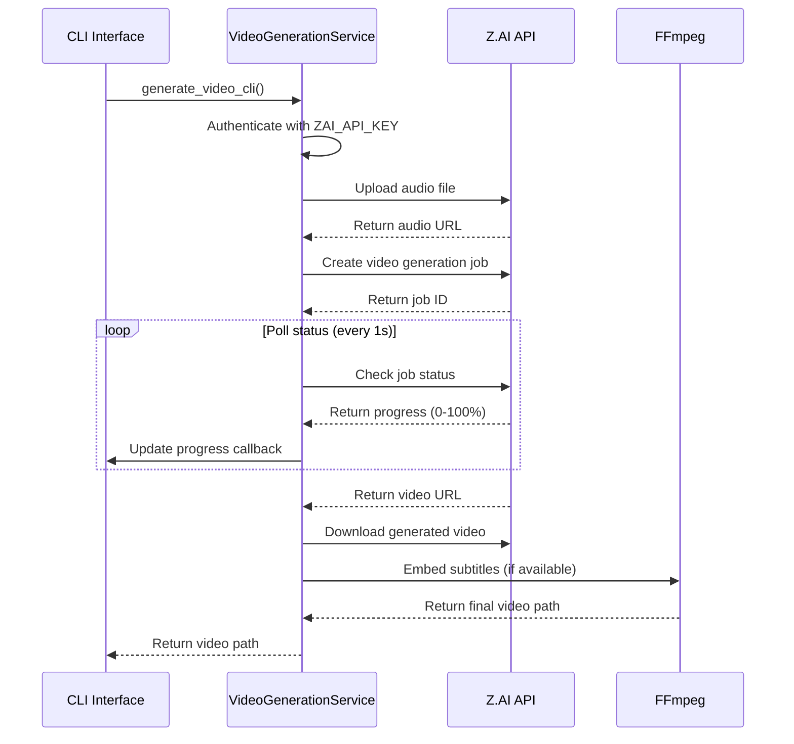
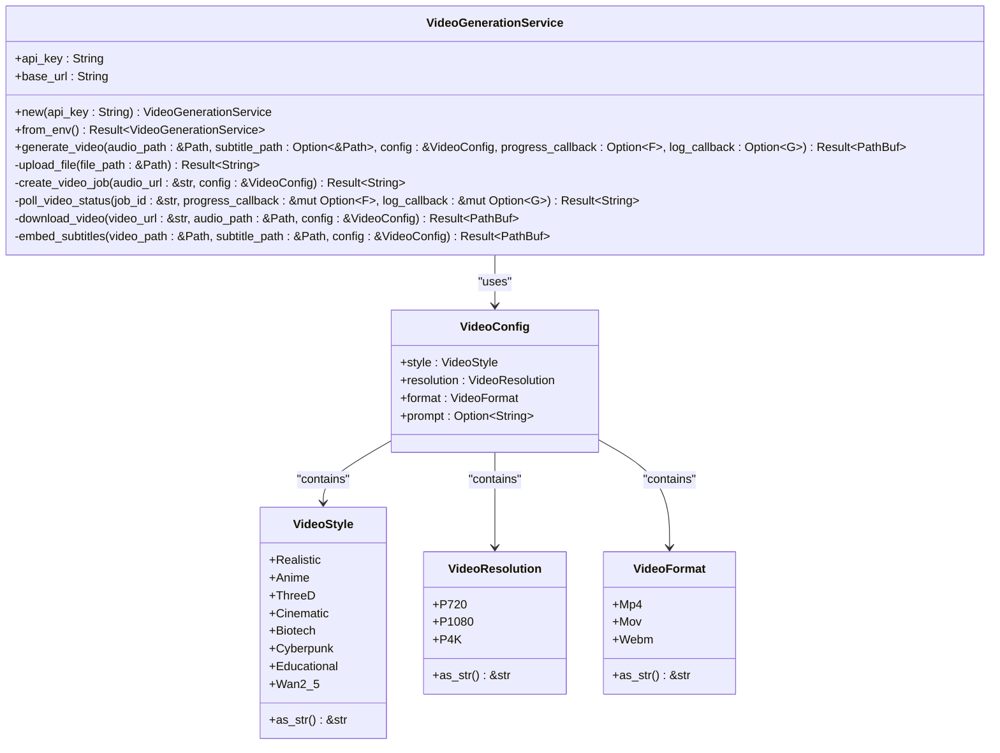
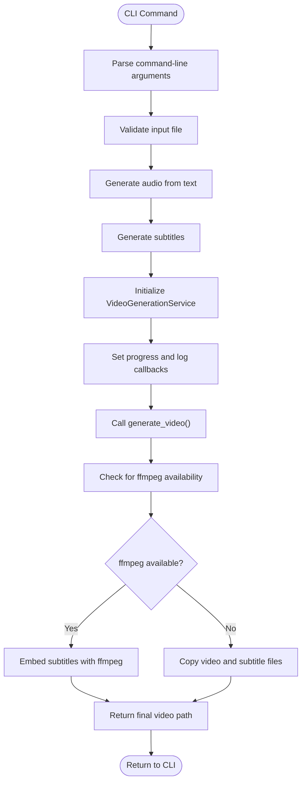
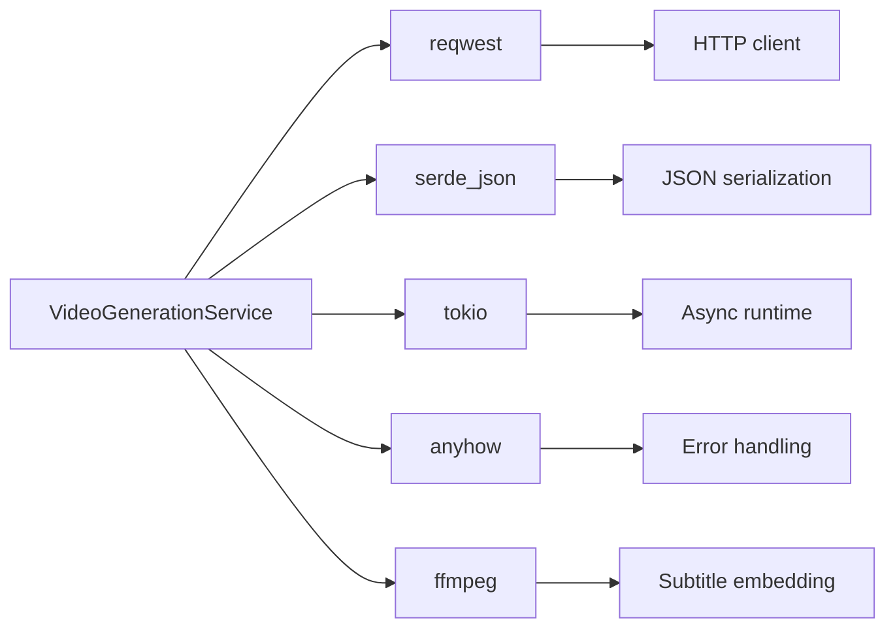

# Video Generation Service

<cite>
**Referenced Files in This Document**   
- [src/video.rs](file://src/video.rs)
- [src/main.rs](file://src/main.rs)
- [src/queue.rs](file://src/queue.rs)
- [src/subtitle.rs](file://src/subtitle.rs)
- [Cargo.toml](file://Cargo.toml)
- [CLI_VIDEO_GENERATION.md](file://CLI_VIDEO_GENERATION.md)
- [VIDEO_CLI_QUICKREF.md](file://VIDEO_CLI_QUICKREF.md)
- [abogen-ui/crates/ui/services/zai_video.rs](file://abogen-ui/crates/ui/services/zai_video.rs)
</cite>

## Table of Contents
1. [Introduction](#introduction)
2. [Project Structure](#project-structure)
3. [Core Components](#core-components)
4. [Architecture Overview](#architecture-overview)
5. [Detailed Component Analysis](#detailed-component-analysis)
6. [Dependency Analysis](#dependency-analysis)
7. [Performance Considerations](#performance-considerations)
8. [Troubleshooting Guide](#troubleshooting-guide)
9. [Conclusion](#conclusion)

## Introduction
The Video Generation Service in VoxWeave provides AI-powered video creation capabilities by integrating with the Z.AI API. This service enables users to generate videos from audio and text inputs with various visual styles, resolutions, and formats. The implementation supports both CLI and GUI applications, offering a comprehensive solution for automated video content creation. The service handles the complete lifecycle from authentication and file upload to video generation, status polling, download, and subtitle embedding.

## Project Structure
The video generation functionality is organized across multiple components in the VoxWeave repository. The core implementation resides in `src/video.rs`, while supporting components are distributed across the codebase.

**Diagram sources**
- [src/video.rs](file://src/video.rs)
- [src/queue.rs](file://src/queue.rs)
- [src/subtitle.rs](file://src/subtitle.rs)
- [src/main.rs](file://src/main.rs)
- [abogen-ui/crates/ui/services/zai_video.rs](file://abogen-ui/crates/ui/services/zai_video.rs)

**Section sources**
- [src/video.rs](file://src/video.rs)
- [src/queue.rs](file://src/queue.rs)

## Core Components
The Video Generation Service consists of several key components that work together to create AI-powered videos. The `VideoGenerationService` struct in `src/video.rs` serves as the main interface for video creation, handling authentication, API communication, and the complete video generation workflow. The service integrates with the Z.AI API to generate videos from audio inputs, with support for various visual styles, resolutions, and formats.

The `VideoConfig` struct defines the configuration options for video generation, including style, resolution, format, and optional prompts. The service also handles subtitle embedding using ffmpeg when available, providing a complete video creation solution. The implementation is designed to be used by both the CLI and GUI applications, ensuring consistency across different interfaces.

**Section sources**
- [src/video.rs](file://src/video.rs#L1-L50)
- [src/queue.rs](file://src/queue.rs#L1-L50)

## Architecture Overview
The Video Generation Service follows a modular architecture that separates concerns and enables reuse across different application interfaces. The service integrates with the Z.AI API to generate videos from audio inputs, handling the complete lifecycle from authentication to final video delivery.

**Diagram sources**
- [src/video.rs](file://src/video.rs#L66-L101)
- [src/main.rs](file://src/main.rs#L300-L350)

## Detailed Component Analysis

### Video Generation Service Analysis
The `VideoGenerationService` is the core component responsible for integrating with the Z.AI API to generate videos from audio inputs. The service handles authentication, file upload, job creation, status polling, video download, and subtitle embedding.

**Diagram sources**
- [src/video.rs](file://src/video.rs#L50-L461)
- [src/queue.rs](file://src/queue.rs#L1-L50)

**Section sources**
- [src/video.rs](file://src/video.rs#L50-L461)
- [src/queue.rs](file://src/queue.rs#L1-L50)

### CLI Integration Analysis
The CLI interface for video generation is implemented in `src/main.rs` and provides a user-friendly command-line interface for creating videos. The implementation includes comprehensive error handling, progress reporting, and integration with the core video generation service.

**Diagram sources**
- [src/main.rs](file://src/main.rs#L300-L423)
- [src/video.rs](file://src/video.rs#L66-L101)

**Section sources**
- [src/main.rs](file://src/main.rs#L300-L423)

## Dependency Analysis
The Video Generation Service has several dependencies that enable its functionality. The service relies on external crates for HTTP communication, JSON serialization, and asynchronous operations.

**Diagram sources**
- [Cargo.toml](file://Cargo.toml#L1-L27)
- [src/video.rs](file://src/video.rs#L1-L10)

**Section sources**
- [Cargo.toml](file://Cargo.toml#L1-L27)

## Performance Considerations
The Video Generation Service is designed with performance in mind, particularly in handling asynchronous operations and network communication. The service uses tokio for asynchronous operations, allowing non-blocking I/O during file uploads, API calls, and video downloads.

The polling mechanism for video generation status is optimized to balance responsiveness with API rate limits, checking every second for up to 5 minutes. The service also implements efficient error handling to minimize the impact of network failures or API rate limits.

When ffmpeg is available, the service can embed subtitles directly into the video file. If ffmpeg is not available, the service falls back to copying the video and subtitle files separately, ensuring that the video generation process completes successfully even without subtitle embedding.

## Troubleshooting Guide
This section provides guidance for common issues encountered when using the Video Generation Service.

**Authentication Failures**
- Ensure that either `ZAI_API_KEY` or `OPENAI_API_KEY` environment variable is set
- Verify that the API key is valid and has sufficient quota
- Check for typos in the environment variable name

**Incomplete Video Downloads**
- Verify network connectivity during the download phase
- Check available disk space in the output directory
- Ensure the Z.AI API is accessible and not experiencing outages

**Subtitle Embedding Issues**
- Install ffmpeg if subtitle embedding is required
- Verify ffmpeg is in the system PATH
- Check that the subtitle file exists and is accessible

**Video Generation Timeouts**
- The service has a 5-minute timeout for video generation
- Try with shorter audio files if timeouts occur frequently
- Check the Z.AI API status for potential service issues

**Feature Availability**
- Ensure the `video-generation` feature is enabled when building
- Verify that required dependencies are installed
- Check that the environment has the necessary permissions for file operations

**Section sources**
- [src/video.rs](file://src/video.rs#L50-L101)
- [CLI_VIDEO_GENERATION.md](file://CLI_VIDEO_GENERATION.md#L1-L50)
- [VIDEO_CLI_QUICKREF.md](file://VIDEO_CLI_QUICKREF.md#L1-L50)

## Conclusion
The Video Generation Service in VoxWeave provides a robust solution for creating AI-powered videos from audio and text inputs. By integrating with the Z.AI API, the service offers a wide range of visual styles, resolutions, and formats, making it suitable for various use cases. The implementation is well-structured, with clear separation of concerns and comprehensive error handling. The service supports both CLI and GUI interfaces, ensuring accessibility for different types of users. With its modular architecture and efficient design, the Video Generation Service represents a significant enhancement to the VoxWeave platform, enabling automated video content creation with minimal user intervention.