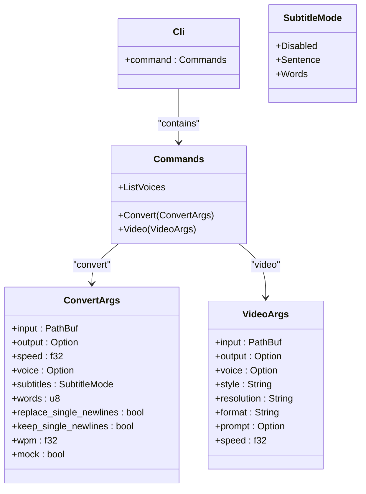
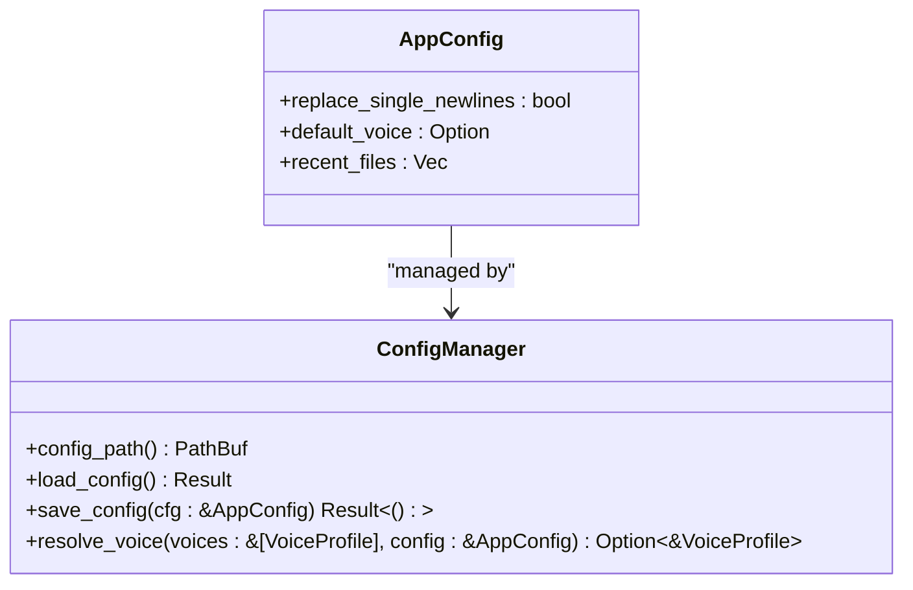
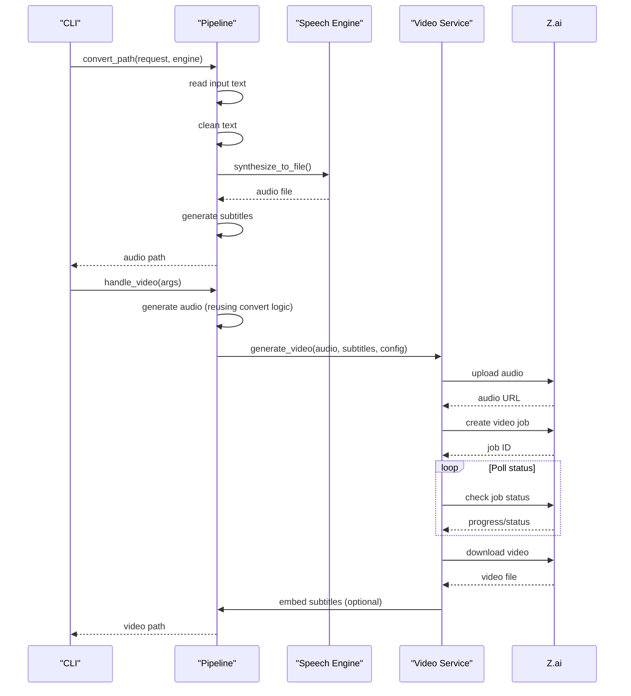
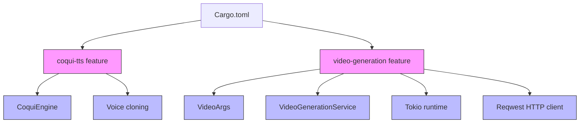

# CLI Entry Point

<cite>
**Referenced Files in This Document**   
- [main.rs](file://src/main.rs)
- [config.rs](file://src/config.rs)
- [pipeline.rs](file://src/pipeline.rs)
- [tts.rs](file://src/tts.rs)
- [video.rs](file://src/video.rs)
- [Cargo.toml](file://Cargo.toml)
- [CLI_VIDEO_GENERATION.md](file://CLI_VIDEO_GENERATION.md)
</cite>

## Table of Contents
1. [Introduction](#introduction)
2. [Command-Line Interface Design](#command-line-interface-design)
3. [Application Initialization and Context](#application-initialization-and-context)
4. [Configuration Management](#configuration-management)
5. [Core Processing Pipeline Integration](#core-processing-pipeline-integration)
6. [Feature Flags and Optional Functionality](#feature-flags-and-optional-functionality)
7. [Automation and Scripting Workflows](#automation-and-scripting-workflows)
8. [Invocation Examples](#invocation-examples)
9. [Conclusion](#conclusion)

## Introduction
The VoxWeave CLI entry point provides a robust command-line interface for text-to-speech conversion and video generation. Built with Rust and leveraging the clap library for command parsing, the CLI offers three primary subcommands: `convert`, `list-voices`, and `video`. The architecture is designed for scriptable automation workflows, enabling batch processing and integration into CI/CD pipelines. This document details the implementation in `src/main.rs`, focusing on command-line interface design, application initialization, configuration handling, and integration with the core processing pipeline.

**Section sources**
- [main.rs](file://src/main.rs#L1-L424)

## Command-Line Interface Design
The CLI interface is implemented using the clap library with derive macros for automatic argument parsing. The main structure consists of a `Cli` struct that serves as the root command, containing subcommands defined through the `Commands` enum. The three primary subcommands are:

- `convert`: For text-to-speech conversion with subtitle generation
- `list-voices`: For displaying available voice profiles
- `video`: For end-to-end video generation (conditionally compiled)

Each subcommand has its own argument structure with comprehensive documentation. The `convert` subcommand accepts input file paths, output directories, voice selection, subtitle configuration, and playback speed. The `video` subcommand extends this with video-specific options including style, resolution, format, and custom visual prompts.

The interface design follows Unix conventions with short and long flag options, default values for non-critical parameters, and clear help text. Error handling is centralized in the `run` function, which catches and displays errors before exiting with an appropriate status code.



**Diagram sources **
- [main.rs](file://src/main.rs#L50-L71)

**Section sources**
- [main.rs](file://src/main.rs#L50-L71)

## Application Initialization and Context
The application initializes through the `main` function, which serves as the entry point and error boundary. The `run` function orchestrates the command dispatching after parsing arguments with `Cli::parse()`. The application context is established by loading the configuration file, determining the voice profile, and setting up the output directory.

The initialization process follows a consistent pattern across subcommands: parse arguments, load configuration, select voice, determine output location, and create the conversion request. For the `video` subcommand, this process is extended to include video-specific configuration and API key validation.

The context management includes error handling with appropriate exit codes, progress reporting through console output, and success indicators using checkmark emojis. The application uses the `anyhow` crate for error propagation, allowing for rich error context throughout the call stack.

**Section sources**
- [main.rs](file://src/main.rs#L6-L45)

## Configuration Management
Configuration is managed through the `AppConfig` struct defined in `config.rs`, which handles user preferences and recent file history. The configuration system supports both file-based storage and environment variable overrides. The `config_path` function determines the appropriate location for the configuration file based on the operating system's conventions using the `directories` crate.

The configuration includes three main components:
- `replace_single_newlines`: Boolean flag for text processing behavior
- `default_voice`: String identifier for the user's preferred voice
- `recent_files`: List of recently processed files for quick access

The configuration is automatically loaded at startup and updated after successful operations. When a user specifies a voice or text processing option, these preferences are persisted to the configuration file. The system also supports environment variable overrides for the configuration directory through `VOXWEAVE_CONFIG_DIR`.



**Diagram sources **
- [config.rs](file://src/config.rs#L10-L48)

**Section sources**
- [config.rs](file://src/config.rs#L10-L48)
- [main.rs](file://src/main.rs#L90-L105)

## Core Processing Pipeline Integration
The CLI integrates with the core processing pipeline through the `convert_path` function in `pipeline.rs`, which serves as the primary interface for text-to-speech conversion. The pipeline follows a consistent workflow: read input text, clean and process the text, synthesize speech, and generate subtitles.

The `ConvertRequest` struct encapsulates all parameters needed for conversion, including source path, output directory, voice profile, playback speed, subtitle configuration, and text processing options. This request object is passed to the `convert_path` function along with a speech engine implementation.

The pipeline supports multiple speech engines through the `SpeechEngine` trait, with current implementations for espeak, Kokoro, and CoquiTTS. The CLI selects the appropriate engine based on the voice profile's engine field, enabling seamless switching between different TTS backends.

For video generation, the pipeline is extended to include video creation through the `VideoGenerationService`. This service handles the complete workflow: uploading audio to the Z.ai API, creating a video generation job, polling for completion, downloading the generated video, and optionally embedding subtitles.



**Diagram sources **
- [pipeline.rs](file://src/pipeline.rs#L10-L19)
- [video.rs](file://src/video.rs#L50-L64)

**Section sources**
- [pipeline.rs](file://src/pipeline.rs#L10-L19)
- [video.rs](file://src/video.rs#L50-L64)
- [main.rs](file://src/main.rs#L107-L145)

## Feature Flags and Optional Functionality
The CLI uses Rust feature flags to conditionally compile optional functionality, allowing users to build lightweight binaries when advanced features are not needed. Two primary feature flags are implemented:

- `coqui-tts`: Enables CoquiTTS voice engine support with voice cloning capabilities
- `video-generation`: Enables video generation functionality with Z.ai API integration

These features are declared in `Cargo.toml` and conditionally compiled using `#[cfg(feature = "...")]` attributes throughout the codebase. The `video-generation` feature depends on additional crates like `tokio` and `reqwest`, which are only included when the feature is enabled.

The feature flag system allows for clean separation of concerns, where advanced functionality can be added without impacting the core application when not needed. For example, the `video` subcommand only appears in the CLI when the `video-generation` feature is enabled at build time.

The configuration system also supports environment variables for feature-specific settings, such as `ZAI_API_KEY` for video generation and `VOXWEAVE_COQUI_PYTHON` for CoquiTTS integration. This allows users to configure optional features without modifying the application code.



**Diagram sources **
- [Cargo.toml](file://Cargo.toml#L20-L26)
- [main.rs](file://src/main.rs#L37-L71)

**Section sources**
- [Cargo.toml](file://Cargo.toml#L20-L26)
- [main.rs](file://src/main.rs#L37-L71)

## Automation and Scripting Workflows
The CLI is designed to support scriptable automation workflows, making it suitable for batch processing, CI/CD integration, and server-side applications. The design principles for automation include:

- Predictable output formats and file naming
- Exit codes that indicate success or failure
- Minimal interactive prompts
- Support for environment variable configuration
- Comprehensive help text accessible via `--help`

The `list-voices` subcommand enables automation scripts to programmatically determine available voices, while the configuration system allows scripts to maintain state between runs. The `convert` subcommand's support for the `mock` flag enables testing workflows without generating actual audio files.

For video generation, the CLI provides real-time progress updates and clear success/failure indicators, making it easy to monitor automated jobs. The integration with environment variables like `ZAI_API_KEY` allows for secure credential management in automated environments.

The CLI's design supports common automation patterns such as processing all files in a directory, generating content on a schedule with cron, or integrating into GitHub Actions workflows for automated content creation.

**Section sources**
- [main.rs](file://src/main.rs#L147-L165)
- [CLI_VIDEO_GENERATION.md](file://CLI_VIDEO_GENERATION.md#L150-L180)

## Invocation Examples
The CLI supports various invocation patterns for different use cases, from simple text-to-speech conversion to complex video generation workflows.

### Text-to-Speech Conversion
Basic conversion with default settings:
```bash
voxweave convert samples/example.txt
```

Custom voice and output directory:
```bash
voxweave convert input.md --voice af_sky --output ./audio
```

With subtitle configuration:
```bash
voxweave convert article.txt --subtitles words --words 4 --wpm 180
```

### Video Generation
Basic video generation:
```bash
voxweave video presentation.md
```

Custom style and resolution:
```bash
voxweave video lecture.md --style educational --resolution 4k
```

With custom visual prompt:
```bash
voxweave video story.txt --style anime --prompt "Japanese anime style with vibrant colors"
```

### Automation Scripts
Batch processing all text files:
```bash
#!/bin/bash
for file in documents/*.txt; do
  voxweave video "$file" --style educational --resolution 1080p
done
```

CI/CD integration:
```yaml
- name: Generate Video
  env:
    ZAI_API_KEY: ${{ secrets.ZAI_API_KEY }}
  run: |
    cargo build --release --features video-generation
    ./target/release/voxweave video content.txt --style cinematic
```

**Section sources**
- [CLI_VIDEO_GENERATION.md](file://CLI_VIDEO_GENERATION.md#L200-L300)

## Conclusion
The VoxWeave CLI entry point provides a comprehensive and extensible command-line interface for text-to-speech and video generation. Built with clap for robust argument parsing, the CLI offers a clean, intuitive interface with three primary subcommands that support a wide range of use cases. The architecture emphasizes scriptable automation workflows, with features like configuration persistence, environment variable integration, and predictable output that make it suitable for batch processing and CI/CD integration.

The implementation in `src/main.rs` demonstrates a well-structured approach to CLI design, with clear separation between argument parsing, application logic, and core processing. The use of feature flags allows for optional functionality like video generation and CoquiTTS support without bloating the core application. The integration with the processing pipeline enables consistent behavior across different output formats, from audio files to complete videos with AI-generated visuals.

Overall, the CLI serves as a powerful tool for both interactive use and automated workflows, providing a flexible interface to VoxWeave's text-to-speech and video generation capabilities.