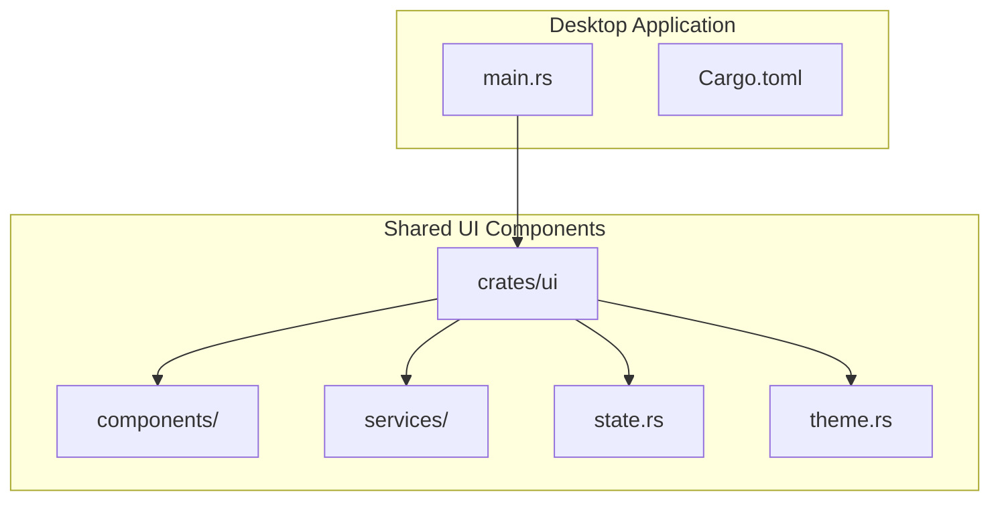
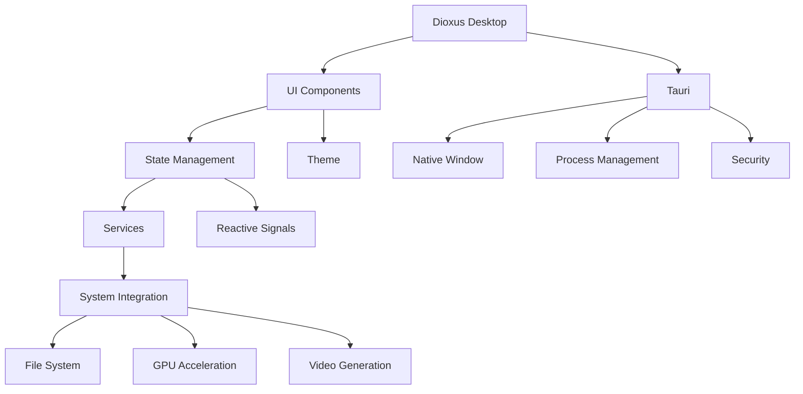
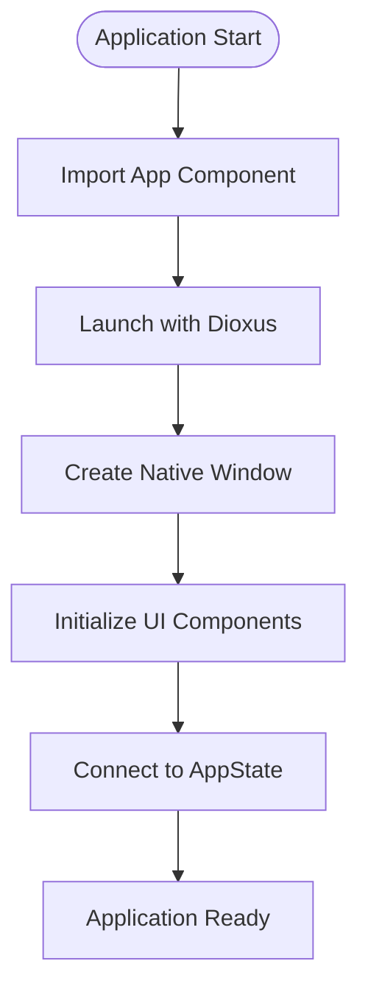
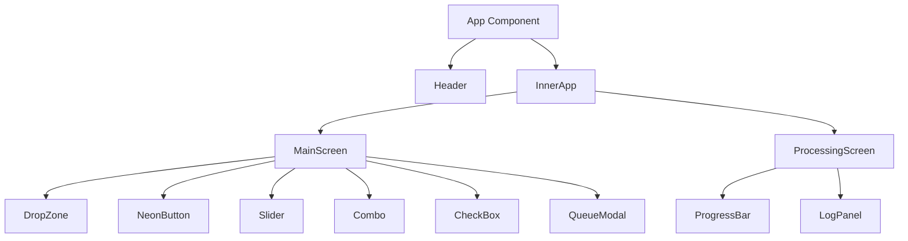
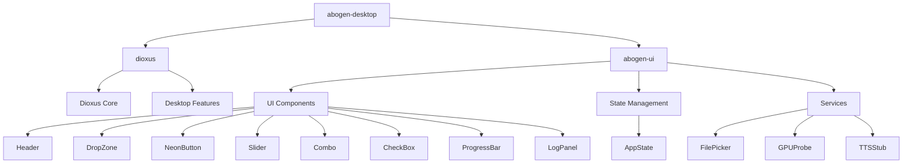

# Desktop UI Entry Point

<cite>
**Referenced Files in This Document**   
- [main.rs](file://abogen-ui/apps/desktop/src/main.rs)
- [Cargo.toml](file://abogen-ui/apps/desktop/Cargo.toml)
- [lib.rs](file://abogen-ui/crates/ui/lib.rs)
- [state.rs](file://abogen-ui/crates/ui/state.rs)
</cite>

## Table of Contents
1. [Introduction](#introduction)
2. [Project Structure](#project-structure)
3. [Core Components](#core-components)
4. [Architecture Overview](#architecture-overview)
5. [Detailed Component Analysis](#detailed-component-analysis)
6. [Dependency Analysis](#dependency-analysis)
7. [Performance Considerations](#performance-considerations)
8. [Troubleshooting Guide](#troubleshooting-guide)
9. [Conclusion](#conclusion)

## Introduction
This document provides architectural documentation for the VoxWeave desktop UI entry point, focusing on its native application design. The desktop application is built using Dioxus for cross-platform UI development and Tauri for native system integration. The entry point in `abogen-ui/apps/desktop/src/main.rs` serves as the foundation for a full-featured local execution environment with access to system resources and the file system. This documentation explains how the desktop entry point initializes the application window, configures platform-specific settings, handles system integration, and connects to shared UI components and state management. It also provides practical examples of build commands and runtime configurations, illustrating the use case for users requiring maximum performance and local processing capabilities.

## Project Structure
The VoxWeave desktop application follows a modular architecture with a clear separation between platform-specific entry points and shared UI components. The desktop application resides in the `abogen-ui/apps/desktop/` directory and contains the native entry point for the desktop platform. This structure enables code sharing across multiple platforms (desktop, web, mobile) while maintaining platform-specific configurations and launchers.



**Diagram sources**
- [main.rs](file://abogen-ui/apps/desktop/src/main.rs)
- [Cargo.toml](file://abogen-ui/apps/desktop/Cargo.toml)
- [lib.rs](file://abogen-ui/crates/ui/lib.rs)

**Section sources**
- [main.rs](file://abogen-ui/apps/desktop/src/main.rs)
- [Cargo.toml](file://abogen-ui/apps/desktop/Cargo.toml)

## Core Components
The desktop UI entry point consists of several core components that work together to create a cross-platform desktop application. The main entry point in `main.rs` launches the Dioxus application, while the `Cargo.toml` file configures the build environment and dependencies. The shared UI components in the `crates/ui` directory provide the visual elements and state management that are used across all platforms. The application state is managed through reactive signals in Dioxus, enabling efficient UI updates and data flow between components.

**Section sources**
- [main.rs](file://abogen-ui/apps/desktop/src/main.rs#L1-L7)
- [Cargo.toml](file://abogen-ui/apps/desktop/Cargo.toml#L1-L13)
- [lib.rs](file://abogen-ui/crates/ui/lib.rs#L1-L640)

## Architecture Overview
The VoxWeave desktop application architecture is built on the Dioxus framework for UI rendering and Tauri for native system integration. This combination enables the creation of a cross-platform desktop application with access to system resources and local file system operations. The architecture follows a component-based design pattern with a clear separation between UI presentation and application state management.



**Diagram sources**
- [main.rs](file://abogen-ui/apps/desktop/src/main.rs#L1-L7)
- [lib.rs](file://abogen-ui/crates/ui/lib.rs#L1-L640)
- [state.rs](file://abogen-ui/crates/ui/state.rs#L1-L259)

## Detailed Component Analysis

### Desktop Entry Point Analysis
The desktop entry point in `main.rs` is minimal and focused on launching the Dioxus application. It imports the shared `App` component from the `abogen-ui` crate and launches it using Dioxus's `launch` function. This approach enables code sharing across platforms while maintaining platform-specific entry points.



**Diagram sources**
- [main.rs](file://abogen-ui/apps/desktop/src/main.rs#L1-L7)

**Section sources**
- [main.rs](file://abogen-ui/apps/desktop/src/main.rs#L1-L7)

### State Management Analysis
The application state is managed through the `AppState` struct, which uses Dioxus signals to provide reactive state management. The state includes file selection, queue management, voice and subtitle settings, video generation options, and processing status. This centralized state management enables consistent data flow across all UI components.

```mermaid
classDiagram
class AppState {
+selected_file : Signal<Option<FileInfo>>
+queue : Signal<Vec<QueuedItem>>
+voice : Signal<String>
+speed : Signal<f64>
+subtitle_mode : Signal<SubtitleMode>
+voice_format : Signal<VoiceFormat>
+subtitle_format : Signal<SubtitleFormat>
+replace_newlines : Signal<bool>
+save_location : Signal<SaveLocation>
+use_gpu : Signal<bool>
+generate_video : Signal<bool>
+video_style : Signal<VideoStyle>
+video_resolution : Signal<VideoResolution>
+video_format : Signal<VideoFormat>
+video_prompt : Signal<Option<String>>
+is_processing : Signal<bool>
+progress : Signal<u8>
+logs : Signal<Vec<LogEntry>>
+cancel_token : Signal<Option<()>>
}
class FileInfo {
+name : String
+path : String
+size : u64
}
class QueuedItem {
+file : FileInfo
+voice : String
+speed : f64
+subtitle_mode : SubtitleMode
+voice_format : VoiceFormat
+subtitle_format : SubtitleFormat
+replace_newlines : bool
+use_gpu : bool
+generate_video : bool
+video_style : VideoStyle
+video_resolution : VideoResolution
+video_format : VideoFormat
+video_prompt : Option<String>
+save_location : SaveLocation
}
AppState --> FileInfo : "contains"
AppState --> QueuedItem : "manages"
```

**Diagram sources**
- [state.rs](file://abogen-ui/crates/ui/state.rs#L1-L259)

**Section sources**
- [state.rs](file://abogen-ui/crates/ui/state.rs#L1-L259)

### UI Component Analysis
The UI components are organized in a modular structure within the `crates/ui/components` directory. Each component is responsible for a specific UI element, such as the header, drop zone, neon button, slider, combo box, checkbox, progress bar, and log panel. These components are designed with a cyberpunk aesthetic featuring neon accents and a dark UI theme.



**Diagram sources**
- [lib.rs](file://abogen-ui/crates/ui/lib.rs#L1-L640)

**Section sources**
- [lib.rs](file://abogen-ui/crates/ui/lib.rs#L1-L640)

## Dependency Analysis
The desktop application has several key dependencies that enable its functionality. The `dioxus` crate with the "desktop" feature provides the UI framework and native window management. The `abogen-ui` crate provides shared UI components and state management. The application also uses various Dioxus prelude components for reactive programming and UI rendering.



**Diagram sources**
- [Cargo.toml](file://abogen-ui/apps/desktop/Cargo.toml#L1-L13)
- [lib.rs](file://abogen-ui/crates/ui/lib.rs#L1-L640)

**Section sources**
- [Cargo.toml](file://abogen-ui/apps/desktop/Cargo.toml#L1-L13)

## Performance Considerations
The desktop application is designed for maximum performance and local processing capabilities. By using Dioxus with Tauri, the application can leverage native system resources and direct file system access. The reactive state management system minimizes unnecessary UI updates, and the component-based architecture enables efficient code organization and maintenance. The application also supports GPU acceleration when available, which can significantly improve video generation performance.

## Troubleshooting Guide
When encountering issues with the desktop application, consider the following common problems and solutions:

1. **Application fails to start**: Ensure that Rust 1.80+ is installed and that the Dioxus desktop dependencies are properly configured.
2. **File selection not working**: Verify that the application has the necessary permissions to access the file system.
3. **GPU acceleration not available**: Check that the "gpu" feature is enabled in the build configuration and that compatible GPU drivers are installed.
4. **Video generation fails**: Ensure that the Z.AI video generation features are enabled and that the required API keys are configured.

**Section sources**
- [Cargo.toml](file://abogen-ui/apps/desktop/Cargo.toml#L1-L13)
- [lib.rs](file://abogen-ui/crates/ui/lib.rs#L1-L640)

## Conclusion
The VoxWeave desktop UI entry point provides a robust foundation for a cross-platform desktop application with access to system resources and local processing capabilities. By leveraging Dioxus for UI development and Tauri for native integration, the application achieves a balance between code sharing and platform-specific functionality. The modular architecture with shared UI components and centralized state management enables efficient development and maintenance. The desktop application is well-suited for users requiring maximum performance and local processing capabilities, with support for GPU acceleration and direct file system access.