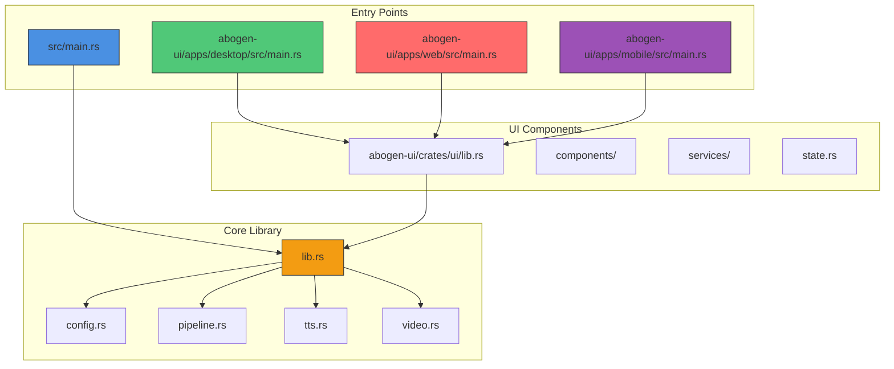
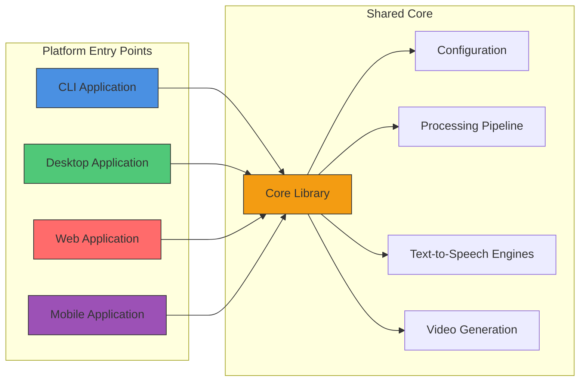
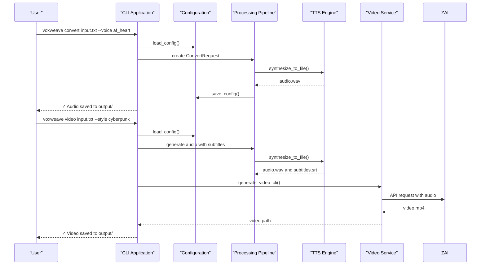
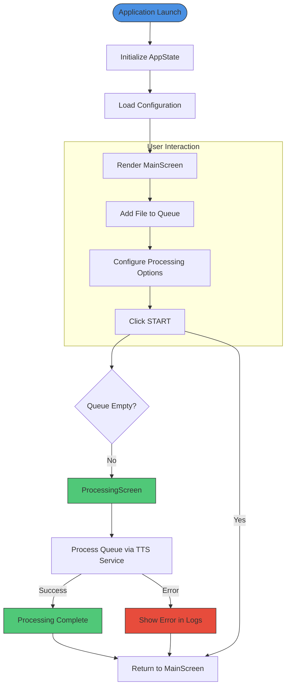
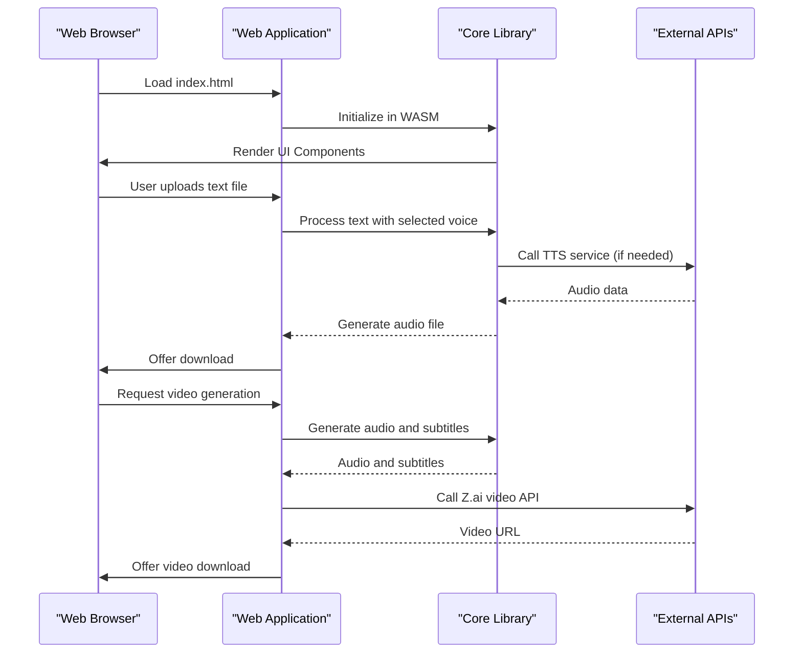
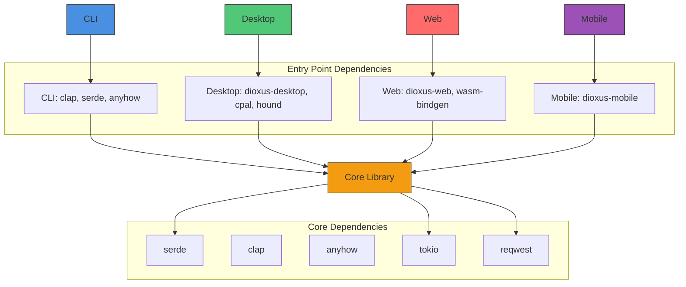

# Entry Points

<cite>
**Referenced Files in This Document**   
- [src/main.rs](file://src/main.rs)
- [src/lib.rs](file://src/lib.rs)
- [src/config.rs](file://src/config.rs)
- [src/pipeline.rs](file://src/pipeline.rs)
- [src/video.rs](file://src/video.rs)
- [abogen-ui/apps/desktop/src/main.rs](file://abogen-ui/apps/desktop/src/main.rs)
- [abogen-ui/apps/web/src/main.rs](file://abogen-ui/apps/web/src/main.rs)
- [abogen-ui/apps/mobile/src/main.rs](file://abogen-ui/apps/mobile/src/main.rs)
- [abogen-ui/crates/ui/lib.rs](file://abogen-ui/crates/ui/lib.rs)
- [Cargo.toml](file://Cargo.toml)
- [abogen-ui/Cargo.toml](file://abogen-ui/Cargo.toml)
- [abogen-ui/apps/desktop/Cargo.toml](file://abogen-ui/apps/desktop/Cargo.toml)
- [abogen-ui/apps/web/Cargo.toml](file://abogen-ui/apps/web/Cargo.toml)
- [abogen-ui/apps/mobile/Cargo.toml](file://abogen-ui/apps/mobile/Cargo.toml)
- [abogen-ui/crates/ui/Cargo.toml](file://abogen-ui/crates/ui/Cargo.toml)
- [abogen-ui/apps/web/Trunk.toml](file://abogen-ui/apps/web/Trunk.toml)
- [abogen-ui/apps/web/index.html](file://abogen-ui/apps/web/index.html)
</cite>

## Table of Contents
1. [Introduction](#introduction)
2. [Project Structure](#project-structure)
3. [Core Components](#core-components)
4. [Architecture Overview](#architecture-overview)
5. [Detailed Component Analysis](#detailed-component-analysis)
6. [Dependency Analysis](#dependency-analysis)
7. [Performance Considerations](#performance-considerations)
8. [Troubleshooting Guide](#troubleshooting-guide)
9. [Conclusion](#conclusion)

## Introduction
VoxWeave is a multi-platform text-to-speech and video generation application with a modular architecture. The system features three distinct entry points: CLI, desktop UI, web UI, and mobile UI, all depending on a shared core library. This documentation details the role of each entry point in the overall system, their initialization processes, configuration handling, integration with the core processing pipeline, platform-specific dependencies, and build configurations. The CLI serves scriptable automation, the desktop application provides full-featured local execution, the web interface enables cross-platform accessibility, and the mobile application supports on-the-go usage.

## Project Structure
The VoxWeave project is organized into multiple components that support its multi-platform design. The core functionality resides in the `src/` directory with the main binary at `src/main.rs` and the shared library at `src/lib.rs`. The UI components are implemented in the `abogen-ui/` directory, which contains separate applications for desktop, web, and mobile platforms. Each UI application has its own `main.rs` entry point and `Cargo.toml` configuration. The shared UI components and state management are located in `abogen-ui/crates/ui/`. The project uses Cargo workspaces to manage the different applications and their dependencies.

**Diagram sources**
- [src/main.rs](file://src/main.rs)
- [src/lib.rs](file://src/lib.rs)
- [abogen-ui/apps/desktop/src/main.rs](file://abogen-ui/apps/desktop/src/main.rs)
- [abogen-ui/apps/web/src/main.rs](file://abogen-ui/apps/web/src/main.rs)
- [abogen-ui/apps/mobile/src/main.rs](file://abogen-ui/apps/mobile/src/main.rs)
- [abogen-ui/crates/ui/lib.rs](file://abogen-ui/crates/ui/lib.rs)

**Section sources**
- [src/main.rs](file://src/main.rs)
- [abogen-ui/apps/desktop/src/main.rs](file://abogen-ui/apps/desktop/src/main.rs)
- [abogen-ui/apps/web/src/main.rs](file://abogen-ui/apps/web/src/main.rs)
- [abogen-ui/apps/mobile/src/main.rs](file://abogen-ui/apps/mobile/src/main.rs)

## Core Components
The VoxWeave system is built around a shared core library (`src/lib.rs`) that exports essential modules for configuration management, pipeline processing, text-to-speech functionality, and video generation. The core components provide a unified API that all entry points use to perform text-to-speech conversion and video generation tasks. The `config.rs` module handles application configuration and persistence, `pipeline.rs` orchestrates the conversion process, `tts.rs` implements various speech engines, and `video.rs` manages AI video generation through external APIs. These components are designed to be platform-agnostic, enabling consistent behavior across all entry points.

**Section sources**
- [src/lib.rs](file://src/lib.rs)
- [src/config.rs](file://src/config.rs)
- [src/pipeline.rs](file://src/pipeline.rs)
- [src/tts.rs](file://src/tts.rs)
- [src/video.rs](file://src/video.rs)

## Architecture Overview
VoxWeave follows a modular architecture with a clear separation between the core functionality and platform-specific entry points. The architecture is designed to maximize code reuse while providing tailored user experiences for different platforms. The shared core library contains all business logic and processing pipelines, while each entry point implements only the necessary platform-specific code to interface with the core. This design allows for consistent functionality across platforms while enabling each entry point to leverage platform-specific capabilities and user interface paradigms.

**Diagram sources**
- [src/lib.rs](file://src/lib.rs)
- [src/main.rs](file://src/main.rs)
- [abogen-ui/apps/desktop/src/main.rs](file://abogen-ui/apps/desktop/src/main.rs)
- [abogen-ui/apps/web/src/main.rs](file://abogen-ui/apps/web/src/main.rs)
- [abogen-ui/apps/mobile/src/main.rs](file://abogen-ui/apps/mobile/src/main.rs)

## Detailed Component Analysis

### CLI Entry Point Analysis
The CLI entry point (`src/main.rs`) serves as the primary interface for scriptable automation and batch processing. It uses the Clap library for command-line argument parsing and provides a straightforward interface for text-to-speech conversion and video generation. The CLI supports three main commands: `convert` for audio generation, `list-voices` for enumerating available voices, and `video` for end-to-end video generation from text input. The CLI handles configuration through a JSON file stored in the user's configuration directory, which persists user preferences like default voice and recent files.

**Diagram sources**
- [src/main.rs](file://src/main.rs)
- [src/config.rs](file://src/config.rs)
- [src/pipeline.rs](file://src/pipeline.rs)
- [src/tts.rs](file://src/tts.rs)
- [src/video.rs](file://src/video.rs)

**Section sources**
- [src/main.rs](file://src/main.rs)
- [src/config.rs](file://src/config.rs)
- [src/pipeline.rs](file://src/pipeline.rs)

### Desktop UI Entry Point Analysis
The desktop UI entry point (`abogen-ui/apps/desktop/src/main.rs`) provides a full-featured local execution environment with access to system resources and enhanced performance capabilities. Built using Dioxus, the desktop application offers a rich graphical interface for managing text-to-speech and video generation tasks. The desktop application can leverage GPU acceleration for faster processing and has direct access to the file system for seamless file operations. It supports advanced features like voice cloning through real-time audio recording and provides comprehensive queue management for batch processing.

**Diagram sources**
- [abogen-ui/apps/desktop/src/main.rs](file://abogen-ui/apps/desktop/src/main.rs)
- [abogen-ui/crates/ui/lib.rs](file://abogen-ui/crates/ui/lib.rs)
- [abogen-ui/crates/ui/state.rs](file://abogen-ui/crates/ui/state.rs)

**Section sources**
- [abogen-ui/apps/desktop/src/main.rs](file://abogen-ui/apps/desktop/src/main.rs)
- [abogen-ui/crates/ui/lib.rs](file://abogen-ui/crates/ui/lib.rs)
- [abogen-ui/crates/ui/state.rs](file://abogen-ui/crates/ui/state.rs)

### Web UI Entry Point Analysis
The web UI entry point (`abogen-ui/apps/web/src/main.rs`) enables cross-platform accessibility through any modern web browser. The web application is built with Dioxus and uses Trunk for bundling, allowing it to run in the browser's WebAssembly environment. While it has some limitations compared to the desktop version due to browser security constraints, it provides core functionality for text-to-speech conversion and video generation. The web interface is ideal for users who need to access VoxWeave from different devices without installing software, making it particularly useful for collaborative environments and quick conversions.

**Diagram sources**
- [abogen-ui/apps/web/src/main.rs](file://abogen-ui/apps/web/src/main.rs)
- [abogen-ui/crates/ui/lib.rs](file://abogen-ui/crates/ui/lib.rs)
- [abogen-ui/apps/web/Trunk.toml](file://abogen-ui/apps/web/Trunk.toml)
- [abogen-ui/apps/web/index.html](file://abogen-ui/apps/web/index.html)

**Section sources**
- [abogen-ui/apps/web/src/main.rs](file://abogen-ui/apps/web/src/main.rs)
- [abogen-ui/crates/ui/lib.rs](file://abogen-ui/crates/ui/lib.rs)

### Mobile UI Entry Point Analysis
The mobile UI entry point (`abogen-ui/apps/mobile/src/main.rs`) provides on-the-go usage capabilities for VoxWeave, allowing users to generate speech and videos from their mobile devices. The mobile application shares the same UI components and state management as the other platforms but is optimized for touch interfaces and mobile workflows. It enables users to quickly convert text to speech while commuting or traveling, making it ideal for content creators who need to produce audio content from anywhere. The mobile version maintains synchronization with the core functionality while adapting the user interface for smaller screens and touch-based interaction.

**Section sources**
- [abogen-ui/apps/mobile/src/main.rs](file://abogen-ui/apps/mobile/src/main.rs)
- [abogen-ui/crates/ui/lib.rs](file://abogen-ui/crates/ui/lib.rs)

## Dependency Analysis
The VoxWeave project uses Cargo workspaces to manage dependencies across its multiple entry points. The core library has minimal dependencies focused on text processing, configuration, and API communication. Each entry point adds platform-specific dependencies as needed. The CLI depends on Clap for argument parsing and optional features for video generation. The desktop application includes dependencies for GPU acceleration and audio recording. The web application uses WebAssembly-compatible libraries and HTTP clients for API communication. The mobile application has streamlined dependencies optimized for mobile performance.

**Diagram sources**
- [Cargo.toml](file://Cargo.toml)
- [abogen-ui/Cargo.toml](file://abogen-ui/Cargo.toml)
- [abogen-ui/apps/desktop/Cargo.toml](file://abogen-ui/apps/desktop/Cargo.toml)
- [abogen-ui/apps/web/Cargo.toml](file://abogen-ui/apps/web/Cargo.toml)
- [abogen-ui/apps/mobile/Cargo.toml](file://abogen-ui/apps/mobile/Cargo.toml)
- [abogen-ui/crates/ui/Cargo.toml](file://abogen-ui/crates/ui/Cargo.toml)

**Section sources**
- [Cargo.toml](file://Cargo.toml)
- [abogen-ui/Cargo.toml](file://abogen-ui/Cargo.toml)

## Performance Considerations
Each entry point in VoxWeave has different performance characteristics based on its platform and intended use case. The CLI offers the best performance for batch processing and automation, with minimal overhead and direct access to system resources. The desktop application provides the most comprehensive feature set with access to GPU acceleration for faster processing. The web application has some performance limitations due to WebAssembly execution and browser security constraints but offers excellent accessibility. The mobile application is optimized for battery efficiency and responsive touch interactions, making it suitable for on-the-go usage.

The shared core library is designed with performance in mind, using efficient algorithms for text processing and audio generation. Configuration is cached and loaded only when needed, reducing startup time. The processing pipeline is optimized to minimize memory allocation and maximize throughput. For video generation, the system uses asynchronous operations to avoid blocking the main thread, providing responsive user interfaces across all platforms.

## Troubleshooting Guide
When encountering issues with VoxWeave entry points, consider the following common problems and solutions:

1. **CLI not found after build**: Ensure you're running the correct binary path. After `cargo build`, the binary is located at `./target/debug/voxweave` or `./target/release/voxweave`.

2. **Voice not found errors**: Run `voxweave list-voices` to see available voices. Some voices require additional features to be enabled during build.

3. **Video generation fails**: Ensure the ZAI_API_KEY environment variable is set. Video generation requires this API key to access the Z.ai service.

4. **Web application not loading**: Check that Trunk is installed and that the web server is running on the correct port (8080 by default).

5. **Mobile application performance issues**: Reduce the processing load by using shorter text inputs or lower resolution settings for video generation.

6. **Configuration not persisting**: Verify that the application has write permissions to the configuration directory, typically located in the user's application data folder.

**Section sources**
- [src/main.rs](file://src/main.rs)
- [src/config.rs](file://src/config.rs)
- [abogen-ui/apps/web/Trunk.toml](file://abogen-ui/apps/web/Trunk.toml)

## Conclusion
VoxWeave's multi-platform architecture with distinct entry points provides flexibility for different use cases while maintaining a consistent core functionality. The CLI serves automation and scripting needs, the desktop application offers full-featured local execution, the web interface enables cross-platform accessibility, and the mobile application supports on-the-go usage. All entry points share a common core library that ensures consistent behavior and reduces code duplication. This architecture allows users to choose the most appropriate interface for their needs while benefiting from the same underlying text-to-speech and video generation capabilities.