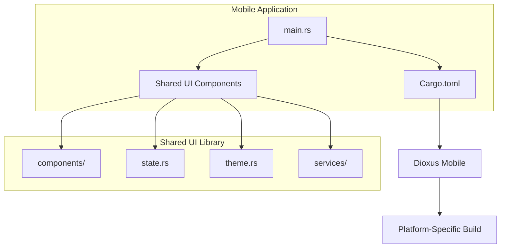
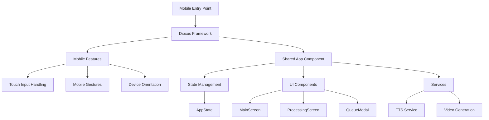
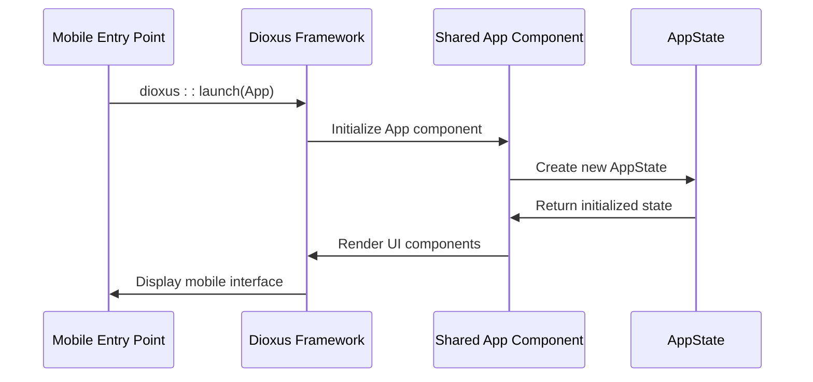
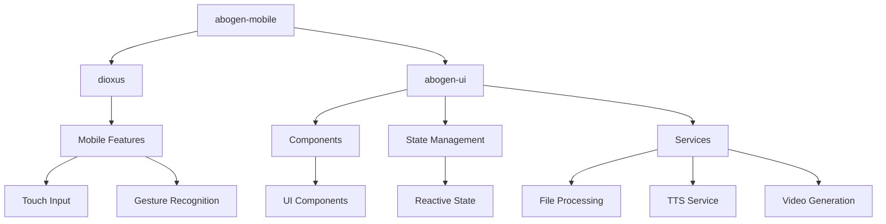

# Mobile UI Entry Point

<cite>
**Referenced Files in This Document**   
- [main.rs](file://abogen-ui/apps/mobile/src/main.rs)
- [lib.rs](file://abogen-ui/crates/ui/lib.rs)
- [Cargo.toml](file://abogen-ui/apps/mobile/Cargo.toml)
- [state.rs](file://abogen-ui/crates/ui/state.rs)
</cite>

## Table of Contents
1. [Introduction](#introduction)
2. [Project Structure](#project-structure)
3. [Core Components](#core-components)
4. [Architecture Overview](#architecture-overview)
5. [Detailed Component Analysis](#detailed-component-analysis)
6. [Dependency Analysis](#dependency-analysis)
7. [Performance Considerations](#performance-considerations)
8. [Troubleshooting Guide](#troubleshooting-guide)
9. [Conclusion](#conclusion)

## Introduction
The VoxWeave mobile UI entry point provides a cross-platform mobile application interface for voice and video generation capabilities using Dioxus. This documentation details the implementation of the mobile application's entry point, its initialization process, mobile-specific configurations, touch interaction handling, and integration with shared UI components and state management. The mobile interface is designed for on-the-go usage with touch-friendly controls and mobile optimizations, enabling users to generate voice and video content from text inputs while mobile.

## Project Structure
The mobile application follows a modular architecture with a shared UI component library and platform-specific entry points. The mobile application resides in the `abogen-ui/apps/mobile/` directory with its own `Cargo.toml` configuration while sharing the core UI components and state management from the `abogen-ui/crates/ui/` library.



**Diagram sources**
- [main.rs](file://abogen-ui/apps/mobile/src/main.rs)
- [Cargo.toml](file://abogen-ui/apps/mobile/Cargo.toml)

**Section sources**
- [main.rs](file://abogen-ui/apps/mobile/src/main.rs)
- [Cargo.toml](file://abogen-ui/apps/mobile/Cargo.toml)

## Core Components
The mobile UI entry point consists of a minimal initialization file that launches the shared application component through Dioxus. The core functionality is implemented in the shared UI library, which provides the App component, state management, and all UI components. The mobile-specific entry point focuses on platform initialization and configuration rather than implementing UI logic directly.

**Section sources**
- [main.rs](file://abogen-ui/apps/mobile/src/main.rs)
- [lib.rs](file://abogen-ui/crates/ui/lib.rs)

## Architecture Overview
The mobile application architecture follows a cross-platform design pattern where the UI logic and components are shared across desktop, web, and mobile platforms, while each platform has its own entry point and build configuration. The mobile entry point initializes the Dioxus framework with mobile-specific features and launches the shared App component.



**Diagram sources**
- [main.rs](file://abogen-ui/apps/mobile/src/main.rs)
- [lib.rs](file://abogen-ui/crates/ui/lib.rs)

## Detailed Component Analysis

### Mobile Entry Point Analysis
The mobile entry point is implemented in `main.rs` and consists of a minimal initialization function that launches the shared App component through the Dioxus framework. The implementation leverages Dioxus's cross-platform capabilities to provide a consistent user experience across different mobile operating systems.



**Diagram sources**
- [main.rs](file://abogen-ui/apps/mobile/src/main.rs)
- [lib.rs](file://abogen-ui/crates/ui/lib.rs)

### State Management Analysis
The application state is managed through the AppState struct which maintains all user interface state including file selection, processing queue, voice settings, and processing status. The state management system uses Dioxus signals for reactive updates across the UI components.

```mermaid
classDiagram
class AppState {
+selected_file : Signal<Option<FileInfo>>
+queue : Signal<Vec<QueuedItem>>
+voice : Signal<String>
+speed : Signal<f64>
+subtitle_mode : Signal<SubtitleMode>
+voice_format : Signal<VoiceFormat>
+subtitle_format : Signal<SubtitleFormat>
+replace_newlines : Signal<bool>
+save_location : Signal<SaveLocation>
+use_gpu : Signal<bool>
+generate_video : Signal<bool>
+video_style : Signal<VideoStyle>
+video_resolution : Signal<VideoResolution>
+video_format : Signal<VideoFormat>
+video_prompt : Signal<Option<String>>
+is_processing : Signal<bool>
+progress : Signal<u8>
+logs : Signal<Vec<LogEntry>>
+cancel_token : Signal<Option<()>>
+new() : Self
}
class FileInfo {
+name : String
+path : String
+size : u64
}
class QueuedItem {
+file : FileInfo
+voice : String
+speed : f64
+subtitle_mode : SubtitleMode
+voice_format : VoiceFormat
+subtitle_format : SubtitleFormat
+replace_newlines : bool
+use_gpu : bool
+generate_video : bool
+video_style : VideoStyle
+video_resolution : VideoResolution
+video_format : VideoFormat
+video_prompt : Option<String>
+save_location : SaveLocation
}
class LogEntry {
+message : String
+level : LogLevel
}
AppState --> FileInfo : "contains"
AppState --> QueuedItem : "contains"
AppState --> LogEntry : "contains"
AppState --> SubtitleMode : "references"
AppState --> VoiceFormat : "references"
AppState --> SubtitleFormat : "references"
AppState --> VideoStyle : "references"
AppState --> VideoResolution : "references"
AppState --> VideoFormat : "references"
AppState --> SaveLocation : "references"
AppState --> LogLevel : "references"
```

**Diagram sources**
- [state.rs](file://abogen-ui/crates/ui/state.rs)
- [lib.rs](file://abogen-ui/crates/ui/lib.rs)

## Dependency Analysis
The mobile application has dependencies on the Dioxus framework with mobile-specific features and the shared UI library. The dependency structure enables code sharing while allowing platform-specific optimizations.



**Diagram sources**
- [Cargo.toml](file://abogen-ui/apps/mobile/Cargo.toml)
- [main.rs](file://abogen-ui/apps/mobile/src/main.rs)

**Section sources**
- [Cargo.toml](file://abogen-ui/apps/mobile/Cargo.toml)
- [main.rs](file://abogen-ui/apps/mobile/src/main.rs)

## Performance Considerations
The mobile application is optimized for touch interactions and mobile device constraints. The UI components are designed with larger touch targets, simplified layouts, and efficient state updates to minimize battery consumption and ensure smooth performance on mobile devices. The shared state management system reduces memory overhead by avoiding duplication of state across components.

## Troubleshooting Guide
Common issues with the mobile application typically relate to build configuration or platform-specific dependencies. Ensure that the Dioxus mobile toolchain is properly installed and configured. Verify that the shared UI library compiles correctly before building the mobile application. Check that all required features are enabled in the Cargo.toml configuration for the desired functionality.

**Section sources**
- [Cargo.toml](file://abogen-ui/apps/mobile/Cargo.toml)
- [main.rs](file://abogen-ui/apps/mobile/src/main.rs)

## Conclusion
The VoxWeave mobile UI entry point provides a streamlined interface for voice and video generation on mobile devices using the Dioxus framework. By leveraging a shared UI library, the application maintains consistency across platforms while optimizing for mobile-specific interactions and constraints. The architecture enables efficient development and maintenance by separating platform-specific initialization from shared UI logic and state management.