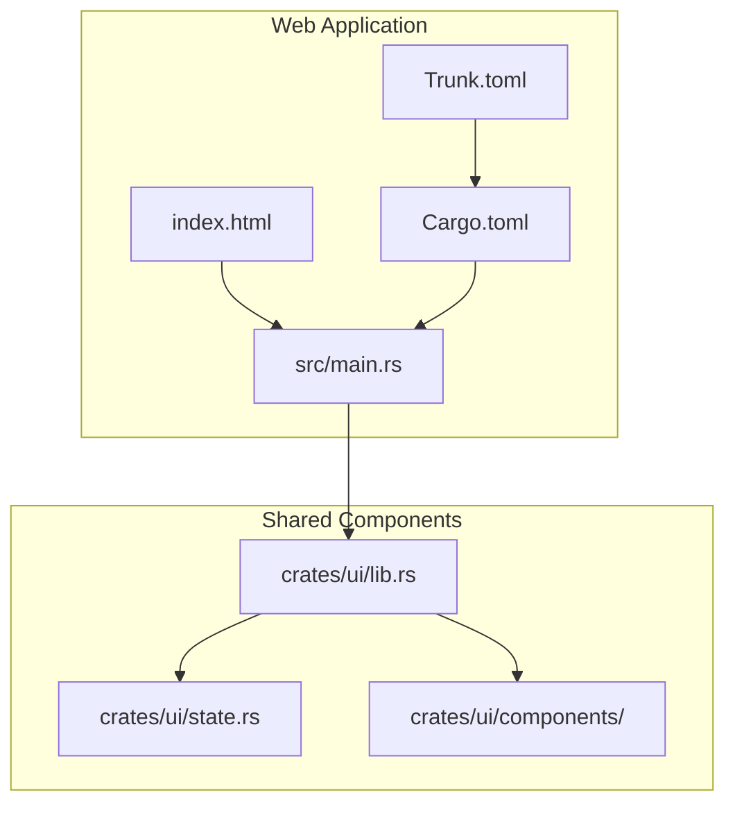
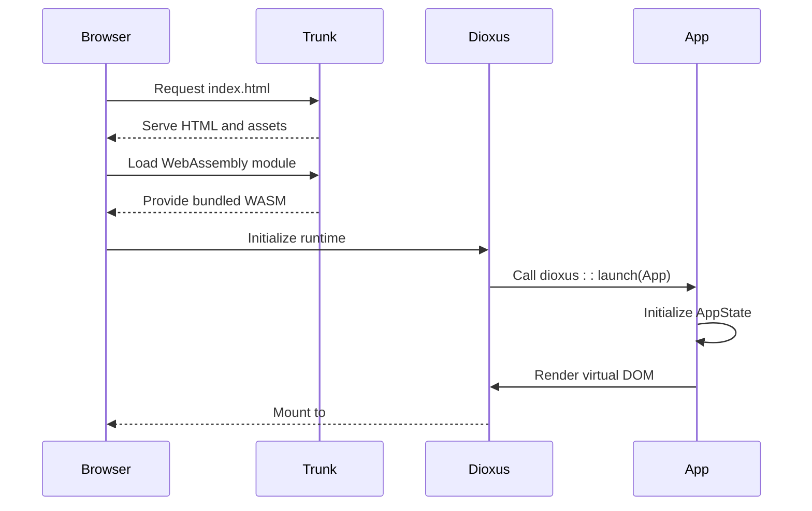
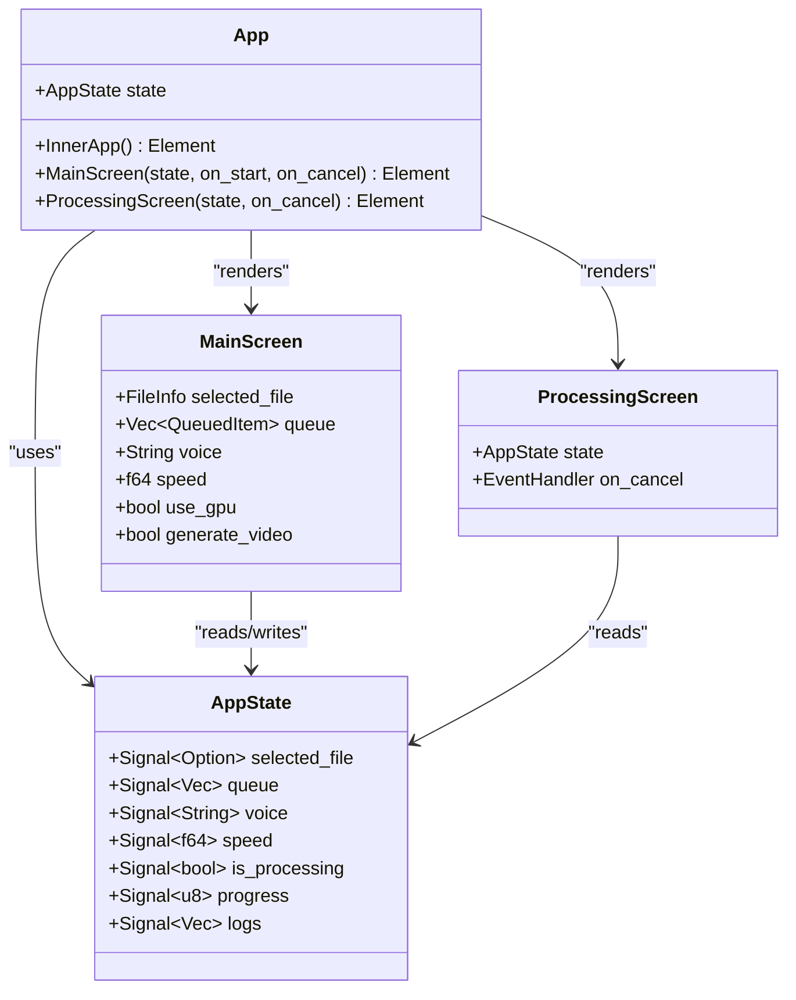
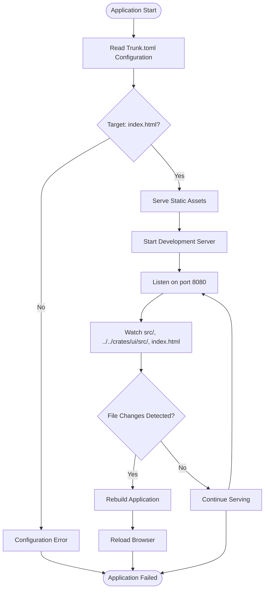
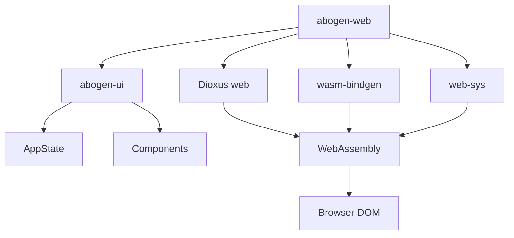

# Web UI Entry Point

<cite>
**Referenced Files in This Document**   
- [main.rs](file://abogen-ui/apps/web/src/main.rs)
- [Trunk.toml](file://abogen-ui/apps/web/Trunk.toml)
- [index.html](file://abogen-ui/apps/web/index.html)
- [Cargo.toml](file://abogen-ui/apps/web/Cargo.toml)
- [lib.rs](file://abogen-ui/crates/ui/lib.rs)
- [state.rs](file://abogen-ui/crates/ui/state.rs)
</cite>

## Table of Contents
1. [Introduction](#introduction)
2. [Project Structure](#project-structure)
3. [Core Components](#core-components)
4. [Architecture Overview](#architecture-overview)
5. [Detailed Component Analysis](#detailed-component-analysis)
6. [Dependency Analysis](#dependency-analysis)
7. [Performance Considerations](#performance-considerations)
8. [Troubleshooting Guide](#troubleshooting-guide)
9. [Conclusion](#conclusion)

## Introduction

The VoxWeave web UI entry point provides browser-based access to the application through a modern Rust-based frontend architecture. Built with Dioxus and bundled with Trunk, this entry point enables cross-platform accessibility without installation requirements, allowing users to access the application from any device with a web browser. The web application follows a component-based architecture where the entry point initializes the Dioxus framework and mounts the root application component to the DOM. This documentation details how the web entry point integrates with the shared UI components and state management system, handles web-specific configurations, and enables seamless deployment workflows.

## Project Structure

The web application entry point is structured within the abogen-ui workspace, following a modular architecture that separates platform-specific launchers from shared UI components. The web application resides in the `abogen-ui/apps/web/` directory and contains all web-specific configuration files alongside the entry point code. This structure enables code sharing across desktop, mobile, and web platforms while maintaining platform-specific configurations. The shared UI components and state management are located in `abogen-ui/crates/ui/`, which is imported as a dependency by the web application.

**Diagram sources**
- [main.rs](file://abogen-ui/apps/web/src/main.rs)
- [lib.rs](file://abogen-ui/crates/ui/lib.rs)
- [state.rs](file://abogen-ui/crates/ui/state.rs)
- [Trunk.toml](file://abogen-ui/apps/web/Trunk.toml)
- [Cargo.toml](file://abogen-ui/apps/web/Cargo.toml)

**Section sources**
- [main.rs](file://abogen-ui/apps/web/src/main.rs)
- [Trunk.toml](file://abogen-ui/apps/web/Trunk.toml)
- [Cargo.toml](file://abogen-ui/apps/web/Cargo.toml)

## Core Components

The web UI entry point consists of several core components that work together to initialize and run the application in the browser environment. The main.rs file serves as the entry point, importing the shared App component from the ui crate and launching it with Dioxus. The Trunk.toml configuration file defines web-specific bundling options, while index.html provides the HTML host for the application. The Cargo.toml file specifies the dependencies required for web compilation, including Dioxus with the web feature flag. These components work in concert to create a seamless web application experience that leverages the shared UI components and state management system.

**Section sources**
- [main.rs](file://abogen-ui/apps/web/src/main.rs)
- [Trunk.toml](file://abogen-ui/apps/web/Trunk.toml)
- [index.html](file://abogen-ui/apps/web/index.html)
- [Cargo.toml](file://abogen-ui/apps/web/Cargo.toml)

## Architecture Overview

The web UI entry point follows a clean separation of concerns between the application logic and platform-specific configuration. When the application starts, Trunk serves as the bundler, processing the Rust code into WebAssembly and managing asset loading. The entry point in main.rs calls `dioxus::launch(App)` which initializes the Dioxus virtual DOM and mounts it to the #main element in index.html. The App component from the shared ui crate contains the entire application logic and state management, allowing the same codebase to be used across all platforms. This architecture enables cross-platform consistency while maintaining web-specific optimizations through Trunk's configuration options.

**Diagram sources**
- [main.rs](file://abogen-ui/apps/web/src/main.rs)
- [index.html](file://abogen-ui/apps/web/index.html)
- [Trunk.toml](file://abogen-ui/apps/web/Trunk.toml)

## Detailed Component Analysis

### Web Entry Point Analysis

The web entry point in main.rs is minimal by design, containing only the necessary code to launch the application. It imports the App component from the shared ui crate and calls `dioxus::launch(App)` to initialize the Dioxus framework. This approach follows the principle of separation of concerns, keeping platform-specific entry points simple while centralizing application logic in the shared components. The simplicity of the entry point enables easy maintenance and reduces the risk of platform-specific bugs.

#### For Object-Oriented Components:

**Diagram sources**
- [main.rs](file://abogen-ui/apps/web/src/main.rs)
- [lib.rs](file://abogen-ui/crates/ui/lib.rs)
- [state.rs](file://abogen-ui/crates/ui/state.rs)

### Configuration Analysis

The web application's behavior is controlled through several configuration files that work together to define the build and runtime environment. Trunk.toml specifies the bundling configuration, including the target HTML file, distribution directory, and development server settings. The watch configuration ensures that changes to the source code and shared components are automatically detected and rebuilt. This enables a smooth development workflow where changes to both the web-specific code and shared components trigger automatic reloads.

#### For Complex Logic Components:

**Diagram sources**
- [Trunk.toml](file://abogen-ui/apps/web/Trunk.toml)
- [Cargo.toml](file://abogen-ui/apps/web/Cargo.toml)

**Section sources**
- [Trunk.toml](file://abogen-ui/apps/web/Trunk.toml)
- [Cargo.toml](file://abogen-ui/apps/web/Cargo.toml)

## Dependency Analysis

The web application entry point has a carefully designed dependency structure that enables code sharing while maintaining platform-specific requirements. The primary dependency is the shared ui crate, which provides the App component and all application logic. For web-specific functionality, the application depends on Dioxus with the web feature flag, wasm-bindgen for WebAssembly bindings, and web-sys for browser API access. Trunk serves as the bundler, processing these dependencies into a format suitable for web deployment. This dependency structure ensures that the application can leverage the full power of Rust while maintaining compatibility with web standards.

**Diagram sources**
- [Cargo.toml](file://abogen-ui/apps/web/Cargo.toml)
- [main.rs](file://abogen-ui/apps/web/src/main.rs)

**Section sources**
- [Cargo.toml](file://abogen-ui/apps/web/Cargo.toml)

## Performance Considerations

The web UI entry point is optimized for performance through several mechanisms. Trunk's bundling process minimizes the size of the WebAssembly module by removing unused code and optimizing the output. The use of Dioxus signals for state management ensures efficient re-renders by only updating the parts of the DOM that have changed. The application's architecture separates the entry point from the main logic, allowing the browser to cache the shared components across sessions. Additionally, the development server configuration enables hot reloading, reducing the feedback loop during development.

## Troubleshooting Guide

When encountering issues with the web UI entry point, several common problems can be addressed through systematic troubleshooting. If the application fails to load, verify that Trunk is properly installed and that the index.html file contains the #main element. For build errors, check that the Dioxus web feature is enabled in Cargo.toml and that all dependencies are correctly specified. If hot reloading is not working, ensure that the watch configuration in Trunk.toml includes the correct paths. For runtime errors, use the browser's developer tools to inspect the WebAssembly module and console output.

**Section sources**
- [main.rs](file://abogen-ui/apps/web/src/main.rs)
- [Trunk.toml](file://abogen-ui/apps/web/Trunk.toml)
- [index.html](file://abogen-ui/apps/web/index.html)

## Conclusion

The VoxWeave web UI entry point provides a robust foundation for browser-based access to the application, leveraging modern Rust web technologies to deliver a seamless user experience. By using Dioxus for the UI framework and Trunk as the bundler, the application achieves high performance and cross-platform compatibility. The architecture's separation of concerns between the entry point and shared components enables code reuse across platforms while maintaining web-specific optimizations. This design allows users to access the application from any device with a browser, fulfilling the goal of installation-free accessibility. The documented build and deployment workflows provide clear guidance for developers and users alike, ensuring smooth operation and maintenance of the web application.