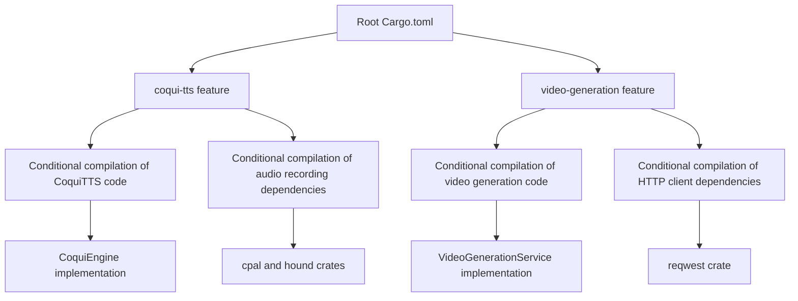
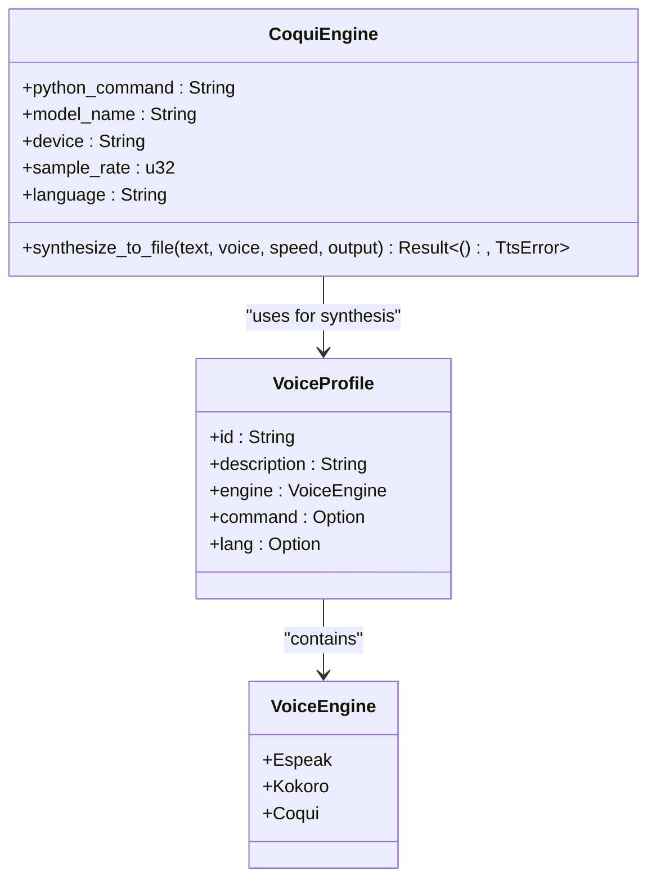
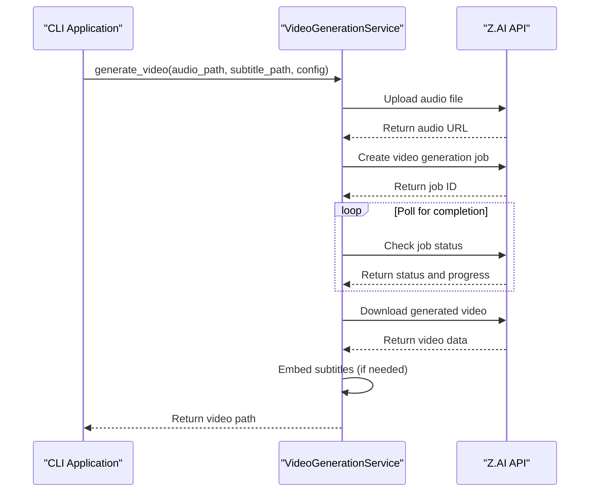
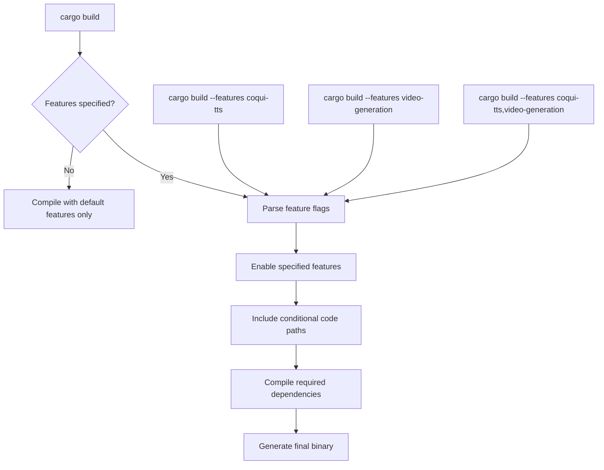

# Feature Flags

<cite>
**Referenced Files in This Document**   
- [Cargo.toml](file://Cargo.toml)
- [src/coqui_tts.rs](file://src/coqui_tts.rs)
- [src/video.rs](file://src/video.rs)
- [abogen-ui/crates/ui/Cargo.toml](file://abogen-ui/crates/ui/Cargo.toml)
- [abogen-ui/apps/desktop/Cargo.toml](file://abogen-ui/apps/desktop/Cargo.toml)
- [abogen-ui/apps/web/Cargo.toml](file://abogen-ui/apps/web/Cargo.toml)
- [src/tts.rs](file://src/tts.rs)
- [abogen-ui/crates/ui/services/voices.rs](file://abogen-ui/crates/ui/services/voices.rs)
- [abogen-ui/crates/ui/services/tts_service.rs](file://abogen-ui/crates/ui/services/tts_service.rs)
- [abogen-ui/crates/ui/services/zai_video.rs](file://abogen-ui/crates/ui/services/zai_video.rs)
</cite>

## Table of Contents
1. [Introduction](#introduction)
2. [Feature Flag System Overview](#feature-flag-system-overview)
3. [Coqui-TTS Feature](#coqui-tts-feature)
4. [Video-Generation Feature](#video-generation-feature)
5. [Build Configuration and Compilation](#build-configuration-and-compilation)
6. [Dependency Management](#dependency-management)
7. [Common Issues and Troubleshooting](#common-issues-and-troubleshooting)
8. [Conclusion](#conclusion)

## Introduction
The VoxWeave feature flag system enables modular compilation and optional functionality through two primary feature flags: 'coqui-tts' for voice cloning capabilities with the CoquiTTS engine, and 'video-generation' for AI video creation via the Z.AI API. This documentation details how these features are declared in Cargo.toml files across the workspace, how they conditionally compile dependencies, and how they gate access to specific code paths in the application. The feature system supports dependency minimization for lightweight deployments and provides flexibility for different deployment scenarios.

## Feature Flag System Overview
The VoxWeave project implements a feature-based compilation system that allows developers to selectively enable optional functionality. This approach enables dependency minimization, reducing binary size and compilation time for deployments that don't require all features. The system uses Rust's conditional compilation attributes (`#[cfg(feature = "...")]`) to gate access to specific code paths based on enabled features.

The feature flag system is declared in the root Cargo.toml file and propagated through the workspace. Features can be enabled or disabled during compilation, which determines which dependencies are compiled and which code paths are included in the final binary. This modular approach allows for lightweight deployments while maintaining the ability to include advanced functionality when needed.



**Diagram sources**
- [Cargo.toml](file://Cargo.toml)
- [src/coqui_tts.rs](file://src/coqui_tts.rs)
- [src/video.rs](file://src/video.rs)

**Section sources**
- [Cargo.toml](file://Cargo.toml)

## Coqui-TTS Feature
The 'coqui-tts' feature enables voice cloning capabilities using the CoquiTTS engine. When this feature is enabled, the application gains access to advanced text-to-speech functionality with support for voice cloning from reference audio. This feature is implemented through conditional compilation that includes the CoquiEngine implementation and related audio recording capabilities.

The Coqui-TTS feature enables the CoquiEngine struct, which provides speech synthesis capabilities using the CoquiTTS XTTS v2 model. The engine supports multiple languages and can be configured through environment variables such as VOXWEAVE_COQUI_PYTHON, VOXWEAVE_COQUI_MODEL, VOXWEAVE_COQUI_DEVICE, VOXWEAVE_COQUI_SAMPLE_RATE, and VOXWEAVE_COQUI_LANGUAGE. Voice cloning is supported by providing a reference audio file path in the VoiceProfile's command field.



**Diagram sources**
- [src/coqui_tts.rs](file://src/coqui_tts.rs)
- [src/tts.rs](file://src/tts.rs)

**Section sources**
- [src/coqui_tts.rs](file://src/coqui_tts.rs)
- [src/tts.rs](file://src/tts.rs)
- [abogen-ui/crates/ui/services/voices.rs](file://abogen-ui/crates/ui/services/voices.rs)

## Video-Generation Feature
The 'video-generation' feature enables AI video creation through the Z.AI API. When this feature is enabled, the application can generate videos with AI visuals synchronized to TTS narration and subtitles. This feature includes conditional compilation of the VideoGenerationService, which handles the complete video generation pipeline including file upload, job creation, status polling, video download, and subtitle embedding.

The video generation feature supports multiple styles including realistic, anime, 3D, cinematic, biotech, cyberpunk, and educational. It also supports various resolutions (720p, 1080p, 4K) and output formats (MP4, MOV, WebM). The feature can be configured with custom prompts to influence the visual style of generated videos. The implementation uses the reqwest HTTP client for API communication with the Z.AI service.



**Diagram sources**
- [src/video.rs](file://src/video.rs)
- [abogen-ui/crates/ui/services/zai_video.rs](file://abogen-ui/crates/ui/services/zai_video.rs)

**Section sources**
- [src/video.rs](file://src/video.rs)
- [abogen-ui/crates/ui/services/zai_video.rs](file://abogen-ui/crates/ui/services/zai_video.rs)

## Build Configuration and Compilation
The feature flag system is configured in the Cargo.toml files across the workspace. The root Cargo.toml declares the available features and their dependencies, while application-specific Cargo.toml files enable the required features for each target.

In the root Cargo.toml, the features are declared as follows:
- The 'coqui-tts' feature has no dependencies and enables CoquiTTS functionality
- The 'video-generation' feature depends on 'tokio' and 'reqwest' and enables video generation capabilities

Application targets can enable specific feature combinations based on their requirements. For example, the desktop application enables multiple features including video-generation, real-tts, zai-video, and coqui-tts, while the web application does not enable any optional features by default.



**Diagram sources**
- [Cargo.toml](file://Cargo.toml)
- [abogen-ui/crates/ui/Cargo.toml](file://abogen-ui/crates/ui/Cargo.toml)
- [abogen-ui/apps/desktop/Cargo.toml](file://abogen-ui/apps/desktop/Cargo.toml)

**Section sources**
- [Cargo.toml](file://Cargo.toml)
- [abogen-ui/crates/ui/Cargo.toml](file://abogen-ui/crates/ui/Cargo.toml)
- [abogen-ui/apps/desktop/Cargo.toml](file://abogen-ui/apps/desktop/Cargo.toml)
- [abogen-ui/apps/web/Cargo.toml](file://abogen-ui/apps/web/Cargo.toml)

## Dependency Management
The feature flag system enables conditional compilation of dependencies, allowing for dependency minimization in lightweight deployments. When features are disabled, their associated dependencies are not compiled, reducing binary size and compilation time.

For the 'coqui-tts' feature, enabling this flag conditionally compiles the cpal and hound crates, which are used for audio recording and WAV file handling. These dependencies are only included when the feature is enabled, allowing deployments without voice cloning capabilities to avoid these dependencies.

For the 'video-generation' feature, enabling this flag conditionally compiles the reqwest HTTP client with multipart and JSON support, as well as additional tokio features for file system operations and time handling. This allows the core application to function without these dependencies when video generation is not required.

The dependency management approach follows a hierarchical pattern where the root Cargo.toml defines the feature dependencies, and application-level Cargo.toml files inherit these dependencies while specifying which features to enable for each target.

**Section sources**
- [Cargo.toml](file://Cargo.toml)
- [abogen-ui/crates/ui/Cargo.toml](file://abogen-ui/crates/ui/Cargo.toml)

## Common Issues and Troubleshooting
When working with the feature flag system, several common issues may arise during compilation and runtime. Understanding these issues and their solutions is essential for successful development and deployment.

### Compilation Issues
1. **Missing features during compilation**: When attempting to use functionality that requires a specific feature without enabling it, the compiler will produce errors. Ensure the required features are enabled with the --features flag.

2. **Dependency conflicts**: When multiple features are enabled, ensure that their dependencies are compatible. The Cargo.lock file helps manage these dependencies.

3. **Conditional code not compiling**: Code wrapped in #[cfg(feature = "...")] attributes will not compile if the feature is not enabled. Verify feature names match exactly.

### Runtime Issues
1. **Missing API keys**: The video generation feature requires the ZAI_API_KEY or OPENAI_API_KEY environment variable to be set. Without this, video generation will fail.

2. **Python dependencies for CoquiTTS**: The CoquiTTS functionality requires Python packages (TTS, torch, numpy) to be installed. Use pip install TTS torch numpy to install these dependencies.

3. **FFmpeg for subtitle embedding**: While not required for basic functionality, FFmpeg is needed for embedding subtitles directly into videos. Without it, subtitles will be provided as separate files.

### Troubleshooting Commands
```bash
# Build with coqui-tts feature
cargo build --features coqui-tts

# Build with video-generation feature  
cargo build --features video-generation

# Build with both features
cargo build --features coqui-tts,video-generation

# Run with features enabled
cargo run --features coqui-tts,video-generation

# Set environment variables for CoquiTTS
export VOXWEAVE_COQUI_DEVICE="cpu"
export ZAI_API_KEY="your_api_key_here"
```

**Section sources**
- [Cargo.toml](file://Cargo.toml)
- [src/coqui_tts.rs](file://src/coqui_tts.rs)
- [src/video.rs](file://src/video.rs)
- [COQUI_USAGE_GUIDE.md](file://COQUI_USAGE_GUIDE.md)
- [VIDEO_CLI_IMPLEMENTATION.md](file://VIDEO_CLI_IMPLEMENTATION.md)

## Conclusion
The VoxWeave feature flag system provides a flexible and modular approach to enabling optional functionality. By using the 'coqui-tts' and 'video-generation' features, developers can selectively include advanced capabilities while maintaining lightweight deployments. The system effectively manages dependencies through conditional compilation, ensuring that only required code and dependencies are included in the final binary. This approach supports various deployment scenarios, from minimal installations to feature-rich applications, while providing clear mechanisms for enabling and configuring optional functionality.