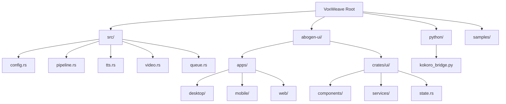
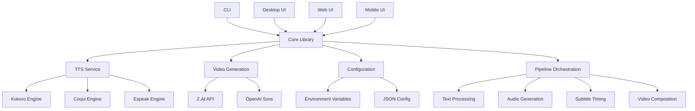
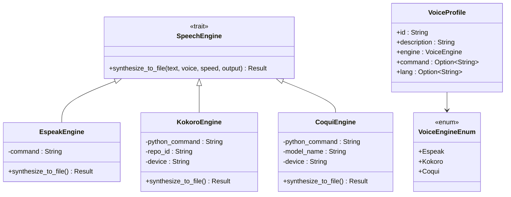
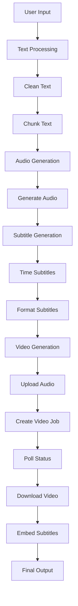
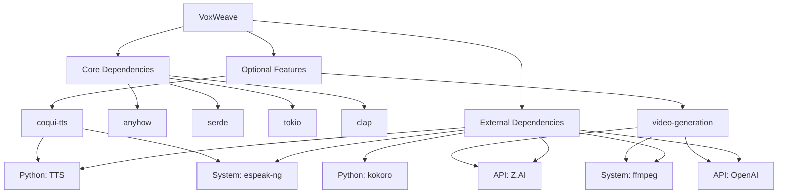

# Architecture

<cite>
**Referenced Files in This Document**   
- [Cargo.toml](file://Cargo.toml)
- [src/lib.rs](file://src/lib.rs)
- [src/pipeline.rs](file://src/pipeline.rs)
- [src/tts.rs](file://src/tts.rs)
- [src/video.rs](file://src/video.rs)
- [src/queue.rs](file://src/queue.rs)
- [src/config.rs](file://src/config.rs)
- [abogen-ui/crates/ui/lib.rs](file://abogen-ui/crates/ui/lib.rs)
- [abogen-ui/crates/ui/services/tts_service.rs](file://abogen-ui/crates/ui/services/tts_service.rs)
- [abogen-ui/crates/ui/services/video_generation.rs](file://abogen-ui/crates/ui/services/video_generation.rs)
- [abogen-ui/crates/ui/state.rs](file://abogen-ui/crates/ui/state.rs)
- [python/kokoro_bridge.py](file://python/kokoro_bridge.py)
- [README.md](file://README.md)
</cite>

## Table of Contents
1. [Introduction](#introduction)
2. [Project Structure](#project-structure)
3. [Core Components](#core-components)
4. [Architecture Overview](#architecture-overview)
5. [Detailed Component Analysis](#detailed-component-analysis)
6. [Dependency Analysis](#dependency-analysis)
7. [Performance Considerations](#performance-considerations)
8. [Troubleshooting Guide](#troubleshooting-guide)
9. [Conclusion](#conclusion)

## Introduction
The VoxWeave platform is a full-stack Rust application designed for text-to-speech and AI video generation. It features a modular monolith architecture with a shared core library that supports multiple user interfaces: CLI, desktop, web, and mobile. The system leverages feature flags to enable optional functionality such as CoquiTTS for advanced voice synthesis and video generation via external APIs. The architecture emphasizes async processing through tokio, service-oriented design with clear separation between UI and business logic, and cross-platform compatibility through Dioxus for UI components.

## Project Structure
The project follows a multi-crate workspace structure with distinct separation between core functionality and UI components. The core library resides in the root directory under `src/`, containing modules for configuration, text processing, TTS, video generation, and pipeline orchestration. The UI layer is organized under `abogen-ui/` with a shared UI crate that provides components and services used across desktop, web, and mobile applications. Python integration scripts are maintained in a dedicated `python/` directory for bridging between Rust and Python-based TTS engines.



**Diagram sources**
- [Cargo.toml](file://Cargo.toml)
- [src/lib.rs](file://src/lib.rs)
- [abogen-ui/crates/ui/lib.rs](file://abogen-ui/crates/ui/lib.rs)

**Section sources**
- [Cargo.toml](file://Cargo.toml)
- [src/lib.rs](file://src/lib.rs)
- [abogen-ui/crates/ui/lib.rs](file://abogen-ui/crates/ui/lib.rs)

## Core Components
The core components of VoxWeave include the TTS engine abstraction, video generation service, configuration management, and processing pipeline. These components are designed to be reusable across different entry points and support optional features through Rust feature flags. The system uses async channels for communication between UI components and background services, ensuring responsive user interfaces during long-running operations like audio synthesis and video generation.

**Section sources**
- [src/lib.rs](file://src/lib.rs)
- [src/pipeline.rs](file://src/pipeline.rs)
- [src/tts.rs](file://src/tts.rs)
- [src/video.rs](file://src/video.rs)

## Architecture Overview
VoxWeave follows a service-oriented architecture where UI components interact with backend services through well-defined interfaces. The core library provides a shared foundation for all entry points, with feature flags enabling optional functionality. The system uses tokio for async runtime, allowing non-blocking operations for file I/O, network requests, and subprocess execution. Configuration is managed through environment variables and JSON configuration files, with logging implemented using the standard `log` crate and error handling via `anyhow`.



**Diagram sources**
- [src/lib.rs](file://src/lib.rs)
- [src/tts.rs](file://src/tts.rs)
- [src/video.rs](file://src/video.rs)
- [src/config.rs](file://src/config.rs)
- [src/pipeline.rs](file://src/pipeline.rs)

## Detailed Component Analysis

### TTS Engine Abstraction
The TTS system is built around a trait-based engine abstraction that allows pluggable speech synthesis backends. The `SpeechEngine` trait defines a common interface for audio generation, with concrete implementations for espeak-ng, Kokoro, and CoquiTTS. Engine selection is determined by voice profiles, which specify the appropriate backend based on voice ID patterns. This design enables seamless switching between different TTS technologies while maintaining a consistent API for the rest of the application.



**Diagram sources**
- [src/tts.rs](file://src/tts.rs)
- [src/coqui_tts.rs](file://src/coqui_tts.rs)

**Section sources**
- [src/tts.rs](file://src/tts.rs)
- [src/coqui_tts.rs](file://src/coqui_tts.rs)

### Video Generation Service
The video generation component provides an abstraction over external AI video APIs, currently supporting Z.AI and OpenAI Sora. The service handles the complete workflow from audio upload to video download, with optional subtitle embedding. It uses async polling to monitor job status and provides progress updates through callback functions. The design includes fallback mechanisms and error recovery strategies to handle API failures and network issues.

```mermaid
sequenceDiagram
participant UI
participant VideoService
participant ZAI
participant Storage
UI->>VideoService : generate_video(audio_path, config)
VideoService->>Storage : upload_file(audio_path)
Storage-->>VideoService : audio_url
VideoService->>ZAI : create_video_job(audio_url, config)
ZAI-->>VideoService : job_id
loop Poll every 1s
VideoService->>ZAI : poll_video_status(job_id)
alt Processing
ZAI-->>VideoService : status=processing
else Complete
ZAI-->>VideoService : video_url
break
else Failed
ZAI-->>VideoService : error
VideoService->>UI : error
exit
end
end
VideoService->>Storage : download_video(video_url)
alt Subtitles enabled
VideoService->>VideoService : embed_subtitles(video_path, subtitle_path)
end
VideoService-->>UI : video_path
```

**Diagram sources**
- [src/video.rs](file://src/video.rs)
- [abogen-ui/crates/ui/services/video_generation.rs](file://abogen-ui/crates/ui/services/video_generation.rs)

**Section sources**
- [src/video.rs](file://src/video.rs)
- [abogen-ui/crates/ui/services/video_generation.rs](file://abogen-ui/crates/ui/services/video_generation.rs)

### Data Flow Pipeline
The processing pipeline orchestrates the complete workflow from user input to final output. It handles text normalization, audio generation, subtitle creation, and video composition in a sequential but modular fashion. The pipeline is designed to be extensible, allowing new processing stages to be added without modifying existing code. Each stage operates on a common data structure that carries all necessary information through the pipeline.



**Diagram sources**
- [src/pipeline.rs](file://src/pipeline.rs)
- [src/text.rs](file://src/text.rs)
- [src/subtitle.rs](file://src/subtitle.rs)

**Section sources**
- [src/pipeline.rs](file://src/pipeline.rs)
- [src/text.rs](file://src/text.rs)
- [src/subtitle.rs](file://src/subtitle.rs)

## Dependency Analysis
The VoxWeave platform has a layered dependency structure with clear separation between core functionality and optional features. The core library depends only on essential Rust crates like anyhow, serde, and tokio, while optional features are enabled through feature flags. External dependencies include Python bridges for Kokoro and CoquiTTS, system binaries like espeak-ng and ffmpeg, and external APIs for video generation. The UI layer depends on Dioxus for cross-platform rendering and associated ecosystem crates.



**Diagram sources**
- [Cargo.toml](file://Cargo.toml)
- [src/tts.rs](file://src/tts.rs)
- [src/video.rs](file://src/video.rs)

**Section sources**
- [Cargo.toml](file://Cargo.toml)
- [src/tts.rs](file://src/tts.rs)
- [src/video.rs](file://src/video.rs)

## Performance Considerations
The system is designed with performance in mind, using async processing to avoid blocking the main thread during I/O operations. Audio synthesis is performed in blocking threads to prevent tokio runtime starvation, with progress updates provided through channels. The architecture supports queue-based batch processing for handling multiple files efficiently. GPU acceleration is supported for CoquiTTS through configurable device settings, and the video generation service includes retry logic with exponential backoff for handling API rate limits.

**Section sources**
- [src/tts.rs](file://src/tts.rs)
- [src/video.rs](file://src/video.rs)
- [abogen-ui/crates/ui/services/tts_service.rs](file://abogen-ui/crates/ui/services/tts_service.rs)

## Troubleshooting Guide
Common issues in the VoxWeave platform typically relate to missing dependencies, configuration problems, or API limitations. The system provides comprehensive logging through the log crate, with error details captured by anyhow. Configuration issues can often be resolved by checking environment variables and configuration files. For TTS issues, verifying Python dependencies and model availability is recommended. Video generation problems may require checking API keys and network connectivity.

**Section sources**
- [README.md](file://README.md)
- [src/config.rs](file://src/config.rs)
- [src/tts.rs](file://src/tts.rs)

## Conclusion
The VoxWeave platform presents a robust architecture for text-to-speech and AI video generation with a focus on modularity, extensibility, and cross-platform compatibility. The use of feature flags allows optional functionality to be included only when needed, reducing binary size and complexity for users who don't require advanced features. The service-oriented design with clear separation between UI and business logic enables multiple entry points to share the same core functionality. The architecture supports future enhancements such as additional TTS engines, video generation providers, and improved error handling mechanisms.