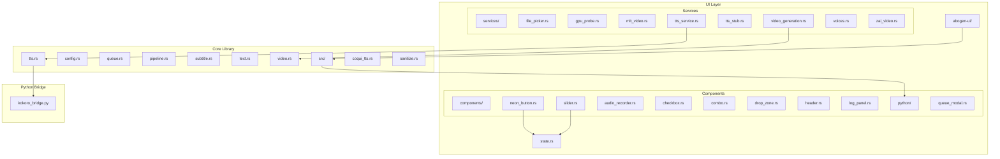
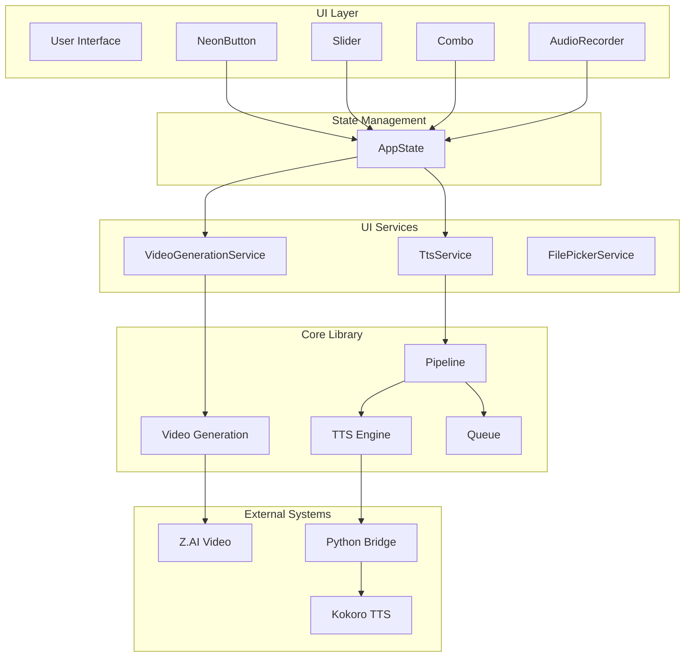
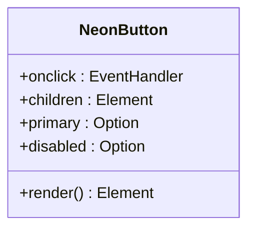
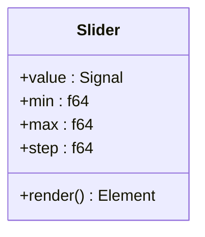
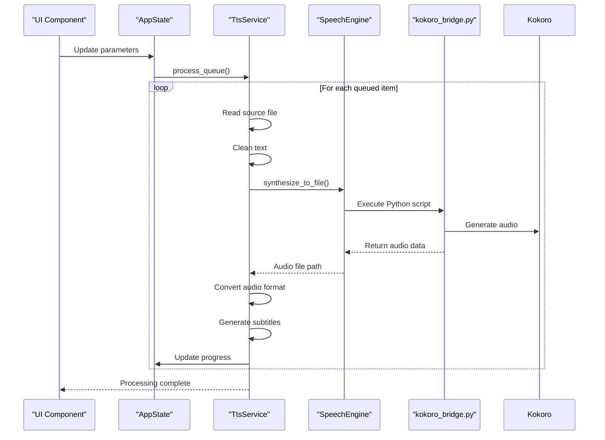
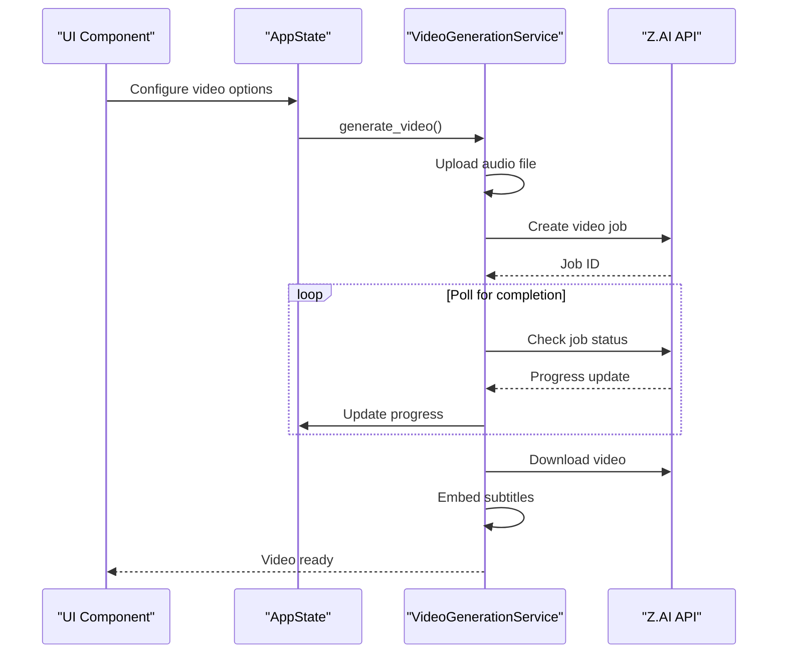
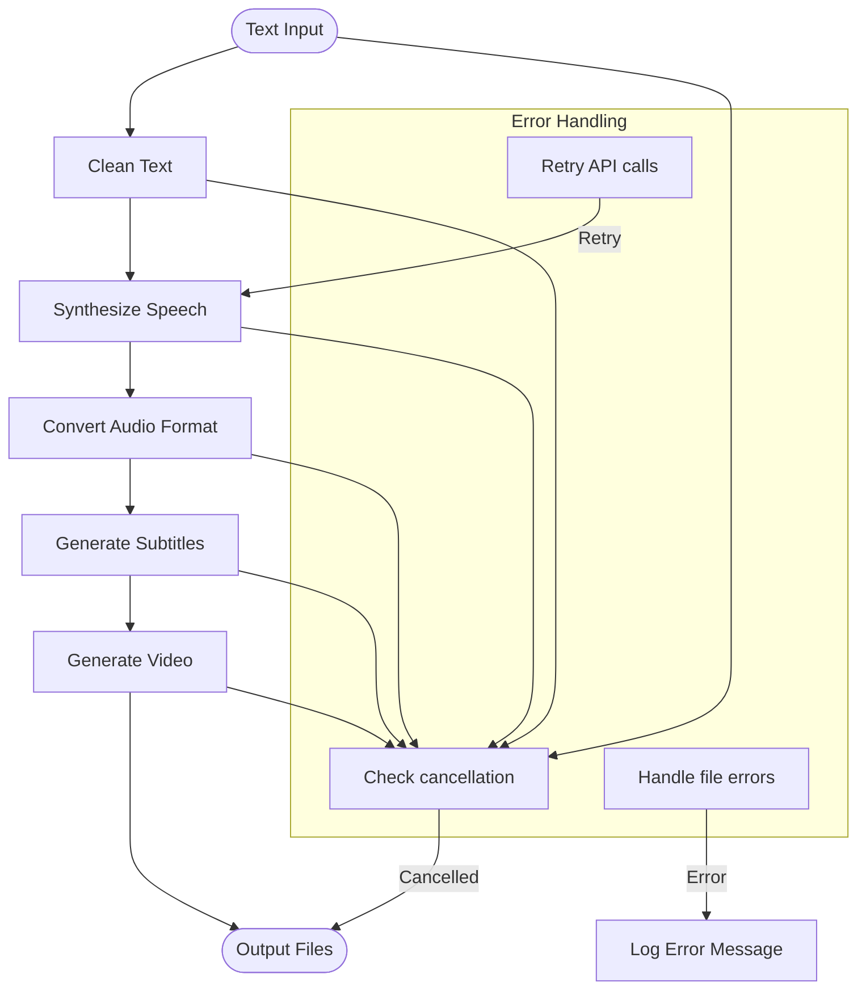
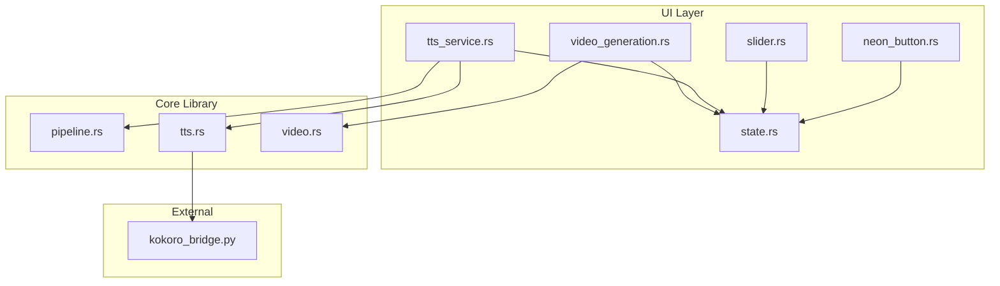

# Component Interactions

<cite>
**Referenced Files in This Document**   
- [state.rs](file://abogen-ui/crates/ui/state.rs)
- [tts_service.rs](file://abogen-ui/crates/ui/services/tts_service.rs)
- [video_generation.rs](file://abogen-ui/crates/ui/services/video_generation.rs)
- [pipeline.rs](file://src/pipeline.rs)
- [tts.rs](file://src/tts.rs)
- [video.rs](file://src/video.rs)
- [kokoro_bridge.py](file://python/kokoro_bridge.py)
- [neon_button.rs](file://abogen-ui/crates/ui/components/neon_button.rs)
- [slider.rs](file://abogen-ui/crates/ui/components/slider.rs)
</cite>

## Table of Contents
1. [Introduction](#introduction)
2. [Project Structure](#project-structure)
3. [Core Components](#core-components)
4. [Architecture Overview](#architecture-overview)
5. [Detailed Component Analysis](#detailed-component-analysis)
6. [Dependency Analysis](#dependency-analysis)
7. [Performance Considerations](#performance-considerations)
8. [Troubleshooting Guide](#troubleshooting-guide)
9. [Conclusion](#conclusion)

## Introduction
This document provides comprehensive architectural documentation for component interactions within the VoxWeave platform. It details the service-oriented architecture where UI components interact with backend services through asynchronous channels and signals. The document explains the interaction patterns between UI components (such as NeonButton and Slider) and state management (AppState) in the Dioxus framework. It also covers how the TtsService and VideoGenerationService components coordinate through the processing pipeline with proper error handling and progress reporting. The event-driven communication between the UI and core processing logic is illustrated, including cancellation tokens and real-time logging. The integration between the Rust core library and Python bridge scripts (kokoro_bridge.py) for TTS engine communication is detailed. Sequence diagrams show the flow of control from user interaction to final output generation, highlighting the async/await patterns used throughout the system. The document also addresses how component interactions support both CLI and UI interfaces with shared service implementations.

## Project Structure



**Diagram sources**
- [abogen-ui/crates/ui/components/neon_button.rs](file://abogen-ui/crates/ui/components/neon_button.rs)
- [abogen-ui/crates/ui/components/slider.rs](file://abogen-ui/crates/ui/components/slider.rs)
- [abogen-ui/crates/ui/state.rs](file://abogen-ui/crates/ui/state.rs)
- [abogen-ui/crates/ui/services/tts_service.rs](file://abogen-ui/crates/ui/services/tts_service.rs)
- [abogen-ui/crates/ui/services/video_generation.rs](file://abogen-ui/crates/ui/services/video_generation.rs)
- [src/pipeline.rs](file://src/pipeline.rs)
- [src/tts.rs](file://src/tts.rs)
- [src/video.rs](file://src/video.rs)
- [python/kokoro_bridge.py](file://python/kokoro_bridge.py)

**Section sources**
- [abogen-ui/crates/ui/components/neon_button.rs](file://abogen-ui/crates/ui/components/neon_button.rs)
- [abogen-ui/crates/ui/components/slider.rs](file://abogen-ui/crates/ui/components/slider.rs)
- [abogen-ui/crates/ui/state.rs](file://abogen-ui/crates/ui/state.rs)
- [abogen-ui/crates/ui/services/tts_service.rs](file://abogen-ui/crates/ui/services/tts_service.rs)
- [abogen-ui/crates/ui/services/video_generation.rs](file://abogen-ui/crates/ui/services/video_generation.rs)
- [src/pipeline.rs](file://src/pipeline.rs)
- [src/tts.rs](file://src/tts.rs)
- [src/video.rs](file://src/video.rs)
- [python/kokoro_bridge.py](file://python/kokoro_bridge.py)

## Core Components

The VoxWeave platform consists of several core components that work together to provide text-to-speech and video generation capabilities. The UI layer is built using the Dioxus framework and includes various components such as NeonButton, Slider, and other interactive elements. These components interact with the AppState to manage application state and trigger processing workflows. The core processing logic is implemented in Rust and exposed through services like TtsService and VideoGenerationService. The system uses a pipeline architecture to coordinate the processing of text input into audio and video outputs. The Python bridge script (kokoro_bridge.py) enables integration with the Kokoro TTS engine, allowing the Rust core to leverage Python-based speech synthesis capabilities.

**Section sources**
- [abogen-ui/crates/ui/state.rs](file://abogen-ui/crates/ui/state.rs)
- [abogen-ui/crates/ui/services/tts_service.rs](file://abogen-ui/crates/ui/services/tts_service.rs)
- [abogen-ui/crates/ui/services/video_generation.rs](file://abogen-ui/crates/ui/services/video_generation.rs)
- [src/pipeline.rs](file://src/pipeline.rs)
- [src/tts.rs](file://src/tts.rs)
- [src/video.rs](file://src/video.rs)
- [python/kokoro_bridge.py](file://python/kokoro_bridge.py)

## Architecture Overview



**Diagram sources**
- [abogen-ui/crates/ui/state.rs](file://abogen-ui/crates/ui/state.rs)
- [abogen-ui/crates/ui/services/tts_service.rs](file://abogen-ui/crates/ui/services/tts_service.rs)
- [abogen-ui/crates/ui/services/video_generation.rs](file://abogen-ui/crates/ui/services/video_generation.rs)
- [src/pipeline.rs](file://src/pipeline.rs)
- [src/tts.rs](file://src/tts.rs)
- [src/video.rs](file://src/video.rs)
- [python/kokoro_bridge.py](file://python/kokoro_bridge.py)

## Detailed Component Analysis

### UI Components Analysis

#### NeonButton Component
The NeonButton component is a styled button implementation that provides visual feedback through a neon effect. It handles user interactions and propagates events to the application state.



**Diagram sources**
- [abogen-ui/crates/ui/components/neon_button.rs](file://abogen-ui/crates/ui/components/neon_button.rs)

#### Slider Component
The Slider component provides a user interface for adjusting numeric values, specifically the speech speed parameter. It integrates with the AppState to maintain synchronized state.



**Diagram sources**
- [abogen-ui/crates/ui/components/slider.rs](file://abogen-ui/crates/ui/components/slider.rs)

### State Management Analysis

#### AppState Component
The AppState component manages the application's state using Dioxus signals. It coordinates between UI components and backend services.

```mermaid
classDiagram
class AppState {
+selected_file : Signal<Option<FileInfo>>
+queue : Signal<Vec<QueuedItem>>
+voice : Signal<String>
+speed : Signal<f64>
+subtitle_mode : Signal<SubtitleMode>
+voice_format : Signal<VoiceFormat>
+subtitle_format : Signal<SubtitleFormat>
+replace_newlines : Signal<bool>
+save_location : Signal<SaveLocation>
+use_gpu : Signal<bool>
+generate_video : Signal<bool>
+video_style : Signal<VideoStyle>
+video_resolution : Signal<VideoResolution>
+video_format : Signal<VideoFormat>
+video_prompt : Signal<Option<String>>
+is_processing : Signal<bool>
+progress : Signal<u8>
+logs : Signal<Vec<LogEntry>>
+cancel_token : Signal<Option<()>>
+new() AppState
}
class FileInfo {
+name : String
+path : String
+size : u64
}
class QueuedItem {
+file : FileInfo
+voice : String
+speed : f64
+subtitle_mode : SubtitleMode
+voice_format : VoiceFormat
+subtitle_format : SubtitleFormat
+replace_newlines : bool
+use_gpu : bool
+generate_video : bool
+video_style : VideoStyle
+video_resolution : VideoResolution
+video_format : VideoFormat
+video_prompt : Option<String>
+save_location : SaveLocation
}
class LogEntry {
+message : String
+level : LogLevel
}
AppState --> FileInfo
AppState --> QueuedItem
AppState --> LogEntry
```

**Diagram sources**
- [abogen-ui/crates/ui/state.rs](file://abogen-ui/crates/ui/state.rs)

### Service Components Analysis

#### TtsService Component
The TtsService component orchestrates text-to-speech processing, coordinating between the UI and the core TTS engine.



**Diagram sources**
- [abogen-ui/crates/ui/services/tts_service.rs](file://abogen-ui/crates/ui/services/tts_service.rs)
- [src/tts.rs](file://src/tts.rs)
- [python/kokoro_bridge.py](file://python/kokoro_bridge.py)

#### VideoGenerationService Component
The VideoGenerationService component manages video generation using external APIs like Z.AI.



**Diagram sources**
- [abogen-ui/crates/ui/services/video_generation.rs](file://abogen-ui/crates/ui/services/video_generation.rs)
- [src/video.rs](file://src/video.rs)

### Pipeline Analysis

#### Processing Pipeline
The processing pipeline coordinates the transformation of text input into audio and video outputs.



**Diagram sources**
- [src/pipeline.rs](file://src/pipeline.rs)
- [src/tts.rs](file://src/tts.rs)
- [src/video.rs](file://src/video.rs)

**Section sources**
- [abogen-ui/crates/ui/components/neon_button.rs](file://abogen-ui/crates/ui/components/neon_button.rs)
- [abogen-ui/crates/ui/components/slider.rs](file://abogen-ui/crates/ui/components/slider.rs)
- [abogen-ui/crates/ui/state.rs](file://abogen-ui/crates/ui/state.rs)
- [abogen-ui/crates/ui/services/tts_service.rs](file://abogen-ui/crates/ui/services/tts_service.rs)
- [abogen-ui/crates/ui/services/video_generation.rs](file://abogen-ui/crates/ui/services/video_generation.rs)
- [src/pipeline.rs](file://src/pipeline.rs)
- [src/tts.rs](file://src/tts.rs)
- [src/video.rs](file://src/video.rs)
- [python/kokoro_bridge.py](file://python/kokoro_bridge.py)

## Dependency Analysis



**Diagram sources**
- [abogen-ui/crates/ui/components/neon_button.rs](file://abogen-ui/crates/ui/components/neon_button.rs)
- [abogen-ui/crates/ui/components/slider.rs](file://abogen-ui/crates/ui/components/slider.rs)
- [abogen-ui/crates/ui/state.rs](file://abogen-ui/crates/ui/state.rs)
- [abogen-ui/crates/ui/services/tts_service.rs](file://abogen-ui/crates/ui/services/tts_service.rs)
- [abogen-ui/crates/ui/services/video_generation.rs](file://abogen-ui/crates/ui/services/video_generation.rs)
- [src/pipeline.rs](file://src/pipeline.rs)
- [src/tts.rs](file://src/tts.rs)
- [src/video.rs](file://src/video.rs)
- [python/kokoro_bridge.py](file://python/kokoro_bridge.py)

**Section sources**
- [abogen-ui/crates/ui/components/neon_button.rs](file://abogen-ui/crates/ui/components/neon_button.rs)
- [abogen-ui/crates/ui/components/slider.rs](file://abogen-ui/crates/ui/components/slider.rs)
- [abogen-ui/crates/ui/state.rs](file://abogen-ui/crates/ui/state.rs)
- [abogen-ui/crates/ui/services/tts_service.rs](file://abogen-ui/crates/ui/services/tts_service.rs)
- [abogen-ui/crates/ui/services/video_generation.rs](file://abogen-ui/crates/ui/services/video_generation.rs)
- [src/pipeline.rs](file://src/pipeline.rs)
- [src/tts.rs](file://src/tts.rs)
- [src/video.rs](file://src/video.rs)
- [python/kokoro_bridge.py](file://python/kokoro_bridge.py)

## Performance Considerations
The VoxWeave platform employs several performance optimization strategies. The UI components use Dioxus signals for efficient state management, minimizing unnecessary re-renders. The processing pipeline runs in separate threads to prevent UI blocking, with periodic yield points to maintain responsiveness. Audio format conversion is handled by external tools like ffmpeg when available, leveraging optimized native code. The video generation service implements exponential backoff for API retries, preventing excessive request rates. Cancellation tokens allow users to stop long-running operations without waiting for completion. Progress reporting provides feedback during processing, improving perceived performance. The system also includes fallback mechanisms, such as using file URLs when uploads fail, to maintain functionality under suboptimal conditions.

## Troubleshooting Guide

**Section sources**
- [abogen-ui/crates/ui/services/tts_service.rs](file://abogen-ui/crates/ui/services/tts_service.rs)
- [abogen-ui/crates/ui/services/video_generation.rs](file://abogen-ui/crates/ui/services/video_generation.rs)
- [src/tts.rs](file://src/tts.rs)
- [src/video.rs](file://src/video.rs)
- [python/kokoro_bridge.py](file://python/kokoro_bridge.py)

## Conclusion
The VoxWeave platform demonstrates a well-structured service-oriented architecture with clear separation between UI components and core processing logic. The Dioxus framework provides an efficient reactive state management system through signals, enabling seamless interaction between UI elements like NeonButton and Slider with the AppState. The processing pipeline coordinates text-to-speech and video generation workflows, with proper error handling and progress reporting. The integration between Rust and Python through the kokoro_bridge.py script enables leveraging specialized TTS engines while maintaining a high-performance core. The system supports both CLI and UI interfaces through shared service implementations, promoting code reuse and consistency. The architecture effectively handles asynchronous operations, cancellation, and real-time feedback, providing a responsive user experience even during long-running processing tasks.