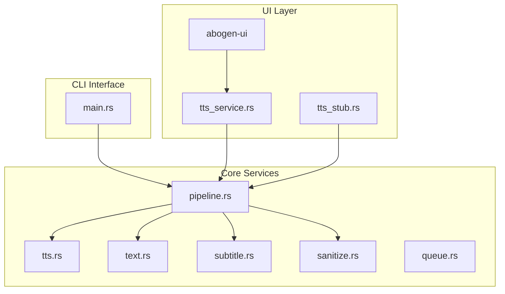
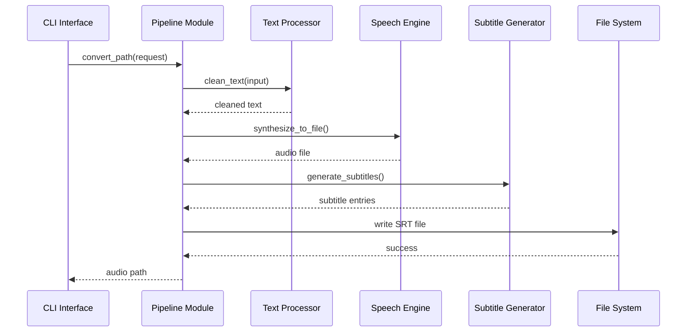
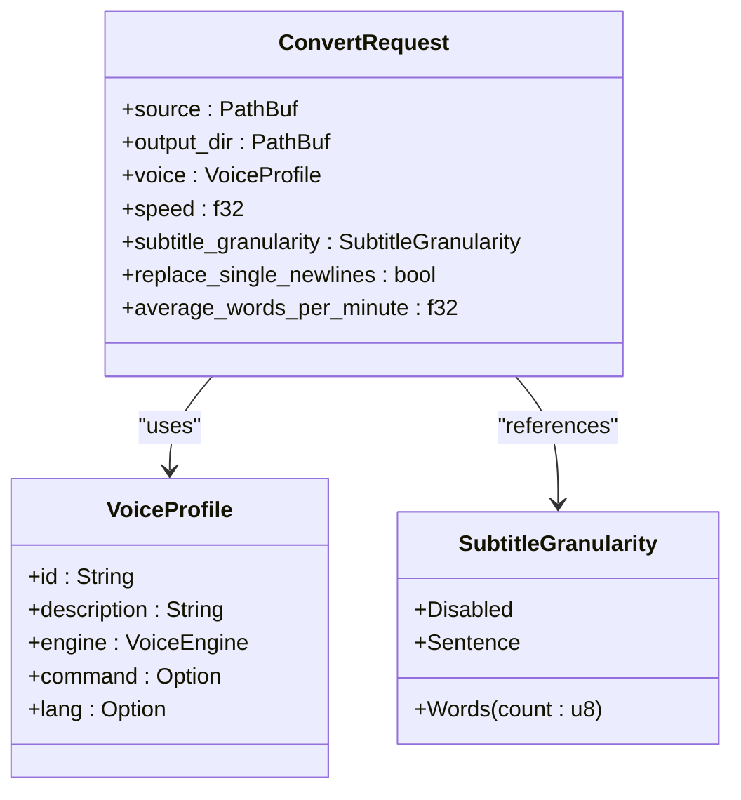
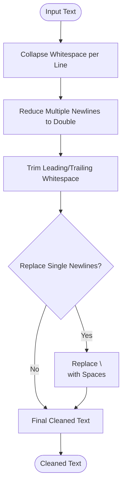
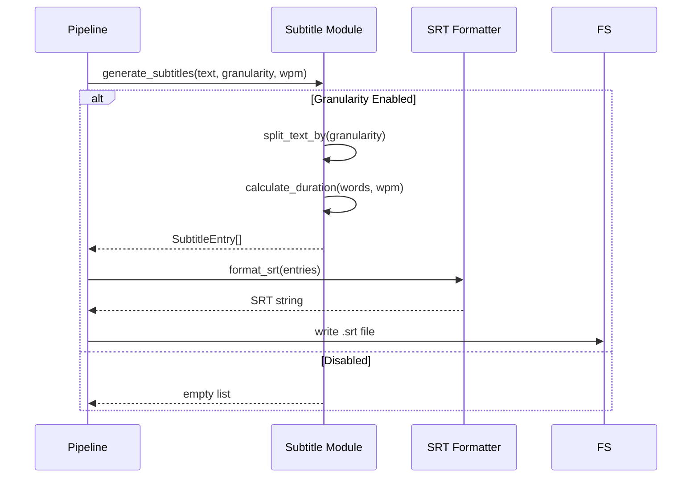
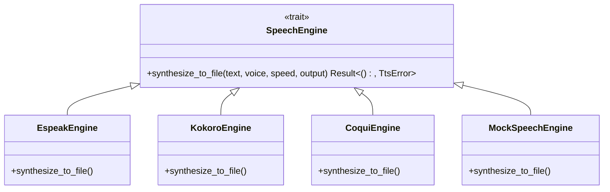
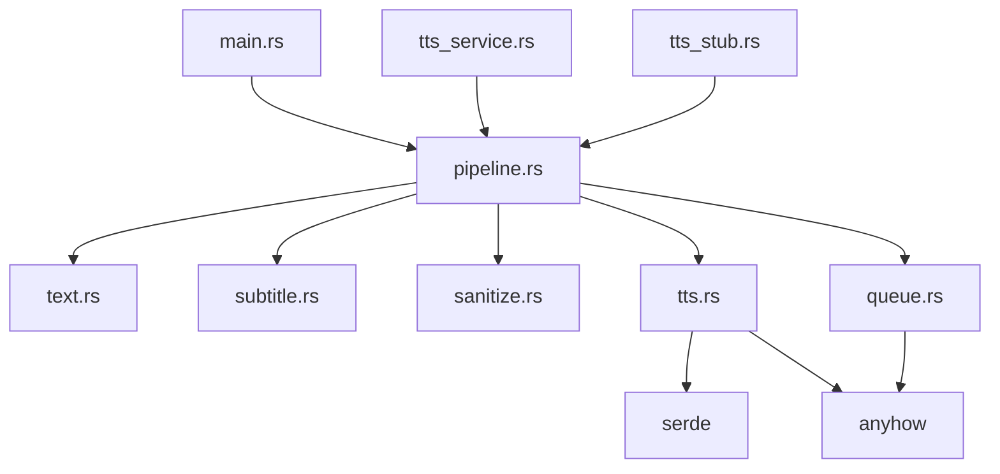

# Core Services

<cite>
**Referenced Files in This Document**   
- [pipeline.rs](file://src/pipeline.rs)
- [tts.rs](file://src/tts.rs)
- [text.rs](file://src/text.rs)
- [subtitle.rs](file://src/subtitle.rs)
- [sanitize.rs](file://src/sanitize.rs)
- [main.rs](file://src/main.rs)
</cite>

## Table of Contents
1. [Introduction](#introduction)
2. [Project Structure](#project-structure)
3. [Core Components](#core-components)
4. [Architecture Overview](#architecture-overview)
5. [Detailed Component Analysis](#detailed-component-analysis)
6. [Dependency Analysis](#dependency-analysis)
7. [Performance Considerations](#performance-considerations)
8. [Troubleshooting Guide](#troubleshooting-guide)
9. [Conclusion](#conclusion)

## Introduction
This document provides architectural documentation for the core services in the VoxWeave platform, focusing on the service-oriented design of the pipeline module. It details how text-to-speech and subtitle generation workflows are orchestrated through the `ConvertRequest` struct and underlying abstractions. The integration between CLI and UI entry points is explained, along with data flow from input text to final audio and subtitle outputs.

## Project Structure
The VoxWeave platform consists of multiple components organized into distinct directories. The core functionality resides in the `src/` directory, which contains modules for configuration, text processing, TTS engines, subtitle generation, and pipeline orchestration. The `abogen-ui/` directory houses frontend implementations across desktop, mobile, and web platforms, while shared logic is abstracted into reusable crates.

**Diagram sources**
- [pipeline.rs](file://src/pipeline.rs#L1-L140)
- [main.rs](file://src/main.rs#L1-L424)
- [tts_service.rs](file://abogen-ui/crates/ui/services/tts_service.rs#L1-L300)
- [tts_stub.rs](file://abogen-ui/crates/ui/services/tts_stub.rs#L1-L120)

**Section sources**
- [pipeline.rs](file://src/pipeline.rs#L1-L140)
- [main.rs](file://src/main.rs#L1-L424)

## Core Components
The core services of VoxWeave are built around a modular architecture that separates concerns across text processing, speech synthesis, and subtitle generation. The pipeline module acts as the central orchestrator, coordinating these components through well-defined interfaces and data structures.

**Section sources**
- [pipeline.rs](file://src/pipeline.rs#L1-L140)
- [tts.rs](file://src/tts.rs#L1-L523)

## Architecture Overview
VoxWeave's architecture follows a service-oriented design where the pipeline module coordinates text cleaning, audio synthesis, and SRT subtitle generation. The system uses a trait-based abstraction (`SpeechEngine`) to support multiple TTS backends, enabling flexibility in voice synthesis technologies.

**Diagram sources**
- [pipeline.rs](file://src/pipeline.rs#L1-L140)
- [text.rs](file://src/text.rs#L1-L71)
- [subtitle.rs](file://src/subtitle.rs#L1-L157)
- [tts.rs](file://src/tts.rs#L1-L523)

## Detailed Component Analysis

### ConvertRequest and Pipeline Orchestration
The `ConvertRequest` struct serves as the primary data carrier for conversion operations, encapsulating all necessary parameters for text-to-speech and subtitle generation workflows. It contains source and output paths, voice profile, speed settings, subtitle configuration, and text processing options.

**Diagram sources**
- [pipeline.rs](file://src/pipeline.rs#L1-L140)
- [tts.rs](file://src/tts.rs#L1-L523)
- [queue.rs](file://src/queue.rs#L1-L100)

**Section sources**
- [pipeline.rs](file://src/pipeline.rs#L1-L140)

### Text Processing Pipeline
The text processing component handles cleaning and normalization of input text before synthesis. It removes excessive whitespace, collapses newlines, and optionally replaces single newlines with spaces based on configuration.

**Diagram sources**
- [text.rs](file://src/text.rs#L1-L71)

**Section sources**
- [text.rs](file://src/text.rs#L1-L71)

### Subtitle Generation Workflow
The subtitle generation system creates timed SRT files based on text content and estimated reading speed. It supports different granularity levels including sentence-based and word-grouped subtitles.

**Diagram sources**
- [subtitle.rs](file://src/subtitle.rs#L1-L157)

**Section sources**
- [subtitle.rs](file://src/subtitle.rs#L1-L157)

### TTS Engine Abstraction
The `SpeechEngine` trait provides a unified interface for different text-to-speech implementations, allowing the pipeline to work with various backend technologies without coupling to specific implementations.

**Diagram sources**
- [tts.rs](file://src/tts.rs#L1-L523)

**Section sources**
- [tts.rs](file://src/tts.rs#L1-L523)

## Dependency Analysis
The core services exhibit a layered dependency structure where higher-level components depend on lower-level abstractions. The pipeline module serves as the integration point, depending on text processing, subtitle generation, and TTS engine components.

**Diagram sources**
- [Cargo.toml](file://Cargo.toml#L1-L50)
- [pipeline.rs](file://src/pipeline.rs#L1-L140)
- [tts.rs](file://src/tts.rs#L1-L523)

**Section sources**
- [Cargo.toml](file://Cargo.toml#L1-L50)
- [pipeline.rs](file://src/pipeline.rs#L1-L140)

## Performance Considerations
The pipeline implementation considers several performance aspects including batch processing efficiency and memory usage during file operations. The `convert_queue` function processes items sequentially but could benefit from parallelization for independent tasks.

Key performance characteristics:
- **Memory Usage**: Text content is loaded entirely into memory; large files may impact memory consumption
- **I/O Operations**: Each conversion involves multiple file operations (read input, write audio, write subtitles)
- **Processing Efficiency**: Queue processing occurs synchronously, limiting throughput for multiple files
- **Path Sanitization**: OS-specific name sanitization adds minimal overhead but ensures cross-platform compatibility

Optimization opportunities include:
- Implementing concurrent processing for queue items
- Streaming text processing for large files
- Caching frequently used voice profiles
- Batch file system operations where possible

**Section sources**
- [pipeline.rs](file://src/pipeline.rs#L1-L140)
- [sanitize.rs](file://src/sanitize.rs#L1-L162)

## Troubleshooting Guide
Common issues in the core services typically relate to configuration, file system permissions, or missing dependencies. Error propagation using `anyhow` provides contextual information for debugging.

Frequent error scenarios:
- **Missing Input Files**: Verify source paths exist and are accessible
- **Output Directory Permissions**: Ensure output directories are writable
- **Voice Profile Not Found**: Check voice ID against available options via `list-voices`
- **TTS Engine Dependencies**: Confirm required binaries (espeak, python) are installed and in PATH
- **Environment Variables**: Set required environment variables for specific engines (VOXWEAVE_KOKORO_PYTHON, VOXWEAVE_ESPEAK_COMMAND)

Error handling follows a consistent pattern using `anyhow::Context` to add contextual information while preserving the original error chain.

**Section sources**
- [pipeline.rs](file://src/pipeline.rs#L1-L140)
- [tts.rs](file://src/tts.rs#L1-L523)
- [main.rs](file://src/main.rs#L1-L424)

## Conclusion
The VoxWeave core services demonstrate a well-structured, modular architecture that effectively separates concerns across text processing, speech synthesis, and subtitle generation. The pipeline module successfully orchestrates these components through the `ConvertRequest` abstraction, providing a clean interface for both CLI and UI entry points. The trait-based design of `SpeechEngine` enables extensibility with different TTS backends while maintaining a consistent API. Future improvements could focus on performance optimizations through parallel processing and enhanced error recovery mechanisms.