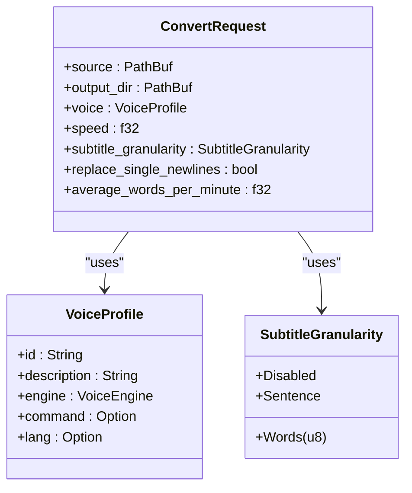
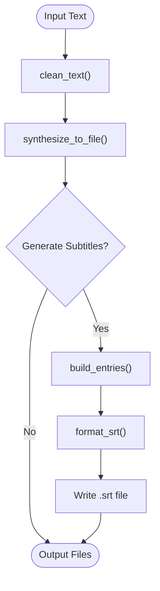
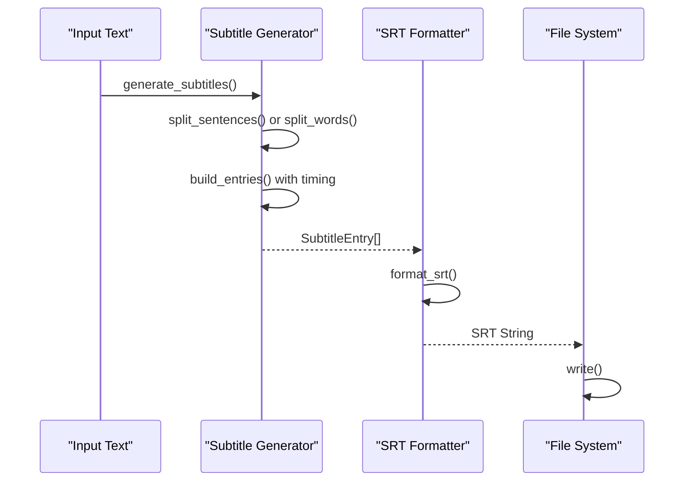
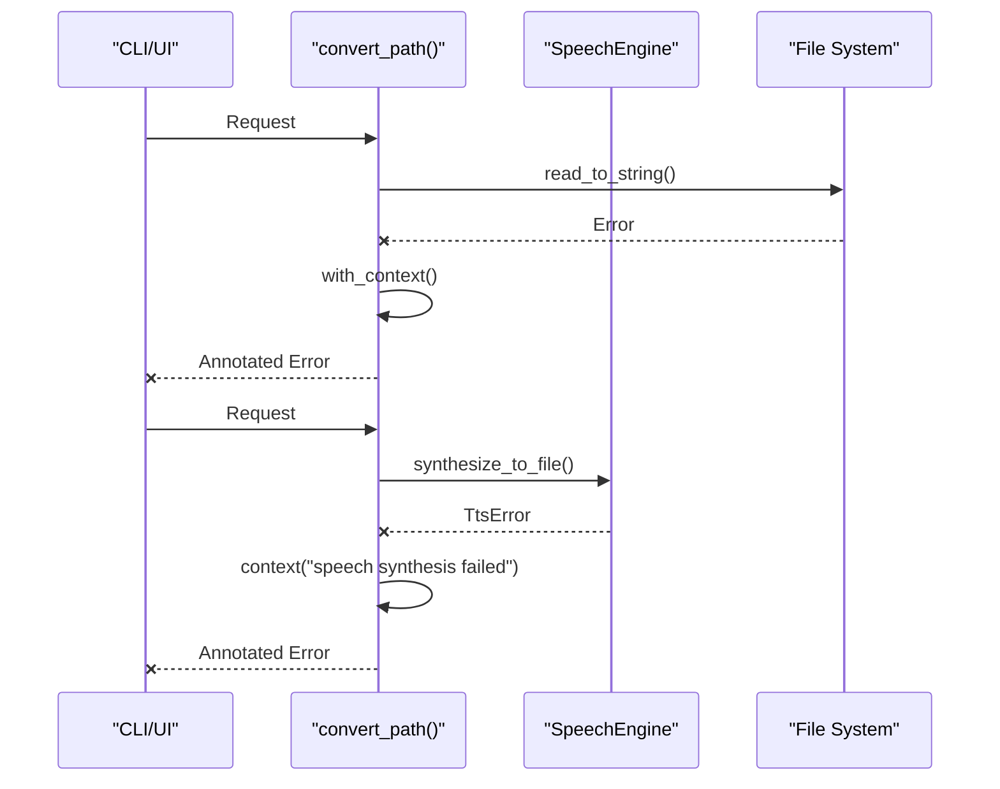
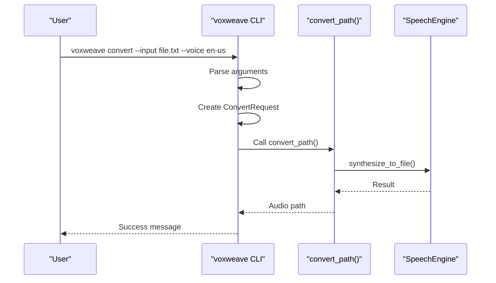
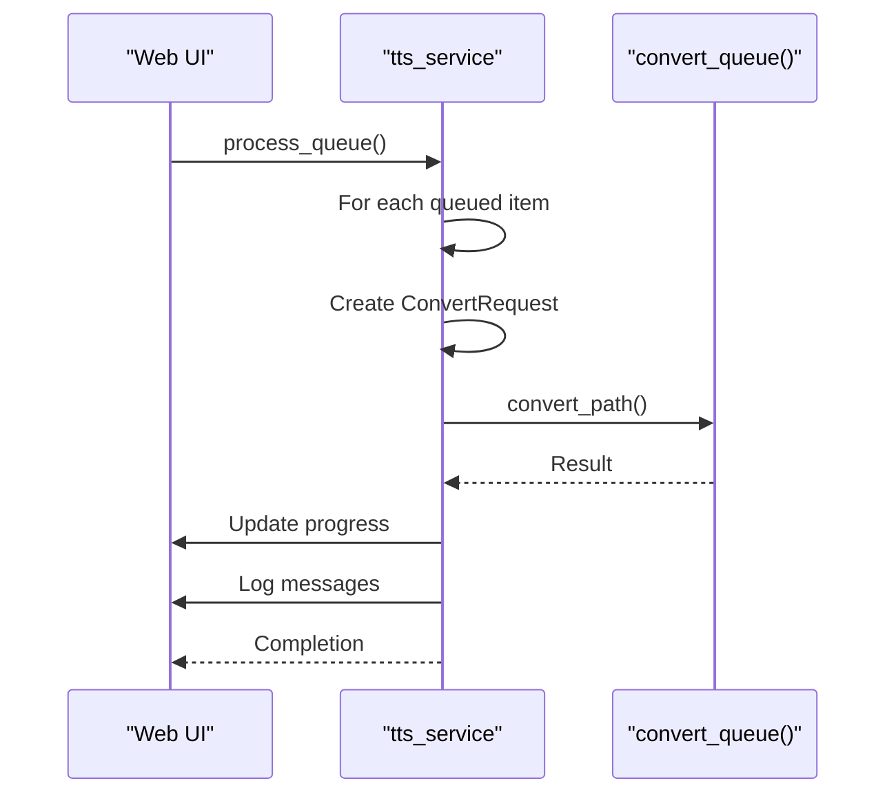

# Pipeline Orchestration

<cite>
**Referenced Files in This Document**   
- [pipeline.rs](file://src/pipeline.rs)
- [text.rs](file://src/text.rs)
- [subtitle.rs](file://src/subtitle.rs)
- [sanitize.rs](file://src/sanitize.rs)
- [tts.rs](file://src/tts.rs)
- [queue.rs](file://src/queue.rs)
- [main.rs](file://src/main.rs)
- [tts_service.rs](file://abogen-ui/crates/ui/services/tts_service.rs)
</cite>

## Table of Contents
1. [Introduction](#introduction)
2. [Core Components](#core-components)
3. [Data Flow and Processing Pipeline](#data-flow-and-processing-pipeline)
4. [Error Handling and Propagation](#error-handling-and-propagation)
5. [File System Operations](#file-system-operations)
6. [Integration with CLI and UI Layers](#integration-with-cli-and-ui-layers)
7. [Performance Considerations](#performance-considerations)
8. [Extending the Pipeline](#extending-the-pipeline)

## Introduction
The VoxWeave pipeline orchestration system provides a unified interface for text-to-speech conversion with subtitle generation. It supports both single-file processing and batch queue operations, integrating with multiple TTS engines through a common trait interface. The system handles text preprocessing, audio synthesis, subtitle timing, and file output management in a robust, extensible architecture.

## Core Components

The pipeline's core functionality revolves around the `ConvertRequest` struct and two primary processing functions: `convert_path` for single files and `convert_queue` for batch operations.



**Diagram sources**
- [pipeline.rs](file://src/pipeline.rs#L10-L24)
- [tts.rs](file://src/tts.rs#L70-L94)
- [queue.rs](file://src/queue.rs#L76-L80)

**Section sources**
- [pipeline.rs](file://src/pipeline.rs#L10-L24)
- [queue.rs](file://src/queue.rs#L76-L80)

## Data Flow and Processing Pipeline

The pipeline processes text input through a series of stages: text cleaning, audio synthesis, and subtitle generation.



**Diagram sources**
- [pipeline.rs](file://src/pipeline.rs#L30-L100)
- [text.rs](file://src/text.rs#L5-L35)
- [subtitle.rs](file://src/subtitle.rs#L10-L60)

### Text Processing
The `clean_text` function normalizes input by:
- Trimming whitespace from each line
- Collapsing multiple spaces into single spaces
- Reducing multiple blank lines to double line breaks
- Optionally replacing single newlines with spaces

**Section sources**
- [text.rs](file://src/text.rs#L5-L35)

### Subtitle Generation
Subtitle generation supports multiple granularity levels:
- **Disabled**: No subtitles generated
- **Sentence**: One subtitle entry per sentence
- **Words(n)**: Entries containing n words each

The timing algorithm calculates duration based on average words per minute, with minimum durations to ensure readability.



**Diagram sources**
- [subtitle.rs](file://src/subtitle.rs#L10-L60)

**Section sources**
- [subtitle.rs](file://src/subtitle.rs#L10-L60)

## Error Handling and Propagation

The pipeline uses `anyhow` for error handling, providing contextual information throughout the call stack.



Errors are propagated up the call chain with additional context at each layer, preserving the original error cause while adding relevant operational context.

**Section sources**
- [pipeline.rs](file://src/pipeline.rs#L30-L100)
- [tts.rs](file://src/tts.rs#L100-L300)

## File System Operations

The pipeline manages file system operations including directory creation, path sanitization, and output file naming.

### Path Sanitization
The `sanitize_name_for_os` function ensures filenames are valid across different operating systems by:
- Replacing invalid characters with underscores
- Handling OS-specific reserved names (Windows)
- Truncating long filenames (255 character limit)
- Handling special cases for hidden files (macOS/Linux)

```mermaid
flowchart TD
Input[Raw Filename] --> Trim["Trim whitespace"]
Trim --> OS{"OS Type?"}
OS --> |Windows| Win["Replace < > : \" / \\ | ? * and control chars"]
OS --> |MacOS| Mac["Replace : and control chars"]
OS --> |Linux| Linux["Replace / and control chars"]
Win --> Reserved{"Reserved name?"}
Mac --> Hidden{"Hidden folder?"}
Linux --> Hidden
Reserved --> |Yes| Prefix["Prefix with _"]
Hidden --> |Yes| RemoveDot["Remove leading . and prefix with _"]
Prefix --> Length["Check length > 255?"]
RemoveDot --> Length
Length --> |Yes| Truncate["Truncate to 255 chars"]
Length --> |No| Output[Valid Filename]
Truncate --> Output
```

**Diagram sources**
- [sanitize.rs](file://src/sanitize.rs#L50-L150)

**Section sources**
- [sanitize.rs](file://src/sanitize.rs#L50-L150)

### Output File Naming
Output files are named using the source file's stem, sanitized for the target OS, with appropriate extensions (.wav for audio, .srt for subtitles).

**Section sources**
- [pipeline.rs](file://src/pipeline.rs#L45-L50)

## Integration with CLI and UI Layers

The pipeline is accessible through both command-line and graphical interfaces.

### CLI Integration
The CLI exposes the pipeline through the `convert` subcommand, mapping command-line arguments to `ConvertRequest` parameters.



**Section sources**
- [main.rs](file://src/main.rs#L100-L200)

### UI Integration
The web UI integrates with the pipeline through the `process_queue` function in `tts_service.rs`, processing queued items with progress reporting and cancellation support.



The UI implementation includes cancellation support through a token mechanism and progress updates for user feedback.

**Section sources**
- [tts_service.rs](file://abogen-ui/crates/ui/services/tts_service.rs#L211-L540)

## Performance Considerations

The pipeline architecture considers several performance aspects:

### Batch Processing Efficiency
The `convert_queue` function processes items sequentially, which provides predictable resource usage but limits throughput. Each item is processed completely (audio + subtitles) before moving to the next.

### Memory Usage
Memory usage is optimized by:
- Processing one file at a time in the queue
- Using streaming where possible (text files read entirely but processed in chunks)
- Avoiding unnecessary data duplication

### Error Propagation
The use of `anyhow::Result` with contextual errors provides detailed debugging information without significant performance overhead, as error paths are typically not performance-critical.

**Section sources**
- [pipeline.rs](file://src/pipeline.rs#L100-L130)
- [tts_service.rs](file://abogen-ui/crates/ui/services/tts_service.rs#L211-L540)

## Extending the Pipeline

The pipeline can be extended with new processing stages through several mechanisms:

### Adding New TTS Engines
New engines can be integrated by implementing the `SpeechEngine` trait, which defines the `synthesize_to_file` method. The trait-based design allows new engines to be used without modifying the pipeline core.

### Custom Processing Stages
Additional processing stages can be inserted by:
- Creating new functions that operate on `ConvertRequest`
- Modifying the `convert_path` function to include new steps
- Implementing pre- or post-processing hooks

### New Subtitle Formats
The subtitle system can be extended to support additional formats by:
- Adding new variants to the `SubtitleFormat` enum in the UI layer
- Implementing new formatting functions similar to `format_srt`
- Updating the pipeline to conditionally generate different formats

The modular design allows extensions while maintaining separation of concerns between text processing, audio synthesis, and file operations.

**Section sources**
- [tts.rs](file://src/tts.rs#L100-L300)
- [subtitle.rs](file://src/subtitle.rs#L65-L100)
- [tts_service.rs](file://abogen-ui/crates/ui/services/tts_service.rs#L150-L200)