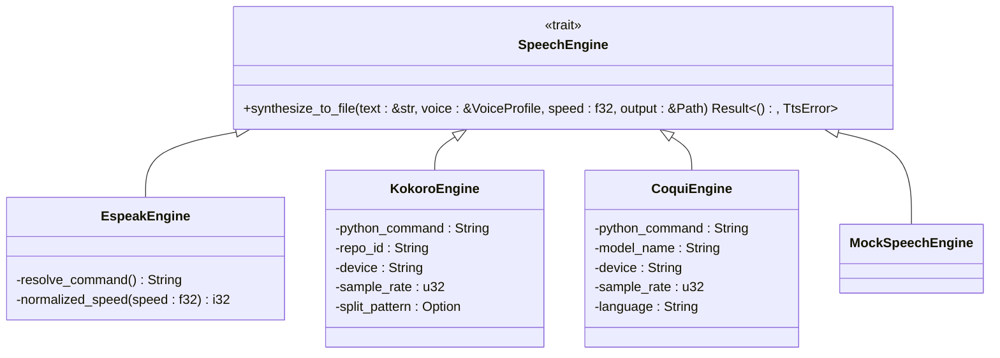
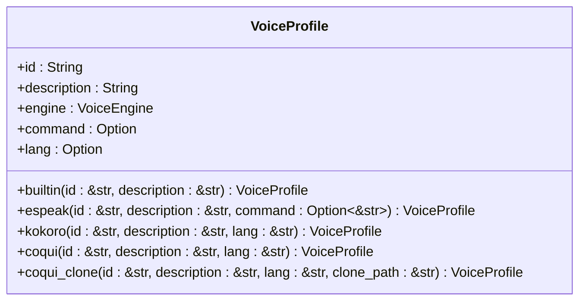
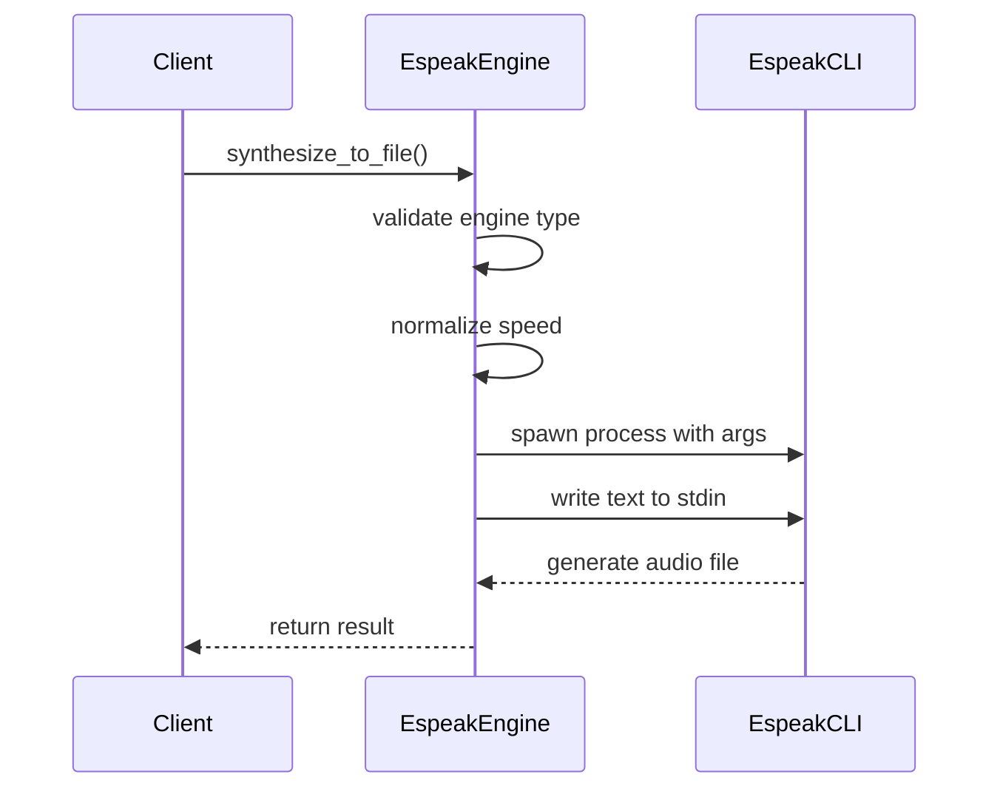
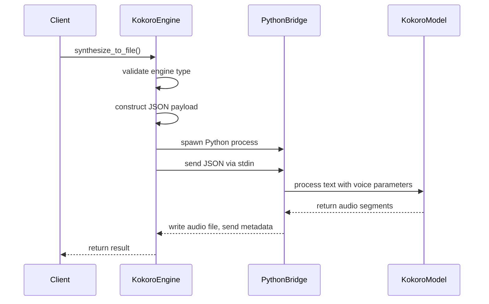
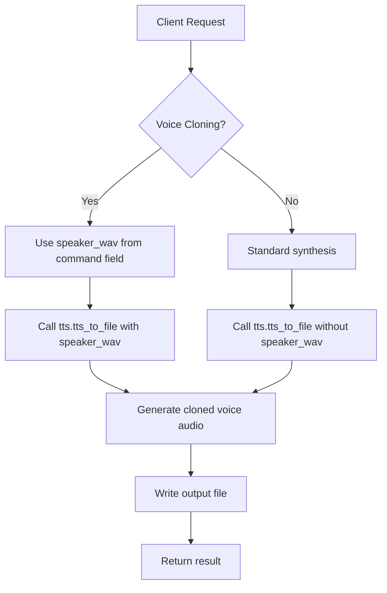

# TTS Engine Integration

<cite>
**Referenced Files in This Document**   
- [tts.rs](file://src/tts.rs)
- [coqui_tts.rs](file://src/coqui_tts.rs)
- [kokoro_bridge.py](file://python/kokoro_bridge.py)
- [COQUI_USAGE_GUIDE.md](file://COQUI_USAGE_GUIDE.md)
</cite>

## Table of Contents
1. [Introduction](#introduction)
2. [SpeechEngine Trait Interface](#speechengine-trait-interface)
3. [VoiceProfile Data Model](#voiceprofile-data-model)
4. [Engine-Specific Implementations](#engine-specific-implementations)
5. [Configuration Mechanisms](#configuration-mechanisms)
6. [Common Issues and Troubleshooting](#common-issues-and-troubleshooting)
7. [Performance Optimization](#performance-optimization)

## Introduction
This document provides comprehensive documentation for the Text-to-Speech (TTS) engine integration layer in VoxWeave. It details the architecture, implementation, and usage patterns for the multi-engine TTS system that supports EspeakEngine, KokoroEngine, and CoquiTTS-based engines. The integration layer abstracts different TTS technologies behind a unified interface, enabling flexible voice synthesis across various platforms and requirements.

## SpeechEngine Trait Interface
The core abstraction in the TTS system is the `SpeechEngine` trait, which defines a uniform interface for all TTS engines regardless of their underlying implementation. This trait enables polymorphic behavior and simplifies engine switching within the application.

**Diagram sources**
- [tts.rs](file://src/tts.rs#L58-L102)
- [coqui_tts.rs](file://src/coqui_tts.rs#L1-L115)

**Section sources**
- [tts.rs](file://src/tts.rs#L58-L102)
- [coqui_tts.rs](file://src/coqui_tts.rs#L1-L115)

## VoiceProfile Data Model
The `VoiceProfile` struct serves as the central data model for managing voice metadata across different TTS engines. It encapsulates essential voice characteristics and provides factory methods for creating engine-specific voice profiles.

### VoiceProfile Structure
The `VoiceProfile` contains the following fields:
- **id**: Unique identifier for the voice
- **description**: Human-readable description of the voice
- **engine**: Enum specifying the TTS engine (Espeak, Kokoro, or Coqui)
- **command**: Optional field used differently by each engine (espeak command, clone audio path)
- **lang**: Optional language code for multilingual support

### Factory Methods
The `VoiceProfile` implementation provides several factory methods for creating specialized voice profiles:

The `coqui_clone` method is particularly important as it enables voice cloning functionality by storing the path to reference audio in the `command` field, which is then used by the CoquiEngine during synthesis.

**Diagram sources**
- [tts.rs](file://src/tts.rs#L60-L102)

**Section sources**
- [tts.rs](file://src/tts.rs#L60-L102)

## Engine-Specific Implementations
Each TTS engine implements the `SpeechEngine` trait with specific adaptations to its underlying technology and API requirements.

### EspeakEngine Implementation
The `EspeakEngine` interfaces with the espeak command-line tool through process spawning and stdin communication. It normalizes speech rate according to espeak's requirements.

The engine uses environment variable `VOXWEAVE_ESPEAK_COMMAND` to determine the espeak executable path and applies rate normalization using a base rate of 175 words per minute, clamping values between 80 and 450.

**Diagram sources**
- [tts.rs](file://src/tts.rs#L101-L150)

**Section sources**
- [tts.rs](file://src/tts.rs#L101-L150)

### KokoroEngine Implementation
The `KokoroEngine` communicates with a Python bridge script via JSON payloads over stdin/stdout, enabling integration with the neural TTS model.

The engine configuration is controlled by several environment variables that determine Python command, model repository, device target, sample rate, and text splitting patterns.

**Diagram sources**
- [tts.rs](file://src/tts.rs#L194-L232)
- [kokoro_bridge.py](file://python/kokoro_bridge.py#L0-L89)

**Section sources**
- [tts.rs](file://src/tts.rs#L194-L232)
- [kokoro_bridge.py](file://python/kokoro_bridge.py#L0-L89)

### CoquiEngine Implementation
The `CoquiEngine` provides advanced TTS capabilities including voice cloning when the `coqui-tts` feature is enabled. It uses a Python bridge similar to Kokoro but with additional voice cloning functionality.

When voice cloning is enabled, the engine passes the reference audio path (`speaker_wav`) to the Coqui TTS model, allowing it to generate speech that mimics the voice in the reference audio. The implementation includes error handling for missing dependencies and invalid audio paths.

**Diagram sources**
- [coqui_tts.rs](file://src/coqui_tts.rs#L84-L113)
- [tts.rs](file://src/tts.rs#L377-L487)

**Section sources**
- [coqui_tts.rs](file://src/coqui_tts.rs#L84-L113)
- [tts.rs](file://src/tts.rs#L377-L487)

## Configuration Mechanisms
The TTS system uses environment variables for runtime configuration, allowing users to customize engine behavior without code changes.

### Environment Variables
The following environment variables control engine behavior:

| Environment Variable | Default Value | Purpose |
|----------------------|-------------|-------|
| VOXWEAVE_ESPEAK_COMMAND | espeak | Espeak executable path |
| VOXWEAVE_KOKORO_PYTHON | python3 | Python command for Kokoro bridge |
| VOXWEAVE_KOKORO_REPO_ID | hexgrad/Kokoro-82M | Model repository identifier |
| VOXWEAVE_KOKORO_DEVICE | cpu | Target device (cpu, cuda, mps) |
| VOXWEAVE_KOKORO_SAMPLE_RATE | 24000 | Audio sample rate in Hz |
| VOXWEAVE_KOKORO_SPLIT_PATTERN | \\n+ | Text splitting regular expression |
| VOXWEAVE_COQUI_PYTHON | python3 | Python command for Coqui bridge |
| VOXWEAVE_COQUI_MODEL | tts_models/multilingual/multi-dataset/xtts_v2 | Coqui TTS model name |
| VOXWEAVE_COQUI_DEVICE | cpu | Target device for Coqui |
| VOXWEAVE_COQUI_SAMPLE_RATE | 24000 | Audio sample rate for Coqui |
| VOXWEAVE_COQUI_LANGUAGE | en | Default language for Coqui |

These variables provide flexibility in deployment scenarios, allowing optimization for different hardware capabilities and user preferences.

**Section sources**
- [tts.rs](file://src/tts.rs#L194-L232)
- [coqui_tts.rs](file://src/coqui_tts.rs#L1-L115)
- [COQUI_USAGE_GUIDE.md](file://COQUI_USAGE_GUIDE.md#L433-L487)

## Common Issues and Troubleshooting
Several common issues may arise when using the TTS engine integration layer, primarily related to dependencies, configuration, and compatibility.

### Missing Dependencies
- **Espeak**: Ensure espeak or espeak-ng is installed on the system
- **Python Packages**: Install required Python packages (TTS, torch, numpy) for Coqui and Kokoro engines
- **Microphone Access**: Grant microphone permissions for voice cloning on macOS and other platforms

### Voice Compatibility
- Verify that voice IDs match available voices for each engine
- Ensure language codes are supported by the selected engine
- Check that clone audio files exist and are in valid WAV format

### Audio Quality Issues
- Adjust sample rate settings to match target playback systems
- Experiment with different speed values to achieve natural-sounding speech
- Use appropriate devices (GPU vs CPU) based on hardware capabilities

**Section sources**
- [COQUI_USAGE_GUIDE.md](file://COQUI_USAGE_GUIDE.md#L433-L487)
- [tts.rs](file://src/tts.rs#L101-L150)

## Performance Optimization
Optimizing TTS engine performance requires consideration of both hardware utilization and configuration settings.

### Device Selection
- **CPU**: Default option, works on all systems
- **CUDA**: For NVIDIA GPUs, provides significant speedup
- **MPS**: For Apple Silicon Macs, leverages GPU acceleration
- **Auto-detection**: Allow the system to detect available hardware when possible

### Sample Rate Configuration
Higher sample rates improve audio quality but increase file size and processing time. Recommended settings:
- **16000 Hz**: Suitable for voice assistants and basic applications
- **24000 Hz**: Default setting, good balance of quality and performance
- **44100 Hz**: High quality, suitable for professional applications

### Engine-Specific Tips
- **Espeak**: Use built-in voices for fastest response times
- **Kokoro**: Pre-load models when possible to reduce latency
- **Coqui**: Cache frequently used voices to avoid repeated model loading

**Section sources**
- [COQUI_USAGE_GUIDE.md](file://COQUI_USAGE_GUIDE.md#L433-L487)
- [tts.rs](file://src/tts.rs#L194-L232)
- [coqui_tts.rs](file://src/coqui_tts.rs#L1-L115)