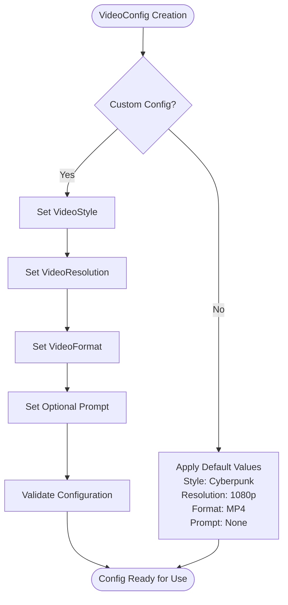
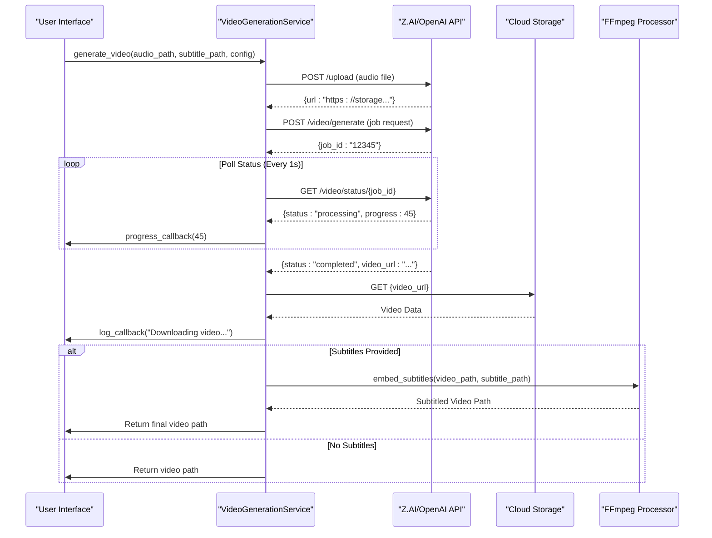
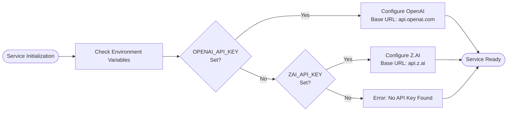
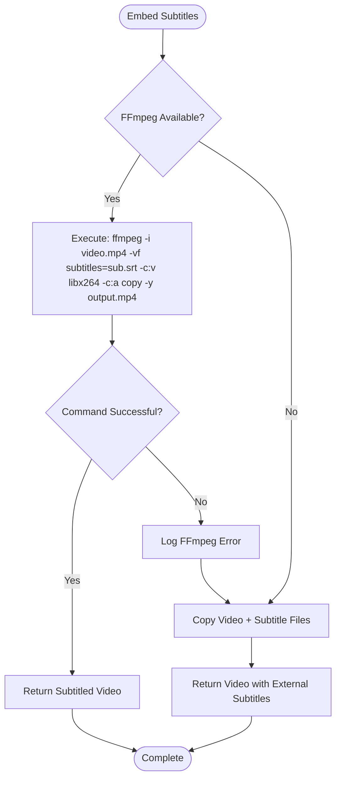

# Video Processing Core

<cite>
**Referenced Files in This Document**   
- [video.rs](file://src/video.rs)
- [video_generation.rs](file://abogen-ui/crates/ui/services/video_generation.rs)
- [zai_video.rs](file://abogen-ui/crates/ui/services/zai_video.rs)
</cite>

## Table of Contents
1. [Introduction](#introduction)
2. [Core Components](#core-components)
3. [Video Generation Service Architecture](#video-generation-service-architecture)
4. [Configuration and Style Management](#configuration-and-style-management)
5. [End-to-End Video Generation Workflow](#end-to-end-video-generation-workflow)
6. [Provider Integration and Fallback Mechanisms](#provider-integration-and-fallback-mechanisms)
7. [Subtitle Embedding and Post-Processing](#subtitle-embedding-and-post-processing)
8. [Error Handling and Resilience](#error-handling-and-resilience)
9. [Performance Considerations](#performance-considerations)
10. [Troubleshooting Guide](#troubleshooting-guide)

## Introduction
The Video Processing Core in VoxWeave is a service-oriented system responsible for generating AI-powered videos from audio and text inputs. It supports multiple AI video generation providers through a flexible architecture, with primary integration for ZAI and OpenAISora services. The core functionality enables users to transform audio files into visually rich videos with customizable styles, resolutions, and formats, while optionally embedding subtitles for enhanced accessibility. This documentation details the architectural design, workflow implementation, and integration patterns that enable robust, scalable video generation across desktop, mobile, and web platforms.

**Section sources**
- [video.rs](file://src/video.rs#L1-L461)
- [video_generation.rs](file://abogen-ui/crates/ui/services/video_generation.rs#L1-L488)

## Core Components

The video processing system is built around three primary components: the `VideoGenerationService`, the `VideoConfig` structure, and provider-specific integration modules. These components work in concert to manage the complete video generation lifecycle from input processing to final output delivery.

The `VideoGenerationService` serves as the central orchestrator, handling authentication, job creation, status polling, and result retrieval. It abstracts provider-specific details behind a unified interface, enabling consistent interaction regardless of the underlying AI service. The service implements asynchronous operations throughout its workflow, ensuring non-blocking execution during network operations and file transfers.

**Section sources**
- [video.rs](file://src/video.rs#L10-L461)
- [video_generation.rs](file://abogen-ui/crates/ui/services/video_generation.rs#L10-L488)

## Video Generation Service Architecture

```mermaid
classDiagram
class VideoGenerationService {
+String api_key
+String base_url
+new(api_key) VideoGenerationService
+from_env() Result~Self~
+generate_video(audio_path, subtitle_path, config, progress_callback, log_callback) Result~PathBuf~
-upload_file(file_path) Result~String~
-create_video_job(audio_url, config) Result~String~
-poll_video_status(job_id, progress_callback, log_callback) Result~String~
-download_video(video_url, audio_path, config) Result~PathBuf~
-embed_subtitles(video_path, subtitle_path, config) Result~PathBuf~
}
class VideoConfig {
+VideoStyle style
+VideoResolution resolution
+VideoFormat format
+Option~String~ prompt
}
class VideoProvider {
<<enumeration>>
ZAI
OpenAISora
}
VideoGenerationService --> VideoConfig : "uses"
VideoGenerationService --> VideoProvider : "supports"
VideoGenerationService --> "reqwest : : Client" : "network operations"
VideoGenerationService --> "ffmpeg" : "subtitle embedding"
```

**Diagram sources**
- [video.rs](file://src/video.rs#L50-L461)
- [video_generation.rs](file://abogen-ui/crates/ui/services/video_generation.rs#L50-L488)

## Configuration and Style Management

The `VideoConfig` structure defines the parameters for video generation, including style, resolution, format, and custom prompts. The configuration system provides sensible defaults while allowing extensive customization through optional fields. Style options include Cyberpunk, Cinematic, Realistic, and Biotech, each triggering distinct visual aesthetics in the generated video.

Resolution settings support 720p, 1080p, and 4K outputs, with format options including MP4 and MOV containers. The optional prompt field enables users to provide custom instructions that influence the AI's visual generation process, allowing for greater creative control over the output.



**Diagram sources**
- [video.rs](file://src/video.rs#L15-L35)
- [video_generation.rs](file://abogen-ui/crates/ui/services/video_generation.rs#L15-L35)

**Section sources**
- [video.rs](file://src/video.rs#L10-L40)
- [video_generation.rs](file://abogen-ui/crates/ui/services/video_generation.rs#L10-L35)

## End-to-End Video Generation Workflow

The video generation process follows a sequential workflow with five distinct phases: audio upload, job creation, status polling, video download, and subtitle embedding. Each phase includes progress reporting and logging capabilities to provide real-time feedback to users.



**Diagram sources**
- [video.rs](file://src/video.rs#L70-L250)
- [video_generation.rs](file://abogen-ui/crates/ui/services/video_generation.rs#L70-L250)

**Section sources**
- [video.rs](file://src/video.rs#L70-L250)
- [video_generation.rs](file://abogen-ui/crates/ui/services/video_generation.rs#L70-L250)

## Provider Integration and Fallback Mechanisms

The system supports multiple video generation providers through environment variable configuration. The `VideoGenerationService::from_env()` method implements a fallback mechanism that first attempts to use OpenAI's API via the `OPENAI_API_KEY` environment variable, falling back to Z.AI's service if the OpenAI key is not available.

Provider-specific API interactions are abstracted behind a common interface, allowing the core workflow to remain consistent regardless of the active provider. Each provider endpoint follows a similar pattern of file upload, job creation with style parameters, asynchronous processing, and result retrieval.



**Diagram sources**
- [video.rs](file://src/video.rs#L100-L130)
- [video_generation.rs](file://abogen-ui/crates/ui/services/video_generation.rs#L100-L130)

**Section sources**
- [video.rs](file://src/video.rs#L100-L130)
- [video_generation.rs](file://abogen-ui/crates/ui/services/video_generation.rs#L100-L130)

## Subtitle Embedding and Post-Processing

Subtitle integration is handled through FFmpeg, which embeds SRT subtitle files directly into the video stream. The system attempts to use FFmpeg for native subtitle embedding, falling back to a file-copy strategy with external subtitle files if FFmpeg is unavailable.

For web platforms (WASM target), the implementation provides alternative handling that avoids direct system calls, instead relying on client-side processing or API-based solutions. The fallback mechanism ensures that video generation can proceed even when subtitle embedding fails, preserving the core video output.



**Diagram sources**
- [video.rs](file://src/video.rs#L380-L430)
- [video_generation.rs](file://abogen-ui/crates/ui/services/video_generation.rs#L380-L430)

**Section sources**
- [video.rs](file://src/video.rs#L380-L430)
- [video_generation.rs](file://abogen-ui/crates/ui/services/video_generation.rs#L380-L430)

## Error Handling and Resilience

The system implements comprehensive error handling at each stage of the video generation process. Network operations include retry logic with exponential backoff for API calls, while file operations provide detailed error context for debugging. The polling mechanism gracefully handles temporary API failures by continuing to retry until timeout.

Authentication failures are detected during the initial service creation phase, preventing subsequent operations with invalid credentials. Rate limiting is managed through the retry mechanism, which automatically delays retries with increasing intervals. All errors are propagated with descriptive messages that aid in troubleshooting and user feedback.

**Section sources**
- [video.rs](file://src/video.rs#L200-L350)
- [video_generation.rs](file://abogen-ui/crates/ui/services/video_generation.rs#L200-L350)

## Performance Considerations

The video processing system is designed with performance and scalability in mind. Network operations use asynchronous I/O to prevent blocking, allowing efficient resource utilization during upload, polling, and download phases. The system handles large files through streaming where possible, though memory usage should be monitored when processing 4K video content.

Processing time is primarily determined by the external AI service's generation speed, typically ranging from 2-5 minutes depending on video length and complexity. Network latency can impact the overall workflow duration, particularly during the polling phase. For optimal performance, users should ensure stable internet connectivity and sufficient storage space for temporary files.

Parallel processing opportunities exist in scenarios where multiple videos are being generated, as each generation job operates independently. However, care should be taken to avoid overwhelming system resources when running concurrent operations.

**Section sources**
- [video.rs](file://src/video.rs#L250-L300)
- [video_generation.rs](file://abogen-ui/crates/ui/services/video_generation.rs#L250-L300)

## Troubleshooting Guide

Common issues in the video processing pipeline include API authentication failures, rate limiting, FFmpeg availability, and network timeouts. Authentication issues are typically resolved by verifying the correct API key is set in the appropriate environment variable (`OPENAI_API_KEY` or `ZAI_API_KEY`).

Rate limiting can be mitigated through the built-in retry mechanism, though users may need to wait before retrying if they've exceeded their quota. FFmpeg-related issues on the desktop platform usually indicate that FFmpeg is not installed or not available in the system PATH.

Network timeouts during video generation may require extending the polling timeout or checking the stability of the internet connection. For web platform users, browser security policies may interfere with external API calls, requiring appropriate CORS configuration on the server side.

**Section sources**
- [video.rs](file://src/video.rs#L200-L400)
- [video_generation.rs](file://abogen-ui/crates/ui/services/video_generation.rs#L200-L400)