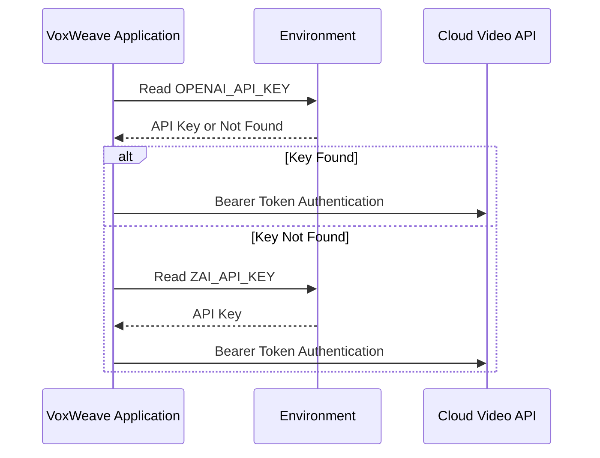
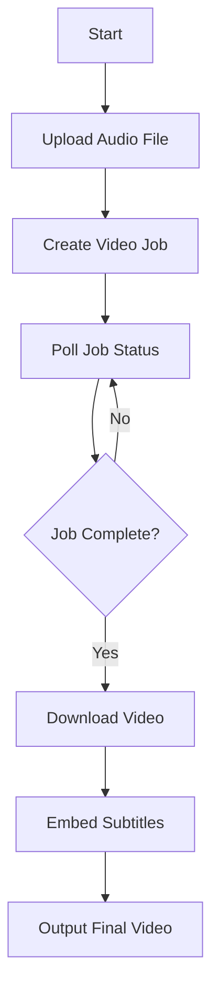
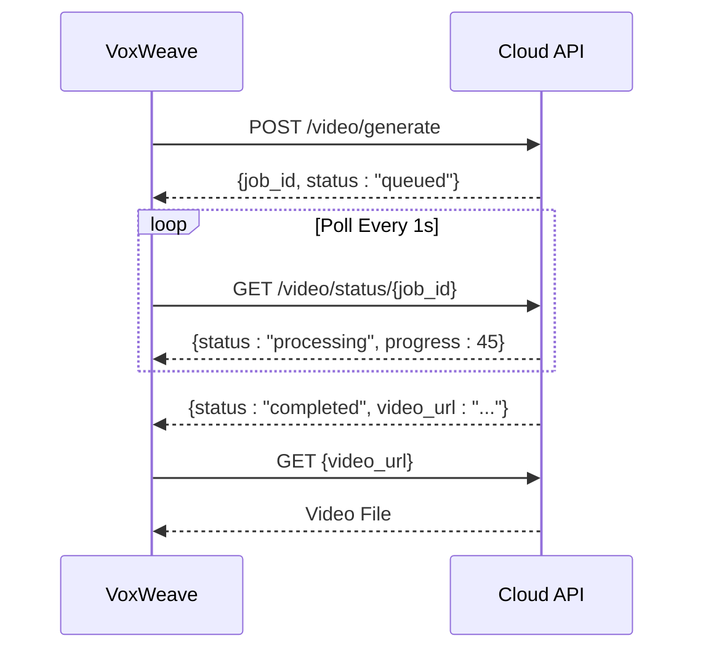

# Cloud API Integrations

<cite>
**Referenced Files in This Document**   
- [video.rs](file://src/video.rs)
- [zai_video.rs](file://abogen-ui/crates/ui/services/zai_video.rs)
- [tts_service.rs](file://abogen-ui/crates/ui/services/tts_service.rs)
- [VIDEO_INTEGRATION_PLAN.md](file://abogen-ui/VIDEO_INTEGRATION_PLAN.md)
- [ZAI_VIDEO_FEATURE.md](file://abogen-ui/ZAI_VIDEO_FEATURE.md)
- [CLI_VIDEO_GENERATION.md](file://CLI_VIDEO_GENERATION.md)
</cite>

## Table of Contents
1. [Introduction](#introduction)
2. [Authentication and API Key Management](#authentication-and-api-key-management)
3. [Video Generation Workflow](#video-generation-workflow)
4. [Provider Abstraction: Z.AI and OpenAI Sora](#provider-abstraction-zai-and-openai-sora)
5. [Request Formatting and Parameters](#request-formatting-and-parameters)
6. [Asynchronous Processing and Polling](#asynchronous-processing-and-polling)
7. [Retry Logic and Exponential Backoff](#retry-logic-and-exponential-backoff)
8. [Fallback Mechanisms and Local Processing](#fallback-mechanisms-and-local-processing)
9. [Security Considerations](#security-considerations)
10. [Media Processing with FFmpeg and MLT](#media-processing-with-ffmpeg-and-mlt)

## Introduction

VoxWeave integrates with cloud-based video generation APIs to enable automated text-to-video content creation. The system leverages external AI video generation services such as Z.AI and OpenAI Sora through HTTP-based integrations. This document details the architecture, workflow, and implementation of these cloud API integrations, focusing on reliability, scalability, and security. The integration supports both CLI and UI-driven workflows, enabling users to generate narrated videos with synchronized subtitles and AI-generated visuals.

**Section sources**
- [video.rs](file://src/video.rs#L1-L461)
- [ZAI_VIDEO_FEATURE.md](file://abogen-ui/ZAI_VIDEO_FEATURE.md#L1-L168)

## Authentication and API Key Management

Authentication for cloud video APIs is managed through API keys stored in environment variables. VoxWeave first attempts to use the `OPENAI_API_KEY` environment variable. If not found, it falls back to `ZAI_API_KEY`. This dual-key strategy enables seamless switching between OpenAI Sora and Z.AI services. The API key is included in the `Authorization` header as a Bearer token for all HTTP requests. This approach ensures that sensitive credentials are never hardcoded or exposed in source code.

**Diagram sources**
- [video.rs](file://src/video.rs#L70-L85)

**Section sources**
- [video.rs](file://src/video.rs#L70-L85)

## Video Generation Workflow

The video generation process follows a multi-step asynchronous workflow:

1. **Audio Upload**: The local audio file is uploaded to the cloud service via a multipart form request.
2. **Job Creation**: A video generation job is initiated with style, resolution, and format parameters.
3. **Status Polling**: The system polls the job status endpoint at regular intervals.
4. **Video Download**: Upon completion, the generated video is downloaded.
5. **Subtitle Embedding**: Subtitles are embedded into the video using FFmpeg if available.

This workflow ensures reliable processing even for long-running video generation tasks.

**Diagram sources**
- [video.rs](file://src/video.rs#L100-L150)

**Section sources**
- [video.rs](file://src/video.rs#L90-L200)
- [VIDEO_INTEGRATION_PLAN.md](file://abogen-ui/VIDEO_INTEGRATION_PLAN.md#L1-L304)

## Provider Abstraction: Z.AI and OpenAI Sora

VoxWeave abstracts the differences between Z.AI and OpenAI Sora APIs through a unified interface. While both services follow similar patterns, they differ in endpoint structures and request/response schemas:

- **Z.AI**: Uses `/v1/video/generate` for job creation and `/v1/video/status/{job_id}` for polling.
- **OpenAI Sora**: Uses a different base URL (`https://api.openai.com/v1`) but maintains similar JSON request structure.

The abstraction layer normalizes these differences, allowing the application to switch providers without changing core logic. Status monitoring follows a consistent pattern: polling with progress percentages until completion or failure.

**Section sources**
- [video.rs](file://src/video.rs#L70-L85)
- [zai_video.rs](file://abogen-ui/crates/ui/services/zai_video.rs#L1-L357)

## Request Formatting and Parameters

Video generation requests are formatted as JSON payloads with the following parameters:

- `audio_url`: URL of the uploaded audio file
- `style`: Visual style (e.g., "cyberpunk", "cinematic")
- `resolution`: Video resolution (e.g., "1080p", "4k")
- `prompt`: Optional custom generation prompt
- `model`: Specifies the video generation model

For file uploads, a multipart form is created with the audio file as a binary part. The `embed_subtitles` process uses FFmpeg to burn subtitles into the video stream, ensuring compatibility across playback platforms.

**Section sources**
- [video.rs](file://src/video.rs#L250-L300)
- [zai_video.rs](file://abogen-ui/crates/ui/services/zai_video.rs#L20-L50)

## Asynchronous Processing and Polling

Cloud video generation is inherently asynchronous. VoxWeave implements a polling mechanism with exponential timing to monitor job status. The system polls the status endpoint every second for up to 5 minutes (300 attempts). Progress is reported via callback functions, updating the UI in real-time. The response includes status ("queued", "processing", "completed", "failed"), progress percentage, and the final video URL upon completion.

**Diagram sources**
- [video.rs](file://src/video.rs#L300-L350)

**Section sources**
- [video.rs](file://src/video.rs#L300-L400)

## Retry Logic and Exponential Backoff

The UI service implements retry logic with exponential backoff for improved production reliability. When API requests fail due to transient issues (e.g., network errors, rate limiting), the system retries with increasing delays between attempts. This prevents overwhelming the API during outages and improves success rates under load. The retry mechanism is particularly important for upload and status polling operations.

**Section sources**
- [zai_video.rs](file://abogen-ui/crates/ui/services/zai_video.rs#L200-L250)

## Fallback Mechanisms and Local Processing

When cloud APIs are unavailable, VoxWeave implements a fallback mechanism to local processing:

1. If Z.AI generation fails, the system attempts standard video generation.
2. If FFmpeg is unavailable for subtitle embedding, subtitles are provided as a separate `.srt` file.
3. If no video generation is possible, the system outputs only audio and subtitle files.

This graceful degradation ensures that partial results are always available, maintaining user productivity even during service disruptions.

**Section sources**
- [tts_service.rs](file://abogen-ui/crates/ui/services/tts_service.rs#L500-L540)
- [ZAI_VIDEO_FEATURE.md](file://abogen-ui/ZAI_VIDEO_FEATURE.md#L150-L160)

## Security Considerations

Security is enforced through multiple layers:

- **API Key Protection**: Keys are loaded from environment variables, never stored in code.
- **Safe URL Handling**: All external URLs are validated before use.
- **Input Validation**: User inputs are sanitized to prevent injection attacks.
- **Secure Transmissions**: All API communications use HTTPS.

These measures ensure that sensitive data and credentials remain protected during cloud API interactions.

**Section sources**
- [video.rs](file://src/video.rs#L70-L85)
- [VIDEO_INTEGRATION_PLAN.md](file://abogen-ui/VIDEO_INTEGRATION_PLAN.md#L250-L270)

## Media Processing with FFmpeg and MLT

After video generation, VoxWeave uses FFmpeg to embed subtitles directly into the video stream. The `embed_subtitles` function constructs an FFmpeg command with the `subtitles` video filter. If FFmpeg is unavailable, the system falls back to copying the video and subtitle files separately. For final composition, MLT is used to merge the AI-generated video with local audio and subtitles, ensuring perfect synchronization.

**Section sources**
- [video.rs](file://src/video.rs#L400-L450)
- [zai_video.rs](file://abogen-ui/crates/ui/services/zai_video.rs#L300-L350)