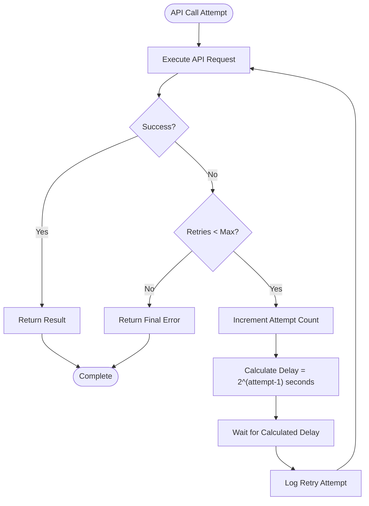

# External Integrations

<cite>
**Referenced Files in This Document**   
- [kokoro_bridge.py](file://python/kokoro_bridge.py)
- [video_generation.rs](file://abogen-ui/crates/ui/services/video_generation.rs)
- [zai_video.rs](file://abogen-ui/crates/ui/services/zai_video.rs)
- [coqui_tts.rs](file://src/coqui_tts.rs)
- [video.rs](file://src/video.rs)
- [main.rs](file://src/main.rs)
- [CLI_VIDEO_GENERATION.md](file://CLI_VIDEO_GENERATION.md)
- [VIDEO_CLI_IMPLEMENTATION.md](file://VIDEO_CLI_IMPLEMENTATION.md)
- [VIDEO_INTEGRATION_PLAN.md](file://abogen-ui/VIDEO_INTEGRATION_PLAN.md)
- [ZAI_VIDEO_FEATURE.md](file://abogen-ui/ZAI_VIDEO_FEATURE.md)
</cite>

## Table of Contents
1. [Rust-Python TTS Integration](#rust-python-tts-integration)
2. [Z.AI Video Generation API Integration](#zai-video-generation-api-integration)
3. [Retry Logic with Exponential Backoff](#retry-logic-with-exponential-backoff)
4. [File Upload/Download Workflow](#file-uploaddownload-workflow)
5. [Fallback Mechanism to Local Video Generation](#fallback-mechanism-to-local-video-generation)
6. [Security Considerations](#security-considerations)

## Rust-Python TTS Integration

The VoxWeave platform integrates Python-based TTS engines through the `kokoro_bridge.py` script, enabling seamless communication between the Rust codebase and external Python components. This integration follows a process spawning pattern where the Rust application spawns a Python subprocess to execute TTS generation tasks.

The integration pattern involves:
- **Process Spawning**: The Rust application spawns a Python process using the `Command` API, passing necessary arguments and configuration
- **Argument Passing**: Configuration parameters such as text input, output path, sample rate, voice selection, and speed are passed via JSON payload through stdin
- **Result Handling**: The Python script processes the TTS request and returns duration information via stdout in JSON format

The `CoquiEngine` in `coqui_tts.rs` demonstrates this integration pattern by constructing a JSON payload with all necessary parameters and piping it to the Python script's stdin. The engine handles various edge cases including empty text input (generating silence) and proper error handling when Python dependencies are missing.

**Section sources**
- [coqui_tts.rs](file://src/coqui_tts.rs#L25-L115)
- [kokoro_bridge.py](file://python/kokoro_bridge.py#L1-L90)

## Z.AI Video Generation API Integration

The VoxWeave platform implements HTTP-based integration with Z.AI's video generation API through the `VideoGenerationService` and `ZaiVideoService` components. This integration enables the creation of AI-generated videos synchronized with TTS audio and subtitles.

### Authentication and API Key Management

Authentication is handled through API key management, with the system checking for the `ZAI_API_KEY` environment variable. The `from_env()` method in both `VideoGenerationService` and `ZaiVideoService` retrieves the API key from the environment, providing a secure way to manage credentials without hardcoding them in the source code.

```mermaid
sequenceDiagram
participant RustApp as Rust Application
participant VideoService as VideoGenerationService
participant ZAIAPI as Z.AI API
participant Client as HTTP Client
RustApp->>VideoService : Initialize with API key
VideoService->>VideoService : Read ZAI_API_KEY from env
VideoService->>ZAIAPI : POST /upload with audio file
ZAIAPI-->>VideoService : Return file URL
VideoService->>ZAIAPI : POST /video/generate with config
ZAIAPI-->>VideoService : Return job_id
loop Poll every 1s
VideoService->>ZAIAPI : GET /video/status/{job_id}
ZAIAPI-->>VideoService : Return progress and status
alt Status = completed
break Complete
end
end
VideoService->>ZAIAPI : GET video_url
ZAIAPI-->>VideoService : Return video bytes
VideoService->>RustApp : Return video path
```

**Diagram sources**
- [video_generation.rs](file://abogen-ui/crates/ui/services/video_generation.rs#L50-L488)
- [zai_video.rs](file://abogen-ui/crates/ui/services/zai_video.rs#L1-L357)
- [video.rs](file://src/video.rs#L1-L461)

### Request Formatting

The integration constructs HTTP requests with specific formatting requirements:
- **Multipart Form Creation**: Audio files are uploaded using multipart form data with proper MIME types
- **JSON Request Construction**: Video generation requests are formatted as JSON with required fields including audio URL, style, resolution, and optional custom prompts
- **Header Configuration**: Requests include proper authorization headers with Bearer tokens and content-type specifications

The `create_video_job` method in `video_generation.rs` constructs the JSON payload with all necessary parameters, including conditional inclusion of custom prompts when provided.

### Response Handling

The system implements comprehensive response handling for various scenarios:
- **Success Responses**: Properly parses JSON responses to extract job IDs and video URLs
- **Error Responses**: Handles API errors by parsing error messages and status codes
- **Progress Updates**: Implements polling mechanisms to track video generation progress and update UI accordingly

**Section sources**
- [video_generation.rs](file://abogen-ui/crates/ui/services/video_generation.rs#L50-L488)
- [zai_video.rs](file://abogen-ui/crates/ui/services/zai_video.rs#L1-L357)
- [video.rs](file://src/video.rs#L1-L461)

## Retry Logic with Exponential Backoff

The VoxWeave platform implements robust retry logic with exponential backoff in the `retry_api_call` method of the `VideoGenerationService`. This mechanism is critical for production reliability, ensuring that transient network issues or API rate limiting do not cause permanent failures.

The retry implementation features:
- **Configurable Retry Attempts**: The system allows specifying the maximum number of retry attempts (default: 3)
- **Exponential Backoff**: Delay between retries doubles with each attempt (1s, 2s, 4s, etc.)
- **Comprehensive Error Handling**: Catches and logs API call failures, providing visibility into retry operations
- **Graceful Failure**: After exhausting all retry attempts, the system returns a descriptive error message

This retry mechanism is particularly important for production environments where network conditions may vary and API endpoints may experience temporary unavailability. By implementing exponential backoff, the system avoids overwhelming the API with rapid-fire requests while still maintaining high availability.



**Diagram sources**
- [video_generation.rs](file://abogen-ui/crates/ui/services/video_generation.rs#L400-L430)
- [video.rs](file://src/video.rs#L300-L330)

**Section sources**
- [video_generation.rs](file://abogen-ui/crates/ui/services/video_generation.rs#L400-L430)
- [video.rs](file://src/video.rs#L300-L330)

## File Upload/Download Workflow

The platform implements a comprehensive file upload/download workflow for cloud video processing, handling temporary file management and URL resolution throughout the video generation pipeline.

### Upload Process

The file upload process follows these steps:
1. **File Reading**: The system reads the audio file into memory using async file operations
2. **Multipart Form Creation**: Constructs a multipart form with the file data, proper filename, and MIME type
3. **HTTP Upload**: Sends the file to Z.AI's upload endpoint with proper authorization headers
4. **URL Resolution**: Parses the response to extract the uploaded file URL, with fallback to file:// URLs if the API doesn't return a proper URL

The `upload_file` method in `video_generation.rs` handles this workflow, including error handling for file reading and network issues.

### Download Process

The video download process includes:
1. **HTTP Download**: Retrieves the generated video from the URL provided by the API
2. **Temporary File Handling**: Creates output files in the same directory as the source audio file
3. **Filename Generation**: Constructs appropriate filenames based on the input audio file stem and requested format
4. **File Writing**: Writes the downloaded video data to disk with proper error handling

The `download_video` method manages this process, determining the output path based on the audio file location and requested video format.

### Temporary File Management

The system implements proper temporary file management by:
- Using the same directory as the input audio file for output
- Generating filenames based on the input file stem
- Supporting multiple video formats (mp4, mov, webm)
- Handling file creation and writing with async operations

**Section sources**
- [video_generation.rs](file://abogen-ui/crates/ui/services/video_generation.rs#L100-L180)
- [video_generation.rs](file://abogen-ui/crates/ui/services/video_generation.rs#L280-L330)
- [video.rs](file://src/video.rs#L100-L180)
- [video.rs](file://src/video.rs#L280-L330)

## Fallback Mechanism to Local Video Generation

The VoxWeave platform implements a sophisticated fallback mechanism that transitions from Z.AI's cloud-based video generation to local video generation when the API is unavailable. This ensures continued functionality even when external services are down.

The fallback mechanism operates at multiple levels:
- **API Key Fallback**: The system first checks for `ZAI_API_KEY` and falls back to `OPENAI_API_KEY` if available
- **Service Fallback**: For specific video styles like "wan2.5-t2v-preview", the system can switch to alternative services like Alibaba Aliyun
- **Feature-Based Fallback**: When video generation features are not enabled, the system provides appropriate error messages and alternatives

The `from_env()` method in `VideoGenerationService` demonstrates the API key fallback logic, attempting to use `OPENAI_API_KEY` before requiring `ZAI_API_KEY`. Additionally, the `generate_zai_video_with_composition` function in `zai_video.rs` includes conditional compilation to switch to Alibaba Aliyun service for specific video styles.

When subtitle embedding fails due to missing `ffmpeg`, the system implements a graceful fallback by:
- Copying the video file directly
- Providing subtitles as a separate external file
- Logging a notice about the fallback behavior

This multi-layered fallback approach ensures maximum reliability and availability of video generation capabilities across different deployment scenarios and service conditions.

**Section sources**
- [video_generation.rs](file://abogen-ui/crates/ui/services/video_generation.rs#L50-L488)
- [zai_video.rs](file://abogen-ui/crates/ui/services/zai_video.rs#L1-L357)
- [video.rs](file://src/video.rs#L1-L461)

## Security Considerations

The VoxWeave platform addresses several critical security considerations in its external integrations:

### API Key Protection

The system protects API keys by:
- Reading keys from environment variables rather than hardcoding them
- Never logging or displaying API keys in error messages
- Using secure string handling in the codebase
- Providing clear documentation on proper key management

### Input Validation

The platform implements input validation for external requests by:
- Validating video styles, resolutions, and formats against predefined enums
- Sanitizing text input before processing
- Validating file paths to prevent directory traversal
- Checking file existence before processing

### Safe Command Execution

When interfacing with system tools like `ffmpeg`, the system ensures safe execution by:
- Using proper argument separation in command construction
- Validating file paths before passing them to external commands
- Handling command execution errors gracefully
- Providing fallback mechanisms when external tools are unavailable

The `embed_subtitles` method demonstrates safe command execution by properly escaping file paths and handling cases where `ffmpeg` is not available, ensuring the system remains functional even without external dependencies.

**Section sources**
- [video_generation.rs](file://abogen-ui/crates/ui/services/video_generation.rs#L330-L400)
- [zai_video.rs](file://abogen-ui/crates/ui/services/zai_video.rs#L1-L357)
- [video.rs](file://src/video.rs#L330-L400)
- [coqui_tts.rs](file://src/coqui_tts.rs#L25-L115)