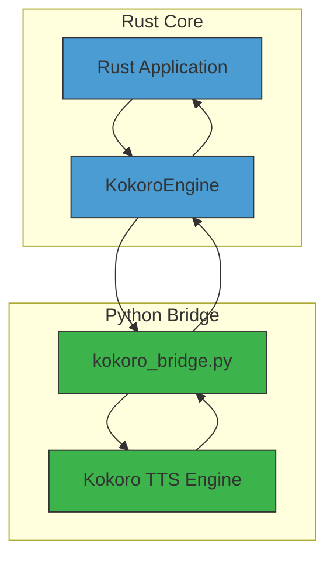
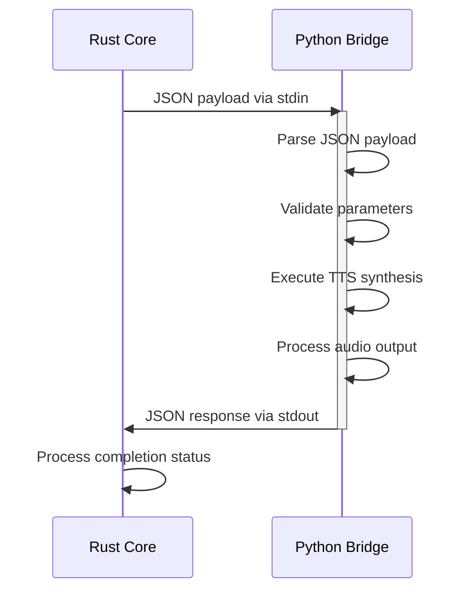
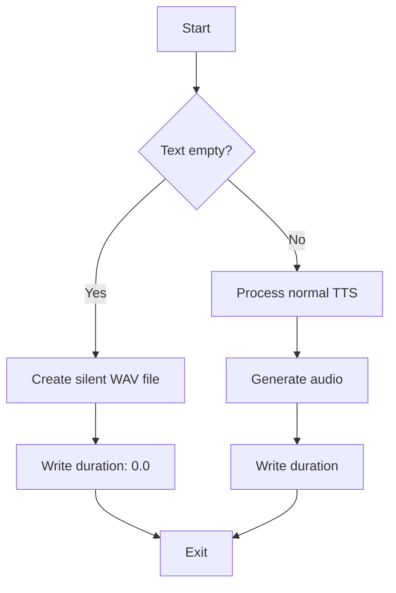
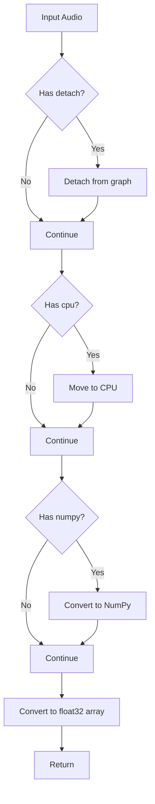

# Python Engine Bridges

<cite>
**Referenced Files in This Document**   
- [python/kokoro_bridge.py](file://python/kokoro_bridge.py)
- [src/tts.rs](file://src/tts.rs)
</cite>

## Table of Contents
1. [Introduction](#introduction)
2. [Integration Architecture](#integration-architecture)
3. [JSON Inter-Process Communication Protocol](#json-inter-process-communication-protocol)
4. [Process Spawning and Data Exchange](#process-spawning-and-data-exchange)
5. [Audio Processing Pipeline](#audio-processing-pipeline)
6. [Silent Audio Generation](#silent-audio-generation)
7. [Main Function Analysis](#main-function-analysis)
8. [Security Considerations](#security-considerations)
9. [Type Coercion Strategy](#type-coercion-strategy)
10. [Conclusion](#conclusion)

## Introduction
The VoxWeave platform implements a hybrid architecture that combines a Rust core with Python-based TTS engines through bridge scripts. This document focuses on the `kokoro_bridge.py` script that enables communication between the Rust application layer and the Kokoro TTS engine. The bridge facilitates text-to-speech synthesis by handling inter-process communication, audio processing, and error management between the two language runtimes.

**Section sources**
- [python/kokoro_bridge.py](file://python/kokoro_bridge.py#L1-L89)

## Integration Architecture
The integration between Rust and Python components in VoxWeave follows a subprocess model where the Rust core spawns Python processes to execute TTS functionality. The `KokoroEngine` in Rust's `tts.rs` creates subprocesses that execute the `kokoro_bridge.py` script, passing configuration and text data through stdin and receiving completion status through stdout. This architecture allows the performance-critical application logic to remain in Rust while leveraging Python's rich ecosystem for machine learning-based TTS processing.

**Diagram sources**
- [python/kokoro_bridge.py](file://python/kokoro_bridge.py#L1-L89)
- [src/tts.rs](file://src/tts.rs#L234-L269)

**Section sources**
- [src/tts.rs](file://src/tts.rs#L234-L269)
- [python/kokoro_bridge.py](file://python/kokoro_bridge.py#L1-L89)

## JSON Inter-Process Communication Protocol
The communication between Rust and Python components is based on a JSON-based protocol transmitted through standard input and output streams. The payload structure includes essential parameters for TTS synthesis:

- **text**: Input text to be synthesized (string)
- **output**: File path for the generated audio output (string)
- **sample_rate**: Audio sample rate in Hz (integer, optional with fallback)
- **repo_id**: Model repository identifier (string, optional)
- **device**: Target device for computation (string, defaults to "cpu")
- **lang_code**: Language code for synthesis (string, optional)
- **voice**: Voice identifier for the desired voice (string, optional)
- **speed**: Speech speed multiplier (float, defaults to 1.0)
- **split_pattern**: Text segmentation pattern (string, optional)

The response payload contains duration information in JSON format: `{"duration": <float_value>}`.

**Diagram sources**
- [python/kokoro_bridge.py](file://python/kokoro_bridge.py#L26-L89)
- [src/tts.rs](file://src/tts.rs#L234-L269)

**Section sources**
- [python/kokoro_bridge.py](file://python/kokoro_bridge.py#L26-L89)
- [src/tts.rs](file://src/tts.rs#L234-L269)

## Process Spawning and Data Exchange
The process spawning workflow begins in the Rust `KokoroEngine::synthesize_to_file` method, which creates a subprocess using the configured Python interpreter. The engine passes the bridge script content via the `-c` flag and establishes piped connections for stdin, stdout, and stderr. The JSON payload is serialized and written to the subprocess's stdin, enabling configuration of the TTS parameters.

Data exchange occurs through standard streams: the Rust process writes the JSON payload to stdin, and the Python bridge reads this data using `json.load(sys.stdin)`. After processing, the Python script writes JSON-formatted results to stdout using `sys.stdout.write()`, which the Rust process captures and parses. Error messages are directed to stderr for proper error handling and logging.

**Section sources**
- [src/tts.rs](file://src/tts.rs#L234-L269)
- [python/kokoro_bridge.py](file://python/kokoro_bridge.py#L26-L27)

## Audio Processing Pipeline
The audio processing pipeline within `kokoro_bridge.py` handles the conversion of neural network outputs to standard WAV audio files. After the Kokoro pipeline generates audio segments, the script processes them through several stages:

1. **Segment collection**: Audio segments are collected from the pipeline iterator
2. **Type coercion**: Audio data is converted to NumPy arrays using the `_coerce_numpy` function
3. **Concatenation**: Segments are concatenated into a single audio array
4. **Normalization**: Audio values are clipped to the range [-1.0, 1.0]
5. **PCM encoding**: Normalized float32 values are converted to 16-bit signed integers
6. **WAV file generation**: Encoded audio is written to a WAV file with proper headers

The pipeline ensures proper audio formatting by setting the WAV file parameters: mono channel (1), 16-bit sample width (2 bytes), and the specified sample rate.

**Section sources**
- [python/kokoro_bridge.py](file://python/kokoro_bridge.py#L53-L88)

## Silent Audio Generation
When empty or whitespace-only text is provided, the bridge implements a silent audio generation fallback. The `_write_silence` function creates a valid WAV file with proper headers but no audio frames (empty bytestring). This approach ensures that the output file is syntactically correct and can be processed by subsequent audio handling components, while representing zero duration of speech.

The function configures the WAV file with standard parameters: single channel, 16-bit sample width, and the requested sample rate. After creating the silent file, the bridge returns a duration of 0.0 seconds in the JSON response, allowing the Rust core to handle the empty result appropriately in the application logic.

**Diagram sources**
- [python/kokoro_bridge.py](file://python/kokoro_bridge.py#L7-L12)
- [python/kokoro_bridge.py](file://python/kokoro_bridge.py#L26-L33)

**Section sources**
- [python/kokoro_bridge.py](file://python/kokoro_bridge.py#L7-L12)
- [python/kokoro_bridge.py](file://python/kokoro_bridge.py#L26-L33)

## Main Function Analysis
The `main()` function in `kokoro_bridge.py` serves as the entry point for the Python bridge process. It begins by parsing the JSON payload from stdin, extracting essential parameters including text, output path, and sample rate (with `SAMPLE_RATE_FALLBACK` of 24000 Hz as default). The function implements comprehensive error handling for dependency loading, attempting to import the Kokoro TTS components and NumPy, with failures reported to stderr and process termination.

After parameter extraction, the function configures the Kokoro pipeline with the specified voice parameters, language code, device target, and speed settings. It processes the text through the pipeline, collecting audio segments and applying type coercion. The audio segments are concatenated, normalized, and converted to PCM format before being written to the output WAV file. Finally, the function calculates and returns the audio duration through stdout.

**Section sources**
- [python/kokoro_bridge.py](file://python/kokoro_bridge.py#L26-L89)

## Security Considerations
The bridge implementation addresses several security aspects to ensure safe execution. The subprocess is spawned with explicit stdin, stdout, and stderr piping, preventing unintended data leakage. Input validation occurs at multiple levels: the Rust core validates parameters before creating the JSON payload, and the Python bridge performs additional checks on the received data.

Error handling is comprehensive, with dependency import failures and runtime exceptions properly reported through stderr and resulting in non-zero exit codes. The bridge avoids executing arbitrary code by using a fixed script structure and parameterized configuration. Input text is treated as data rather than code, preventing injection attacks. The file system operations are limited to the specified output path, with no arbitrary file access.

**Section sources**
- [python/kokoro_bridge.py](file://python/kokoro_bridge.py#L35-L44)
- [src/tts.rs](file://src/tts.rs#L234-L269)

## Type Coercion Strategy
The `_coerce_numpy` function implements a robust type coercion strategy for handling both PyTorch tensors and NumPy arrays in the audio processing pipeline. The function uses hasattr checks to detect tensor methods and progressively converts the audio data through the PyTorch tensor lifecycle: detaching from computation graph, moving to CPU memory, and converting to NumPy array format.

This defensive programming approach ensures compatibility with different output types from the TTS model by checking for common tensor methods (`detach`, `cpu`, `numpy`) before attempting conversion. The final conversion uses `np.asarray` with explicit float32 dtype specification, guaranteeing consistent output format for subsequent audio processing stages regardless of the input type.

**Diagram sources**
- [python/kokoro_bridge.py](file://python/kokoro_bridge.py#L15-L23)

**Section sources**
- [python/kokoro_bridge.py](file://python/kokoro_bridge.py#L15-L23)

## Conclusion
The `kokoro_bridge.py` script serves as a critical integration point between the Rust core and Python TTS engine in the VoxWeave platform. Through its JSON-based IPC protocol, robust error handling, and efficient audio processing pipeline, the bridge enables seamless text-to-speech functionality while maintaining the performance benefits of the Rust application layer. The design emphasizes security, reliability, and compatibility, making it a robust component in the overall TTS architecture.