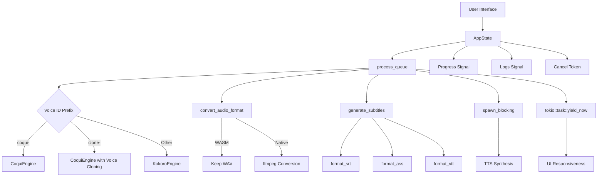
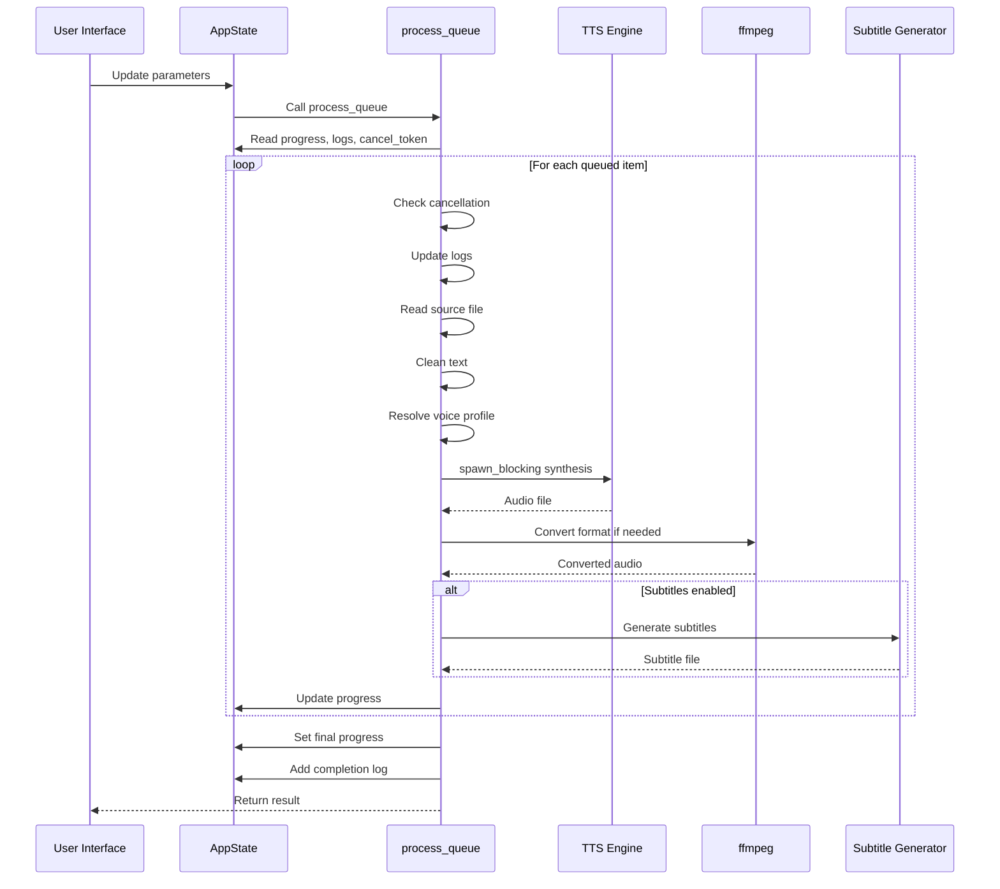
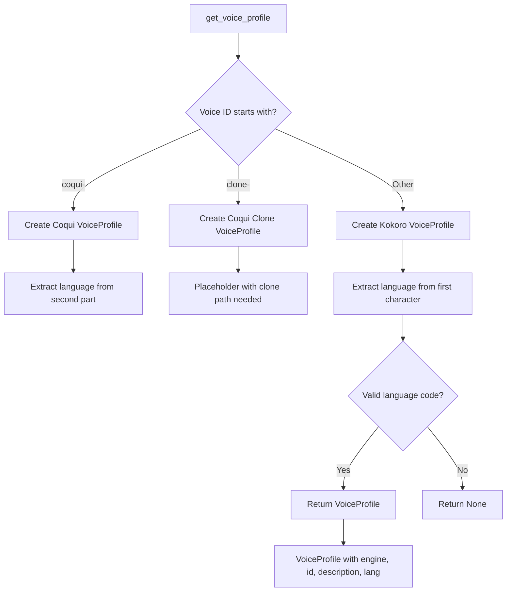
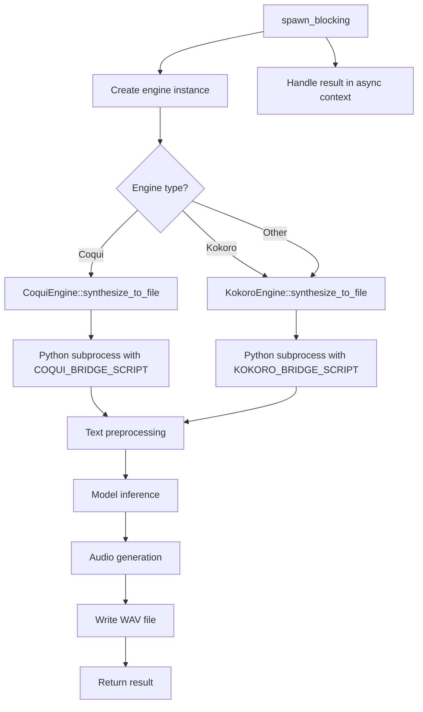
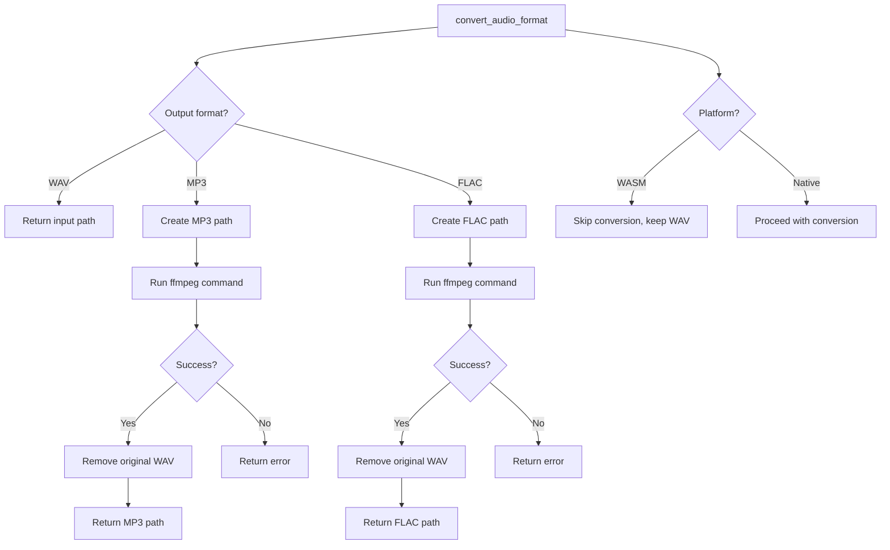
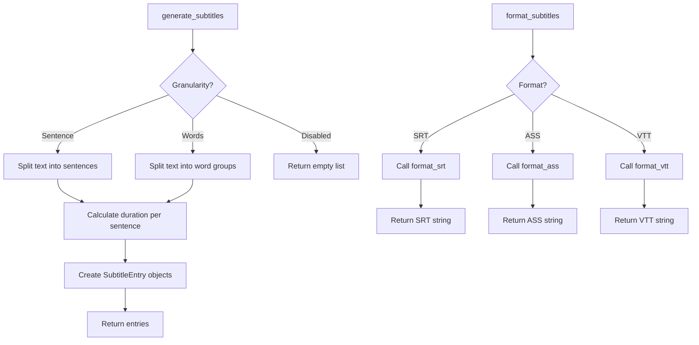
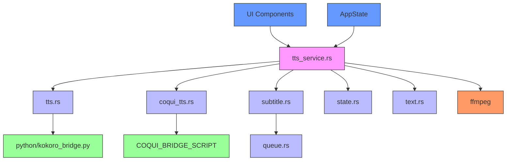

# TTS Service

<cite>
**Referenced Files in This Document**   
- [tts_service.rs](file://abogen-ui/crates/ui/services/tts_service.rs)
- [tts.rs](file://src/tts.rs)
- [coqui_tts.rs](file://src/coqui_tts.rs)
- [subtitle.rs](file://src/subtitle.rs)
- [state.rs](file://abogen-ui/crates/ui/state.rs)
- [kokoro_bridge.py](file://python/kokoro_bridge.py)
- [text.rs](file://src/text.rs)
</cite>

## Table of Contents
1. [Introduction](#introduction)
2. [Core Components](#core-components)
3. [Architecture Overview](#architecture-overview)
4. [Detailed Component Analysis](#detailed-component-analysis)
5. [Dependency Analysis](#dependency-analysis)
6. [Performance Considerations](#performance-considerations)
7. [Troubleshooting Guide](#troubleshooting-guide)
8. [Conclusion](#conclusion)

## Introduction
The TTS Service in VoxWeave UI provides a comprehensive text-to-speech processing pipeline integrated with a reactive state system. It enables users to convert text files into audio with customizable voice profiles, subtitle generation, and format conversion. The service is designed to handle multiple items in a queue, supporting both desktop and web platforms with appropriate adaptations for each environment.

**Section sources**
- [tts_service.rs](file://abogen-ui/crates/ui/services/tts_service.rs#L1-L540)

## Core Components

The TTS Service consists of several core components that work together to process text files into audio outputs. The main entry point is the `process_queue` function, which orchestrates the entire workflow. This function integrates with the Dioxus reactive state system through signals for progress tracking, log updates, and cancellation handling. The service supports multiple TTS engines, including Kokoro and CoquiTTS, with voice profiles resolved based on voice ID prefixes. Audio format conversion is handled via ffmpeg for MP3 and FLAC outputs, with special considerations for WASM platform limitations. Subtitle generation is integrated through the `generate_subtitles` function with support for SRT, ASS, and VTT formats.

**Section sources**
- [tts_service.rs](file://abogen-ui/crates/ui/services/tts_service.rs#L1-L540)
- [tts.rs](file://src/tts.rs#L1-L522)
- [coqui_tts.rs](file://src/coqui_tts.rs#L1-L115)

## Architecture Overview

**Diagram sources**
- [tts_service.rs](file://abogen-ui/crates/ui/services/tts_service.rs#L1-L540)
- [tts.rs](file://src/tts.rs#L1-L522)

## Detailed Component Analysis

### Process Queue Function Analysis

The `process_queue` function serves as the central orchestrator of the TTS processing pipeline. It receives the application state and a list of queued items to process, returning a Result indicating success or failure.

**Diagram sources**
- [tts_service.rs](file://abogen-ui/crates/ui/services/tts_service.rs#L220-L540)

**Section sources**
- [tts_service.rs](file://abogen-ui/crates/ui/services/tts_service.rs#L220-L540)

### Voice Profile Resolution

The voice profile resolution system determines which TTS engine to use based on the voice ID prefix. This allows the system to support multiple voice types and engines within a unified interface.

**Diagram sources**
- [tts_service.rs](file://abogen-ui/crates/ui/services/tts_service.rs#L36-L68)
- [tts.rs](file://src/tts.rs#L120-L150)

**Section sources**
- [tts_service.rs](file://abogen-ui/crates/ui/services/tts_service.rs#L36-L68)

### Audio Synthesis Workflow

The audio synthesis workflow uses asynchronous processing with blocking operations to prevent UI freezing. This ensures the interface remains responsive during potentially long-running TTS operations.

**Diagram sources**
- [tts_service.rs](file://abogen-ui/crates/ui/services/tts_service.rs#L280-L350)
- [coqui_tts.rs](file://src/coqui_tts.rs#L1-L115)
- [tts.rs](file://src/tts.rs#L300-L522)

**Section sources**
- [tts_service.rs](file://abogen-ui/crates/ui/services/tts_service.rs#L280-L350)

### Audio Format Conversion Pipeline

The audio format conversion pipeline handles the transformation of generated WAV files into other formats like MP3 and FLAC using ffmpeg, with special handling for the WASM platform.

**Diagram sources**
- [tts_service.rs](file://abogen-ui/crates/ui/services/tts_service.rs#L70-L132)

**Section sources**
- [tts_service.rs](file://abogen-ui/crates/ui/services/tts_service.rs#L70-L132)

### Subtitle Generation Integration

The subtitle generation system creates timed subtitles from processed text, supporting multiple output formats for different use cases.

**Diagram sources**
- [tts_service.rs](file://abogen-ui/crates/ui/services/tts_service.rs#L134-L180)
- [subtitle.rs](file://src/subtitle.rs#L1-L156)

**Section sources**
- [tts_service.rs](file://abogen-ui/crates/ui/services/tts_service.rs#L134-L180)

## Dependency Analysis

**Diagram sources**
- [tts_service.rs](file://abogen-ui/crates/ui/services/tts_service.rs#L1-L540)
- [tts.rs](file://src/tts.rs#L1-L522)
- [coqui_tts.rs](file://src/coqui_tts.rs#L1-L115)
- [subtitle.rs](file://src/subtitle.rs#L1-L156)
- [state.rs](file://abogen-ui/crates/ui/state.rs#L1-L258)
- [text.rs](file://src/text.rs#L1-L70)

## Performance Considerations

The TTS Service implements several performance optimization techniques to maintain UI responsiveness during processing. The primary mechanism is the use of `tokio::task::yield_now()` at strategic points in the processing loop, which allows the async runtime to yield control back to the UI thread. This prevents the interface from freezing during long operations.

For audio synthesis, the service uses `spawn_blocking` to run the TTS engine in a separate thread pool dedicated to blocking operations. This is crucial because the TTS engines invoke external Python processes which would otherwise block the async runtime. The combination of these techniques ensures smooth UI performance even during intensive processing tasks.

On the WASM platform, certain operations like ffmpeg conversion are disabled due to platform limitations, which affects the final output format but maintains functionality. The service gracefully handles these limitations by providing appropriate log messages and fallback behaviors.

**Section sources**
- [tts_service.rs](file://abogen-ui/crates/ui/services/tts_service.rs#L225-L226)
- [tts_service.rs](file://abogen-ui/crates/ui/services/tts_service.rs#L304-L305)

## Troubleshooting Guide

The TTS Service includes comprehensive error handling for various failure scenarios. When a source file is missing, the service logs an error but continues processing the remaining items in the queue. For synthesis failures, detailed error messages from the underlying TTS engines are captured and displayed in the UI logs.

Cancellation is handled through a cancel token signal in the application state. When the user requests cancellation, the token is set, and the processing loop checks for this condition at the beginning of each iteration. This allows for graceful termination of the processing pipeline.

Common issues and their solutions include:
- Missing ffmpeg: Install ffmpeg on the system for MP3/FLAC conversion
- Python dependencies not installed: Ensure required Python packages are available
- Voice cloning path not set: Provide the correct path to the reference audio file
- WASM platform limitations: Accept WAV output instead of MP3/FLAC

**Section sources**
- [tts_service.rs](file://abogen-ui/crates/ui/services/tts_service.rs#L230-L240)
- [tts_service.rs](file://abogen-ui/crates/ui/services/tts_service.rs#L250-L260)
- [tts_service.rs](file://abogen-ui/crates/ui/services/tts_service.rs#L100-L130)

## Conclusion

The TTS Service in VoxWeave UI provides a robust and flexible text-to-speech processing pipeline with comprehensive features for voice synthesis, subtitle generation, and format conversion. Its integration with the Dioxus reactive state system enables real-time updates to progress, logs, and cancellation status. The service supports multiple TTS engines through a unified interface, with voice profile resolution based on ID prefixes. The architecture carefully balances performance and responsiveness through asynchronous processing and strategic use of blocking operations. Platform-specific adaptations ensure functionality across desktop and web environments, making it a versatile solution for text-to-speech conversion needs.