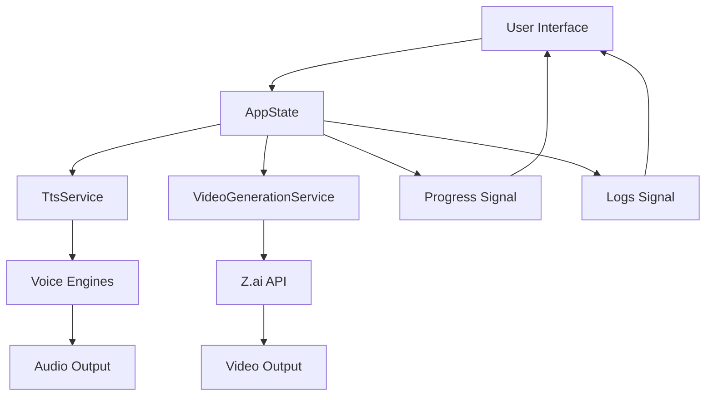
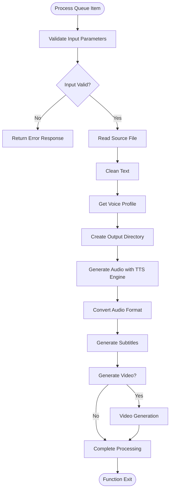
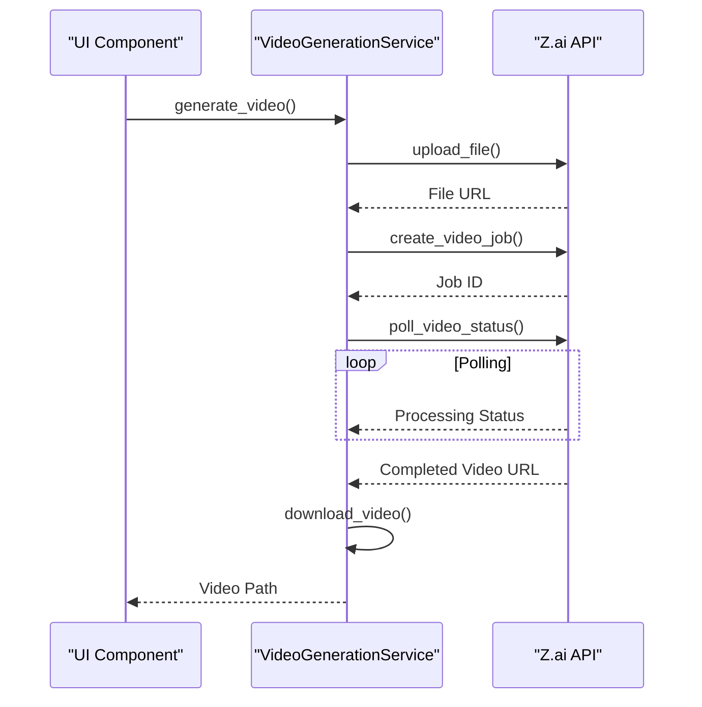
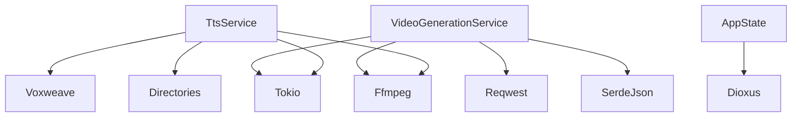

# UI Services

<cite>
**Referenced Files in This Document**   
- [tts_service.rs](file://abogen-ui/crates/ui/services/tts_service.rs)
- [video_generation.rs](file://abogen-ui/crates/ui/services/video_generation.rs)
- [state.rs](file://abogen-ui/crates/ui/state.rs)
- [lib.rs](file://abogen-ui/crates/ui/lib.rs)
- [voices.rs](file://abogen-ui/crates/ui/services/voices.rs)
</cite>

## Table of Contents
1. [Introduction](#introduction)
2. [Core Components](#core-components)
3. [Architecture Overview](#architecture-overview)
4. [Detailed Component Analysis](#detailed-component-analysis)
5. [Dependency Analysis](#dependency-analysis)
6. [Performance Considerations](#performance-considerations)
7. [Troubleshooting Guide](#troubleshooting-guide)
8. [Conclusion](#conclusion)

## Introduction
The VoxWeave application implements a sophisticated UI services layer that orchestrates text-to-speech and video generation workflows through a reactive Dioxus state management system. This documentation details the implementation of TtsService and VideoGenerationService, focusing on their integration with the application's state system, asynchronous processing patterns, and cross-platform considerations. The services enable users to process text files into audio and video content with customizable voice profiles, subtitle generation, and format conversion capabilities.

## Core Components

The UI services layer in VoxWeave consists of two primary services: TtsService for text-to-speech processing and VideoGenerationService for video generation. These services interact with the Dioxus state management system through signals and async channels, enabling real-time updates to the user interface during processing. The process_queue function serves as the orchestration engine, coordinating the workflow from text input to final output generation. The services are designed to maintain UI responsiveness through strategic use of tokio::task::yield_now() and proper signal handling patterns.

**Section sources**
- [tts_service.rs](file://abogen-ui/crates/ui/services/tts_service.rs#L225-L225)
- [tts_service.rs](file://abogen-ui/crates/ui/services/tts_service.rs#L304-L304)
- [video_generation.rs](file://abogen-ui/crates/ui/services/video_generation.rs#L100-L150)

## Architecture Overview

The UI services architecture follows a reactive pattern where user interactions trigger state changes that propagate through the application. The AppState structure coordinates service operations by maintaining references to signals for progress, logs, and processing state. When a user initiates processing, the MainScreen component spawns an asynchronous task that invokes the process_queue function with the current application state and queue items.

**Diagram sources **
- [state.rs](file://abogen-ui/crates/ui/state.rs#L1-L259)
- [tts_service.rs](file://abogen-ui/crates/ui/services/tts_service.rs#L1-L541)
- [video_generation.rs](file://abogen-ui/crates/ui/services/video_generation.rs#L1-L489)

## Detailed Component Analysis

### TtsService Implementation
The TtsService handles text-to-speech processing with support for multiple voice engines and format conversion. It integrates with the Dioxus state management system through signals that provide real-time updates to the UI.

#### Voice Profile Mapping and Audio Processing
The service implements voice profile mapping through the get_voice_profile function, which determines the appropriate VoiceProfile based on the voice ID. Voice IDs starting with "coqui-" use the Coqui engine, while others use the Kokoro engine. The service supports audio format conversion from WAV to MP3 or FLAC using ffmpeg, with platform-specific handling for web environments where ffmpeg is not available.

**Diagram sources **
- [tts_service.rs](file://abogen-ui/crates/ui/services/tts_service.rs#L1-L541)
- [voices.rs](file://abogen-ui/crates/ui/services/voices.rs#L1-L217)

#### Subtitle Generation
The service implements subtitle generation with configurable granularity through the subtitle_mode_to_granularity function. Subtitles can be generated at sentence or paragraph level, with support for SRT, ASS, and VTT formats. The format_subtitles function handles conversion to the requested format, with specialized formatting functions for ASS and WebVTT formats.

**Section sources**
- [tts_service.rs](file://abogen-ui/crates/ui/services/tts_service.rs#L1-L541)

### VideoGenerationService Implementation
The VideoGenerationService handles video generation through integration with the Z.ai API, providing a cloud-based solution for creating videos from audio and subtitle inputs.

#### API Integration and Job Management
The service implements a complete workflow for video generation, including file upload, job creation, status polling, and video download. The generate_video function orchestrates this process, uploading the audio file to Z.ai storage, creating a video generation job, polling for completion, and downloading the resulting video.

**Diagram sources **
- [video_generation.rs](file://abogen-ui/crates/ui/services/video_generation.rs#L1-L489)

#### Subtitle Embedding and Format Handling
The service includes functionality for embedding subtitles into generated videos using ffmpeg. On non-web platforms, it uses ffmpeg to burn subtitles into the video, while on web platforms it falls back to providing subtitles as a separate file. The embed_subtitles function handles this cross-platform difference, attempting ffmpeg integration when available and providing fallback behavior for web environments.

**Section sources**
- [video_generation.rs](file://abogen-ui/crates/ui/services/video_generation.rs#L1-L489)

## Dependency Analysis

The UI services layer depends on several external crates and internal modules to provide its functionality. The TtsService depends on the voxweave crate for TTS engine implementations, subtitle generation, and text processing. It also depends on the directories crate for determining user directory paths. The VideoGenerationService depends on reqwest for HTTP requests to the Z.ai API, serde_json for JSON serialization, and tokio for asynchronous file operations.

**Diagram sources **
- [tts_service.rs](file://abogen-ui/crates/ui/services/tts_service.rs#L1-L541)
- [video_generation.rs](file://abogen-ui/crates/ui/services/video_generation.rs#L1-L489)

## Performance Considerations

The UI services are designed with performance and responsiveness as key considerations. The process_queue function uses tokio::task::yield_now() to periodically yield control back to the runtime, preventing UI freezing during long-running operations. Blocking TTS synthesis operations are executed in separate threads using tokio::task::spawn_blocking to avoid blocking the async runtime.

The services implement progress tracking at multiple stages of processing, with progress updates divided into phases: reading input (10%), generating audio (40%), converting audio format (50%), generating subtitles (70%), and completing processing (100%). This granular progress reporting provides users with meaningful feedback on processing status.

Error handling is implemented throughout the services, with comprehensive logging of errors and warnings. The services check for file existence before processing and handle missing files gracefully by logging an error and continuing to the next item in the queue.

## Troubleshooting Guide

Common issues with the UI services include file path resolution problems, missing source files, and platform-specific limitations. On web platforms, ffmpeg operations are not available, which limits audio format conversion and subtitle embedding capabilities. The services handle these limitations by providing appropriate fallback behavior and logging informative messages.

When encountering missing source files, the service logs an error message and continues processing the remaining items in the queue. For voice profile issues, the get_voice_profile function returns None for invalid voice IDs, which results in an error being returned from the process_queue function.

To extend the services with new features while maintaining UI responsiveness, developers should follow the existing patterns of using tokio::task::yield_now() at appropriate intervals and executing blocking operations in separate threads. New features should integrate with the existing signal-based state management system to ensure real-time UI updates.

**Section sources**
- [tts_service.rs](file://abogen-ui/crates/ui/services/tts_service.rs#L1-L541)
- [video_generation.rs](file://abogen-ui/crates/ui/services/video_generation.rs#L1-L489)

## Conclusion

The UI services layer in VoxWeave provides a robust foundation for text-to-speech and video generation workflows. By leveraging Dioxus signals and async channels, the services maintain a responsive user interface while performing computationally intensive operations. The architecture supports extensibility and cross-platform operation, with appropriate fallbacks for web platform limitations. The comprehensive error handling and logging mechanisms ensure reliable operation and provide valuable feedback for troubleshooting issues.