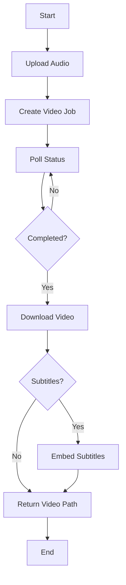
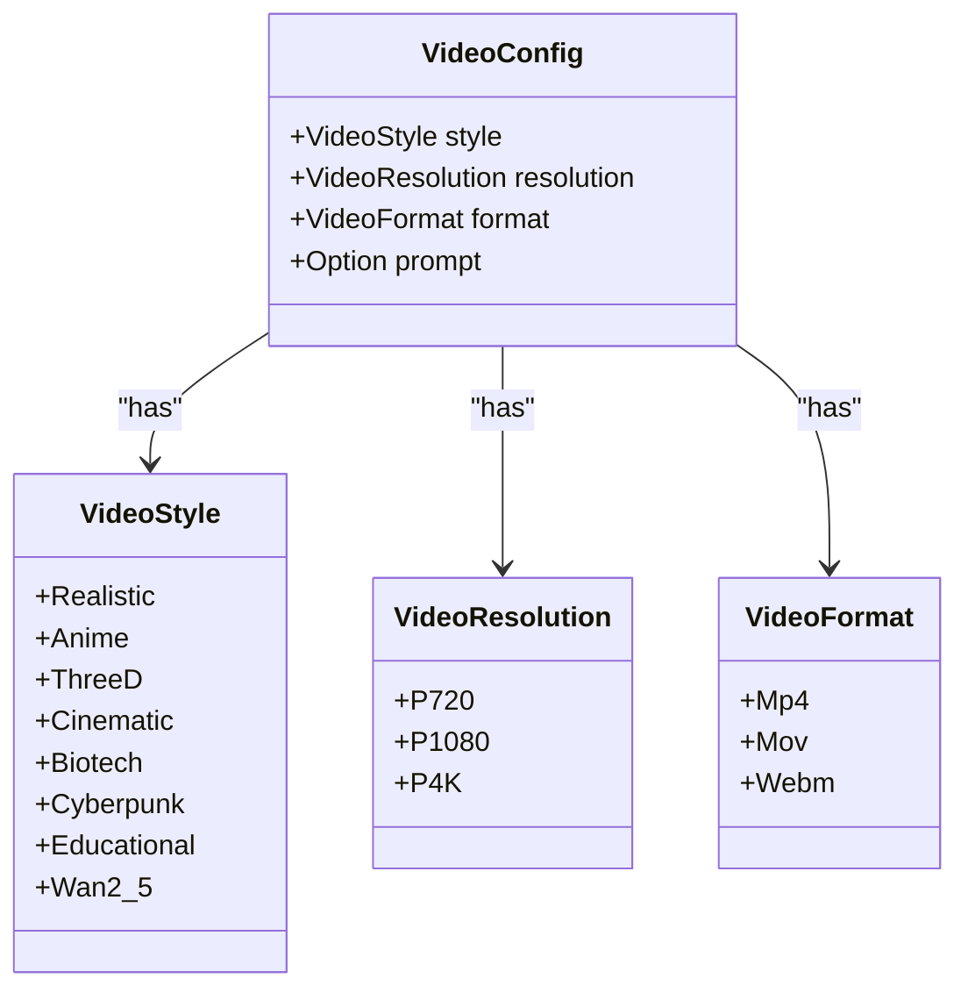
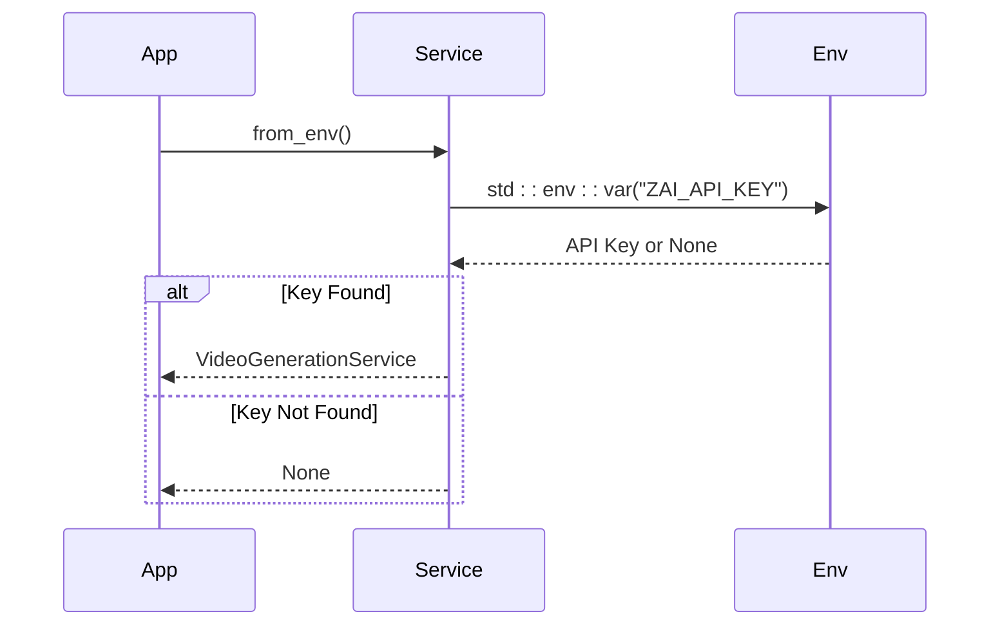
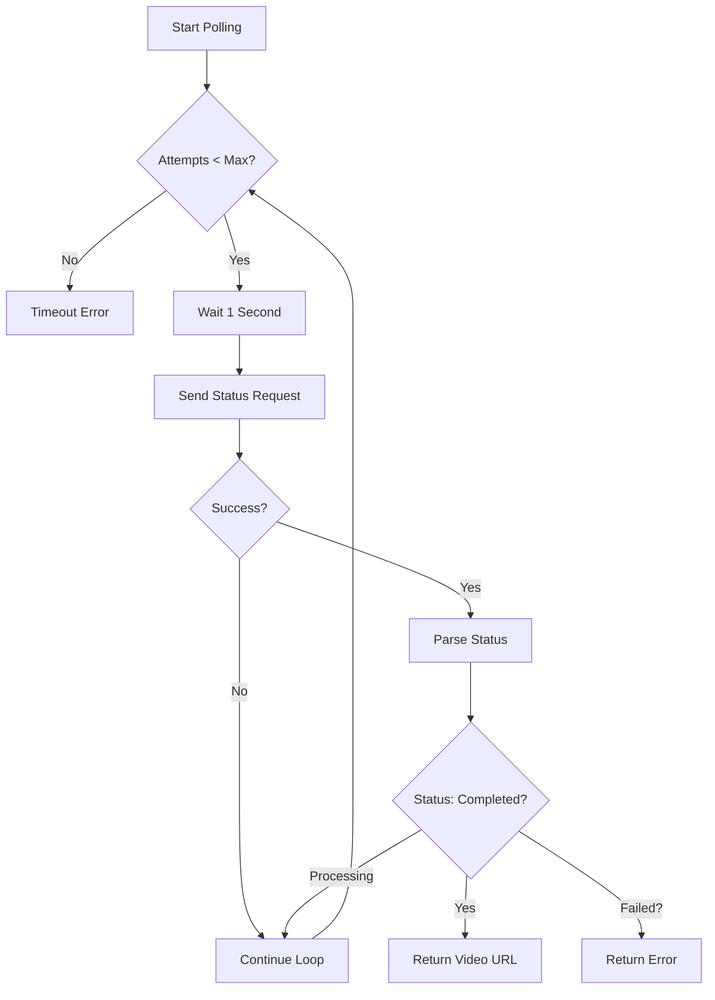
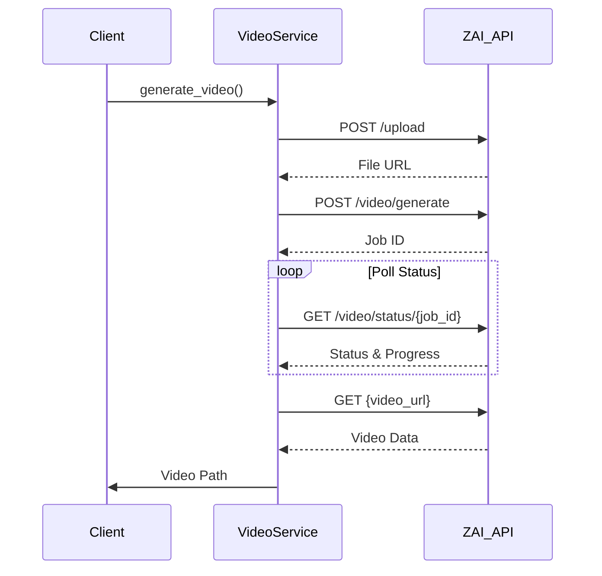

# Video Generation Service

<cite>
**Referenced Files in This Document**   
- [video_generation.rs](file://abogen-ui/crates/ui/services/video_generation.rs)
- [zai_video.rs](file://abogen-ui/crates/ui/services/zai_video.rs)
- [state.rs](file://abogen-ui/crates/ui/state.rs)
- [video.rs](file://src/video.rs)
- [VIDEO_INTEGRATION_PLAN.md](file://abogen-ui/VIDEO_INTEGRATION_PLAN.md)
- [ZAI_VIDEO_FEATURE.md](file://abogen-ui/ZAI_VIDEO_FEATURE.md)
- [CLI_VIDEO_GENERATION.md](file://CLI_VIDEO_GENERATION.md)
- [generate_video.sh](file://generate_video.sh)
</cite>

## Table of Contents
1. [Introduction](#introduction)
2. [Video Generation Process](#video-generation-process)
3. [VideoConfig Structure](#videoconfig-structure)
4. [Service Initialization](#service-initialization)
5. [Core Methods](#core-methods)
6. [Error Handling and Logging](#error-handling-and-logging)
7. [Subtitle Embedding](#subtitle-embedding)
8. [API Integration](#api-integration)
9. [Platform-Specific Behavior](#platform-specific-behavior)
10. [Usage Examples](#usage-examples)

## Introduction

The Video Generation Service in VoxWeave UI enables AI-powered video creation through integration with the Z.AI API. This service transforms audio files into visually rich videos with customizable styles, resolutions, and formats. The implementation supports both desktop and web platforms, providing a comprehensive solution for automated video content creation.

**Section sources**
- [VIDEO_INTEGRATION_PLAN.md](file://abogen-ui/VIDEO_INTEGRATION_PLAN.md#L1-L305)
- [ZAI_VIDEO_FEATURE.md](file://abogen-ui/ZAI_VIDEO_FEATURE.md#L1-L169)

## Video Generation Process

The video generation follows a five-step workflow:

1. **Upload audio** to Z.AI storage
2. **Create video generation job** with specified parameters
3. **Poll status** with progress updates
4. **Download generated video** from Z.AI
5. **Embed subtitles** into the final video

This sequential process ensures reliable video creation with proper error handling and progress tracking throughout the workflow.



**Diagram sources**
- [video_generation.rs](file://abogen-ui/crates/ui/services/video_generation.rs#L100-L150)
- [video.rs](file://src/video.rs#L100-L150)

**Section sources**
- [video_generation.rs](file://abogen-ui/crates/ui/services/video_generation.rs#L100-L150)
- [video.rs](file://src/video.rs#L100-L150)

## VideoConfig Structure

The VideoConfig structure defines the parameters for video generation:

- **style**: Visual style (Realistic, Anime, 3D, Cinematic, Biotech, Cyberpunk, Educational, Wan2_5)
- **resolution**: Output resolution (720p, 1080p, 4K)
- **format**: Container format (MP4, MOV, WebM)
- **prompt**: Optional custom prompt for AI video generation

This configuration enables users to customize the visual characteristics of generated videos according to their specific requirements.



**Diagram sources**
- [state.rs](file://abogen-ui/crates/ui/state.rs#L130-L200)
- [video.rs](file://src/video.rs#L10-L30)

**Section sources**
- [state.rs](file://abogen-ui/crates/ui/state.rs#L130-L200)
- [video.rs](file://src/video.rs#L10-L30)

## Service Initialization

The VideoGenerationService can be initialized in two ways:

1. Direct instantiation with an API key
2. Environment-based initialization via `from_env()`

The `from_env()` method attempts to retrieve the ZAI_API_KEY from environment variables, providing a secure way to manage API credentials without hardcoding them in the application.



**Diagram sources**
- [video_generation.rs](file://abogen-ui/crates/ui/services/video_generation.rs#L50-L70)
- [video.rs](file://src/video.rs#L80-L100)

**Section sources**
- [video_generation.rs](file://abogen-ui/crates/ui/services/video_generation.rs#L50-L70)
- [video.rs](file://src/video.rs#L80-L100)

## Core Methods

### upload_file

Handles multipart form uploads to Z.AI's storage API. The method reads the audio file, creates a multipart form with appropriate headers, and uploads it to the Z.AI service. It includes error fallbacks that return a file:// URL if the upload fails.

### create_video_job

Constructs and sends a JSON request to create a video generation job. The method includes retry logic with exponential backoff to handle transient API failures. It constructs the request body with audio URL, style, resolution, and optional custom prompt.

### poll_video_status

Implements a polling mechanism to monitor video generation progress. The method polls the Z.AI API every second for up to 5 minutes, updating progress signals and handling various status states (processing, completed, failed).



**Diagram sources**
- [video_generation.rs](file://abogen-ui/crates/ui/services/video_generation.rs#L200-L350)
- [video.rs](file://src/video.rs#L200-L350)

**Section sources**
- [video_generation.rs](file://abogen-ui/crates/ui/services/video_generation.rs#L200-L350)
- [video.rs](file://src/video.rs#L200-L350)

## Error Handling and Logging

The service implements comprehensive error handling with descriptive error messages and appropriate fallback behaviors. All operations include detailed logging through the Signal<Vec<LogEntry>> parameter, providing real-time feedback on the video generation process.

Error handling strategies include:
- Retry logic for API calls with exponential backoff
- Graceful degradation when subtitle embedding fails
- Fallback to file URLs when upload endpoints are unavailable
- Detailed error messages with status codes and response texts

**Section sources**
- [video_generation.rs](file://abogen-ui/crates/ui/services/video_generation.rs#L30-L50)
- [video.rs](file://src/video.rs#L30-L50)

## Subtitle Embedding

The embed_subtitles function integrates ffmpeg to burn subtitles directly into the video stream. On non-WASM platforms, it executes ffmpeg commands to overlay subtitles using the subtitles filter. On WASM (web) platforms, it implements a fallback strategy that copies the video and maintains subtitles as a separate file.

The embedding process:
1. Creates an output path with "_subtitled" suffix
2. Attempts ffmpeg command execution
3. Falls back to copying files if ffmpeg is unavailable
4. Returns the path to the final video

**Section sources**
- [video_generation.rs](file://abogen-ui/crates/ui/services/video_generation.rs#L400-L450)
- [video.rs](file://src/video.rs#L400-L450)

## API Integration

The service integrates with Z.AI's video generation API using standard HTTP patterns:

- **POST /upload**: Upload audio files
- **POST /video/generate**: Create video generation jobs
- **GET /video/status/{job_id}**: Poll job status
- **GET {video_url}**: Download completed videos

Authentication is handled via Bearer tokens in the Authorization header using the ZAI_API_KEY.



**Diagram sources**
- [video_generation.rs](file://abogen-ui/crates/ui/services/video_generation.rs#L100-L350)
- [zai_video.rs](file://abogen-ui/crates/ui/services/zai_video.rs#L50-L150)

**Section sources**
- [video_generation.rs](file://abogen-ui/crates/ui/services/video_generation.rs#L100-L350)
- [zai_video.rs](file://abogen-ui/crates/ui/services/zai_video.rs#L50-L150)

## Platform-Specific Behavior

The implementation includes conditional compilation for platform-specific behavior:

- **Non-WASM platforms**: Full ffmpeg integration for subtitle embedding
- **WASM platform**: Fallback to file copying with separate subtitle files

This ensures the service remains functional across different deployment targets while providing optimal functionality when system tools are available.

**Section sources**
- [video_generation.rs](file://abogen-ui/crates/ui/services/video_generation.rs#L400-L450)

## Usage Examples

### CLI Usage

```bash
voxweave video input.txt --style cyberpunk --resolution 1080p
```

### Desktop Application

1. Enable "Generate Video" checkbox
2. Select style (Cyberpunk, Biotech, Educational, etc.)
3. Choose resolution (720p, 1080p, 4K)
4. Set custom prompt (optional)
5. Click START to begin processing

### Environment Setup

```bash
export ZAI_API_KEY=your_api_key_here
cargo run --features "video-generation"
```

**Section sources**
- [CLI_VIDEO_GENERATION.md](file://CLI_VIDEO_GENERATION.md#L1-L324)
- [generate_video.sh](file://generate_video.sh#L1-L42)
- [ZAI_VIDEO_FEATURE.md](file://abogen-ui/ZAI_VIDEO_FEATURE.md#L1-L169)