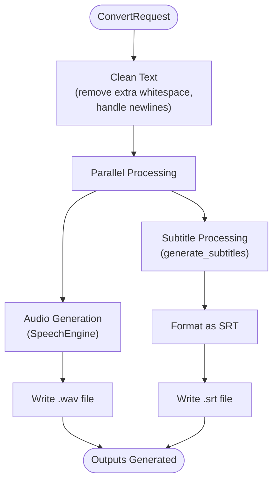
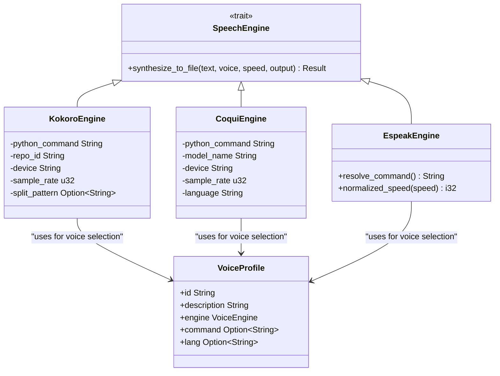
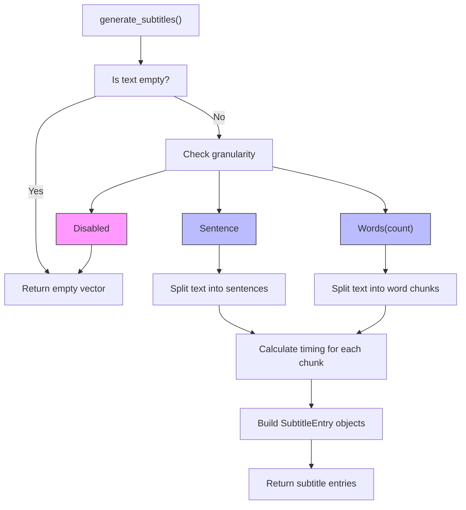
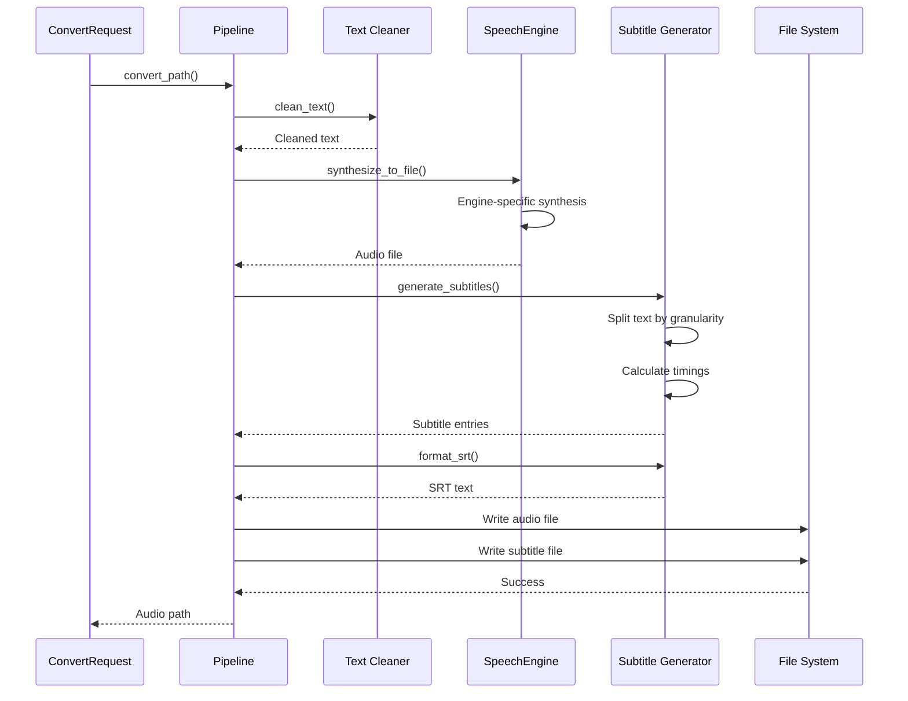

# Audio & Subtitle Pipeline

<cite>
**Referenced Files in This Document**   
- [pipeline.rs](file://src/pipeline.rs)
- [tts.rs](file://src/tts.rs)
- [coqui_tts.rs](file://src/coqui_tts.rs)
- [subtitle.rs](file://src/subtitle.rs)
- [queue.rs](file://src/queue.rs)
- [text.rs](file://src/text.rs)
- [COQUI_TTS_IMPLEMENTATION.md](file://COQUI_TTS_IMPLEMENTATION.md)
- [COQUI_USAGE_GUIDE.md](file://COQUI_USAGE_GUIDE.md)
- [SUBTITLE_IMPROVEMENTS.md](file://SUBTITLE_IMPROVEMENTS.md)
</cite>

## Table of Contents
1. [Introduction](#introduction)
2. [Pipeline Overview](#pipeline-overview)
3. [Core Components](#core-components)
4. [Speech Engine Implementation](#speech-engine-implementation)
5. [Subtitle Generation Process](#subtitle-generation-process)
6. [Voice Profile System](#voice-profile-system)
7. [Error Handling](#error-handling)
8. [Integration Flow](#integration-flow)
9. [Configuration and Environment](#configuration-and-environment)
10. [Conclusion](#conclusion)

## Introduction

The VoxWeave platform provides a comprehensive audio and subtitle generation pipeline that transforms text input into synchronized audio and subtitle outputs. This documentation details the architecture and implementation of the coordinated TTS synthesis and subtitle creation process, focusing on the integration of multiple speech engines, voice profiles, and subtitle formatting options. The system is designed to handle text cleaning, audio generation, and subtitle timing in a unified workflow that ensures synchronization between audio and visual components.

## Pipeline Overview

The audio and subtitle generation pipeline begins with a `ConvertRequest` that specifies the source text file, output directory, voice profile, speech speed, subtitle granularity, and timing parameters. The pipeline processes the request by first cleaning the input text, then simultaneously generating audio through a TTS engine and creating synchronized subtitles. The cleaned text is sent to the selected speech engine for audio synthesis, while the same text is processed to generate timed subtitle entries in SRT format. This parallel processing ensures that both outputs are based on identical text content, maintaining consistency across the generated media assets.

**Diagram sources**
- [pipeline.rs](file://src/pipeline.rs#L10-L19)
- [text.rs](file://src/text.rs#L1-L70)
- [subtitle.rs](file://src/subtitle.rs#L1-L156)

**Section sources**
- [pipeline.rs](file://src/pipeline.rs#L10-L139)
- [text.rs](file://src/text.rs#L1-L70)

## Core Components

The pipeline architecture consists of several core components that work together to transform text into synchronized audio and subtitle outputs. The `ConvertRequest` structure serves as the primary input container, holding all necessary parameters for the conversion process including file paths, voice selection, speed adjustments, and subtitle configuration. The `convert_path` function orchestrates the entire workflow by coordinating text cleaning, speech synthesis, and subtitle generation. Each component is designed to be modular and independent, allowing for flexible configuration and extension of the pipeline's capabilities.

**Section sources**
- [pipeline.rs](file://src/pipeline.rs#L10-L19)
- [pipeline.rs](file://src/pipeline.rs#L21-L85)

## Speech Engine Implementation

The speech engine implementation in VoxWeave supports multiple TTS backends through a unified trait-based interface. The `SpeechEngine` trait defines the contract for all speech synthesis engines, requiring implementations of the `synthesize_to_file` method that converts text to audio with specified voice and speed parameters. Currently, the system supports three engine types: espeak, Kokoro, and CoquiTTS, each accessible through the `VoiceEngine` enum. This extensible architecture allows for additional engines to be integrated by implementing the same trait interface.

**Diagram sources**
- [tts.rs](file://src/tts.rs#L91-L99)
- [tts.rs](file://src/tts.rs#L101-L102)
- [coqui_tts.rs](file://src/coqui_tts.rs#L1-L115)

**Section sources**
- [tts.rs](file://src/tts.rs#L91-L522)
- [coqui_tts.rs](file://src/coqui_tts.rs#L1-L115)

### Espeak Engine

The Espeak engine implementation provides a lightweight, cross-platform TTS solution that operates through command-line invocation. It supports various voice variants through the `command` field in the `VoiceProfile`, allowing selection of different accents and languages. The engine normalizes speech speed by converting the input speed multiplier to a rate parameter that espeak understands, clamping values between 80 and 450 words per minute to ensure audible output. Text is passed to the espeak process through stdin, enabling efficient processing of cleaned text without intermediate file storage.

### Kokoro Engine

The Kokoro engine leverages a Python bridge to interface with the Kokoro TTS system, enabling high-quality speech synthesis with support for multiple languages and voices. Configuration parameters such as Python command, repository ID, device selection, and sample rate are controlled through environment variables, allowing runtime customization without code changes. The engine communicates with the Python bridge through JSON payloads sent via stdin, receiving status and metadata through stdout and stderr. This architecture isolates the Python dependencies while providing a clean Rust interface for speech synthesis.

### CoquiTTS Engine

The CoquiTTS engine implements voice cloning capabilities through the XTTS v2 model, allowing users to generate speech in custom voices based on reference audio samples. The engine is configured through environment variables that specify the Python interpreter, model name, device (CPU, CUDA, or MPS), sample rate, and default language. Voice cloning is enabled by storing the path to a reference WAV file in the `command` field of the `VoiceProfile`, which the engine uses to synthesize speech with the cloned voice characteristics. The inline Python bridge script handles model loading, voice cloning, and audio generation with proper error handling and metadata reporting.

## Subtitle Generation Process

The subtitle generation process in VoxWeave creates synchronized captions that match the timing of the generated audio. The system supports multiple granularity levels, allowing subtitles to be segmented by sentence or by word groups. Timing calculations are based on the average words-per-minute parameter, which determines the duration of each subtitle segment. The generated subtitles are formatted in the standard SRT format, ensuring compatibility with various video players and editing software.

**Diagram sources**
- [subtitle.rs](file://src/subtitle.rs#L1-L156)
- [queue.rs](file://src/queue.rs#L87-L92)

**Section sources**
- [subtitle.rs](file://src/subtitle.rs#L1-L156)
- [queue.rs](file://src/queue.rs#L87-L92)

### Granularity Options

The subtitle generation system supports three granularity options: disabled, sentence-level, and word-level. When disabled, no subtitles are generated. Sentence-level granularity splits the text at sentence boundaries using a regular expression pattern that identifies periods, exclamation marks, and question marks as delimiters. Word-level granularity divides the text into chunks of a specified number of words, allowing for more granular control over subtitle display timing. The word chunk size is configurable through the `SubtitleGranularity::Words(count)` variant, with a minimum size of one word enforced by the system.

### Timing Calculation

Timing for subtitle entries is calculated based on the average words-per-minute parameter, which defaults to 150 words per minute if not specified or set to an invalid value. The system calculates milliseconds per word by dividing 60,000 (milliseconds in a minute) by the words-per-minute value. Each subtitle chunk's duration is determined by multiplying the word count in the chunk by the milliseconds-per-word value, with a minimum duration of 500 milliseconds enforced to ensure readability. The start time of each subsequent subtitle is set to the end time of the previous subtitle, creating a continuous timeline that matches the expected speech duration.

### SRT Formatting

The generated subtitle entries are formatted according to the SRT (SubRip Text) specification, which is a widely supported subtitle format. Each entry includes a sequential index number, timecodes in hours:minutes:seconds,ms format for start and end times, the subtitle text, and a blank line to separate entries. Timecodes are formatted with leading zeros to ensure consistent width, and milliseconds are separated by a comma as required by the SRT standard. The formatted output is a plain text string that can be written directly to an .srt file for use with video players and editing software.

## Voice Profile System

The voice profile system in VoxWeave provides a unified interface for configuring and selecting different speech synthesis voices across multiple engine backends. Each `VoiceProfile` contains metadata such as ID, description, engine type, and optional configuration parameters like language codes or command overrides. The system includes factory methods for creating profiles specific to each engine type, including specialized constructors for voice cloning with CoquiTTS. This abstraction allows the pipeline to handle voice selection and configuration consistently regardless of the underlying TTS engine.

**Section sources**
- [tts.rs](file://src/tts.rs#L36-L43)
- [COQUI_TTS_IMPLEMENTATION.md](file://COQUI_TTS_IMPLEMENTATION.md#L1-L152)

### Voice Selection and Configuration

Voice selection is managed through the `VoiceProfile` structure, which specifies both the engine type and voice parameters. The `VoiceEngine` enum identifies which TTS backend should be used for synthesis, while the profile's fields provide engine-specific configuration. For espeak, the `command` field specifies the voice variant; for Kokoro and CoquiTTS, the `lang` field specifies the language code. The system includes a `find_voice` function that searches a collection of voice profiles by ID, enabling dynamic voice selection based on user preferences or configuration files.

### Voice Cloning with CoquiTTS

The voice cloning feature in VoxWeave leverages CoquiTTS's XTTS v2 model to create custom voices from reference audio samples. The `VoiceProfile::coqui_clone` constructor creates a profile that includes the path to a reference WAV file in the `command` field. During synthesis, the CoquiEngine detects this configuration and uses the reference audio to clone the speaker's voice characteristics. This enables personalized speech synthesis that can replicate a specific person's voice with only a few seconds of sample audio, opening possibilities for custom narration voices and accessibility applications.

## Error Handling

The pipeline implements comprehensive error handling to ensure robust operation under various conditions. The system uses the `anyhow` crate for error propagation, providing contextual information about failures at each stage of processing. TTS-specific errors are encapsulated in the `TtsError` enum, which distinguishes between unsupported voices, command execution failures, and audio backend issues. The pipeline gracefully handles edge cases such as empty input text by generating silent audio files and skipping subtitle generation, ensuring that the output directory contains appropriately named but empty files when no content is available.

**Section sources**
- [tts.rs](file://src/tts.rs#L1-L20)
- [pipeline.rs](file://src/pipeline.rs#L21-L85)

## Integration Flow

The integration flow of the audio and subtitle pipeline demonstrates how the various components work together to produce synchronized outputs. Starting from the `ConvertRequest`, the system coordinates text cleaning, parallel audio and subtitle processing, and file output generation. The pipeline ensures that both audio and subtitles are based on the same cleaned text, maintaining consistency between the spoken and visual representations. Configuration parameters like speed adjustments and words-per-minute settings are applied consistently across both outputs, creating a cohesive multimedia experience.

**Diagram sources**
- [pipeline.rs](file://src/pipeline.rs#L21-L85)
- [text.rs](file://src/text.rs#L1-L70)
- [subtitle.rs](file://src/subtitle.rs#L1-L156)

**Section sources**
- [pipeline.rs](file://src/pipeline.rs#L21-L85)

## Configuration and Environment

The VoxWeave pipeline supports extensive configuration through both code-level APIs and environment variables. Engine-specific parameters such as Python interpreter paths, model names, device selection, and sample rates can be customized using environment variables, allowing users to adapt the system to their hardware capabilities and preferences. The `VoiceProfile` system provides a programmatic interface for creating and managing voice configurations, while the `ConvertRequest` structure exposes all processing parameters for fine-grained control over the output. This dual approach to configuration enables both user-friendly defaults and advanced customization options.

**Section sources**
- [COQUI_USAGE_GUIDE.md](file://COQUI_USAGE_GUIDE.md#L1-L672)
- [tts.rs](file://src/tts.rs#L1-L522)

## Conclusion

The audio and subtitle generation pipeline in VoxWeave provides a robust, extensible framework for transforming text into synchronized multimedia outputs. By separating concerns into distinct components—text cleaning, speech synthesis, and subtitle generation—the system achieves modularity and maintainability while ensuring consistent results across different output formats. The support for multiple TTS engines, including voice cloning capabilities with CoquiTTS, offers flexibility in voice selection and quality. The subtitle system's configurable granularity and accurate timing calculations ensure that captions are both readable and precisely synchronized with the audio. This comprehensive pipeline architecture enables a wide range of applications from accessibility tools to content creation workflows, providing a solid foundation for text-to-speech and captioning needs.