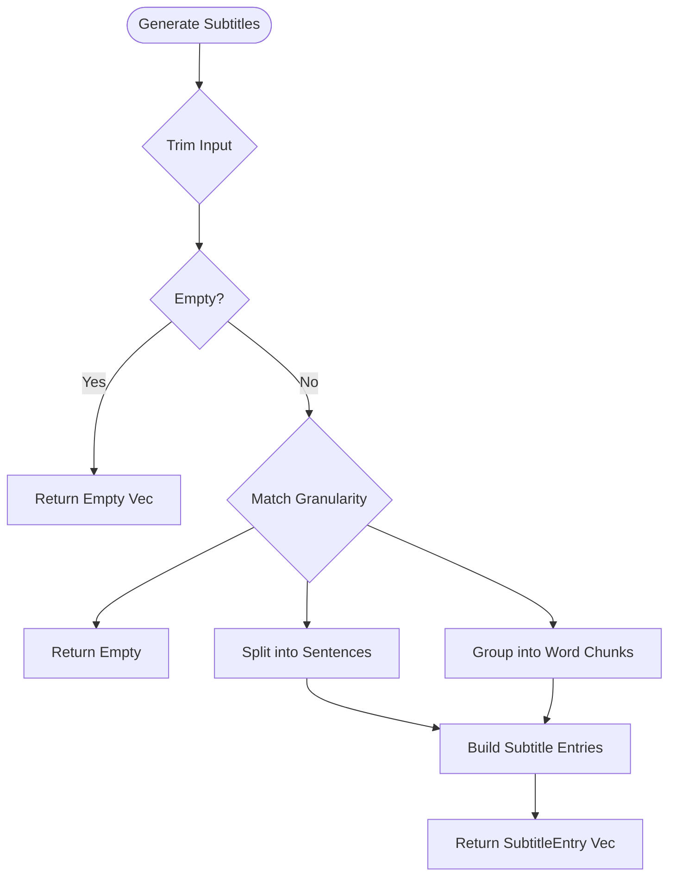
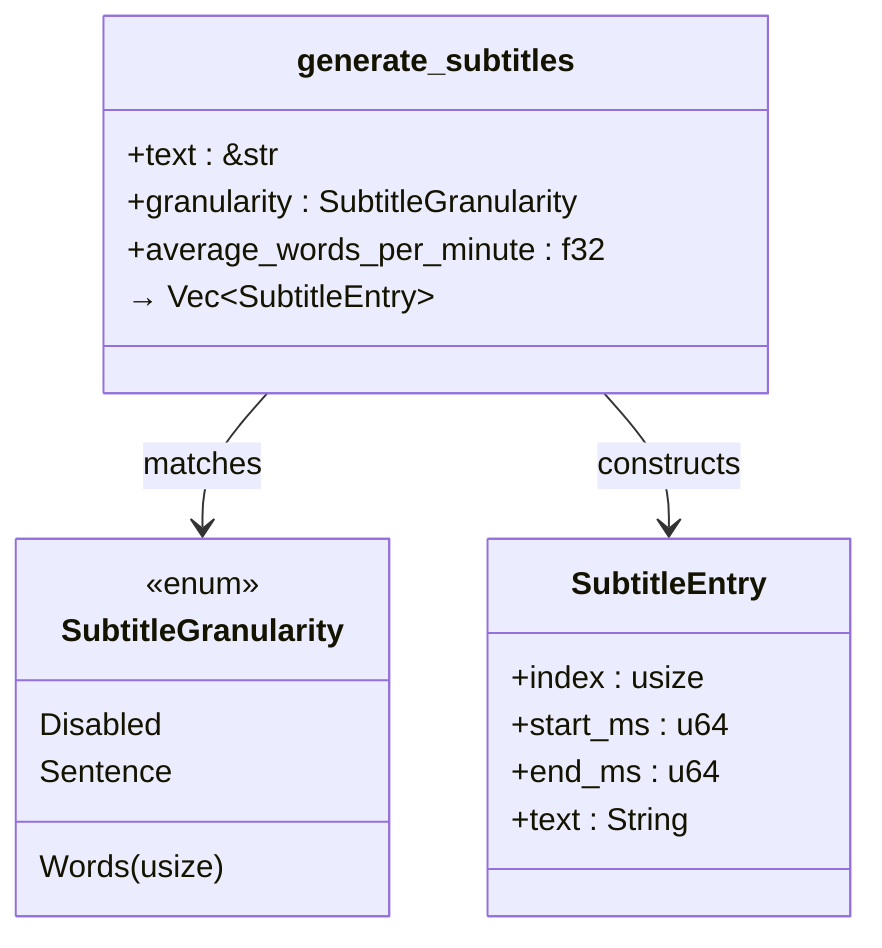
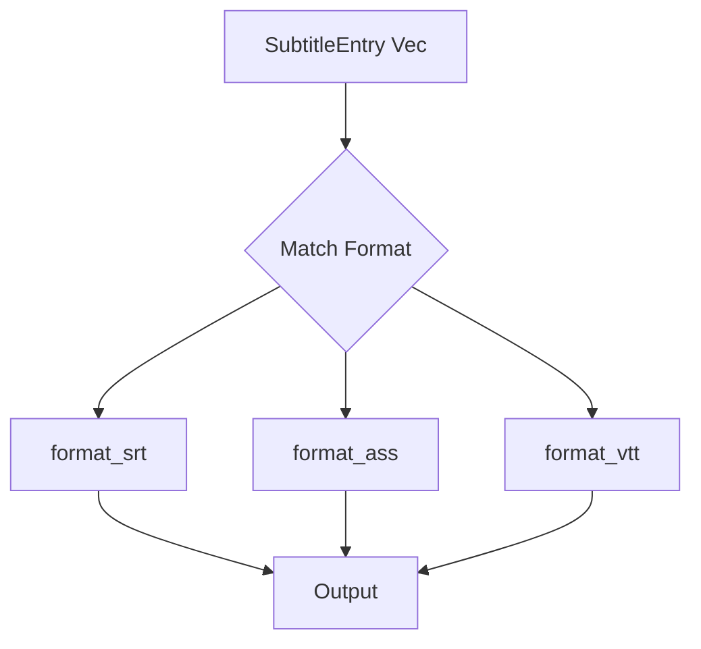

# Subtitle Generation

<cite>
**Referenced Files in This Document**   
- [subtitle.rs](file://src/subtitle.rs)
- [text.rs](file://src/text.rs)
- [sanitize.rs](file://src/sanitize.rs)
- [tts_service.rs](file://abogen-ui/crates/ui/services/tts_service.rs)
</cite>

## Table of Contents
1. [Introduction](#introduction)
2. [Subtitle Granularity Strategies](#subtitle-granularity-strategies)
3. [Text Preprocessing and Cleaning](#text-preprocessing-and-cleaning)
4. [Timing Calculation Algorithm](#timing-calculation-algorithm)
5. [Subtitle Entry Generation Process](#subtitle-entry-generation-process)
6. [SRT, ASS, and VTT Formatting](#srt-ass-and-vtt-formatting)
7. [Integration with Audio Pipeline](#integration-with-audio-pipeline)
8. [Word-Level Timing for Synchronized Highlighting](#word-level-timing-for-synchronized-highlighting)
9. [Common Issues and Troubleshooting](#common-issues-and-troubleshooting)

## Introduction
The subtitle generation system in VoxWeave enables synchronized captioning for audio and video outputs, supporting multiple granularity levels and subtitle formats. This document details the implementation of sentence-level and word-level subtitle strategies, timing calculations based on words-per-minute (WPM), and integration with the text-to-speech (TTS) and video generation pipelines. The system handles edge cases such as empty input, punctuation, and formatting errors, ensuring robust output across platforms.

**Section sources**
- [subtitle.rs](file://src/subtitle.rs#L0-L156)
- [text.rs](file://src/text.rs#L0-L70)

## Subtitle Granularity Strategies
VoxWeave supports three subtitle granularity modes: disabled, sentence-level, and word-level chunking. These are controlled via the `SubtitleGranularity` enum, which determines how input text is segmented before timing is applied.

- **Disabled**: No subtitles are generated.
- **Sentence**: Text is split into sentences using a regex pattern that identifies sentence boundaries (`.`, `!`, `?`).
- **Words(n)**: Text is grouped into chunks of `n` words, enabling fine-grained control over subtitle display duration.

The `generate_subtitles` function routes processing based on the selected granularity, applying either `split_sentences` or `split_words` to segment the cleaned input text.



**Diagram sources**
- [subtitle.rs](file://src/subtitle.rs#L0-L54)
- [subtitle.rs](file://src/subtitle.rs#L52-L95)

**Section sources**
- [subtitle.rs](file://src/subtitle.rs#L0-L156)

## Text Preprocessing and Cleaning
Before subtitle generation, raw input text undergoes preprocessing to ensure consistent formatting and readability. The `clean_text` function in `text.rs` performs the following operations:

- Trims leading and trailing whitespace
- Collapses multiple internal spaces into single spaces
- Reduces sequences of three or more newlines to two
- Optionally replaces single newlines with spaces (when `replace_single_newlines` is enabled)

This normalization ensures that line breaks do not interfere with sentence or word segmentation logic.

```mermaid
flowchart TD
Input([Raw Text]) --> TrimGlobal[Trim Entire Text]
TrimGlobal --> SplitLines[Split by Newline]
SplitLines --> MapLines[Map: collapse_whitespace]
MapLines --> JoinLines[Join Lines with \\n]
JoinLines --> ReduceNewlines[Replace \\n{3,} with \\n\\n]
ReduceNewlines --> ReplaceOption{Replace Single Newlines?}
ReplaceOption --> |Yes| ReplaceWithSpaces[Replace \\n with Space]
ReplaceOption --> |No| Output[Final Cleaned Text]
ReplaceWithSpaces --> Output
```

**Diagram sources**
- [text.rs](file://src/text.rs#L0-L70)

**Section sources**
- [text.rs](file://src/text.rs#L0-L70)

## Timing Calculation Algorithm
The timing of each subtitle entry is calculated based on an average reading speed in words per minute (WPM), with normalization and minimum duration safeguards.

### Normalization Logic
The `normalize_wpm` function ensures valid WPM values:
- If WPM ≤ 0, defaults to 150.0 WPM (standard reading speed)
- Otherwise, uses the provided value

### Duration Estimation
For each text chunk:
- Word count is determined via `split_whitespace().count()`, with a minimum of 1
- Milliseconds per word = 60,000 / average_wpm
- Total duration = word_count × ms_per_word, rounded and clamped to a minimum of 500ms
- Entries are assigned sequential start/end times using a time cursor

This approach ensures natural pacing while preventing excessively short or long subtitle displays.

```mermaid
flowchart TD
Chunk[Text Chunk] --> WordCount[Count Words (min 1)]
WordCount --> MsPerWord[ms_per_word = 60_000 / wpm]
MsPerWord --> Duration[Duration = words × ms_per_word]
Duration --> Clamp[Clamp to min 500ms]
Clamp --> AssignTime[Assign start_ms = cursor, end_ms = cursor + duration]
AssignTime --> UpdateCursor[cursor += duration]
```

**Diagram sources**
- [subtitle.rs](file://src/subtitle.rs#L52-L95)

**Section sources**
- [subtitle.rs](file://src/subtitle.rs#L52-L95)

## Subtitle Entry Generation Process
The `generate_subtitles` function orchestrates the full pipeline from cleaned text to structured `SubtitleEntry` instances.

### Input Handling
- Input text is trimmed; empty input returns an empty vector
- Supports sentence splitting via regex: `r"(?s)[^.!?]+[.!?]?"`

### Chunking Strategies
- **Sentence-level**: Uses `split_sentences` with regex iteration
- **Word-level**: Splits text into whitespace-separated words, then groups into chunks of specified size

### Edge Cases Handled
- Empty input → empty subtitle list
- Invalid WPM → defaults to 150.0
- Zero-word chunks → treated as one word
- Single leftover words in chunking → included as final entry



**Diagram sources**
- [subtitle.rs](file://src/subtitle.rs#L4-L10)
- [subtitle.rs](file://src/subtitle.rs#L0-L54)

**Section sources**
- [subtitle.rs](file://src/subtitle.rs#L0-L156)

## SRT, ASS, and VTT Formatting
VoxWeave supports multiple subtitle formats through dedicated formatting functions.

### SRT Format
- Timestamp format: `HH:MM:SS,mmm --> HH:MM:SS,mmm`
- Each entry includes index, timestamps, and text
- Double newline separates entries

### ASS Format
- Includes script info, styles, and events sections
- Timestamp format: `H:MM:SS.CC` (centiseconds)
- Uses Dialogue lines with layer, start, end, style, and text

### WebVTT Format
- Header: `WEBVTT`
- Timestamp format: `HH:MM:SS.mmm`
- Includes cue index, timestamps, and text

Format conversion is handled in the UI layer via `format_subtitles`, which delegates to `format_srt`, `format_ass`, or `format_vtt` based on user selection.



**Diagram sources**
- [tts_service.rs](file://abogen-ui/crates/ui/services/tts_service.rs#L149-L180)
- [subtitle.rs](file://src/subtitle.rs#L97-L133)

**Section sources**
- [tts_service.rs](file://abogen-ui/crates/ui/services/tts_service.rs#L149-L209)
- [subtitle.rs](file://src/subtitle.rs#L97-L133)

## Integration with Audio Pipeline
Subtitle generation is tightly integrated with the TTS and video generation workflows in `process_queue`.

### Workflow Steps
1. Read and clean source text
2. Generate TTS audio (WAV)
3. Convert audio to target format (MP3/FLAC) if needed
4. Generate subtitles if enabled
5. Write subtitle file in selected format (SRT/ASS/VTT)
6. Pass subtitle data to video generation (MLT or Z.AI)

The `subtitle_mode_to_granularity` function maps UI-level subtitle modes (Sentence, Paragraph, None) to internal `SubtitleGranularity` values.

**Section sources**
- [tts_service.rs](file://abogen-ui/crates/ui/services/tts_service.rs#L504-L538)

## Word-Level Timing for Synchronized Highlighting
While current implementation focuses on sentence or fixed-size word chunks, the structure supports future enhancements for per-word timing. The `SubtitleEntry` model could be extended to include word-level timestamps, enabling synchronized highlighting in video outputs via MLT.

Potential implementation:
- Use phoneme-level timing from TTS engine
- Distribute chunk duration evenly across words
- Generate intermediate timestamps for each word

This would allow precise visual feedback during playback, aligning text highlights with spoken audio.

**Section sources**
- [subtitle.rs](file://src/subtitle.rs#L52-L95)

## Common Issues and Troubleshooting
### Timing Desynchronization
- **Cause**: Mismatch between estimated and actual speech duration
- **Solution**: Calibrate WPM setting based on voice characteristics

### Formatting Errors
- **Cause**: Special characters in filenames or text
- **Solution**: Use `sanitize_name_for_os` to clean output paths

### Empty Subtitles
- **Cause**: Empty input or disabled granularity
- **Solution**: Validate input text and subtitle settings

### Punctuation Handling
- Sentence splitting may misfire on abbreviations (e.g., "Dr.", "etc.")
- Consider enhancing regex to handle common exceptions

**Section sources**
- [subtitle.rs](file://src/subtitle.rs#L0-L156)
- [sanitize.rs](file://src/sanitize.rs#L0-L161)