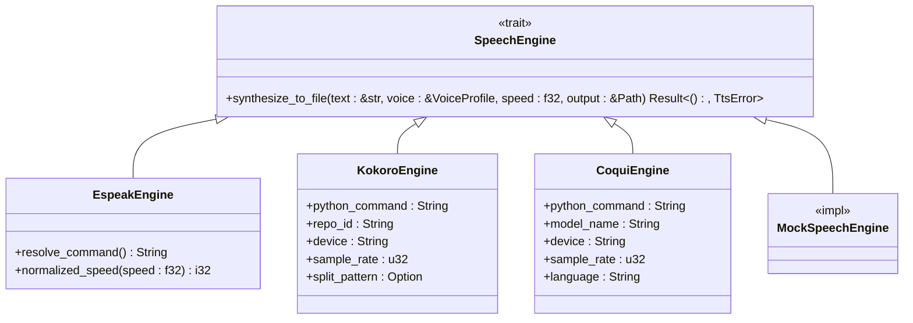
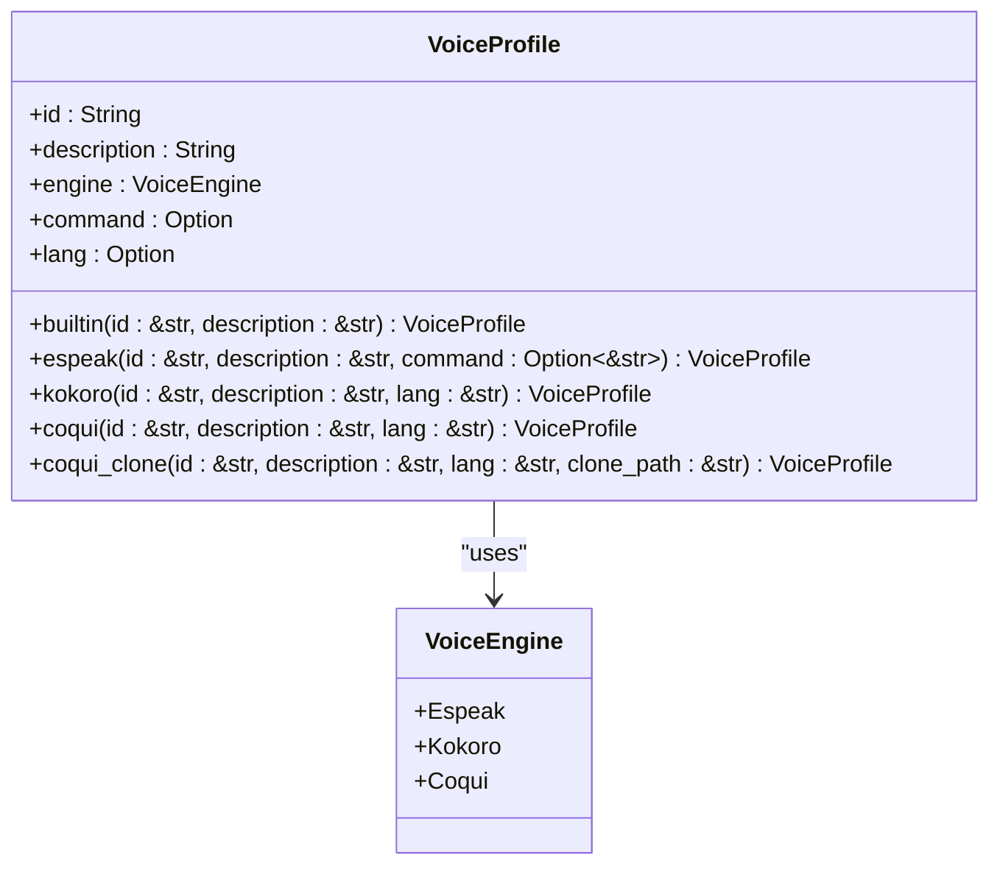
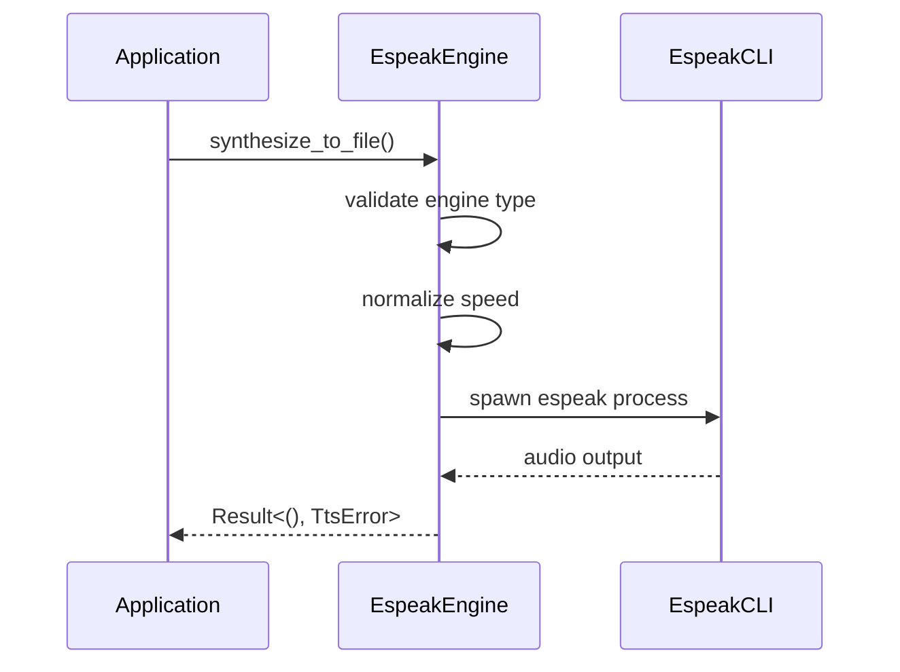
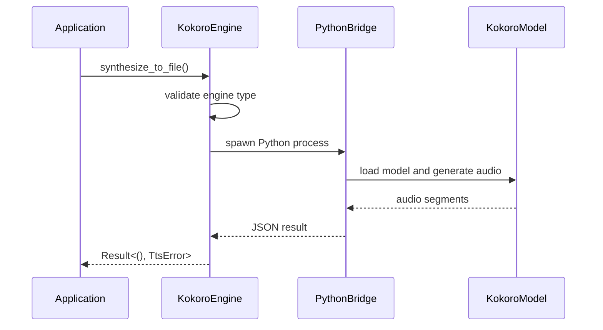
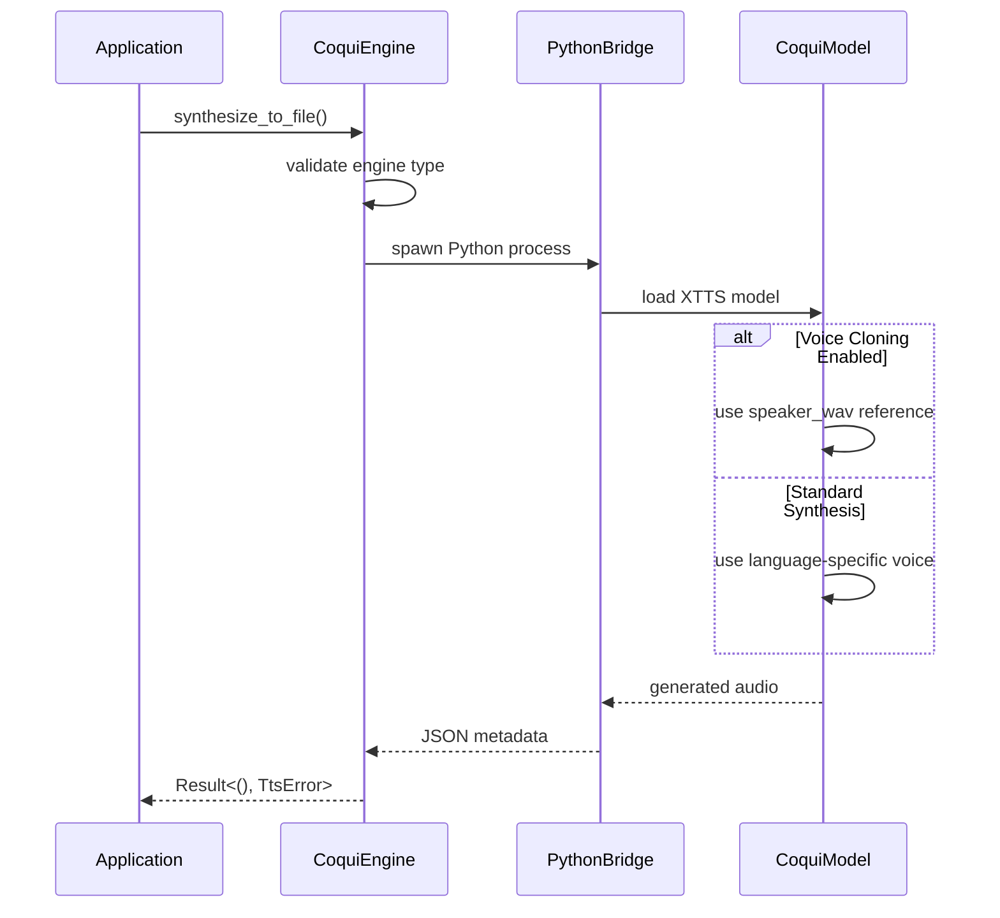
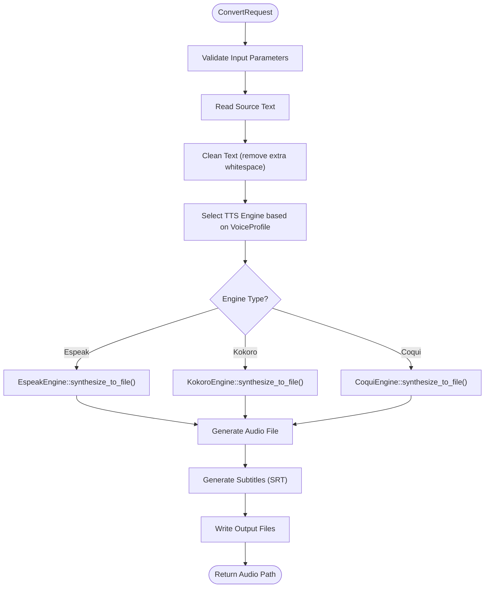
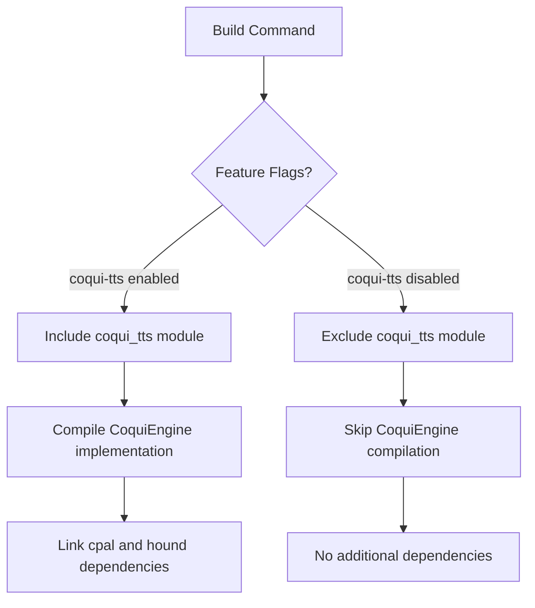
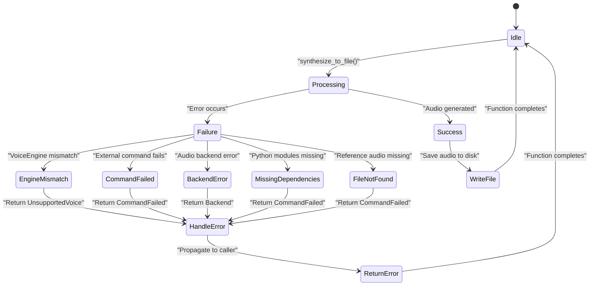

# TTS Engine Integration

<cite>
**Referenced Files in This Document**   
- [tts.rs](file://src/tts.rs)
- [coqui_tts.rs](file://src/coqui_tts.rs)
- [pipeline.rs](file://src/pipeline.rs)
- [config.rs](file://src/config.rs)
- [kokoro_bridge.py](file://python/kokoro_bridge.py)
</cite>

## Table of Contents
1. [Introduction](#introduction)
2. [TTS Engine Architecture](#tts-engine-architecture)
3. [Voice Profile System](#voice-profile-system)
4. [Engine Implementation Details](#engine-implementation-details)
5. [CoquiTTS Voice Cloning](#coquitts-voice-cloning)
6. [Pipeline Integration](#pipeline-integration)
7. [Feature Flag Management](#feature-flag-management)
8. [Error Handling and Troubleshooting](#error-handling-and-troubleshooting)
9. [Performance Considerations](#performance-considerations)
10. [Conclusion](#conclusion)

## Introduction

VoxWeave implements a multi-engine text-to-speech (TTS) system that supports three distinct TTS engines: espeak-ng, Kokoro, and CoquiTTS. This document details the integration of these engines through the SpeechEngine trait, explaining how voice profiles, speed adjustments, and audio generation are handled across different implementations. The system is designed to provide flexibility in voice selection and synthesis quality, with special emphasis on CoquiTTS's voice cloning capabilities that enable personalized voice generation using speaker reference audio.

**Section sources**
- [tts.rs](file://src/tts.rs#L1-L522)
- [coqui_tts.rs](file://src/coqui_tts.rs#L1-L115)

## TTS Engine Architecture

The TTS engine architecture in VoxWeave is built around a trait-based design that allows multiple TTS implementations to coexist and be selected at runtime. The core of this architecture is the `SpeechEngine` trait, which defines a common interface for all TTS engines.

**Diagram sources**
- [tts.rs](file://src/tts.rs#L1-L522)
- [coqui_tts.rs](file://src/coqui_tts.rs#L1-L115)

**Section sources**
- [tts.rs](file://src/tts.rs#L1-L522)
- [coqui_tts.rs](file://src/coqui_tts.rs#L1-L115)

## Voice Profile System

The `VoiceProfile` struct serves as the central configuration mechanism for TTS voice selection and engine-specific parameters. Each voice profile contains metadata that determines which engine will be used and how the synthesis should be performed.

The voice profile system supports four construction methods:
- `builtin()`: Creates a profile for the default espeak engine
- `espeak()`: Creates a profile with optional command override for espeak
- `kokoro()`: Creates a profile with language specification for Kokoro
- `coqui()`: Creates a standard CoquiTTS profile with language support
- `coqui_clone()`: Creates a voice cloning profile with reference audio path

Voice profiles are resolved through the `find_voice` function, which searches a collection of available voices by ID. The system also supports configuration persistence through the `AppConfig` structure, which can store user preferences including the default voice selection.

**Diagram sources**
- [tts.rs](file://src/tts.rs#L1-L522)

**Section sources**
- [tts.rs](file://src/tts.rs#L1-L522)
- [config.rs](file://src/config.rs#L1-L117)

## Engine Implementation Details

### Espeak-ng Engine

The `EspeakEngine` implementation provides basic TTS functionality through the espeak-ng command-line tool. It handles speed adjustments by converting the floating-point speed multiplier to an integer rate value that espeak understands, with normalization to ensure values stay within the valid range of 80-450 words per minute.

**Diagram sources**
- [tts.rs](file://src/tts.rs#L1-L522)

**Section sources**
- [tts.rs](file://src/tts.rs#L1-L522)

### Kokoro Engine

The `KokoroEngine` implementation uses a Python bridge to interface with the Kokoro TTS system. It communicates with the Python process through stdin/stdout using JSON payloads that contain all necessary synthesis parameters.

The engine configuration is controlled by environment variables that specify the Python command, model repository ID, device (CPU/GPU), sample rate, and text splitting pattern. The bridge script (`kokoro_bridge.py`) handles the actual TTS generation and returns metadata including the audio duration.

**Diagram sources**
- [tts.rs](file://src/tts.rs#L1-L522)
- [kokoro_bridge.py](file://python/kokoro_bridge.py#L1-L89)

**Section sources**
- [tts.rs](file://src/tts.rs#L1-L522)
- [kokoro_bridge.py](file://python/kokoro_bridge.py#L1-L89)

### CoquiTTS Engine

The `CoquiEngine` implementation provides advanced TTS capabilities through the Coqui TTS library, with special support for voice cloning. Like the Kokoro engine, it uses a Python bridge but with additional parameters for voice cloning functionality.

**Diagram sources**
- [coqui_tts.rs](file://src/coqui_tts.rs#L1-L115)
- [tts.rs](file://src/tts.rs#L1-L522)

**Section sources**
- [coqui_tts.rs](file://src/coqui_tts.rs#L1-L115)
- [tts.rs](file://src/tts.rs#L1-L522)

## CoquiTTS Voice Cloning

The voice cloning feature in CoquiTTS allows users to create personalized voices using a reference audio sample. This is implemented through the `VoiceProfile::coqui_clone()` method, which stores the path to a WAV file in the `command` field of the voice profile.

When the `CoquiEngine` processes a voice profile with a non-empty `command` field, it interprets this as a voice cloning request and includes the `speaker_wav` parameter in the JSON payload sent to the Python bridge. The bridge script then uses this reference audio to condition the TTS model, producing speech that mimics the characteristics of the recorded voice.

The voice cloning process requires:
1. A high-quality WAV audio file containing clear speech
2. The Coqui TTS library with XTTS v2 model support
3. Sufficient computational resources (GPU recommended)
4. Properly configured environment variables

The system checks for the existence of the reference audio file before attempting synthesis, returning appropriate errors if the file is missing or inaccessible.

**Section sources**
- [coqui_tts.rs](file://src/coqui_tts.rs#L1-L115)
- [tts.rs](file://src/tts.rs#L1-L522)
- [COQUI_TTS_IMPLEMENTATION.md](file://COQUI_TTS_IMPLEMENTATION.md#L1-L152)
- [COQUI_USAGE_GUIDE.md](file://COQUI_USAGE_GUIDE.md#L1-L672)

## Pipeline Integration

The TTS engines are integrated into the VoxWeave pipeline through the `ConvertRequest` structure and the `convert_path` function. This integration layer abstracts the engine-specific details and provides a unified interface for text-to-speech conversion.

The `ConvertRequest` structure contains all necessary parameters for the conversion process:
- Source text file path
- Output directory
- Voice profile for engine selection and configuration
- Speed multiplier for speech rate
- Subtitle granularity settings
- Text processing options
- Average words per minute for timing calculations

The pipeline also handles text cleaning, subtitle generation, and output file management, ensuring a complete workflow from text input to audio and subtitle output.

**Diagram sources**
- [pipeline.rs](file://src/pipeline.rs#L1-L139)

**Section sources**
- [pipeline.rs](file://src/pipeline.rs#L1-L139)
- [tts.rs](file://src/tts.rs#L1-L522)

## Feature Flag Management

The CoquiTTS engine implementation is conditionally compiled using the `coqui-tts` feature flag. This allows the library to be built with or without CoquiTTS support, depending on the user's requirements and system capabilities.

When the `coqui-tts` feature is enabled:
- The `coqui_tts` module is included in the build
- The `CoquiEngine` implementation is compiled
- Audio recording dependencies (cpal, hound) are linked
- The Python bridge script is embedded in the binary

When the feature is disabled:
- The `coqui_tts` module is excluded
- Only espeak-ng and Kokoro engines are available
- No Python dependencies are required
- Smaller binary size and fewer dependencies

This feature flag system allows users to choose between a lightweight build with basic TTS functionality or a full-featured build with voice cloning capabilities.

**Diagram sources**
- [lib.rs](file://src/lib.rs#L1-L13)
- [coqui_tts.rs](file://src/coqui_tts.rs#L1-L115)

**Section sources**
- [lib.rs](file://src/lib.rs#L1-L13)
- [coqui_tts.rs](file://src/coqui_tts.rs#L1-L115)

## Error Handling and Troubleshooting

The TTS system implements comprehensive error handling through the `TtsError` enum, which provides descriptive error messages for various failure scenarios.

Common issues and their solutions include:

**Missing Dependencies**
- Issue: "Failed to import coqui dependencies"
- Solution: Install required Python packages: `pip install TTS torch numpy`

**Voice Loading Failures**
- Issue: "Speaker reference audio not found"
- Solution: Verify the WAV file path exists and is accessible

**Performance Issues**
- Issue: Slow synthesis or high memory usage
- Solution: Adjust device settings via environment variables (use CPU instead of GPU if necessary)

**Configuration Problems**
- Issue: Incorrect voice selection
- Solution: Verify voice profile IDs match available voices

The system also provides environment variables for troubleshooting and configuration:
- `VOXWEAVE_COQUI_PYTHON`: Specify Python interpreter
- `VOXWEAVE_COQUI_DEVICE`: Control device usage (cpu, cuda, mps)
- `VOXWEAVE_KOKORO_DEVICE`: Control Kokoro device usage
- `VOXWEAVE_ESPEAK_COMMAND`: Override espeak command

**Diagram sources**
- [tts.rs](file://src/tts.rs#L1-L522)
- [COQUI_USAGE_GUIDE.md](file://COQUI_USAGE_GUIDE.md#L1-L672)

**Section sources**
- [tts.rs](file://src/tts.rs#L1-L522)
- [COQUI_USAGE_GUIDE.md](file://COQUI_USAGE_GUIDE.md#L1-L672)

## Performance Considerations

The performance characteristics of each TTS engine vary significantly based on implementation and requirements:

| Engine | Startup Time | Synthesis Speed | Memory Usage | Quality | Use Case |
|--------|--------------|-----------------|--------------|---------|----------|
| espeak-ng | Fast | Fast | Low | Basic | Quick synthesis, limited resources |
| Kokoro | Medium | Medium | Medium | Good | Balanced quality and performance |
| CoquiTTS | Slow | Slow | High | Excellent | High-quality, voice cloning |

Key performance factors:
- **Model Loading**: CoquiTTS loads a ~1.8GB model on first use, causing slow startup
- **Device Utilization**: GPU acceleration significantly improves CoquiTTS performance
- **Audio Quality**: Higher sample rates increase file size and processing time
- **Text Length**: Longer texts require more processing and memory

For real-time synthesis applications, consider:
- Pre-loading engines during application startup
- Using espeak-ng for quick responses
- Caching frequently used voice profiles
- Monitoring system resources during synthesis
- Implementing timeout mechanisms for long-running operations

**Section sources**
- [COQUI_USAGE_GUIDE.md](file://COQUI_USAGE_GUIDE.md#L1-L672)
- [tts.rs](file://src/tts.rs#L1-L522)
- [coqui_tts.rs](file://src/coqui_tts.rs#L1-L115)

## Conclusion

The TTS engine integration in VoxWeave provides a flexible, extensible system for text-to-speech conversion with support for multiple engines and advanced features like voice cloning. The trait-based architecture allows for clean separation of concerns while maintaining a consistent interface across different implementations. The voice profile system enables sophisticated configuration and engine selection, while the pipeline integration ensures seamless operation within the broader application context. With proper configuration and dependency management, users can leverage the strengths of each engine type for their specific use cases, from lightweight espeak-ng synthesis to high-quality CoquiTTS voice cloning.