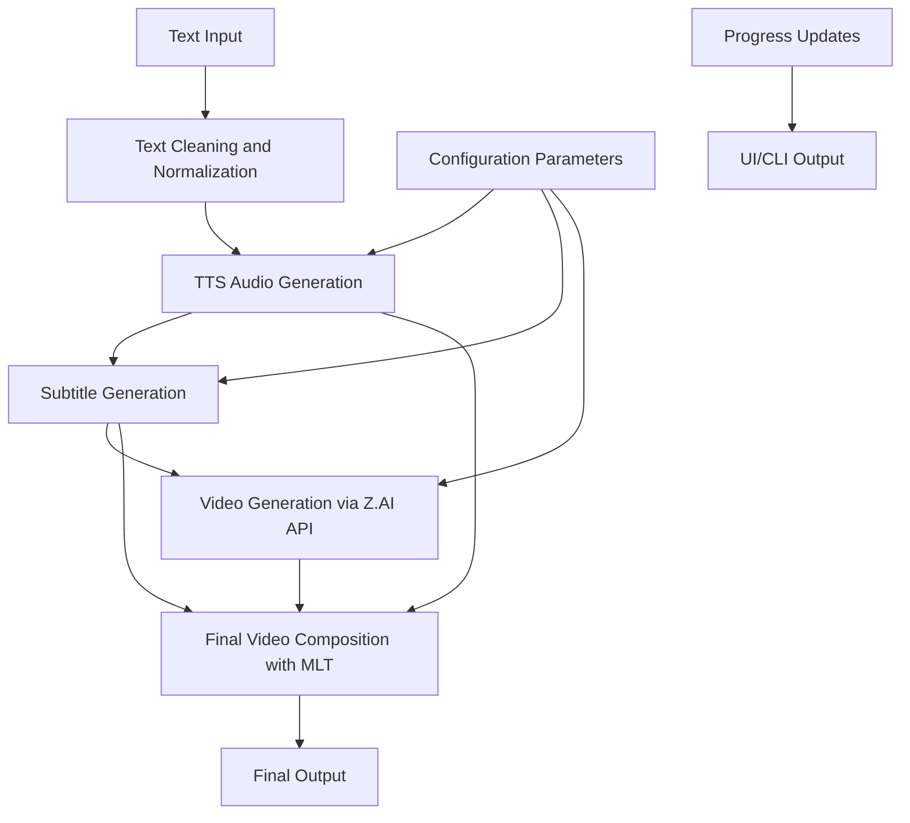
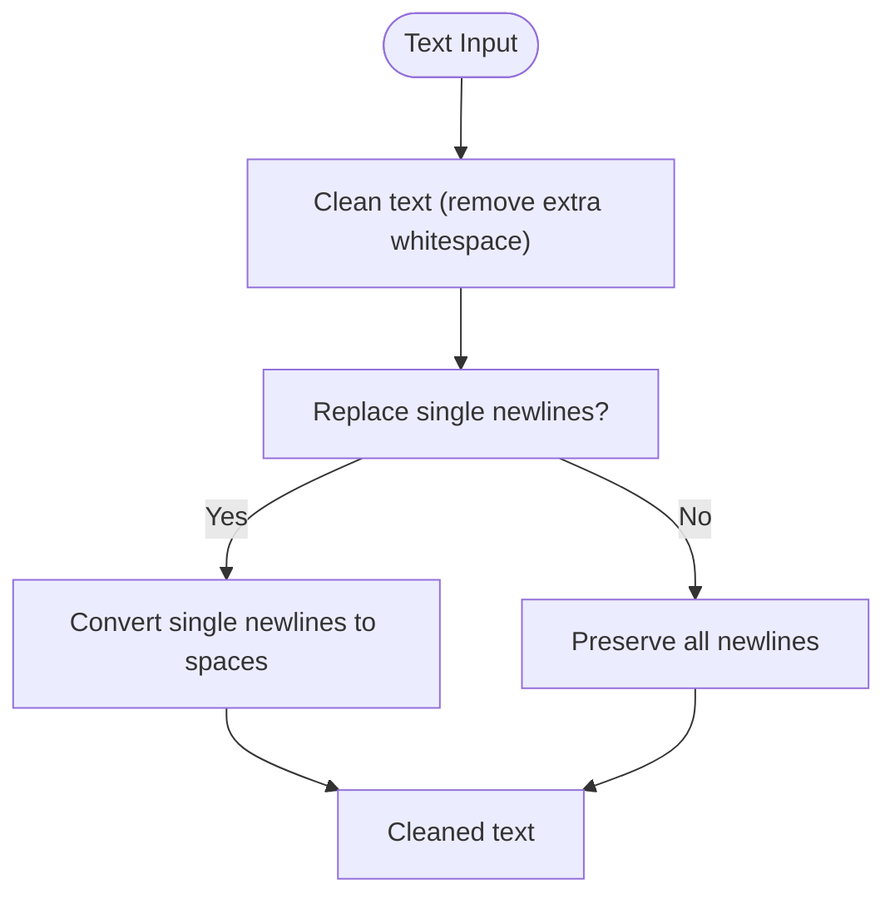
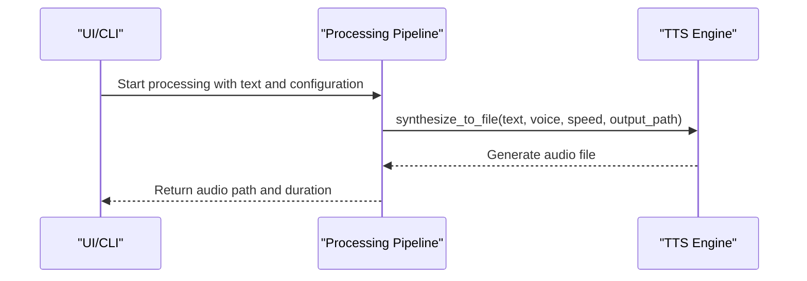
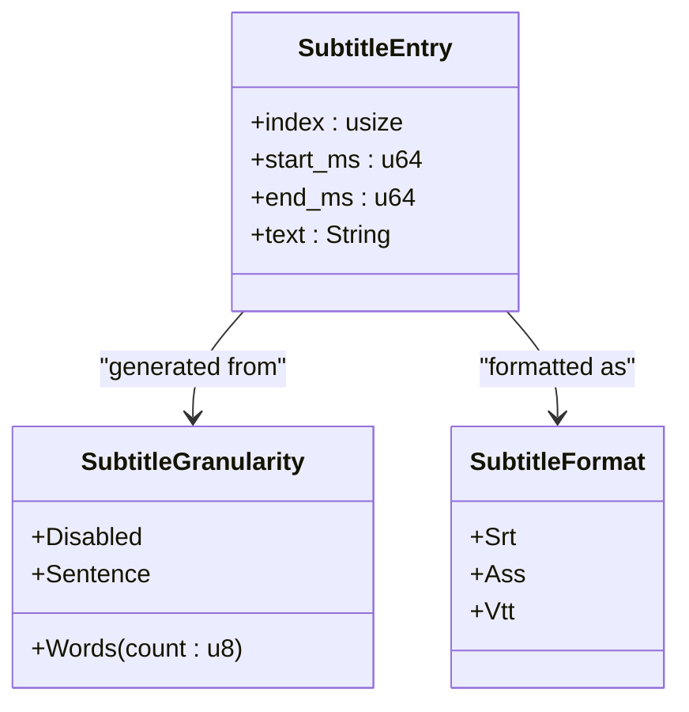
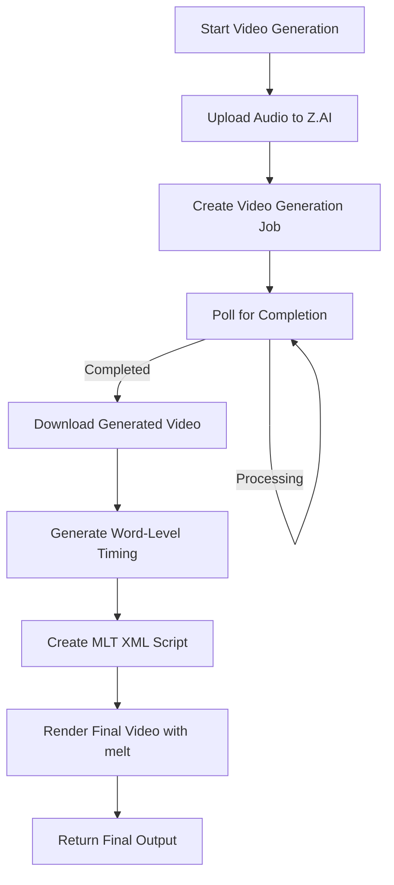
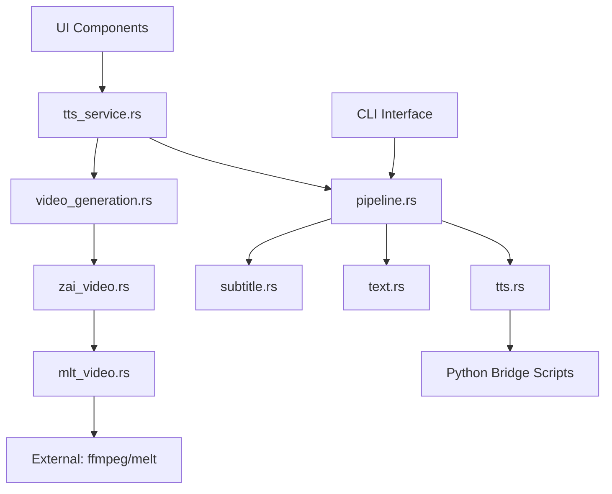

# Data Flow

<cite>
**Referenced Files in This Document**   
- [pipeline.rs](file://src/pipeline.rs)
- [tts.rs](file://src/tts.rs)
- [subtitle.rs](file://src/subtitle.rs)
- [video.rs](file://src/video.rs)
- [tts_service.rs](file://abogen-ui/crates/ui/services/tts_service.rs)
- [zai_video.rs](file://abogen-ui/crates/ui/services/zai_video.rs)
- [mlt_video.rs](file://abogen-ui/crates/ui/services/mlt_video.rs)
- [state.rs](file://abogen-ui/crates/ui/state.rs)
</cite>

## Table of Contents
1. [Introduction](#introduction)
2. [Project Structure](#project-structure)
3. [Core Components](#core-components)
4. [Architecture Overview](#architecture-overview)
5. [Detailed Component Analysis](#detailed-component-analysis)
6. [Dependency Analysis](#dependency-analysis)
7. [Performance Considerations](#performance-considerations)
8. [Troubleshooting Guide](#troubleshooting-guide)
9. [Conclusion](#conclusion)

## Introduction
This document provides comprehensive architectural documentation for the data flow in the VoxWeave platform. It describes the complete pipeline from text input through audio generation, subtitle creation, and video composition. The document details the data transformation stages including text cleaning and normalization, TTS audio generation with timing metadata, subtitle file generation in SRT/ASS/VTT formats, and video generation via Z.AI API integration. It explains how timing data flows from the TTS engine to subtitle generation and how this synchronizes with the final video composition using MLT. The data flow for both CLI and UI workflows is illustrated, highlighting how configuration parameters and progress updates are propagated through the system.

## Project Structure
The VoxWeave platform consists of a Rust-based core engine with a Dioxus-based UI layer. The project structure is organized into several key directories:
- `abogen-ui/`: Contains the Dioxus-based user interface with desktop, mobile, and web applications
- `python/`: Contains Python bridge scripts for TTS engines
- `samples/`: Contains sample input files
- `src/`: Contains the core Rust implementation for text processing, TTS, subtitles, and video generation
- `tests/`: Contains integration tests

The core functionality is split between the CLI and UI workflows, both of which share the same underlying processing pipeline implemented in the `src/` directory.

## Core Components
The VoxWeave platform's data flow consists of several interconnected components that process text input through to final video output. The pipeline begins with text input processing, followed by TTS audio generation, subtitle creation, and video composition. Each stage transforms the data and passes it to the next component, with timing information flowing from the audio generation stage to synchronize subtitles and video elements.

**Section sources**
- [pipeline.rs](file://src/pipeline.rs)
- [tts.rs](file://src/tts.rs)
- [subtitle.rs](file://src/subtitle.rs)
- [video.rs](file://src/video.rs)

## Architecture Overview
The VoxWeave platform implements a multi-stage processing pipeline that transforms text input into synchronized audio, subtitles, and video output. The architecture supports both CLI and UI workflows, with shared core components that handle the actual data processing.

**Diagram sources **
- [pipeline.rs](file://src/pipeline.rs)
- [tts.rs](file://src/tts.rs)
- [subtitle.rs](file://src/subtitle.rs)
- [video.rs](file://src/video.rs)

## Detailed Component Analysis

### Text Processing Pipeline
The text processing pipeline handles the initial transformation of raw text input into cleaned and normalized text suitable for TTS generation. This stage removes extraneous whitespace, normalizes line breaks based on user configuration, and prepares the text for speech synthesis.

**Diagram sources **
- [text.rs](file://src/text.rs)
- [pipeline.rs](file://src/pipeline.rs)

### TTS Audio Generation
The TTS audio generation component converts cleaned text into spoken audio using various voice engines. The system supports multiple TTS engines including Kokoro, Coqui, and espeak, with voice selection and speed configuration. The audio generation process also captures timing metadata that is used for subtitle synchronization.

**Diagram sources **
- [tts.rs](file://src/tts.rs)
- [pipeline.rs](file://src/pipeline.rs)

### Subtitle Generation
The subtitle generation component creates timed subtitle files in SRT, ASS, or VTT formats based on the processed text and audio timing. The system supports different granularity levels (sentence or word groups) and calculates timing based on average words per minute. The generated subtitles are synchronized with the audio output.

**Diagram sources **
- [subtitle.rs](file://src/subtitle.rs)
- [queue.rs](file://src/queue.rs)

### Video Generation and Composition
The video generation component orchestrates the creation of final video output using the Z.AI API for AI-generated visuals and MLT for final composition. The process involves uploading audio to Z.AI, generating AI video, downloading the result, and composing the final output with synchronized subtitles using MLT.

**Diagram sources **
- [video.rs](file://src/video.rs)
- [zai_video.rs](file://abogen-ui/crates/ui/services/zai_video.rs)
- [mlt_video.rs](file://abogen-ui/crates/ui/services/mlt_video.rs)

## Dependency Analysis
The VoxWeave platform components are organized with clear dependencies that enable both CLI and UI workflows to share the same core processing logic. The dependency graph shows how higher-level components depend on lower-level services while maintaining separation of concerns.

**Diagram sources **
- [Cargo.toml](file://Cargo.toml)
- [abogen-ui/Cargo.toml](file://abogen-ui/Cargo.toml)

## Performance Considerations
The VoxWeave platform handles potentially long-running operations through async processing and progress tracking. Video generation, being the most time-consuming operation, is handled asynchronously with periodic polling for status updates. The system uses tokio for async operations and implements progress callbacks to keep the UI responsive during processing. For large text inputs, the processing is broken into chunks to prevent memory issues and allow for incremental progress reporting.

**Section sources**
- [video.rs](file://src/video.rs)
- [zai_video.rs](file://abogen-ui/crates/ui/services/zai_video.rs)
- [tts_service.rs](file://abogen-ui/crates/ui/services/tts_service.rs)

## Troubleshooting Guide
The system includes comprehensive error handling and logging to assist with troubleshooting. Error conditions and cancellation requests propagate through the data flow via Result types and cancellation tokens. When errors occur during video generation, the system attempts to provide descriptive error messages from the Z.AI API. For subtitle generation issues, the system validates input text and handles edge cases like empty input. The UI displays detailed logs to help users understand processing status and identify issues.

**Section sources**
- [video.rs](file://src/video.rs)
- [zai_video.rs](file://abogen-ui/crates/ui/services/zai_video.rs)
- [tts_service.rs](file://abogen-ui/crates/ui/services/tts_service.rs)

## Conclusion
The VoxWeave platform implements a robust data flow pipeline that transforms text input into synchronized audio, subtitles, and video output. The architecture effectively separates concerns between text processing, audio generation, subtitle creation, and video composition while maintaining tight integration through shared timing data. The system supports both CLI and UI workflows with a shared core engine, and handles long-running operations through async processing and progress tracking. The use of external APIs like Z.AI for AI video generation and MLT for final composition enables powerful multimedia output while keeping the core application focused on coordination and data flow.