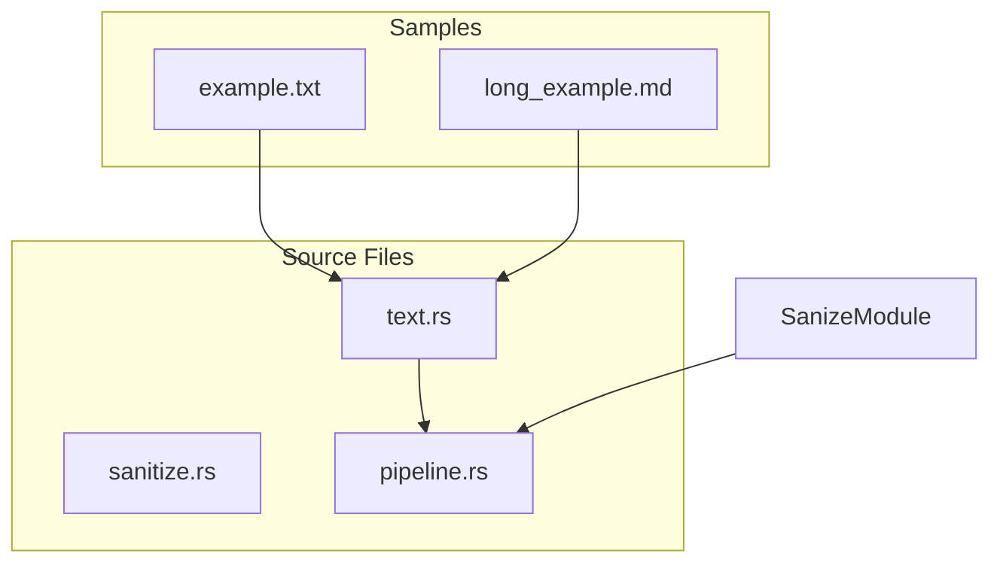
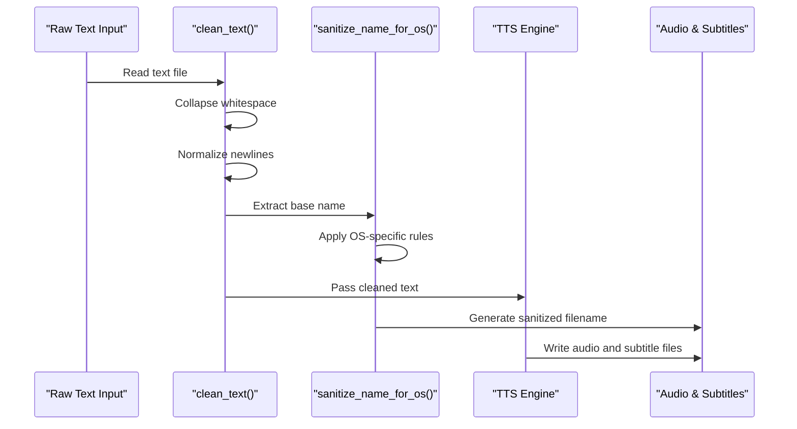
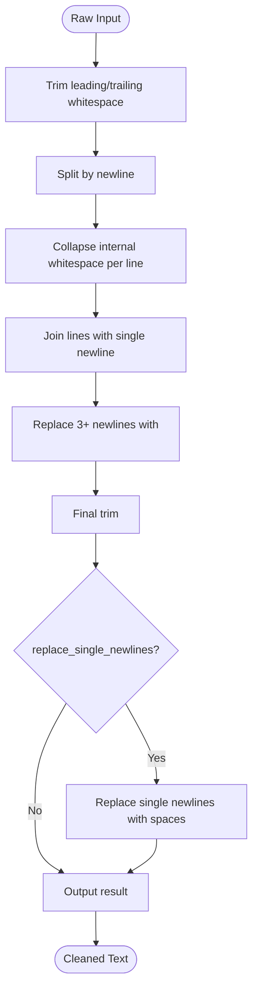
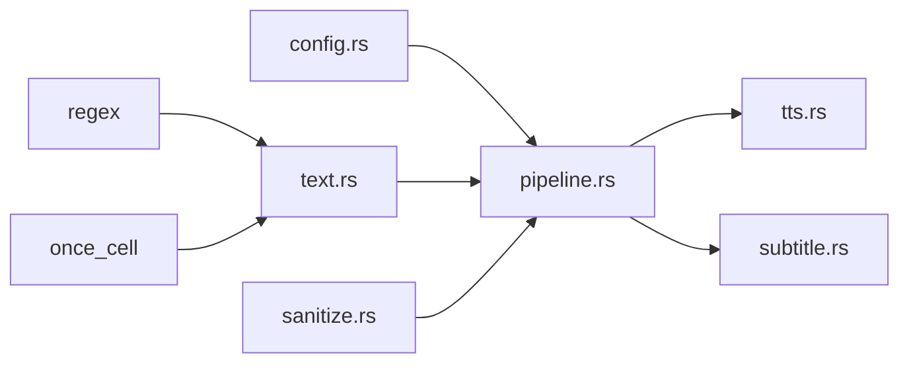

# Text Processing

<cite>
**Referenced Files in This Document**   
- [text.rs](file://src/text.rs)
- [sanitize.rs](file://src/sanitize.rs)
- [pipeline.rs](file://src/pipeline.rs)
- [config.rs](file://src/config.rs)
- [example.txt](file://samples/example.txt)
- [long_example.md](file://samples/long_example.md)
</cite>

## Table of Contents
1. [Introduction](#introduction)
2. [Project Structure](#project-structure)
3. [Core Components](#core-components)
4. [Architecture Overview](#architecture-overview)
5. [Detailed Component Analysis](#detailed-component-analysis)
6. [Dependency Analysis](#dependency-analysis)
7. [Performance Considerations](#performance-considerations)
8. [Troubleshooting Guide](#troubleshooting-guide)
9. [Conclusion](#conclusion)

## Introduction
This document provides architectural documentation for the text processing pipeline in the VoxWeave platform. The pipeline is responsible for transforming raw text input into a clean, normalized format suitable for Text-to-Speech (TTS) synthesis and subtitle generation. It handles whitespace collapsing, newline normalization, and OS-safe filename sanitization. The system ensures consistent text formatting across platforms and prepares content for downstream audio and video generation workflows.

## Project Structure
The text processing functionality is organized within the `src/` directory of the VoxWeave repository. Key modules include `text.rs` for text cleaning, `sanitize.rs` for filename sanitization, and `pipeline.rs` for orchestrating the end-to-end conversion process. Sample inputs are provided in the `samples/` directory for testing and demonstration purposes.



**Diagram sources**
- [text.rs](file://src/text.rs#L1-L70)
- [sanitize.rs](file://src/sanitize.rs#L1-L161)
- [pipeline.rs](file://src/pipeline.rs#L1-L139)

**Section sources**
- [text.rs](file://src/text.rs#L1-L70)
- [sanitize.rs](file://src/sanitize.rs#L1-L161)
- [pipeline.rs](file://src/pipeline.rs#L1-L139)
- [samples/example.txt](file://samples/example.txt#L1-L3)
- [samples/long_example.md](file://samples/long_example.md#L1-L19)

## Core Components
The core components of the text processing pipeline include the `clean_text` function for input normalization and the `sanitize_name_for_os` function for cross-platform filename compatibility. These functions are invoked during the conversion process to ensure consistent and safe handling of text and file paths across different operating systems.

**Section sources**
- [text.rs](file://src/text.rs#L7-L22)
- [sanitize.rs](file://src/sanitize.rs#L30-L32)

## Architecture Overview
The text processing pipeline follows a sequential transformation model where raw text is first cleaned and normalized, then used to generate audio and subtitles. The cleaned text is passed to TTS engines for synthesis, while the original filename is sanitized to ensure compatibility with the target operating system's filesystem constraints.



**Diagram sources**
- [text.rs](file://src/text.rs#L7-L22)
- [sanitize.rs](file://src/sanitize.rs#L30-L32)
- [pipeline.rs](file://src/pipeline.rs#L21-L55)

## Detailed Component Analysis

### Text Cleaning Process
The `clean_text` function processes raw input by collapsing internal whitespace, reducing multiple consecutive newlines to double newlines (preserving paragraph breaks), and optionally replacing single newlines with spaces based on configuration.



**Diagram sources**
- [text.rs](file://src/text.rs#L7-L22)

**Section sources**
- [text.rs](file://src/text.rs#L7-L22)

### Filename Sanitization
The `sanitize_name_for_os` function ensures filenames are compatible across Windows, macOS, and Linux by removing or replacing invalid characters, handling reserved names on Windows, and preventing hidden file creation on Unix-like systems.

```mermaid
flowchart TD
FileName[Original Filename] --> Trim["Trim whitespace"]
Trim --> EmptyCheck{"Empty?"}
EmptyCheck --> |Yes| Default["Use 'audiobook'"]
EmptyCheck --> |No| OS{"Current OS?"}
OS --> |Windows| WindowsSanitize["Replace < > : \" / \\ | ? * and control chars"]
OS --> |MacOS| MacSanitize["Replace : and control chars"]
OS --> |Linux/Other| LinuxSanitize["Replace / and control chars"]
WindowsSanitize --> ReservedCheck["Check for reserved names"]
ReservedCheck --> |Match| PrefixUnderscore["Prefix with _"]
ReservedCheck --> |No Match| Continue
MacSanitize --> FolderCheck["Is folder?"]
LinuxSanitize --> FolderCheck
FolderCheck --> |Yes| LeadingDot{"Starts with .?"}
LeadingDot --> |Yes| RemoveDot["Remove . and prefix with _"]
LeadingDot --> |No| Continue
FolderCheck --> |No| Continue
Continue --> LengthCheck{">255 chars?"}
LengthCheck --> |Yes| Truncate["Truncate to 255"]
LengthCheck --> |No| FinalOutput
Truncate --> FinalTrim["Trim trailing . and space"]
FinalTrim --> FinalOutput
FinalOutput --> End([Sanitized Name])
```

**Diagram sources**
- [sanitize.rs](file://src/sanitize.rs#L30-L32)

**Section sources**
- [sanitize.rs](file://src/sanitize.rs#L30-L32)

## Dependency Analysis
The text processing pipeline depends on several external crates including `regex` for pattern matching and `once_cell` for lazy static initialization. The core functionality is integrated into the main conversion pipeline through direct function calls from `pipeline.rs`, with configuration values flowing from `config.rs`.



**Diagram sources**
- [pipeline.rs](file://src/pipeline.rs#L29-L29)
- [text.rs](file://src/text.rs#L1-L70)
- [sanitize.rs](file://src/sanitize.rs#L1-L161)
- [config.rs](file://src/config.rs#L1-L117)

**Section sources**
- [pipeline.rs](file://src/pipeline.rs#L29-L29)
- [config.rs](file://src/config.rs#L10-L18)

## Performance Considerations
The text processing pipeline employs several optimizations to minimize performance overhead. Regular expressions are compiled once using `Lazy<Regex>` to avoid recompilation. The `replace_single_newlines_with_spaces` function pre-allocates string capacity based on input size to reduce reallocations. For large inputs, the processing time is dominated by regex operations and string allocations, but the current implementation avoids unnecessary intermediate allocations through careful use of iterators and string builders.

**Section sources**
- [text.rs](file://src/text.rs#L7-L22)
- [sanitize.rs](file://src/sanitize.rs#L30-L32)

## Troubleshooting Guide
Common issues in the text processing pipeline include unexpected whitespace behavior and filename compatibility problems. When `replace_single_newlines` is enabled, ensure that intentional line breaks (double newlines) are preserved in the source text. For filename issues, verify that the output directory supports the character set being used, especially on Windows where reserved names and special characters are strictly prohibited.

**Section sources**
- [text.rs](file://src/text.rs#L7-L22)
- [sanitize.rs](file://src/sanitize.rs#L30-L32)
- [pipeline.rs](file://src/pipeline.rs#L29-L29)

## Conclusion
The VoxWeave text processing pipeline provides a robust foundation for preparing textual content for audio and video synthesis. By normalizing whitespace and ensuring cross-platform filename compatibility, it enables reliable operation across diverse environments. The modular design allows for easy configuration and extension, while comprehensive testing ensures consistent behavior. Future enhancements could include support for additional text preprocessing options and improved performance for very large inputs.