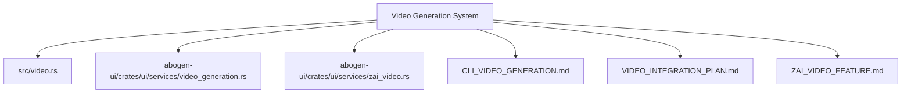
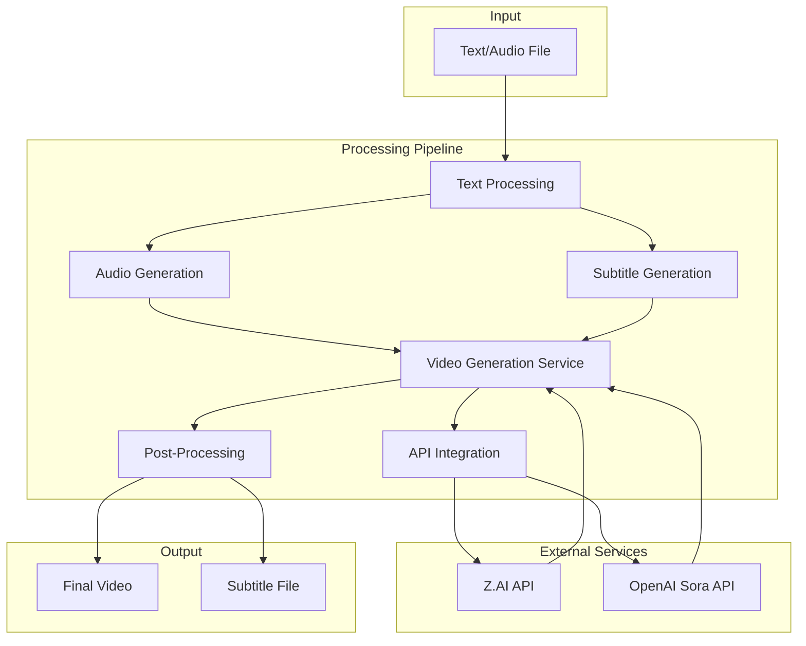
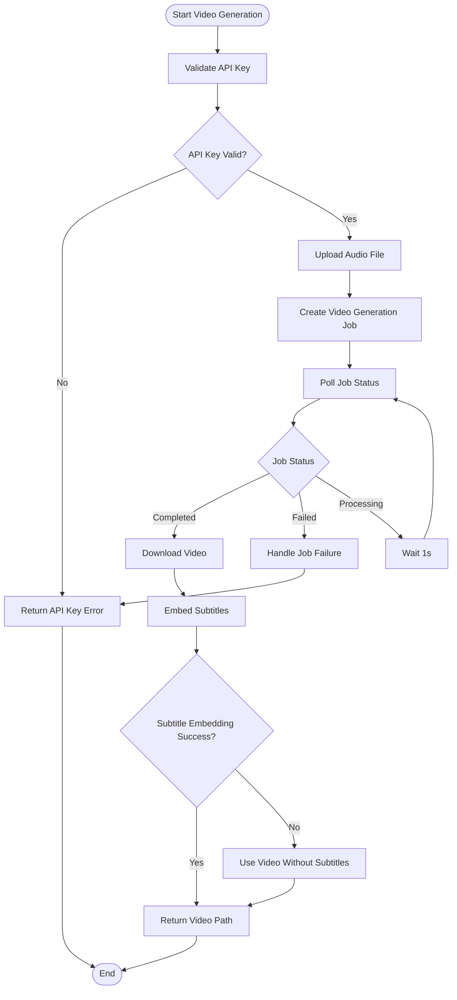
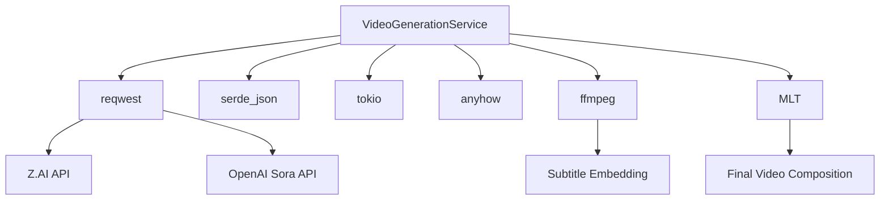

# AI Video Generation

<cite>
**Referenced Files in This Document**   
- [video.rs](file://src/video.rs)
- [video_generation.rs](file://abogen-ui/crates/ui/services/video_generation.rs)
- [zai_video.rs](file://abogen-ui/crates/ui/services/zai_video.rs)
- [CLI_VIDEO_GENERATION.md](file://CLI_VIDEO_GENERATION.md)
- [VIDEO_INTEGRATION_PLAN.md](file://abogen-ui/VIDEO_INTEGRATION_PLAN.md)
- [ZAI_VIDEO_FEATURE.md](file://abogen-ui/ZAI_VIDEO_FEATURE.md)
</cite>

## Table of Contents
1. [Introduction](#introduction)
2. [Project Structure](#project-structure)
3. [Core Components](#core-components)
4. [Architecture Overview](#architecture-overview)
5. [Detailed Component Analysis](#detailed-component-analysis)
6. [Dependency Analysis](#dependency-analysis)
7. [Performance Considerations](#performance-considerations)
8. [Troubleshooting Guide](#troubleshooting-guide)
9. [Conclusion](#conclusion)

## Introduction
This document provides comprehensive documentation for the AI-powered video generation system in VoxWeave, which integrates with Z.AI and OpenAI Sora APIs. The system enables users to generate videos from text or audio inputs with synchronized narration, subtitles, and AI-generated visuals. The implementation supports multiple video styles, resolutions, and formats, with fallback mechanisms for subtitle embedding and error handling. This documentation covers the VideoGenerationService implementation, workflow, configuration options, API integration, and operational requirements.

## Project Structure
The AI video generation functionality is distributed across multiple components in the VoxWeave repository. The core video generation logic resides in the `src/video.rs` file, while UI-specific services are located in the `abogen-ui/crates/ui/services/` directory. Configuration and workflow documentation are provided in markdown files that detail CLI usage and integration plans.



**Diagram sources**
- [video.rs](file://src/video.rs)
- [video_generation.rs](file://abogen-ui/crates/ui/services/video_generation.rs)
- [zai_video.rs](file://abogen-ui/crates/ui/services/zai_video.rs)

**Section sources**
- [video.rs](file://src/video.rs)
- [video_generation.rs](file://abogen-ui/crates/ui/services/video_generation.rs)
- [zai_video.rs](file://abogen-ui/crates/ui/services/zai_video.rs)
- [CLI_VIDEO_GENERATION.md](file://CLI_VIDEO_GENERATION.md)
- [VIDEO_INTEGRATION_PLAN.md](file://abogen-ui/VIDEO_INTEGRATION_PLAN.md)
- [ZAI_VIDEO_FEATURE.md](file://abogen-ui/ZAI_VIDEO_FEATURE.md)

## Core Components
The AI video generation system consists of several key components that work together to transform text input into synchronized video output. The core functionality is implemented in the VideoGenerationService, which handles API communication with Z.AI, job creation, status polling, and result processing. The system supports both direct API integration and UI-driven workflows, with configuration options for video style, resolution, format, and custom prompts.

**Section sources**
- [video.rs](file://src/video.rs#L1-L461)
- [video_generation.rs](file://abogen-ui/crates/ui/services/video_generation.rs#L1-L488)
- [zai_video.rs](file://abogen-ui/crates/ui/services/zai_video.rs#L1-L357)

## Architecture Overview
The AI video generation system follows a modular architecture that separates concerns between configuration, service implementation, and user interface. The system integrates with external APIs (Z.AI and potentially OpenAI Sora) to generate AI-powered visuals synchronized with text-to-speech audio and subtitles.



**Diagram sources**
- [video.rs](file://src/video.rs#L1-L461)
- [VIDEO_INTEGRATION_PLAN.md](file://abogen-ui/VIDEO_INTEGRATION_PLAN.md#L1-L304)
- [ZAI_VIDEO_FEATURE.md](file://abogen-ui/ZAI_VIDEO_FEATURE.md#L1-L168)

## Detailed Component Analysis

### Video Generation Service Analysis
The VideoGenerationService is the core component responsible for orchestrating the video generation process. It handles API key management, job creation, polling mechanisms, and result processing.

#### Service Implementation
```mermaid
classDiagram
class VideoConfig {
+VideoStyle style
+VideoResolution resolution
+VideoFormat format
+Option<String> prompt
+default() VideoConfig
}
class VideoGenerationService {
-String api_key
-String base_url
+new(api_key : String) VideoGenerationService
+from_env() Result<Self>
+generate_video(audio_path : &Path, subtitle_path : Option<&Path>, config : &VideoConfig, progress_callback : Option<F>, log_callback : Option<G>) Result<PathBuf>
-upload_file(file_path : &Path) Result<String>
-create_video_job(audio_url : &str, config : &VideoConfig) Result<String>
-poll_video_status(job_id : &str, progress_callback : &mut Option<F>, log_callback : &mut Option<G>) Result<String>
-download_video(video_url : &str, audio_path : &Path, config : &VideoConfig) Result<PathBuf>
-embed_subtitles(video_path : &Path, subtitle_path : &Path, config : &VideoConfig) Result<PathBuf>
}
VideoGenerationService --> VideoConfig : "uses"
```

**Diagram sources**
- [video.rs](file://src/video.rs#L1-L461)
- [video_generation.rs](file://abogen-ui/crates/ui/services/video_generation.rs#L1-L488)

#### Video Generation Workflow
```mermaid
sequenceDiagram
participant User as "User"
participant Service as "VideoGenerationService"
participant API as "Z.AI API"
participant Storage as "Local Storage"
User->>Service : generate_video()
Service->>Service : Upload audio file
Service->>API : POST /upload
API-->>Service : File URL
Service->>API : POST /video/generate
API-->>Service : Job ID
loop Poll every 1s
Service->>API : GET /video/status/{job_id}
API-->>Service : Status & Progress
alt Completed
Service->>Service : Get video URL
break
else Failed
Service->>User : Error
break
end
end
Service->>API : Download video
API-->>Service : Video data
Service->>Storage : Save video file
alt Subtitles provided
Service->>Service : Embed subtitles with ffmpeg
alt Success
Service->>Storage : Save subtitled video
else Failure
Service->>User : Warning, no subtitles
end
end
Service-->>User : Video path
```

**Diagram sources**
- [video.rs](file://src/video.rs#L1-L461)
- [CLI_VIDEO_GENERATION.md](file://CLI_VIDEO_GENERATION.md#L1-L323)

### Configuration and Style Options
The system provides extensive configuration options for customizing video output, including style, resolution, format, and custom prompts.

#### Video Configuration Options
| Configuration Option | Available Values | Default Value | Description |
|----------------------|------------------|---------------|-------------|
| **Video Style** | realistic, anime, 3d, cinematic, biotech, cyberpunk, educational, wan2_5 | cyberpunk | Visual aesthetic for generated video |
| **Resolution** | 720p, 1080p, 4k | 1080p | Output video resolution |
| **Format** | mp4, mov, webm | mp4 | Container format for output video |
| **Custom Prompt** | String | None | Additional instructions for video generation |

**Section sources**
- [video.rs](file://src/video.rs#L1-L461)
- [CLI_VIDEO_GENERATION.md](file://CLI_VIDEO_GENERATION.md#L1-L323)
- [ZAI_VIDEO_FEATURE.md](file://abogen-ui/ZAI_VIDEO_FEATURE.md#L1-L168)

### API Integration and Fallback Mechanisms
The system implements robust API integration with fallback mechanisms for handling failures and edge cases.

#### API Integration Flow


**Diagram sources**
- [video.rs](file://src/video.rs#L1-L461)
- [video_generation.rs](file://abogen-ui/crates/ui/services/video_generation.rs#L1-L488)

## Dependency Analysis
The AI video generation system depends on several external services and libraries to function properly. These dependencies enable API communication, file handling, and video processing.



**Diagram sources**
- [video.rs](file://src/video.rs#L1-L461)
- [go.mod](file://Cargo.toml#L1-L50)

**Section sources**
- [video.rs](file://src/video.rs#L1-L461)
- [Cargo.toml](file://Cargo.toml#L1-L50)

## Performance Considerations
The video generation process involves several performance-critical operations, including network communication, file uploads/downloads, and video processing. The system implements polling with exponential backoff and retry mechanisms to handle API rate limits and transient failures.

**Section sources**
- [video.rs](file://src/video.rs#L1-L461)
- [video_generation.rs](file://abogen-ui/crates/ui/services/video_generation.rs#L1-L488)
- [CLI_VIDEO_GENERATION.md](file://CLI_VIDEO_GENERATION.md#L1-L323)

## Troubleshooting Guide
This section documents common issues and their solutions for the AI video generation system.

### Common Issues and Solutions
| Issue | Cause | Solution |
|------|------|----------|
| **ZAI_API_KEY not set** | Environment variable missing | Set ZAI_API_KEY or OPENAI_API_KEY environment variable |
| **Video generation timeout** | Job exceeds 5-minute limit | Reduce input length or check API status |
| **Subtitle embedding failed** | ffmpeg not installed | Install ffmpeg or accept separate subtitle file |
| **Voice not found** | Invalid voice identifier | Use `voxweave list-voices` to find valid voices |
| **API rate limit exceeded** | Too many requests | Implement delays between batch requests |

### Error Handling Strategies
The system implements comprehensive error handling at multiple levels:
- API key validation with fallback between Z.AI and OpenAI
- Retry logic with exponential backoff for API calls
- Fallback mechanisms for subtitle embedding
- Graceful degradation when external services fail

**Section sources**
- [video.rs](file://src/video.rs#L1-L461)
- [video_generation.rs](file://abogen-ui/crates/ui/services/video_generation.rs#L1-L488)
- [CLI_VIDEO_GENERATION.md](file://CLI_VIDEO_GENERATION.md#L1-L323)

## Conclusion
The AI video generation system in VoxWeave provides a comprehensive solution for creating synchronized videos from text input using Z.AI and OpenAI Sora APIs. The system features a modular architecture with clear separation of concerns, robust error handling, and extensive configuration options. The implementation supports both CLI and UI workflows, making it accessible for automation and interactive use cases. With its integration of text-to-speech, subtitle generation, and AI-powered visuals, the system transforms VoxWeave into a complete text-to-video content creation platform.