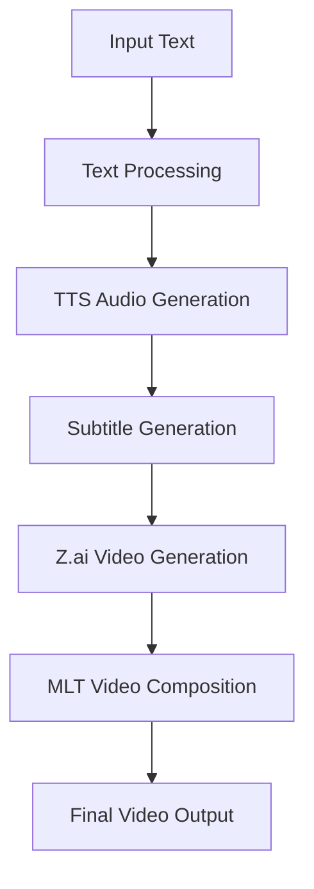
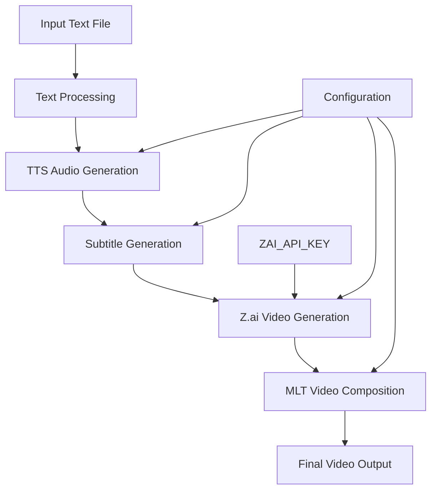
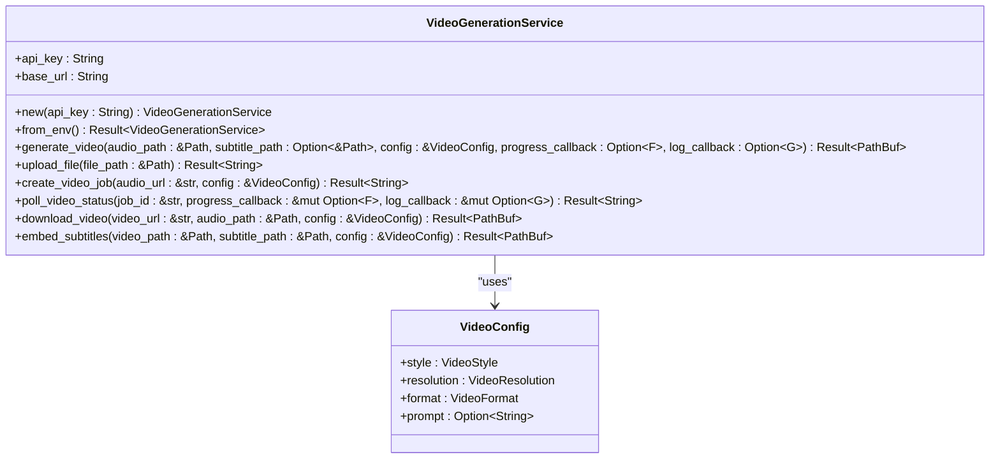
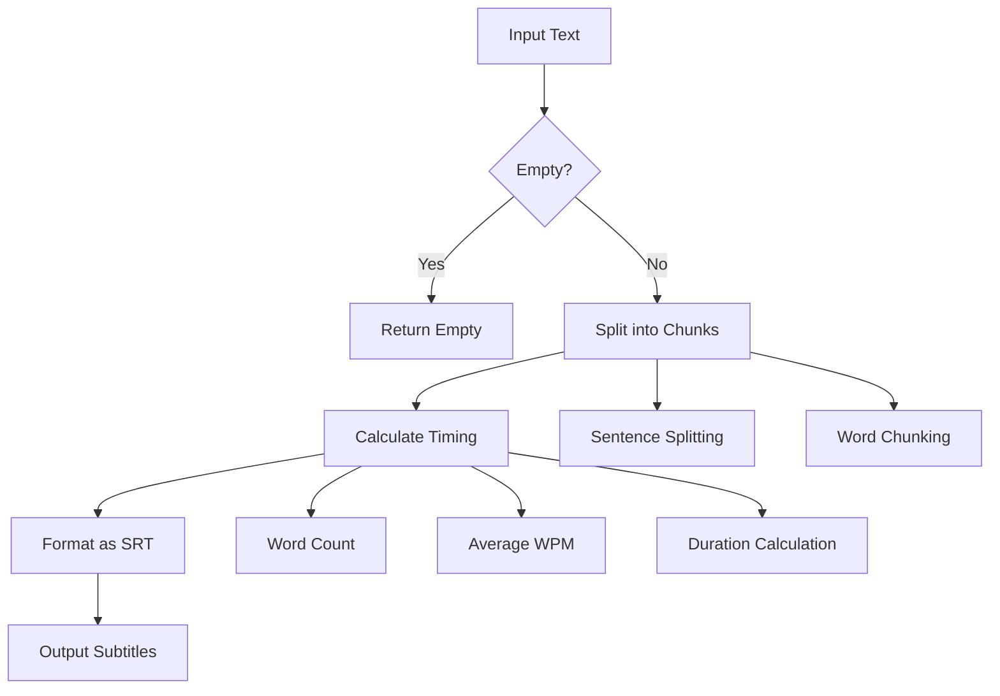
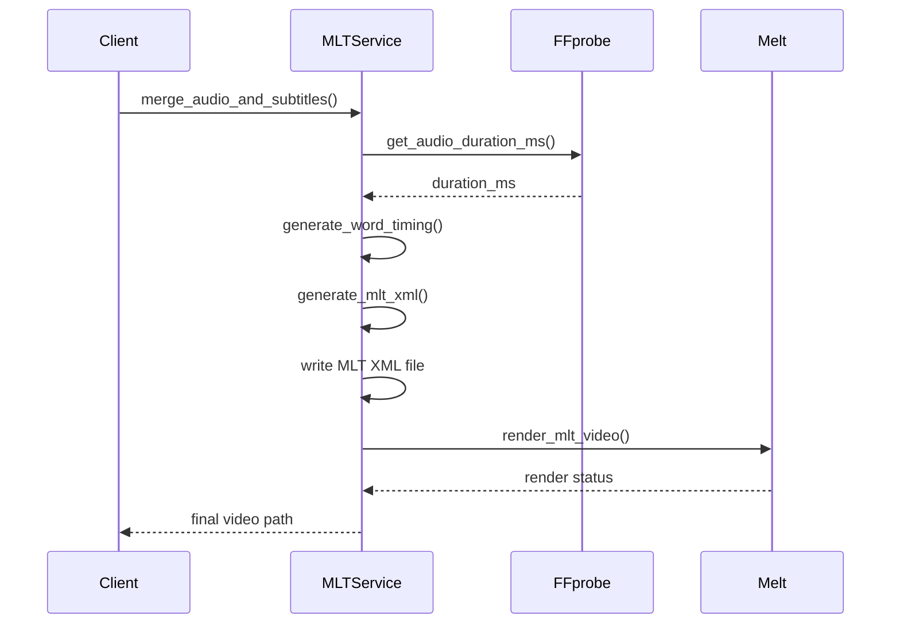
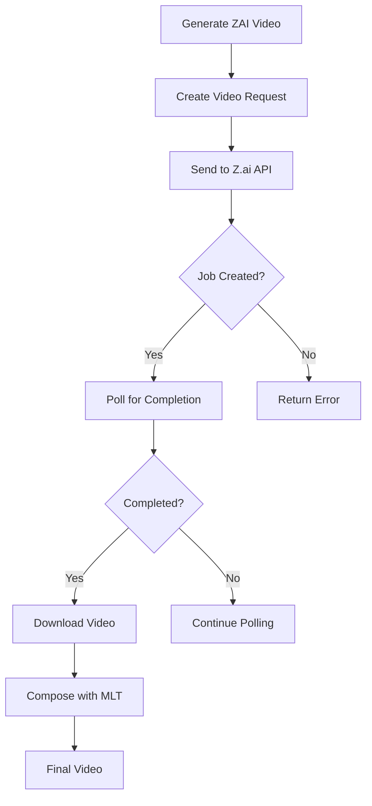
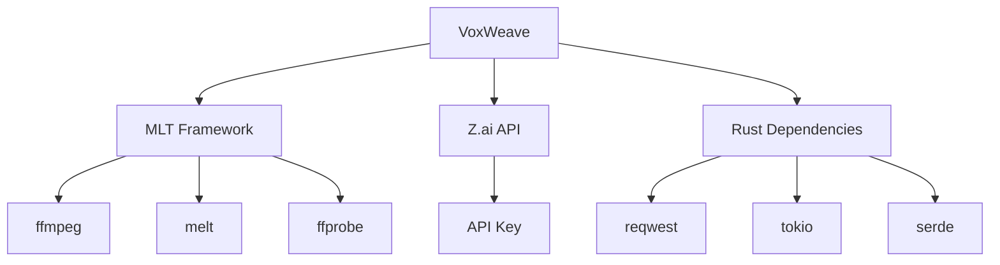

# Local Video Composition

<cite>
**Referenced Files in This Document**   
- [src/video.rs](file://src/video.rs)
- [src/subtitle.rs](file://src/subtitle.rs)
- [src/tts.rs](file://src/tts.rs)
- [abogen-ui/crates/ui/services/mlt_video.rs](file://abogen-ui/crates/ui/services/mlt_video.rs)
- [abogen-ui/crates/ui/services/zai_video.rs](file://abogen-ui/crates/ui/services/zai_video.rs)
- [generate_video.sh](file://generate_video.sh)
- [CLI_VIDEO_GENERATION.md](file://CLI_VIDEO_GENERATION.md)
- [VIDEO_CLI_QUICKREF.md](file://VIDEO_CLI_QUICKREF.md)
- [abogen-ui/VIDEO_INTEGRATION_PLAN.md](file://abogen-ui/VIDEO_INTEGRATION_PLAN.md)
- [abogen-ui/ZAI_VIDEO_FEATURE.md](file://abogen-ui/ZAI_VIDEO_FEATURE.md)
</cite>

## Table of Contents
1. [Introduction](#introduction)
2. [Project Structure](#project-structure)
3. [Core Components](#core-components)
4. [Architecture Overview](#architecture-overview)
5. [Detailed Component Analysis](#detailed-component-analysis)
6. [Dependency Analysis](#dependency-analysis)
7. [Performance Considerations](#performance-considerations)
8. [Troubleshooting Guide](#troubleshooting-guide)
9. [Conclusion](#conclusion)

## Introduction
This document provides comprehensive documentation for the local video composition system in VoxWeave, which leverages the Media Lovin' Toolkit (MLT) to create narrated videos with synchronized subtitles. The system integrates text-to-speech (TTS) audio generation with AI-generated visuals from Z.ai, combining them into a final video output with word-by-word highlighted subtitles. The workflow involves detecting audio duration using ffprobe, calculating word-level timing based on text and audio length, generating MLT XML scripts for multi-track composition, and rendering the final video using melt. The documentation covers the structure of the MLT XML format, text rendering with Pango markup for real-time word highlighting in cyan, external dependencies (ffmpeg, melt, ffprobe), error handling for missing tools, and configuration options for video dimensions, format-specific codecs, and rendering performance.

## Project Structure
The VoxWeave project is structured to support both CLI and GUI applications with a focus on text-to-speech and video generation capabilities. The core functionality resides in the `src` directory, with additional UI components in the `abogen-ui` directory. The video composition system is implemented across multiple files, with key components in `src/video.rs` for Z.ai video generation, `src/subtitle.rs` for subtitle generation, and `abogen-ui/crates/ui/services/mlt_video.rs` for MLT-based video composition. The system supports various video styles (realistic, anime, cyberpunk, etc.), resolutions (720p, 1080p, 4K), and formats (mp4, mov, webm). Configuration is managed through environment variables and feature flags, with the `video-generation` feature enabling video generation capabilities.

**Diagram sources**
- [src/video.rs](file://src/video.rs#L1-L462)
- [src/subtitle.rs](file://src/subtitle.rs#L1-L157)
- [abogen-ui/crates/ui/services/mlt_video.rs](file://abogen-ui/crates/ui/services/mlt_video.rs#L1-L350)

**Section sources**
- [README.md](file://README.md#L0-L132)
- [CLI_VIDEO_GENERATION.md](file://CLI_VIDEO_GENERATION.md#L0-L323)
- [VIDEO_CLI_QUICKREF.md](file://VIDEO_CLI_QUICKREF.md#L0-L171)

## Core Components
The local video composition system consists of several core components that work together to transform text input into a narrated video with synchronized subtitles. The system begins with text processing and TTS audio generation, followed by subtitle generation with timing information. The Z.ai video generation service creates AI-generated visuals synchronized with the audio, while the MLT video composition service combines the video, audio, and subtitles into a final output. The system supports word-by-word subtitle highlighting using Pango markup, with the current word displayed in cyan. Configuration options allow users to specify video style, resolution, format, and other parameters. The implementation is feature-gated, with the `video-generation` feature enabling video generation capabilities.

**Section sources**
- [src/video.rs](file://src/video.rs#L1-L462)
- [src/subtitle.rs](file://src/subtitle.rs#L1-L157)
- [abogen-ui/crates/ui/services/mlt_video.rs](file://abogen-ui/crates/ui/services/mlt_video.rs#L1-L350)
- [abogen-ui/crates/ui/services/zai_video.rs](file://abogen-ui/crates/ui/services/zai_video.rs#L1-L357)

## Architecture Overview
The video composition system follows a multi-stage pipeline that transforms text input into a final narrated video. The process begins with text processing and TTS audio generation, creating a WAV audio file from the input text. Subtitle generation follows, creating SRT files with timing information based on word count and average words per minute. The Z.ai video generation service then creates AI-generated visuals synchronized with the audio, using the Z.ai API to generate video from the audio and text. Finally, the MLT video composition service combines the video, audio, and subtitles into a final output using MLT XML scripts. The system supports both CLI and GUI interfaces, with the same core functionality available through both interfaces.

**Diagram sources**
- [src/video.rs](file://src/video.rs#L1-L462)
- [src/subtitle.rs](file://src/subtitle.rs#L1-L157)
- [abogen-ui/crates/ui/services/mlt_video.rs](file://abogen-ui/crates/ui/services/mlt_video.rs#L1-L350)
- [abogen-ui/crates/ui/services/zai_video.rs](file://abogen-ui/crates/ui/services/zai_video.rs#L1-L357)

## Detailed Component Analysis

### Video Generation Service
The video generation service in `src/video.rs` provides functionality for generating videos using the Z.ai API. It handles uploading audio files, creating video generation jobs, polling for completion, downloading generated videos, and embedding subtitles using ffmpeg. The service supports various video styles, resolutions, and formats, with configuration options for custom prompts. Error handling is implemented for API failures, timeouts, and missing dependencies. The service uses reqwest for HTTP requests and tokio for asynchronous operations, with progress callbacks for real-time updates.

**Diagram sources**
- [src/video.rs](file://src/video.rs#L1-L462)

**Section sources**
- [src/video.rs](file://src/video.rs#L1-L462)
- [CLI_VIDEO_GENERATION.md](file://CLI_VIDEO_GENERATION.md#L0-L323)
- [VIDEO_CLI_QUICKREF.md](file://VIDEO_CLI_QUICKREF.md#L0-L171)

### Subtitle Generation
The subtitle generation component in `src/subtitle.rs` creates timed subtitles from text input. It supports different granularity levels (sentence, word chunks) and calculates timing based on word count and average words per minute. The component splits text into sentences or word chunks, calculates duration for each chunk, and formats the output as SRT. The implementation uses regex for sentence splitting and handles edge cases like empty input. The timing calculation ensures minimum duration per word and synchronizes subtitles with audio playback.

**Diagram sources**
- [src/subtitle.rs](file://src/subtitle.rs#L1-L157)

**Section sources**
- [src/subtitle.rs](file://src/subtitle.rs#L1-L157)
- [abogen-ui/crates/ui/services/mlt_video.rs](file://abogen-ui/crates/ui/services/mlt_video.rs#L1-L350)

### MLT Video Composition
The MLT video composition service in `abogen-ui/crates/ui/services/mlt_video.rs` handles merging audio with video and generating word-by-word highlighted subtitles. It uses ffprobe to detect audio duration, calculates word-level timing, generates MLT XML scripts for multi-track composition, and renders the final video using melt. The service supports Pango markup for text rendering, with the current word highlighted in cyan. The MLT XML format includes producers for video and audio, a playlist for subtitles, and a tractor for multi-track composition. Configuration options allow customization of video dimensions, format-specific codecs, and rendering performance.

**Diagram sources**
- [abogen-ui/crates/ui/services/mlt_video.rs](file://abogen-ui/crates/ui/services/mlt_video.rs#L1-L350)

**Section sources**
- [abogen-ui/crates/ui/services/mlt_video.rs](file://abogen-ui/crates/ui/services/mlt_video.rs#L1-L350)
- [abogen-ui/ZAI_VIDEO_FEATURE.md](file://abogen-ui/ZAI_VIDEO_FEATURE.md#L0-L168)

### Z.ai Video Integration
The Z.ai video integration in `abogen-ui/crates/ui/services/zai_video.rs` provides a service for generating videos using the Z.ai API. It handles creating video generation jobs, polling for completion, downloading generated videos, and composing the final output with audio and subtitles using MLT. The service supports various video styles (biotech, cyberpunk, educational, etc.) with custom prompts for enhanced visual generation. The integration follows a multi-step process: creating a video generation job, polling for completion, downloading the video, and composing the final output with MLT. Error handling is implemented for API failures, timeouts, and missing dependencies.

**Diagram sources**
- [abogen-ui/crates/ui/services/zai_video.rs](file://abogen-ui/crates/ui/services/zai_video.rs#L1-L357)

**Section sources**
- [abogen-ui/crates/ui/services/zai_video.rs](file://abogen-ui/crates/ui/services/zai_video.rs#L1-L357)
- [abogen-ui/VIDEO_INTEGRATION_PLAN.md](file://abogen-ui/VIDEO_INTEGRATION_PLAN.md#L0-L304)
- [abogen-ui/ZAI_VIDEO_FEATURE.md](file://abogen-ui/ZAI_VIDEO_FEATURE.md#L0-L168)

## Dependency Analysis
The video composition system relies on several external dependencies for its functionality. The core dependencies include ffmpeg, melt, and ffprobe from the MLT framework for video processing and composition. The system also depends on the Z.ai API for AI-generated visuals, requiring an API key for authentication. Additional dependencies include reqwest for HTTP requests, tokio for asynchronous operations, and serde for JSON serialization. The implementation is feature-gated, with the `video-generation` feature enabling video generation capabilities. Error handling is implemented for missing tools, with fallback behavior when dependencies are not available.

**Diagram sources**
- [src/video.rs](file://src/video.rs#L1-L462)
- [abogen-ui/crates/ui/services/mlt_video.rs](file://abogen-ui/crates/ui/services/mlt_video.rs#L1-L350)
- [abogen-ui/crates/ui/services/zai_video.rs](file://abogen-ui/crates/ui/services/zai_video.rs#L1-L357)

**Section sources**
- [README.md](file://README.md#L0-L132)
- [CLI_VIDEO_GENERATION.md](file://CLI_VIDEO_GENERATION.md#L0-L323)
- [VIDEO_CLI_QUICKREF.md](file://VIDEO_CLI_QUICKREF.md#L0-L171)

## Performance Considerations
The video composition system has several performance considerations that affect processing time and resource usage. Video generation time depends on content length, API server load, selected resolution, and network speed, with 720p being the fastest and 4K the slowest. The system implements progress callbacks for real-time updates during long-running operations like video generation and rendering. Configuration options allow users to balance quality and performance by selecting appropriate resolution and format. The implementation uses asynchronous operations for API requests and file operations to improve responsiveness. For batch processing, users are advised to add delays between requests to avoid rate limits.

## Troubleshooting Guide
Common issues with the video composition system include missing API keys, video generation timeouts, and missing dependencies. The system provides error messages and logging to help diagnose issues. For missing ZAI_API_KEY, users must set the environment variable before running the application. For video generation timeouts, users should try shorter text or lower resolution. For missing ffmpeg, users should install ffmpeg using their package manager. The system provides fallback behavior when dependencies are not available, such as using external subtitle files instead of embedded subtitles. Logging is implemented throughout the system to provide visibility into the processing pipeline.

**Section sources**
- [CLI_VIDEO_GENERATION.md](file://CLI_VIDEO_GENERATION.md#L0-L323)
- [VIDEO_CLI_QUICKREF.md](file://VIDEO_CLI_QUICKREF.md#L0-L171)
- [abogen-ui/VIDEO_INTEGRATION_PLAN.md](file://abogen-ui/VIDEO_INTEGRATION_PLAN.md#L0-L304)

## Conclusion
The local video composition system in VoxWeave provides a comprehensive solution for creating narrated videos with synchronized subtitles from text input. By leveraging the MLT framework and Z.ai API, the system combines TTS audio generation with AI-generated visuals and word-by-word highlighted subtitles. The implementation is modular and feature-gated, allowing users to enable video generation capabilities as needed. The system supports various video styles, resolutions, and formats, with configuration options for customization. Error handling and logging provide robustness and visibility into the processing pipeline. The architecture supports both CLI and GUI interfaces, making it accessible to users with different preferences and use cases.