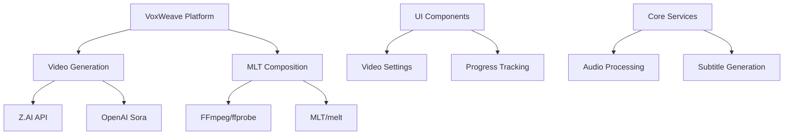
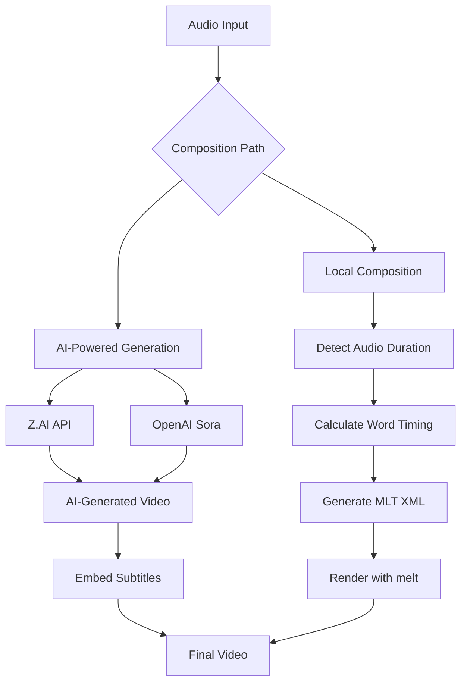
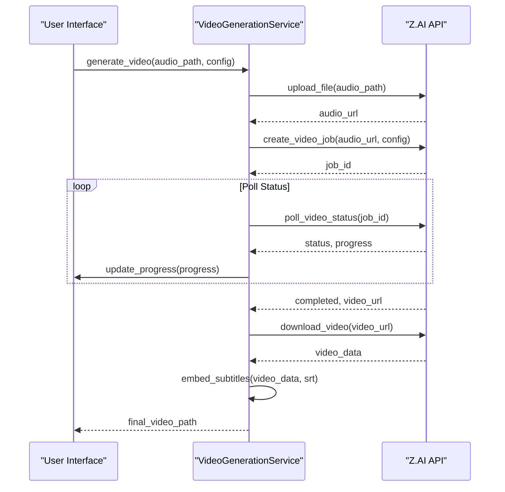
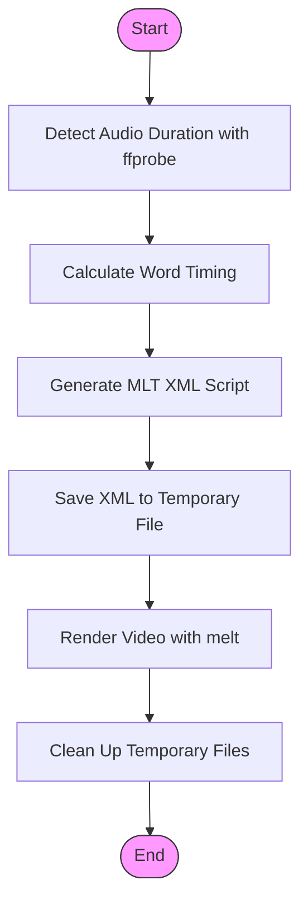
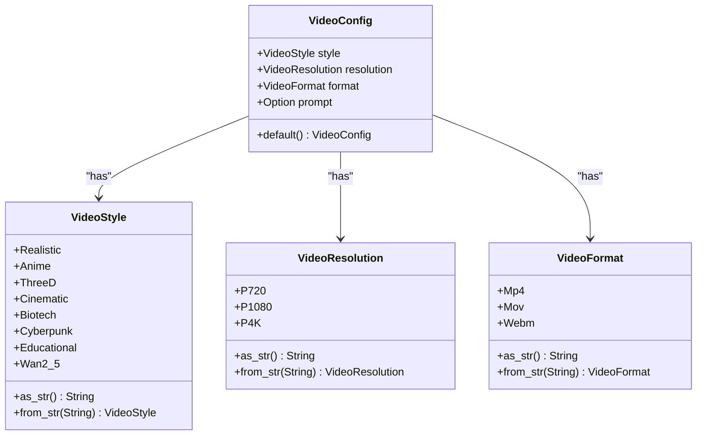
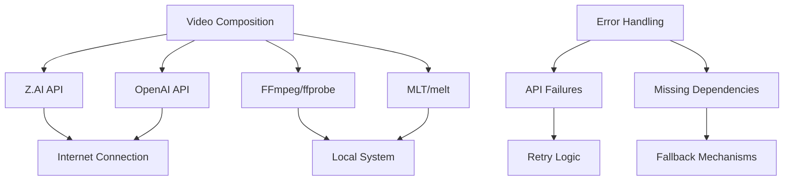

# Video Composition

<cite>
**Referenced Files in This Document**   
- [src/video.rs](file://src/video.rs)
- [abogen-ui/crates/ui/services/video_generation.rs](file://abogen-ui/crates/ui/services/video_generation.rs)
- [abogen-ui/crates/ui/services/mlt_video.rs](file://abogen-ui/crates/ui/services/mlt_video.rs)
- [abogen-ui/crates/ui/state.rs](file://abogen-ui/crates/ui/state.rs)
- [abogen-ui/VIDEO_INTEGRATION_PLAN.md](file://abogen-ui/VIDEO_INTEGRATION_PLAN.md)
</cite>

## Table of Contents
1. [Introduction](#introduction)
2. [Project Structure](#project-structure)
3. [Core Components](#core-components)
4. [Architecture Overview](#architecture-overview)
5. [Detailed Component Analysis](#detailed-component-analysis)
6. [Dependency Analysis](#dependency-analysis)
7. [Performance Considerations](#performance-considerations)
8. [Troubleshooting Guide](#troubleshooting-guide)
9. [Conclusion](#conclusion)

## Introduction
The VoxWeave platform implements a dual-path video composition system that combines AI-powered visual generation with local audio-subtitle synchronization. This architecture enables users to create videos through two distinct approaches: leveraging cloud-based AI models (Z.AI/OpenAI Sora) for complete video generation from audio, or using local MLT (Media Lovin' Toolkit) processing to compose audio with dynamically generated word-by-word highlighted subtitles over a background. The system integrates seamlessly with the platform's TTS (Text-to-Speech) pipeline, allowing for end-to-end content creation from text input to final video output.

## Project Structure
The video composition functionality is distributed across multiple components in the VoxWeave repository. The core video generation logic resides in the `src/video.rs` module, while UI-specific implementations are located in the `abogen-ui/crates/ui/services/` directory. The system leverages both Rust and WebAssembly technologies to provide cross-platform capabilities, with separate implementations for desktop, mobile, and web environments. Configuration options for video style, resolution, and format are managed through the state system in `abogen-ui/crates/ui/state.rs`.

**Diagram sources**
- [src/video.rs](file://src/video.rs)
- [abogen-ui/crates/ui/services/video_generation.rs](file://abogen-ui/crates/ui/services/video_generation.rs)
- [abogen-ui/crates/ui/services/mlt_video.rs](file://abogen-ui/crates/ui/services/mlt_video.rs)

**Section sources**
- [src/video.rs](file://src/video.rs)
- [abogen-ui/crates/ui/services/video_generation.rs](file://abogen-ui/crates/ui/services/video_generation.rs)
- [abogen-ui/crates/ui/services/mlt_video.rs](file://abogen-ui/crates/ui/services/mlt_video.rs)

## Core Components
The video composition system consists of three primary components: the VideoGenerationService for AI-powered video creation, the MLT-based composition system for local audio-subtitle synchronization, and the configuration system that manages style, resolution, and format options. These components work together to provide a flexible video creation pipeline that can adapt to different user requirements and system capabilities.

**Section sources**
- [src/video.rs](file://src/video.rs#L1-L50)
- [abogen-ui/crates/ui/services/video_generation.rs](file://abogen-ui/crates/ui/services/video_generation.rs#L1-L50)
- [abogen-ui/crates/ui/services/mlt_video.rs](file://abogen-ui/crates/ui/services/mlt_video.rs#L1-L50)

## Architecture Overview
The video composition architecture follows a dual-path approach, allowing users to choose between AI-generated visuals or locally composed videos with dynamic subtitles. The system begins with audio input, which can be either uploaded directly or generated through the platform's TTS service. From this audio foundation, the system can pursue one of two composition paths: AI-powered generation through Z.AI or OpenAI Sora APIs, or local composition using MLT for precise audio-subtitle synchronization.

**Diagram sources**
- [src/video.rs](file://src/video.rs)
- [abogen-ui/crates/ui/services/video_generation.rs](file://abogen-ui/crates/ui/services/video_generation.rs)
- [abogen-ui/crates/ui/services/mlt_video.rs](file://abogen-ui/crates/ui/services/mlt_video.rs)

## Detailed Component Analysis

### Video Generation Service Analysis
The VideoGenerationService orchestrates the AI-powered video creation process through a well-defined workflow. The service begins by uploading the audio file to the Z.AI storage system, then creates a video generation job with the specified style, resolution, and optional prompt. The system polls the API for completion status, providing progress updates to the user interface, and finally downloads the generated video. If subtitles are provided, the service attempts to embed them using ffmpeg, falling back to external subtitle files if ffmpeg is unavailable.

**Diagram sources**
- [src/video.rs](file://src/video.rs#L66-L101)
- [abogen-ui/crates/ui/services/video_generation.rs](file://abogen-ui/crates/ui/services/video_generation.rs#L150-L210)

### MLT-Based Composition Analysis
The MLT-based composition system provides a local alternative for video creation, focusing on precise audio-subtitle synchronization with word-by-word highlighting. This process begins with audio duration detection using ffprobe, followed by word timing calculation based on the audio length and text content. The system then generates an MLT XML script that defines the video composition, including the audio track and a series of subtitle producers that highlight each word as it is spoken. Finally, the melt renderer processes this XML script to produce the final video output.

**Diagram sources**
- [abogen-ui/crates/ui/services/mlt_video.rs](file://abogen-ui/crates/ui/services/mlt_video.rs#L150-L200)

### Configuration System Analysis
The configuration system manages video composition parameters through a structured approach that includes style, resolution, and format options. The VideoConfig struct encapsulates these settings, with default values for cyberpunk style, 1080p resolution, and MP4 format. Users can override these defaults with custom settings, including an optional prompt for AI-generated videos. The system supports multiple video styles (realistic, anime, 3D, cinematic, biotech, cyberpunk, educational) and resolutions (720p, 1080p, 4K), providing flexibility for different use cases and quality requirements.

**Diagram sources**
- [src/video.rs](file://src/video.rs#L10-L40)
- [abogen-ui/crates/ui/state.rs](file://abogen-ui/crates/ui/state.rs#L126-L185)

## Dependency Analysis
The video composition system relies on both external APIs and local command-line tools to function effectively. For AI-powered generation, the system depends on Z.AI or OpenAI Sora APIs, with fallback mechanisms between them based on environment variable configuration. For local composition, the system requires FFmpeg (specifically ffprobe for audio duration detection) and MLT (specifically the melt renderer for video composition). The implementation includes graceful degradation when these tools are unavailable, such as copying subtitle files externally when ffmpeg fails to embed them directly into the video.

**Diagram sources**
- [src/video.rs](file://src/video.rs)
- [abogen-ui/crates/ui/services/video_generation.rs](file://abogen-ui/crates/ui/services/video_generation.rs)
- [abogen-ui/crates/ui/services/mlt_video.rs](file://abogen-ui/crates/ui/services/mlt_video.rs)

## Performance Considerations
The video composition system implements several performance optimizations to ensure responsive user experience. For API calls, the system uses exponential backoff retry logic to handle transient failures without overwhelming the servers. Progress updates are streamed to the user interface during long-running operations like video generation and rendering, providing real-time feedback. The MLT XML generation is optimized to create efficient scripts that minimize rendering time, while the AI-powered generation offloads computationally intensive tasks to cloud infrastructure. The system also implements timeout mechanisms (5 minutes for Z.AI polling) to prevent indefinite waiting for external services.

**Section sources**
- [abogen-ui/crates/ui/services/video_generation.rs](file://abogen-ui/crates/ui/services/video_generation.rs#L457-L486)
- [src/video.rs](file://src/video.rs#L239-L283)

## Troubleshooting Guide
The video composition system includes comprehensive error handling for common issues. API failures are handled with retry logic and clear error messages, while missing dependencies like ffmpeg or melt result in fallback behaviors rather than complete failure. The system logs detailed information about each step of the process, making it easier to diagnose issues. Common problems include missing API keys (ZAI_API_KEY or OPENAI_API_KEY), unavailable command-line tools (ffprobe, melt), and network connectivity issues affecting API calls. The system provides specific error messages for each of these scenarios, guiding users toward appropriate solutions.

**Section sources**
- [src/video.rs](file://src/video.rs)
- [abogen-ui/crates/ui/services/video_generation.rs](file://abogen-ui/crates/ui/services/video_generation.rs)
- [abogen-ui/crates/ui/services/mlt_video.rs](file://abogen-ui/crates/ui/services/mlt_video.rs)

## Conclusion
The VoxWeave video composition system provides a flexible dual-path approach to video creation, combining the power of AI-generated visuals with the precision of local audio-subtitle synchronization. By offering both cloud-based and local processing options, the system accommodates different user needs, technical capabilities, and quality requirements. The architecture is well-structured, with clear separation between AI-powered generation and MLT-based composition, while maintaining a consistent interface through the VideoGenerationService. This design enables users to create professional-quality videos with dynamic subtitles, whether they prefer automated AI generation or manual control over the composition process.