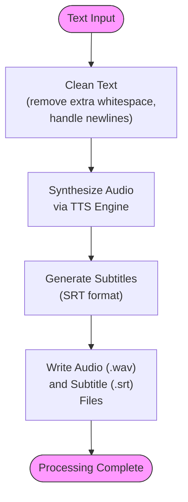

# Core Functionality

<cite>
**Referenced Files in This Document**   
- [pipeline.rs](file://src/pipeline.rs)
- [tts.rs](file://src/tts.rs)
- [video.rs](file://src/video.rs)
- [text.rs](file://src/text.rs)
- [subtitle.rs](file://src/subtitle.rs)
- [queue.rs](file://src/queue.rs)
- [config.rs](file://src/config.rs)
- [lib.rs](file://src/lib.rs)
- [kokoro_bridge.py](file://python/kokoro_bridge.py)
</cite>

## Table of Contents
1. [Introduction](#introduction)
2. [Pipeline Orchestration](#pipeline-orchestration)
3. [Text Processing Pipeline](#text-processing-pipeline)
4. [Multi-Engine TTS Architecture](#multi-engine-tts-architecture)
5. [Video Generation Process](#video-generation-process)
6. [Configuration and Integration](#configuration-and-integration)
7. [Common Issues and Troubleshooting](#common-issues-and-troubleshooting)
8. [Performance Considerations](#performance-considerations)

## Introduction
VoxWeave is a modular Rust library designed to transform text input into synchronized audio, subtitles, and AI-generated videos. The core functionality revolves around a pipeline-based architecture that processes text through normalization, speech synthesis, subtitle generation, and optional video creation. The system supports multiple TTS engines (espeak-ng, Kokoro, CoquiTTS) and integrates with external AI video generation services like Z.AI. The pipeline is designed for both programmatic use and integration with UI/CLI interfaces, providing a flexible foundation for text-to-speech and video generation workflows.

## Pipeline Orchestration

The pipeline orchestration in VoxWeave is implemented in `src/pipeline.rs` and serves as the central coordinator for text-to-speech and subtitle generation workflows. The `convert_path` function takes a `ConvertRequest` struct containing source text, output directory, voice profile, speed, and subtitle configuration, then processes the text through cleaning, speech synthesis, and subtitle generation stages. The pipeline follows a sequential processing model where text is first cleaned using `clean_text`, then synthesized to audio via the specified TTS engine, and finally converted to SRT subtitles when enabled. The `convert_queue` function extends this capability to batch processing, allowing multiple conversion requests to be processed sequentially from a `ConversionQueue`. This queue-based approach enables efficient batch processing of multiple text files with different voice profiles and output configurations.



**Diagram sources**
- [pipeline.rs](file://src/pipeline.rs#L20-L139)
- [text.rs](file://src/text.rs#L10-L70)
- [subtitle.rs](file://src/subtitle.rs#L10-L156)

**Section sources**
- [pipeline.rs](file://src/pipeline.rs#L1-L139)
- [lib.rs](file://src/lib.rs#L1-L14)

## Text Processing Pipeline

The text processing pipeline in VoxWeave handles text normalization and preparation before TTS synthesis. Implemented in `src/text.rs`, the `clean_text` function performs several key operations: collapsing multiple whitespace characters within lines, reducing multiple consecutive blank lines to double line breaks, trimming leading/trailing whitespace, and optionally replacing single newlines with spaces. The `collapse_whitespace` function uses regex patterns to normalize internal whitespace while preserving line structure. This preprocessing ensures consistent text input for TTS engines, improving speech quality and timing accuracy. The pipeline also supports configurable text handling through the `replace_single_newlines` parameter, allowing users to control whether paragraph breaks should be preserved or converted to spaces for continuous narration.


**Diagram sources**
- [text.rs](file://src/text.rs#L10-L70)

**Section sources**
- [text.rs](file://src/text.rs#L1-L70)

## Multi-Engine TTS Architecture

VoxWeave implements a flexible multi-engine TTS architecture through the `SpeechEngine` trait defined in `src/tts.rs`. This trait-based design allows seamless integration of multiple TTS engines while maintaining a consistent interface. The system supports three primary engines: espeak-ng for lightweight local synthesis, Kokoro for high-quality neural TTS, and CoquiTTS for advanced voice cloning capabilities. Each engine implements the `synthesize_to_file` method, which takes text input, voice profile, speed parameter, and output path. The `VoiceProfile` struct encapsulates engine-specific configuration, including voice ID, description, engine type, and optional command or language parameters. The architecture uses environment variables for engine configuration (e.g., `VOXWEAVE_KOKORO_PYTHON`, `VOXWEAVE_COQUI_DEVICE`), allowing runtime customization without code changes. The `default_voice_profiles` function provides a comprehensive set of built-in voices across all supported engines.

```mermaid
classDiagram
class SpeechEngine {
<<trait>>
+synthesize_to_file(text, voice, speed, output) Result~(), TtsError~
}
class VoiceProfile {
+id : String
+description : String
+engine : VoiceEngine
+command : Option~String~
+lang : Option~String~
+builtin(id, description) VoiceProfile
+espeak(id, description, command) VoiceProfile
+kokoro(id, description, lang) VoiceProfile
+coqui(id, description, lang) VoiceProfile
+coqui_clone(id, description, lang, clone_path) VoiceProfile
}
class VoiceEngine {
<<enum>>
+Espeak
+Kokoro
+Coqui
}
class EspeakEngine {
+resolve_command() String
+normalized_speed(speed) i32
}
class KokoroEngine {
+python_command : String
+repo_id : String
+device : String
+sample_rate : u32
+split_pattern : Option~String~
}
class CoquiEngine {
+python_command : String
+model_name : String
+device : String
+sample_rate : u32
+language : String
}
SpeechEngine <|-- EspeakEngine
SpeechEngine <|-- KokoroEngine
SpeechEngine <|-- CoquiEngine
VoiceProfile --> VoiceEngine
EspeakEngine --> VoiceProfile
KokoroEngine --> VoiceProfile
CoquiEngine --> VoiceProfile
note right of SpeechEngine
Core trait defining TTS interface
Implemented by all engine types
end note
note right of VoiceProfile
Contains engine-specific configuration
Stores voice metadata and parameters
end note
```

**Diagram sources**
- [tts.rs](file://src/tts.rs#L1-L523)

**Section sources**
- [tts.rs](file://src/tts.rs#L1-L523)

## Video Generation Process

The video generation process in VoxWeave is implemented in `src/video.rs` and provides integration with external AI video generation services, primarily Z.AI. The `VideoGenerationService` orchestrates the creation of AI-generated videos from audio files, with optional subtitle embedding. The process follows a multi-step workflow: uploading the audio file to the service, creating a video generation job with specified style and resolution, polling for completion, downloading the generated video, and optionally embedding subtitles using ffmpeg. The service supports multiple providers through the `VideoProvider` enum, currently including Z.AI and OpenAI Sora. Configuration is handled via the `VideoConfig` struct, which specifies style, resolution, format, and optional prompt text. The implementation uses async/await patterns with tokio for non-blocking operations and includes progress and log callbacks for real-time feedback during long-running operations.

```mermaid
sequenceDiagram
participant Client
participant Service as VideoGenerationService
participant API as Z.AI API
participant Storage as Cloud Storage
Client->>Service : generate_video(audio_path, config)
Service->>Service : Upload audio file
Service->>Storage : POST /upload
Storage-->>Service : File URL
Service->>API : Create video job
API-->>Service : Job ID
loop Poll every 1s
Service->>API : GET /videos/generations/{job_id}
API-->>Service : Status update
alt Processing
Service->>Client : Update progress (20-90%)
else Complete
break
end
end
Service->>Service : Download video
Service->>Service : Embed subtitles (if requested)
Service-->>Client : Video file path
```

**Diagram sources**
- [video.rs](file://src/video.rs#L1-L463)

**Section sources**
- [video.rs](file://src/video.rs#L1-L463)

## Configuration and Integration

VoxWeave's configuration system, implemented in `src/config.rs`, manages user preferences and application state through JSON serialization. The `AppConfig` struct stores settings such as newline replacement behavior, default voice selection, and recent file history. Configuration is persisted to disk using the `directories` crate to determine appropriate platform-specific locations, with support for environment variable overrides via `VOXWEAVE_CONFIG_DIR`. The `resolve_voice` function integrates configuration with voice selection, allowing users to set a default voice that persists across sessions. Integration between components follows a dependency injection pattern where configuration flows from UI/CLI layers to service components. The `PipelineBuilder` pattern (implied by the API structure) allows for fluent construction of conversion requests with various options. Environment variables provide another configuration layer, enabling system-wide settings for TTS engines and video generation services without modifying code.

**Section sources**
- [config.rs](file://src/config.rs#L1-L118)
- [queue.rs](file://src/queue.rs#L1-L155)

## Common Issues and Troubleshooting

Common issues in VoxWeave typically fall into three categories: dependency problems, API limitations, and synchronization challenges. Missing dependencies like espeak, python3, or ffmpeg can prevent core functionality; these require proper system installation and PATH configuration. API rate limits and authentication issues affect video generation, particularly with external services like Z.AI, requiring valid API keys in environment variables (`ZAI_API_KEY` or `OPENAI_API_KEY`). Audio-video synchronization problems may occur when subtitle timing doesn't match speech duration, often due to inaccurate words-per-minute estimates in `SubtitleGranularity::Words`. Users may also encounter Python dependency issues with CoquiTTS, requiring proper installation of the TTS package. The system handles empty text input gracefully by generating silent audio files, and includes fallback mechanisms like file:// URLs when cloud uploads fail. Error handling is comprehensive, with specific error types for command execution failures, backend issues, and unsupported voices.

**Section sources**
- [tts.rs](file://src/tts.rs#L1-L523)
- [video.rs](file://src/video.rs#L1-L463)
- [pipeline.rs](file://src/pipeline.rs#L1-L139)

## Performance Considerations

Performance in VoxWeave is optimized through async execution with tokio and efficient batch processing. The video generation components use async/await patterns to avoid blocking during network operations, allowing concurrent processing of multiple tasks. The `convert_queue` function enables batch processing of multiple text files, minimizing setup overhead by reusing TTS engine instances. For large-scale operations, the system benefits from connection pooling and reuse in HTTP clients. Memory usage is managed through streaming operations where possible, such as when uploading files or downloading video content. The text processing pipeline is designed for efficiency with regex compilation cached via `once_cell`. When using CoquiTTS, performance can be improved by running on GPU-accelerated hardware with CUDA support. For high-throughput scenarios, users can implement external queuing systems or distribute work across multiple instances, leveraging the stateless nature of the core processing functions.

**Section sources**
- [video.rs](file://src/video.rs#L1-L463)
- [pipeline.rs](file://src/pipeline.rs#L1-L139)
- [tts.rs](file://src/tts.rs#L1-L523)