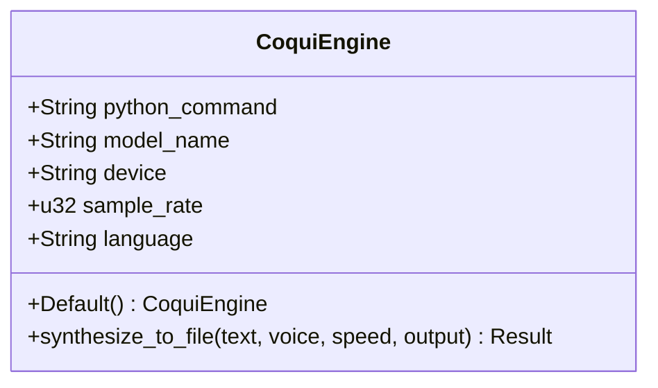
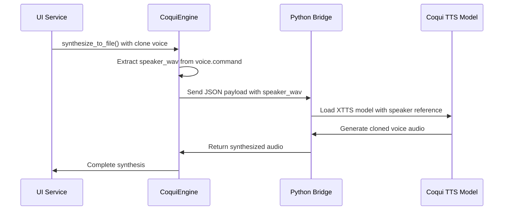
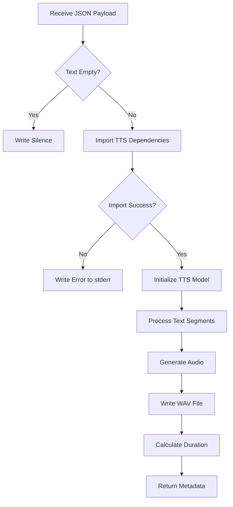
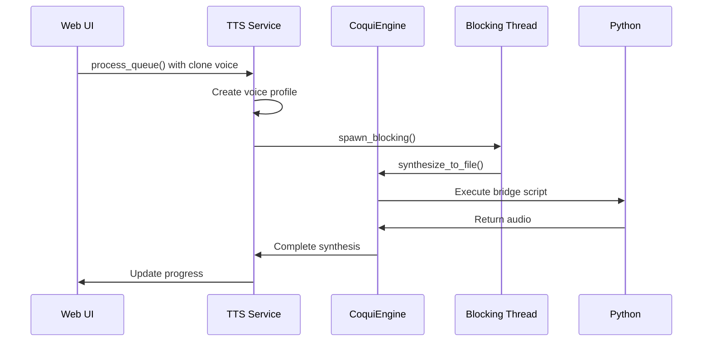
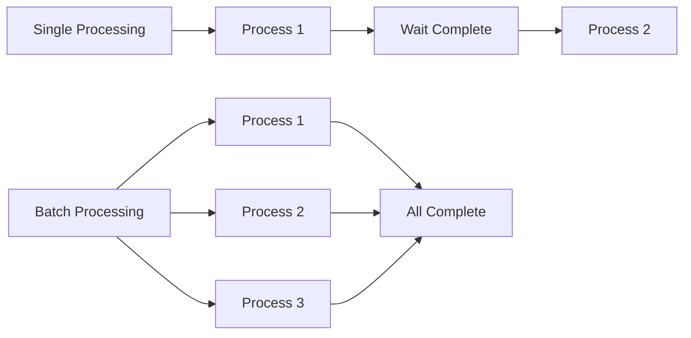

# CoquiTTS Implementation

<cite>
**Referenced Files in This Document**   
- [coqui_tts.rs](file://src/coqui_tts.rs)
- [kokoro_bridge.py](file://python/kokoro_bridge.py)
- [tts_service.rs](file://abogen-ui/crates/ui/services/tts_service.rs)
- [config.rs](file://src/config.rs)
</cite>

## Table of Contents
1. [Introduction](#introduction)
2. [CoquiEngine Configuration](#coquiengine-configuration)
3. [Voice Cloning Implementation](#voice-cloning-implementation)
4. [Coqui Bridge Script](#coqui-bridge-script)
5. [JSON Payload Structure](#json-payload-structure)
6. [Feature-Gated Implementation](#feature-gated-implementation)
7. [UI Integration](#ui-integration)
8. [Common Issues and Solutions](#common-issues-and-solutions)
9. [Performance Optimization](#performance-optimization)
10. [Conclusion](#conclusion)

## Introduction
The CoquiTTS implementation in VoxWeave provides a robust text-to-speech solution with advanced voice cloning capabilities. This documentation details the architecture, configuration, and integration of the CoquiTTS system, focusing on the `CoquiEngine` struct, voice cloning functionality, and Python bridge communication. The implementation supports multilingual synthesis through the XTTS v2 model and integrates seamlessly with the existing UI service layer.

## CoquiEngine Configuration
The `CoquiEngine` struct manages the configuration and execution of CoquiTTS synthesis operations. It is configured through environment variables that control Python execution, model selection, device targeting, and audio parameters.



**Diagram sources**
- [coqui_tts.rs](file://src/coqui_tts.rs#L0-L115)

**Section sources**
- [coqui_tts.rs](file://src/coqui_tts.rs#L0-L115)

### Environment Variables
The engine's behavior is controlled by the following environment variables:

- **VOXWEAVE_COQUI_PYTHON**: Specifies the Python command to execute (default: `python3`)
- **VOXWEAVE_COQUI_MODEL**: Determines the TTS model to load (default: `tts_models/multilingual/multi-dataset/xtts_v2`)
- **VOXWEAVE_COQUI_DEVICE**: Sets the execution device (cpu, cuda, mps, etc.) (default: `cpu`)
- **VOXWEAVE_COQUI_SAMPLE_RATE**: Configures the audio sample rate (default: `24000`)
- **VOXWEAVE_COQUI_LANGUAGE**: Defines the default language for synthesis (default: `en`)

The `CoquiEngine::default()` implementation reads these environment variables to configure the engine instance, providing sensible defaults when variables are not set.

## Voice Cloning Implementation
The voice cloning capability in VoxWeave allows users to create personalized voices using reference audio samples. This functionality is implemented through the `VoiceProfile::coqui_clone` method and the `speaker_wav` parameter.



**Diagram sources**
- [coqui_tts.rs](file://src/coqui_tts.rs#L42-L82)
- [tts_service.rs](file://abogen-ui/crates/ui/services/tts_service.rs#L36-L68)

**Section sources**
- [coqui_tts.rs](file://src/coqui_tts.rs#L42-L82)
- [tts_service.rs](file://abogen-ui/crates/ui/services/tts_service.rs#L36-L68)

### Voice Profile Structure
The `VoiceProfile::coqui_clone` method creates a voice profile with the reference audio path stored in the `command` field:

```rust
pub fn coqui_clone(id: &str, description: &str, lang: &str, clone_path: &str) -> Self {
    Self {
        id: id.to_owned(),
        description: description.to_owned(),
        engine: VoiceEngine::Coqui,
        command: Some(clone_path.to_owned()),
        lang: Some(lang.to_owned()),
    }
}
```

When synthesizing speech, the engine checks if `voice.command` contains a valid path to reference audio, enabling voice cloning mode when present.

## Coqui Bridge Script
The inline `COQUI_BRIDGE_SCRIPT` handles the Python-side execution of CoquiTTS operations, including model loading, voice cloning synthesis, and duration estimation. The script is embedded directly in the Rust codebase to ensure consistent deployment.



**Diagram sources**
- [kokoro_bridge.py](file://python/kokoro_bridge.py#L53-L88)
- [coqui_tts.rs](file://src/tts.rs#L377-L451)

**Section sources**
- [kokoro_bridge.py](file://python/kokoro_bridge.py#L53-L88)

The bridge script performs the following operations:
1. Receives JSON input via stdin
2. Validates and processes the text input
3. Imports required Python dependencies (TTS, torch, numpy)
4. Initializes the XTTS model with specified parameters
5. Generates speech audio with voice cloning when `speaker_wav` is provided
6. Writes the output as a WAV file
7. Returns duration metadata via stdout

## JSON Payload Structure
The communication between Rust and Python components occurs through a structured JSON payload passed via stdin. This payload contains all necessary parameters for speech synthesis.

```json
{
  "text": "Hello, this is a test",
  "output": "/path/to/output.wav",
  "sample_rate": 24000,
  "model_name": "tts_models/multilingual/multi-dataset/xtts_v2",
  "device": "cuda",
  "language": "en",
  "speed": 1.0,
  "speaker_wav": "/path/to/reference.wav"
}
```

**Section sources**
- [coqui_tts.rs](file://src/coqui_tts.rs#L60-L80)

The payload includes:
- **text**: Input text for synthesis
- **output**: Path for the generated audio file
- **sample_rate**: Audio sampling rate in Hz
- **model_name**: Coqui TTS model identifier
- **device**: Execution device (cpu, cuda, mps)
- **language**: Target language code
- **speed**: Speech speed multiplier
- **speaker_wav**: Optional path to reference audio for voice cloning

## Feature-Gated Implementation
The CoquiTTS functionality is implemented with feature gating using the `#[cfg(feature = "coqui-tts")]` attribute, allowing conditional compilation based on build configuration.

```mermaid
classDiagram
class SpeechEngine {
<<trait>>
+synthesize_to_file(text, voice, speed, output) Result
}
class CoquiEngine {
+python_command
+model_name
+device
+sample_rate
+language
}
class KokoroEngine {
+repo_id
+device
}
CoquiEngine --|> SpeechEngine : implements
KokoroEngine --|> SpeechEngine : implements
CoquiEngine --> "optional" : cfg(feature = \"coqui-tts\")
```

**Diagram sources**
- [coqui_tts.rs](file://src/coqui_tts.rs#L0-L115)
- [tts.rs](file://src/tts.rs#L60-L102)

**Section sources**
- [coqui_tts.rs](file://src/coqui_tts.rs#L0-L115)

### Error Handling
The implementation includes comprehensive error handling for missing Python dependencies:

```rust
try {
    from TTS.api import TTS
    import torch
} catch Exception as exc {
    sys.stderr.write(f"failed to import coqui dependencies: {exc}\n")
    sys.exit(1)
}
```

When Python dependencies are not available, the bridge script exits with an error code, which is propagated back to the Rust layer as a `TtsError::CommandFailed`.

## UI Integration
The CoquiTTS system integrates with the UI service layer to support cloned voice functionality and manage asynchronous execution constraints.



**Diagram sources**
- [tts_service.rs](file://abogen-ui/crates/ui/services/tts_service.rs#L36-L68)
- [tts_service.rs](file://abogen-ui/crates/ui/services/tts_service.rs#L200-L250)

**Section sources**
- [tts_service.rs](file://abogen-ui/crates/ui/services/tts_service.rs#L36-L68)

The integration features:
- Voice profile creation based on voice ID patterns (`coqui-*` and `clone-*`)
- Asynchronous processing using `tokio::task::spawn_blocking` to prevent UI freezing
- Progress tracking and logging throughout the synthesis process
- Audio format conversion (WAV to MP3/FLAC) when needed

## Common Issues and Solutions
Several common issues may arise when using the CoquiTTS implementation, particularly related to dependencies, hardware requirements, and audio quality.

### Dependency Issues
**Missing Python Packages**: The system requires `TTS`, `torch`, and `numpy` Python packages. Install them with:
```bash
pip install TTS torch numpy
```

**Python Command Not Found**: Ensure the Python executable is available in PATH or set `VOXWEAVE_COQUI_PYTHON` to the correct path.

### Hardware Limitations
**Large Model Downloads**: The XTTS v2 model is approximately 2GB and downloads automatically on first use. Ensure sufficient disk space and stable internet connection.

**CUDA Memory Limitations**: When using GPU acceleration, the model may exceed available VRAM. Solutions include:
- Using CPU instead: `VOXWEAVE_COQUI_DEVICE="cpu"`
- For Apple Silicon: `VOXWEAVE_COQUI_DEVICE="mps"`
- Reducing batch size in future enhancements

### Audio Quality Issues
**Alignment Artifacts**: Voice cloning may produce audio artifacts due to misalignment between reference and generated speech. Mitigation strategies:
- Use high-quality reference audio (16kHz+ sample rate)
- Ensure reference audio contains clear speech without background noise
- Use reference clips of appropriate length (3-10 seconds)

## Performance Optimization
To maximize performance and efficiency when using CoquiTTS in VoxWeave, consider the following optimization strategies.

### Batch Processing
For multiple synthesis requests, batch processing can significantly improve throughput:



**Section sources**
- [tts_service.rs](file://abogen-ui/crates/ui/services/tts_service.rs#L200-L250)

### GPU Utilization
Optimize GPU usage based on available hardware:

- **NVIDIA GPUs**: Use `VOXWEAVE_COQUI_DEVICE="cuda"`
- **Apple Silicon**: Use `VOXWEAVE_COQUI_DEVICE="mps"` for optimal performance
- **AMD GPUs**: ROCm support may require additional configuration

Monitor GPU memory usage and adjust the configuration based on available resources. The first execution will be slower due to model loading and caching.

## Conclusion
The CoquiTTS implementation in VoxWeave provides a comprehensive text-to-speech solution with advanced voice cloning capabilities. The system is configured through environment variables, supports multiple languages, and integrates seamlessly with the UI layer. The feature-gated design allows flexible compilation, while the Python bridge enables robust error handling and dependency management. By addressing common issues like model size and GPU memory constraints, and implementing performance optimizations for batch processing and GPU utilization, the system delivers reliable and high-quality speech synthesis for diverse use cases.