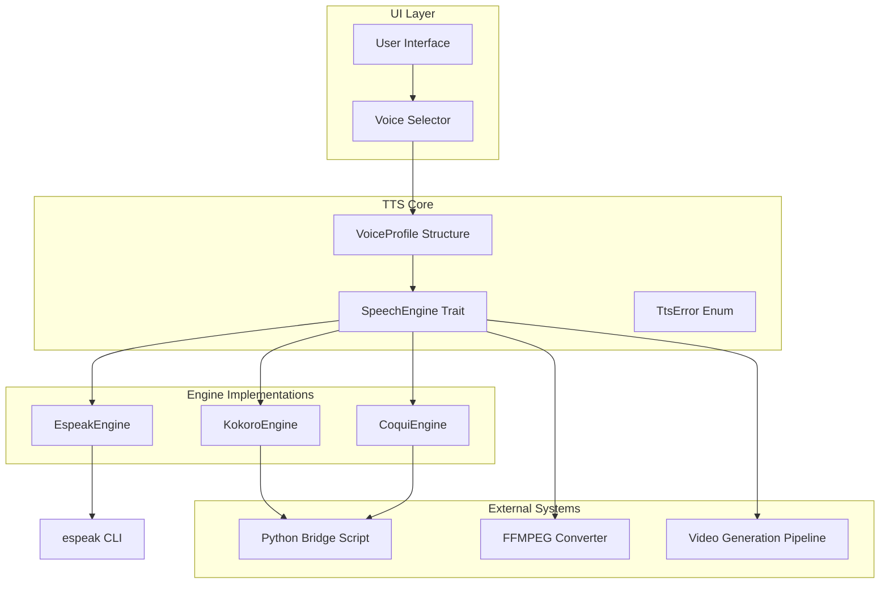
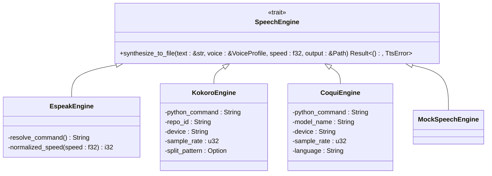
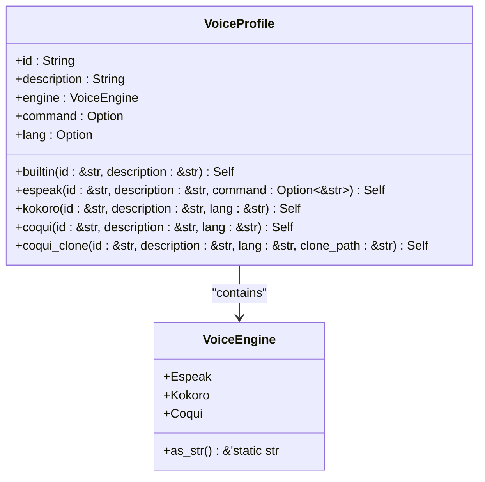
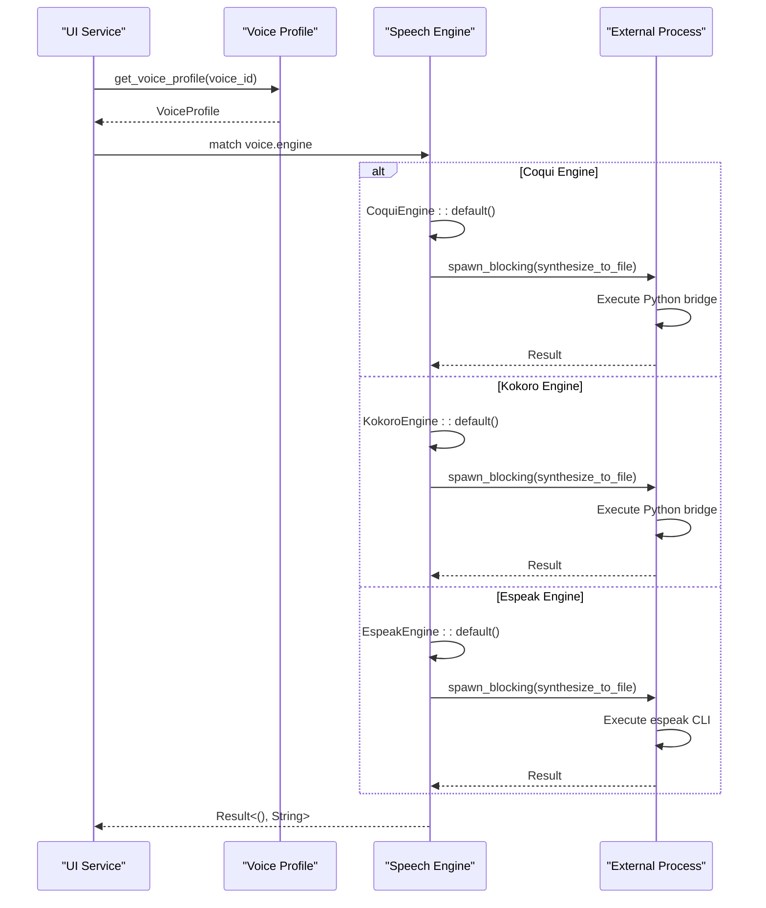
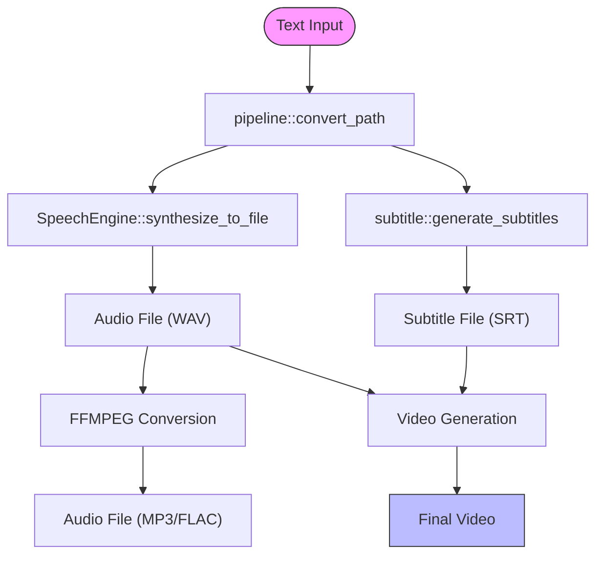
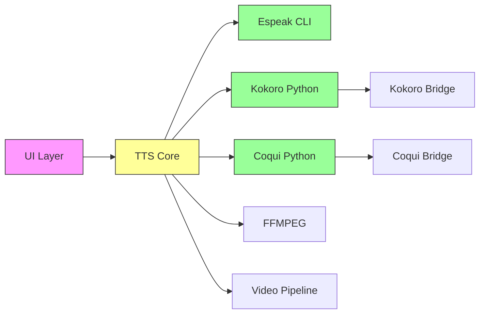

# Engine Architecture

<cite>
**Referenced Files in This Document**   
- [tts.rs](file://src/tts.rs)
- [coqui_tts.rs](file://src/coqui_tts.rs)
- [tts_service.rs](file://abogen-ui/crates/ui/services/tts_service.rs)
- [pipeline.rs](file://src/pipeline.rs)
- [python/kokoro_bridge.py](file://python/kokoro_bridge.py)
</cite>

## Table of Contents
1. [Introduction](#introduction)
2. [Core Components](#core-components)
3. [Architecture Overview](#architecture-overview)
4. [Detailed Component Analysis](#detailed-component-analysis)
5. [Dependency Analysis](#dependency-analysis)
6. [Performance Considerations](#performance-considerations)
7. [Troubleshooting Guide](#troubleshooting-guide)
8. [Conclusion](#conclusion)

## Introduction
This document provides a comprehensive analysis of the Text-to-Speech (TTS) engine architecture in VoxWeave, focusing on the core `SpeechEngine` trait and its implementations. The system supports multiple TTS engines including espeak, Kokoro, and Coqui, with a flexible voice profile system that enables runtime engine selection. The architecture integrates tightly with the UI service layer and downstream video generation pipeline, providing a complete solution for audio content creation. This documentation covers the trait-based design pattern, error handling mechanisms, voice abstraction model, and integration points with higher-level components.

## Core Components
The TTS subsystem in VoxWeave is built around a trait-based architecture that enables polymorphic behavior across different speech synthesis engines. The core components include the `SpeechEngine` trait that defines the contract for all TTS implementations, the `TtsError` enum for unified error handling, and the `VoiceProfile` structure that abstracts voice metadata across different engines. The system supports three primary engines: espeak for lightweight synthesis, Kokoro for neural text-to-speech, and Coqui for advanced voice cloning capabilities. Each engine implements the `SpeechEngine` trait while maintaining engine-specific configuration through environment variables and runtime parameters.

**Section sources**
- [tts.rs](file://src/tts.rs#L0-L522)
- [coqui_tts.rs](file://src/coqui_tts.rs#L0-L115)

## Architecture Overview
The TTS architecture in VoxWeave follows a plugin-based design pattern where different speech synthesis engines implement a common interface. This approach enables runtime engine selection based on voice profiles while maintaining a consistent API for audio generation. The system uses environment variables for engine configuration, allowing users to customize paths, devices, and sample rates without code changes. The architecture separates voice metadata from engine implementation, with the `VoiceProfile` structure serving as a bridge between the UI layer and the underlying TTS engines. This design enables a clean separation of concerns, where the UI can present voice options without knowledge of the specific engine implementation details.

**Diagram sources **
- [tts.rs](file://src/tts.rs#L0-L522)
- [coqui_tts.rs](file://src/coqui_tts.rs#L0-L115)
- [tts_service.rs](file://abogen-ui/crates/ui/services/tts_service.rs#L0-L540)

## Detailed Component Analysis

### SpeechEngine Trait Analysis
The `SpeechEngine` trait serves as the foundation for all TTS implementations in VoxWeave, defining a uniform interface for speech synthesis across different backend technologies. This trait-based approach enables polymorphism and dependency inversion, allowing the system to work with any engine that implements the required functionality. The trait contains a single method `synthesize_to_file` that takes text input, voice configuration, speed parameters, and an output path, returning a Result type that handles both success and error cases.

**Diagram sources **
- [tts.rs](file://src/tts.rs#L0-L522)
- [coqui_tts.rs](file://src/coqui_tts.rs#L0-L115)

**Section sources**
- [tts.rs](file://src/tts.rs#L50-L100)

### VoiceProfile Structure Analysis
The `VoiceProfile` structure provides a unified abstraction for voice metadata across different TTS engines, enabling consistent voice management throughout the application. This structure contains essential voice attributes including a unique identifier, descriptive text, engine type, optional command specification, and language code. The design allows different engines to store engine-specific configuration in the same structure, with the `command` field serving multiple purposes: storing espeak voice identifiers, Coqui voice cloning paths, or remaining unused for Kokoro voices. The structure includes factory methods for creating voice profiles specific to each engine, ensuring proper initialization and type safety.

**Diagram sources **
- [tts.rs](file://src/tts.rs#L0-L522)

**Section sources**
- [tts.rs](file://src/tts.rs#L20-L50)

### Engine Implementation Analysis
The TTS engine implementations follow a consistent pattern while adapting to the specific requirements of each backend technology. Each engine validates that the provided voice profile matches its type before proceeding with synthesis, ensuring type safety and preventing incorrect engine usage. The implementations use environment variables for configuration, allowing users to customize engine behavior without code changes. Error handling is standardized across implementations, with engine-specific errors converted to the common `TtsError` enum for consistent error reporting throughout the system.

#### Engine Dispatch Sequence
The sequence of operations when synthesizing speech shows how the system handles engine selection and execution in the UI service layer. The process begins with voice profile creation based on user selection, followed by engine instantiation and execution in a blocking task to prevent UI freezing. The system uses tokio's spawn_blocking to ensure responsive user interface during potentially long-running TTS operations.

**Diagram sources **
- [tts.rs](file://src/tts.rs#L0-L522)
- [coqui_tts.rs](file://src/coqui_tts.rs#L0-L115)
- [tts_service.rs](file://abogen-ui/crates/ui/services/tts_service.rs#L0-L540)

**Section sources**
- [tts.rs](file://src/tts.rs#L100-L522)
- [coqui_tts.rs](file://src/coqui_tts.rs#L0-L115)
- [tts_service.rs](file://abogen-ui/crates/ui/services/tts_service.rs#L0-L540)

### Integration with Higher-Level Components
The TTS subsystem integrates with higher-level components through well-defined interfaces and data flow patterns. The pipeline module provides a high-level API for converting text files to audio, while the queue processor handles batch operations with progress tracking and error handling. The integration with video generation enables automatic creation of videos with synchronized audio and subtitles, forming a complete content creation pipeline.

**Diagram sources **
- [pipeline.rs](file://src/pipeline.rs#L0-L139)
- [tts_service.rs](file://abogen-ui/crates/ui/services/tts_service.rs#L0-L540)

**Section sources**
- [pipeline.rs](file://src/pipeline.rs#L0-L139)
- [tts_service.rs](file://abogen-ui/crates/ui/services/tts_service.rs#L0-L540)

## Dependency Analysis
The TTS subsystem has well-defined dependencies that enable its functionality while maintaining separation of concerns. The core dependencies include external command-line tools (espeak), Python-based neural TTS systems (Kokoro, Coqui), and multimedia processing tools (FFMPEG). The system uses environment variables to configure external dependencies, allowing users to specify custom paths and parameters. The architecture minimizes direct dependencies between components, with the `SpeechEngine` trait serving as the primary interface between the core system and engine implementations.

**Diagram sources **
- [tts.rs](file://src/tts.rs#L0-L522)
- [coqui_tts.rs](file://src/coqui_tts.rs#L0-L115)
- [tts_service.rs](file://abogen-ui/crates/ui/services/tts_service.rs#L0-L540)

**Section sources**
- [tts.rs](file://src/tts.rs#L0-L522)
- [coqui_tts.rs](file://src/coqui_tts.rs#L0-L115)
- [Cargo.toml](file://Cargo.toml#L0-L26)

## Performance Considerations
The TTS architecture includes several performance considerations to ensure efficient operation, particularly for neural models that have significant startup overhead. Engine instances are created per synthesis operation rather than being reused, which avoids potential thread safety issues in async contexts but incurs initialization costs for each operation. The system uses blocking tasks for TTS operations to prevent UI freezing, with periodic yield calls to maintain responsiveness. Memory usage is optimized by processing text in chunks and using streaming interfaces where possible. For neural models like Coqui and Kokoro, the Python bridge scripts handle model loading and unloading, minimizing memory footprint between operations.

**Section sources**
- [tts.rs](file://src/tts.rs#L0-L522)
- [coqui_tts.rs](file://src/coqui_tts.rs#L0-L115)
- [tts_service.rs](file://abogen-ui/crates/ui/services/tts_service.rs#L0-L540)

## Troubleshooting Guide
Common issues in the TTS subsystem typically relate to engine initialization, voice compatibility, and external dependency configuration. Engine initialization failures often occur when required external tools are not available or incorrectly configured through environment variables. Voice compatibility mismatches happen when a voice profile is used with an incompatible engine, which is prevented by runtime type checking in the `synthesize_to_file` method. Thread safety issues in async contexts are mitigated by using blocking tasks for TTS operations, ensuring that engine instances are not shared across threads. Configuration issues can be diagnosed by checking environment variables and verifying the availability of external dependencies.

**Section sources**
- [tts.rs](file://src/tts.rs#L0-L522)
- [coqui_tts.rs](file://src/coqui_tts.rs#L0-L115)
- [tts_service.rs](file://abogen-ui/crates/ui/services/tts_service.rs#L0-L540)

## Conclusion
The TTS engine architecture in VoxWeave demonstrates a well-designed, extensible system for text-to-speech synthesis with support for multiple backend technologies. The trait-based design enables clean separation of concerns and easy addition of new engines, while the voice profile system provides a unified interface for voice management. The integration with higher-level components like the video generation pipeline creates a complete content creation solution. The architecture balances flexibility with performance considerations, using environment variables for configuration and blocking tasks for long-running operations. Future improvements could include engine instance pooling to reduce startup overhead and enhanced error reporting for troubleshooting common configuration issues.