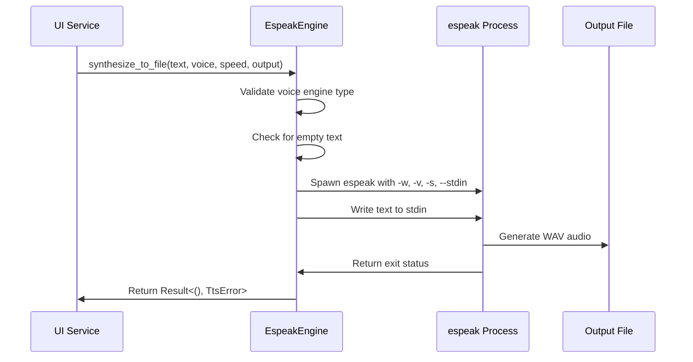
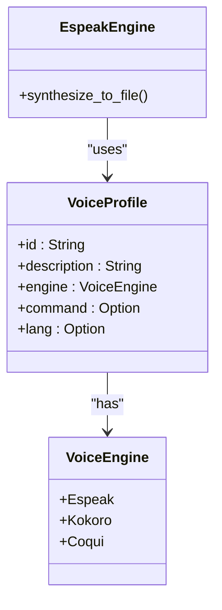

# Espeak Integration

<cite>
**Referenced Files in This Document**   
- [tts.rs](file://src/tts.rs)
- [tts_service.rs](file://abogen-ui/crates/ui/services/tts_service.rs)
</cite>

## Table of Contents
1. [Introduction](#introduction)
2. [EspeakEngine Implementation](#espeakengine-implementation)
3. [Voice Profiles and Language Mapping](#voice-profiles-and-language-mapping)
4. [Speed Normalization and Command Resolution](#speed-normalization-and-command-resolution)
5. [Integration with UI Service Layer](#integration-with-ui-service-layer)
6. [Error Handling and Common Issues](#error-handling-and-common-issues)
7. [Performance Considerations](#performance-considerations)

## Introduction
This document details the integration of the Espeak text-to-speech engine within the VoxWeave application. The implementation centers around the `EspeakEngine` struct, which adheres to the `SpeechEngine` trait for standardized audio synthesis. The integration leverages command-line invocation via `std::process::Command`, supports stdin streaming for text input, and validates process exit statuses to ensure reliable operation. This documentation covers core functionality, configuration options, voice profiles, and practical usage considerations.

**Section sources**
- [tts.rs](file://src/tts.rs#L0-L522)

## EspeakEngine Implementation

The `EspeakEngine` struct provides a concrete implementation of the `SpeechEngine` trait, enabling text-to-speech synthesis through the external `espeak` command-line utility. The engine operates by spawning a child process and communicating with it via standard input.

Key implementation aspects include:
- **Command-line invocation**: Uses `std::process::Command` to execute the `espeak` binary with specific arguments
- **WAV output**: Employs the `-w` flag to direct synthesized audio output to a specified WAV file
- **Text streaming**: Utilizes the `--stdin` argument to stream text input through the process's stdin pipe
- **Exit status validation**: Checks the child process status to confirm successful execution

The synthesis process first validates that the provided `VoiceProfile` is configured for the Espeak engine. Empty input text is handled gracefully by creating an empty output file. For valid input, the engine constructs the command with appropriate parameters including output file, voice selection, speech rate, and enables stdin streaming.



**Diagram sources**
- [tts.rs](file://src/tts.rs#L101-L192)

**Section sources**
- [tts.rs](file://src/tts.rs#L101-L192)

## Voice Profiles and Language Mapping

The Espeak integration includes a predefined set of voice profiles through the `ESPEAK_VOICES` constant, which defines available voices with their identifiers, descriptions, and language mappings. These profiles are used to configure the `VoiceProfile` objects that specify which voice to use during synthesis.

The built-in voice profiles include:
- English (US, UK, Australia)
- Spanish, French, German, Italian
- Portuguese (Brazil), Turkish, Hindi
- Japanese, Chinese (Mandarin)

Each voice profile maps to an espeak voice identifier that is passed via the `-v` command-line argument. The `VoiceProfile` struct's `command` field stores the specific voice identifier to use, defaulting to the profile's `id` if no override is provided. This design allows for flexible voice selection while maintaining compatibility with espeak's voice naming conventions.



**Diagram sources**
- [tts.rs](file://src/tts.rs#L350-L375)

**Section sources**
- [tts.rs](file://src/tts.rs#L287-L298)

## Speed Normalization and Command Resolution

The Espeak integration provides two utility methods within the `EspeakEngine` implementation to handle speed normalization and command resolution.

### Speed Normalization
The `normalized_speed` function converts a user-provided speed multiplier (f32) into an appropriate espeak rate parameter (i32). The conversion uses a base rate of 175 words per minute, multiplying it by the user's speed value and rounding to the nearest integer. The resulting rate is clamped between 80 and 450 to ensure it falls within espeak's acceptable range:

```rust
fn normalized_speed(speed: f32) -> i32 {
    let base_rate = 175.0;
    let rate = (base_rate * speed).round();
    rate.clamp(80.0, 450.0) as i32
}
```

This function is called during synthesis to convert the speed parameter into the `-s` argument value passed to the espeak command.

### Command Resolution
The `resolve_command` method determines which executable to invoke for espeak functionality. It first checks for the `VOXWEAVE_ESPEAK_COMMAND` environment variable, allowing users to override the default command. If the environment variable is not set, it defaults to "espeak":

```rust
fn resolve_command() -> String {
    env::var("VOXWEAVE_ESPEAK_COMMAND").unwrap_or_else(|_| "espeak".to_string())
}
```

This override capability supports platform-specific installations, custom builds, or alternative TTS engines that provide espeak-compatible interfaces.

**Section sources**
- [tts.rs](file://src/tts.rs#L120-L128)

## Integration with UI Service Layer

The Espeak engine integrates with the application's UI through the service layer, where voice selection and synthesis parameters are coordinated between the user interface and the backend TTS system. The UI service layer handles the creation of appropriate `VoiceProfile` objects based on user selections.

When processing a synthesis request, the service layer:
1. Determines the appropriate speech engine based on the voice profile
2. For Espeak voices, ensures the `VoiceEngine` is set to `VoiceEngine::Espeak`
3. Passes the voice profile, text content, speed setting, and output path to the engine
4. Handles the resulting audio file and any conversion to other formats if needed

The integration follows a pattern where the UI service spawns blocking tasks for TTS synthesis to prevent interface freezing during audio generation. This approach maintains responsiveness while performing the potentially time-consuming synthesis operation.

**Section sources**
- [tts_service.rs](file://abogen-ui/crates/ui/services/tts_service.rs#L0-L540)

## Error Handling and Common Issues

The Espeak integration includes comprehensive error handling to address various failure scenarios that may occur during synthesis.

### Error Types
The system defines several error conditions:
- `TtsError::UnsupportedVoice`: Raised when attempting to use a non-Espeak voice with the Espeak engine
- `TtsError::CommandFailed`: Indicates process execution failure or non-zero exit status
- `TtsError::Backend`: Covers I/O errors and stdin access issues

### Common Issues and Solutions
**Platform-specific command resolution**: On some systems, the espeak executable may be named differently (e.g., `espeak-ng`). This is addressed by the `VOXWEAVE_ESPEAK_COMMAND` environment variable override.

**Missing espeak installation**: If espeak is not installed or not in the system PATH, the command execution will fail. The error handling captures this and returns an appropriate error message.

**Audio quality limitations**: Espeak produces robotic-sounding speech compared to modern neural TTS systems. This is an inherent limitation of the formant synthesis approach used by espeak.

**Empty text input**: The implementation handles empty or whitespace-only input by creating an empty output file, preventing espeak from hanging or producing unexpected behavior.

**Headless environment considerations**: In server or CI environments without audio devices, espeak may produce warnings. These do not affect WAV file generation and can be safely ignored.

**Section sources**
- [tts.rs](file://src/tts.rs#L152-L192)

## Performance Considerations

When using the Espeak engine in VoxWeave, several performance considerations should be taken into account:

### Batch Processing
For processing multiple text items, consider the following optimizations:
- Reuse the same `EspeakEngine` instance across multiple synthesis calls
- Process items sequentially to avoid system resource contention
- Monitor system load, as espeak can be CPU-intensive for large texts

### Headless Environment Usage
When running in server or containerized environments:
- Ensure espeak is properly installed in the environment
- The `-w` flag for WAV output works reliably even without audio hardware
- Consider setting appropriate resource limits to prevent excessive CPU usage

### Speed Settings
The speed normalization function provides a predictable mapping from user-facing speed values to espeak rate parameters. Users should be aware that:
- Speed values below 0.5x may produce unnatural speech
- Speed values above 2.0x may reduce intelligibility
- The clamping ensures values remain within espeak's effective range

The combination of stdin streaming and direct WAV file output provides efficient processing without intermediate file I/O, making the integration suitable for automated workflows and batch processing scenarios.

**Section sources**
- [tts.rs](file://src/tts.rs#L101-L192)
- [tts.rs](file://src/tts.rs#L120-L128)