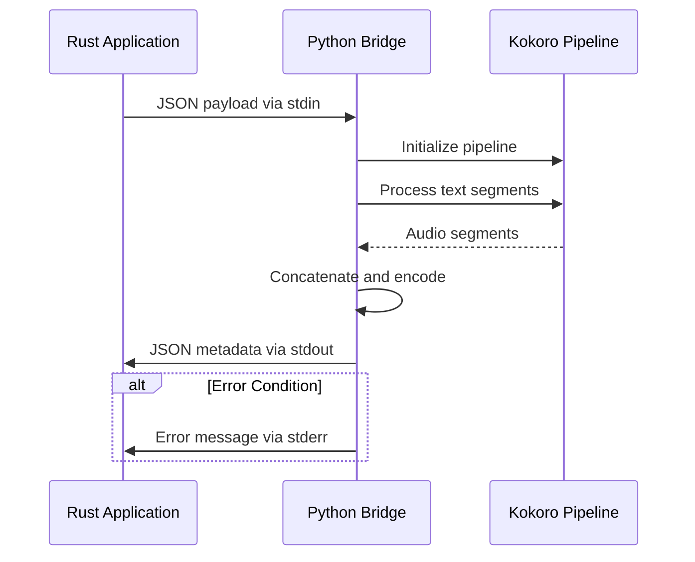
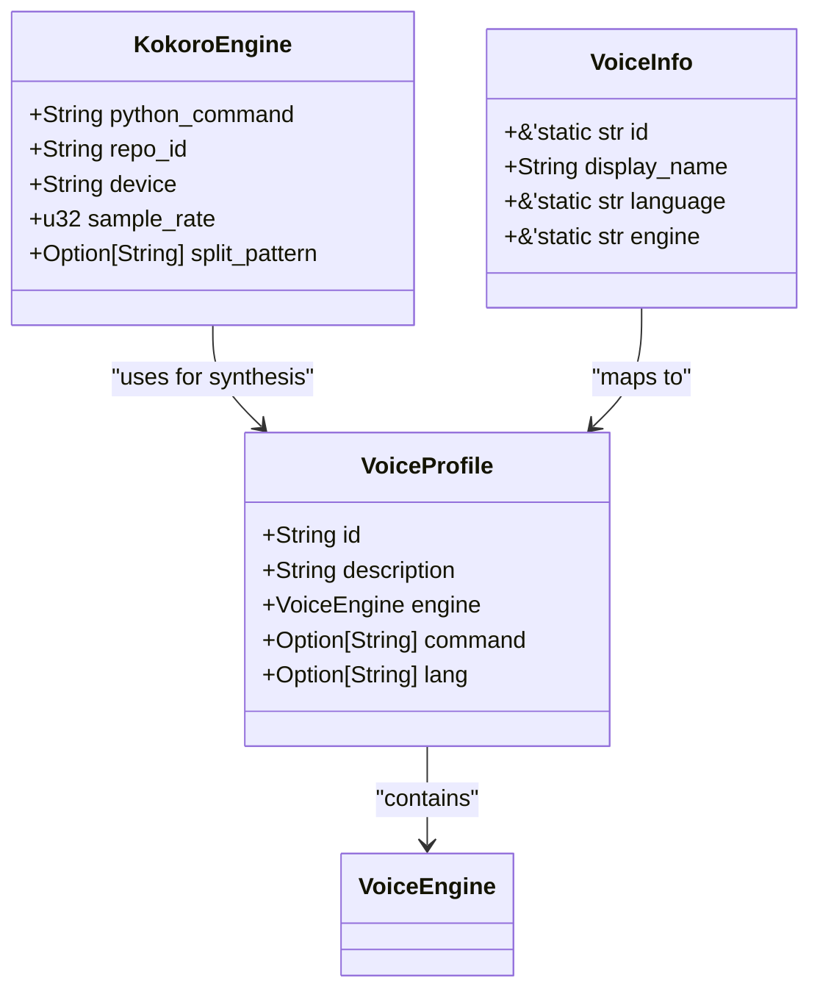
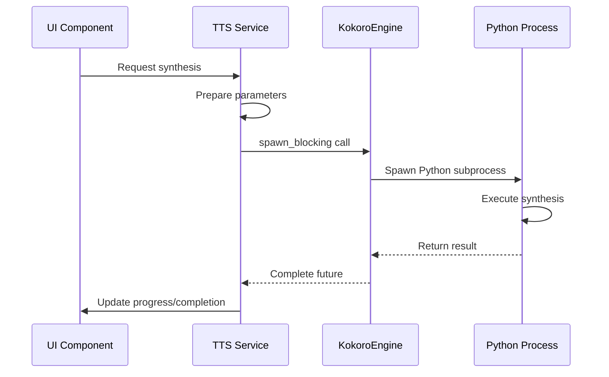

# Kokoro Integration

<cite>
**Referenced Files in This Document**   
- [tts.rs](file://src/tts.rs)
- [kokoro_bridge.py](file://python/kokoro_bridge.py)
- [tts_service.rs](file://abogen-ui/crates/ui/services/tts_service.rs)
- [voices.rs](file://abogen-ui/crates/ui/services/voices.rs)
</cite>

## Table of Contents
1. [Introduction](#introduction)
2. [KokoroEngine Configuration](#kokoroengine-configuration)
3. [Bidirectional JSON Communication Protocol](#bidirectional-json-communication-protocol)
4. [kokoro_bridge.py Script Responsibilities](#kokorobridgepy-script-responsibilities)
5. [Voice Profile System](#voice-profile-system)
6. [Process Execution and Error Handling](#process-execution-and-error-handling)
7. [UI Service Integration](#ui-service-integration)
8. [Common Issues and Troubleshooting](#common-issues-and-troubleshooting)
9. [Performance Considerations](#performance-considerations)
10. [Conclusion](#conclusion)

## Introduction
The Kokoro TTS integration in VoxWeave enables high-quality neural text-to-speech synthesis through a Rust-Python bridge architecture. This system leverages the Kokoro TTS library to generate natural-sounding speech across multiple languages and voice profiles. The integration follows a modular design where the Rust application orchestrates TTS operations by spawning Python processes that execute the actual synthesis. This architecture allows VoxWeave to maintain its Rust-first approach while incorporating specialized Python-based TTS capabilities. The system supports configurable voice profiles, sample rates, and device selection for both CPU and GPU execution, providing flexibility for different deployment scenarios and hardware configurations.

## KokoroEngine Configuration

The `KokoroEngine` struct in the VoxWeave TTS module provides a configurable interface for neural text-to-speech synthesis. This engine is initialized with default values that can be overridden through environment variables, allowing for flexible deployment across different environments.

The engine configuration includes several key parameters:
- **Python bridge invocation**: The path to the Python interpreter is controlled by the `VOXWEAVE_KOKORO_PYTHON` environment variable, defaulting to "python3" if not specified
- **Model repository specification**: The model source is defined by `VOXWEAVE_KOKORO_REPO_ID`, defaulting to "hexgrad/Kokoro-82M" for the standard Kokoro model
- **Device selection**: The execution device (CPU/GPU) is determined by `VOXWEAVE_KOKORO_DEVICE`, with "cpu" as the default value
- **Sample rate settings**: The audio output sample rate is configured via `VOXWEAVE_KOKORO_SAMPLE_RATE`, defaulting to 24,000 Hz
- **Text splitting pattern**: An optional regex pattern for text segmentation can be set with `VOXWEAVE_KOKORO_SPLIT_PATTERN`, defaulting to "\\n+" for paragraph-based splitting

These configuration options allow users to customize the TTS behavior without modifying the application code, supporting different deployment scenarios from resource-constrained environments to high-performance GPU-accelerated systems.

**Section sources**
- [tts.rs](file://src/tts.rs#L194-L232)

## Bidirectional JSON Communication Protocol

The communication between Rust and Python components in the Kokoro integration follows a structured JSON protocol that enables bidirectional data exchange. When the `KokoroEngine` initiates synthesis, it constructs a JSON payload containing all necessary parameters for the TTS operation.

The request payload structure includes the following fields:
- **text**: The input text to be synthesized into speech
- **voice**: The voice profile identifier (e.g., "af_alloy", "am_michael")
- **language code**: The language identifier derived from the voice ID (e.g., "a" for American English)
- **speed**: The speech rate as a floating-point multiplier
- **output path**: The filesystem path where the generated audio should be saved
- **sample rate**: The desired audio sampling rate in Hz
- **repository ID**: The Hugging Face repository identifier for the TTS model
- **device**: The execution device ("cpu" or "cuda")
- **split pattern**: Regular expression for text segmentation during synthesis

The Python bridge script processes this JSON input from stdin and, upon successful synthesis, returns metadata via stdout as a JSON object containing the audio duration. Error conditions are communicated through stderr, allowing the Rust application to handle failures appropriately. This JSON-based protocol ensures type safety and structured data exchange between the two language runtimes.

**Diagram sources**
- [tts.rs](file://src/tts.rs#L234-L265)
- [kokoro_bridge.py](file://python/kokoro_bridge.py#L35-L88)

## kokoro_bridge.py Script Responsibilities

The `kokoro_bridge.py` script serves as the critical integration point between the Rust application and the Kokoro TTS library. This Python script handles several essential responsibilities to ensure reliable TTS operation.

The script's primary responsibilities include:
- **Dependency loading**: Importing the Kokoro TTS library, NumPy, and other required dependencies with comprehensive error handling
- **Pipeline initialization**: Creating a `KPipeline` instance with the specified language code and device configuration
- **Audio concatenation**: Processing text through the pipeline to generate multiple audio segments and concatenating them into a continuous output
- **WAV encoding**: Converting the floating-point audio data to 16-bit PCM format and writing it to a WAV file with proper headers

The script implements robust error handling by catching import and execution exceptions, reporting them through stderr to enable proper error propagation back to the Rust application. It also handles edge cases such as empty input text by generating silent audio files with appropriate duration metadata. The audio processing pipeline includes normalization to ensure the output stays within the valid [-1.0, 1.0] range before conversion to integer PCM format, preventing clipping and distortion in the final output.

**Section sources**
- [kokoro_bridge.py](file://python/kokoro_bridge.py#L35-L88)

## Voice Profile System

VoxWeave implements a comprehensive voice profile system that organizes and manages the available Kokoro TTS voices through a structured naming convention and language mapping system. The voice profiles are defined in the `KOKORO_VOICES` constant, which contains an extensive collection of voice identifiers categorized by language, gender, and regional dialect.

The voice identification system uses a prefix-based language mapping where the first character of each voice ID determines the language:
- "a" prefix: American English
- "b" prefix: British English  
- "e" prefix: Spanish
- "f" prefix: French
- "h" prefix: Hindi
- "i" prefix: Italian
- "j" prefix: Japanese
- "p" prefix: Brazilian Portuguese
- "z" prefix: Mandarin Chinese

Each voice ID follows the pattern `[language][gender]_[name]`, where the second character indicates gender (f=female, m=male) and the name portion is derived from the voice characteristics. The system automatically generates descriptive display names by formatting the name portion with proper capitalization. Voice profiles are instantiated with their corresponding language codes, enabling the TTS engine to select appropriate linguistic models for synthesis. This systematic approach allows for easy expansion of voice offerings while maintaining consistency in voice selection and language handling.

**Diagram sources**
- [tts.rs](file://src/tts.rs#L60-L102)
- [voices.rs](file://abogen-ui/crates/ui/services/voices.rs#L0-L48)

## Process Execution and Error Handling

The Kokoro integration employs a robust process execution model that spawns Python processes with proper stdin piping and comprehensive error reporting. When the `KokoroEngine` initiates synthesis, it creates a subprocess using the configured Python interpreter and passes the bridge script via the `-c` argument.

The process execution includes:
- **Stdin piping**: The JSON payload is written to the subprocess stdin, enabling parameter transmission
- **Stdout capture**: The bridge script returns synthesis metadata through stdout for duration reporting
- **Stderr handling**: All error messages and exceptions are routed through stderr for reliable error detection
- **Process lifecycle management**: The parent process waits for completion and checks the exit status

Error handling is implemented at multiple levels. The Rust application detects non-zero exit codes and captures stderr output to provide meaningful error messages to users. The Python bridge script validates dependencies on startup and reports import failures through stderr. During synthesis, any exceptions are caught and reported through the error channel. This multi-layered approach ensures that both configuration issues (missing dependencies) and runtime errors (model loading failures) are properly communicated, enabling effective troubleshooting.

**Section sources**
- [tts.rs](file://src/tts.rs#L234-L265)

## UI Service Integration

The Kokoro TTS integration is seamlessly incorporated into the VoxWeave UI service layer through asynchronous execution patterns that maintain application responsiveness. The UI service orchestrates TTS operations using the `tokio::task::spawn_blocking` function to prevent blocking the main UI thread during potentially long-running synthesis operations.

The integration workflow includes:
- **Voice profile mapping**: Converting UI voice selections to appropriate `VoiceProfile` instances
- **Async execution**: Wrapping TTS synthesis in `spawn_blocking` to maintain UI responsiveness
- **Progress tracking**: Updating progress indicators during long operations
- **Error propagation**: Converting TTS errors to UI-appropriate log messages

The service layer handles the complete workflow from text input to audio file generation, including text cleaning, synthesis, format conversion, and subtitle generation when enabled. This integration ensures that users can initiate TTS operations through the UI without experiencing interface freezes, even when processing large text inputs or using resource-intensive GPU models.

**Diagram sources**
- [tts_service.rs](file://abogen-ui/crates/ui/services/tts_service.rs#L297-L363)

## Common Issues and Troubleshooting

The Kokoro TTS integration may encounter several common issues that require specific troubleshooting approaches. Understanding these potential problems helps ensure reliable operation across different environments.

**Python dependency installation**: The most frequent issue occurs when required Python packages are not installed. The system requires `kokoro`, `numpy`, and `torch` to be available in the Python environment. Users should verify installation with `pip list` and install missing packages. The bridge script provides specific error messages when imports fail, aiding diagnosis.

**CUDA compatibility**: GPU acceleration requires compatible CUDA drivers and PyTorch installation with CUDA support. Users experiencing GPU issues should verify their CUDA version compatibility and ensure PyTorch was installed with CUDA support. The system defaults to CPU execution if CUDA is unavailable, providing a fallback option.

**Bridge script execution failures**: These can occur due to Python interpreter path issues or script corruption. Users should verify the `VOXWEAVE_KOKORO_PYTHON` environment variable points to a valid Python 3.9+ interpreter. Checking file permissions and script integrity can resolve execution problems.

**Model repository access**: Network issues or authentication requirements may prevent downloading the TTS model. Users should ensure internet connectivity and verify repository access permissions when using private models.

**Section sources**
- [README.md](file://README.md#L15-L32)
- [tts.rs](file://src/tts.rs#L249-L258)
- [kokoro_bridge.py](file://python/kokoro_bridge.py#L45-L52)

## Performance Considerations

The Kokoro TTS integration presents several performance characteristics that impact system resource usage and response times. Understanding these factors helps optimize deployment and usage patterns.

**Model loading time**: The initial model loading can be significant, especially for GPU execution, as the entire model must be transferred to GPU memory. Subsequent synthesis operations are much faster once the model is loaded. Applications should consider keeping the engine warm for batch operations rather than creating new instances for each synthesis.

**Memory usage**: The integration has substantial memory requirements, particularly when using GPU acceleration. The model itself consumes several gigabytes of memory, and additional memory is needed for audio processing buffers. Batch operations should be carefully managed to avoid memory exhaustion, with appropriate limits on concurrent processes.

**CPU vs GPU trade-offs**: While GPU execution provides faster synthesis for long texts, it has higher startup overhead due to model loading and memory transfer. CPU execution has lower startup costs and may be more efficient for short texts or infrequent synthesis operations.

**Batch optimization**: For applications processing multiple texts, batching requests through a single engine instance is more efficient than creating separate processes for each text, as it amortizes the model loading cost across multiple synthesis operations.

**Section sources**
- [tts.rs](file://src/tts.rs#L194-L232)
- [kokoro_bridge.py](file://python/kokoro_bridge.py#L35-L88)

## Conclusion
The Kokoro TTS integration in VoxWeave provides a robust, configurable solution for neural text-to-speech synthesis through a well-designed Rust-Python bridge architecture. By leveraging environment variables for configuration, JSON for inter-process communication, and async execution patterns for UI integration, the system balances flexibility, reliability, and performance. The comprehensive voice profile system and structured error handling enable users to effectively utilize the TTS capabilities across various deployment scenarios. While the integration introduces dependencies on Python and potentially large model files, the design provides clear pathways for troubleshooting and optimization, making it a powerful addition to the VoxWeave text-to-speech pipeline.