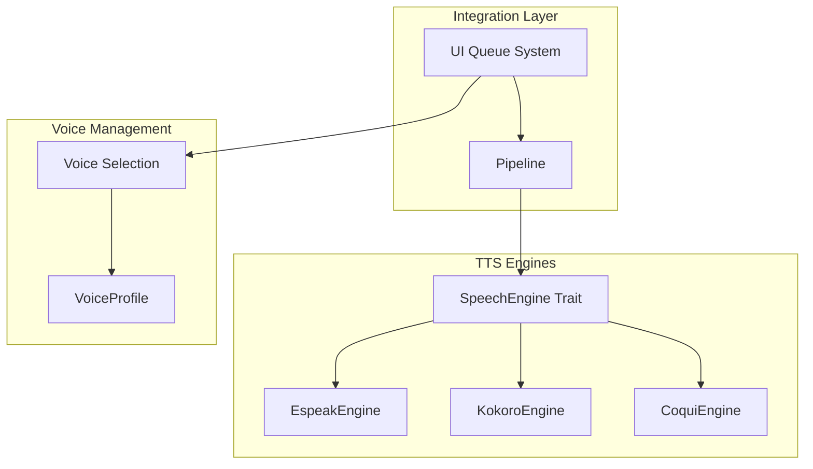
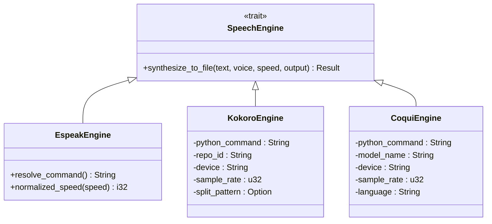
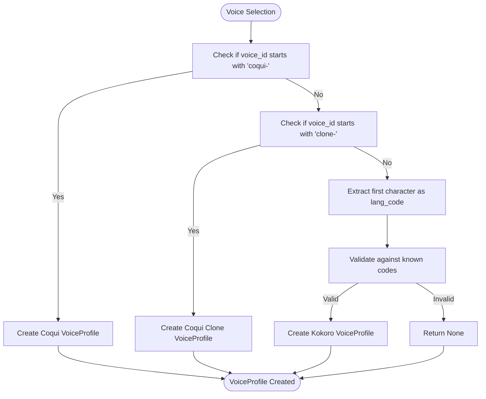
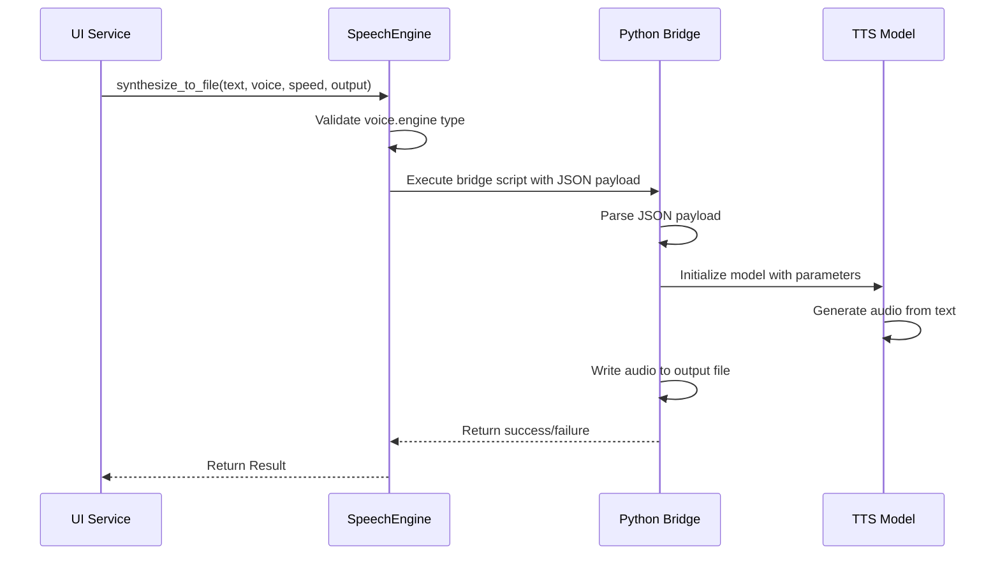
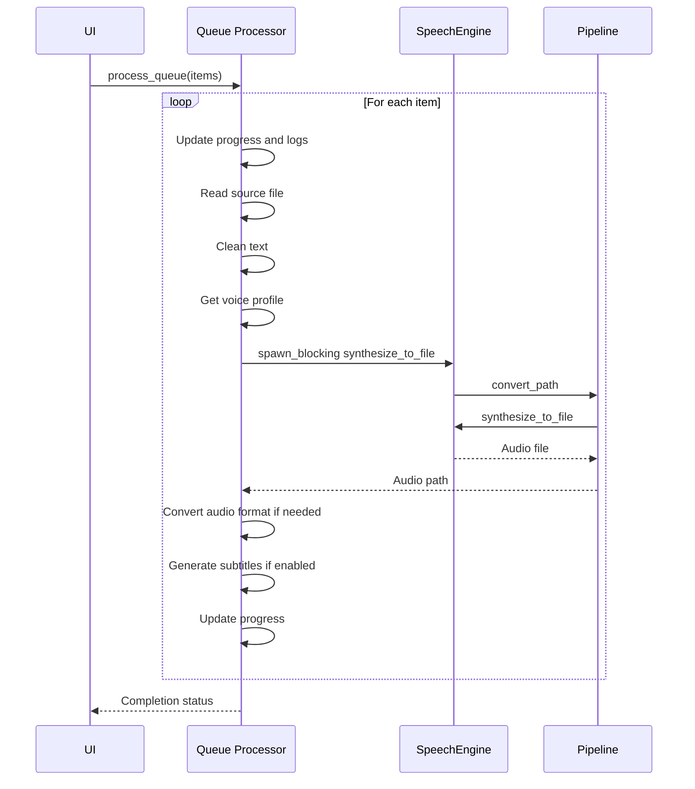

# TTS Engines

<cite>
**Referenced Files in This Document**   
- [tts.rs](file://src/tts.rs)
- [coqui_tts.rs](file://src/coqui_tts.rs)
- [tts_service.rs](file://abogen-ui/crates/ui/services/tts_service.rs)
- [voices.rs](file://abogen-ui/crates/ui/services/voices.rs)
- [pipeline.rs](file://src/pipeline.rs)
- [queue.rs](file://src/queue.rs)
- [kokoro_bridge.py](file://python/kokoro_bridge.py)
</cite>

## Table of Contents
1. [Introduction](#introduction)
2. [Core Architecture](#core-architecture)
3. [SpeechEngine Trait and Implementation](#speechengine-trait-and-implementation)
4. [VoiceProfile Structure and Voice Selection](#voiceprofile-structure-and-voice-selection)
5. [Engine-Specific Configuration and Behavior](#engine-specific-configuration-and-behavior)
6. [Integration with Pipeline and UI Queue](#integration-with-pipeline-and-ui-queue)
7. [Common Issues and Troubleshooting](#common-issues-and-troubleshooting)
8. [Performance Considerations](#performance-considerations)
9. [Conclusion](#conclusion)

## Introduction
The TTS (Text-to-Speech) engines subsystem in VoxWeave provides a unified interface for generating synthetic speech using multiple backend engines. This document details the architecture and implementation of the TTS system, focusing on the abstraction of espeak-ng, Kokoro, and CoquiTTS engines through the `SpeechEngine` trait. It explains voice management via `VoiceProfile`, engine-specific configurations, and integration points with the processing pipeline and user interface. The system is designed for extensibility, performance, and ease of use across different platforms and deployment scenarios.

## Core Architecture
The TTS subsystem is built around a trait-based architecture that abstracts different speech synthesis engines behind a common interface. This design enables the application to support multiple TTS backends while maintaining a consistent API for text synthesis. The core components include the `SpeechEngine` trait, concrete engine implementations, voice profile management, and integration with higher-level systems like the processing pipeline and UI services.

**Diagram sources**
- [tts.rs](file://src/tts.rs#L92-L218)
- [coqui_tts.rs](file://src/coqui_tts.rs#L44-L115)

**Section sources**
- [tts.rs](file://src/tts.rs#L1-L522)
- [coqui_tts.rs](file://src/coqui_tts.rs#L1-L115)

## SpeechEngine Trait and Implementation
The `SpeechEngine` trait defines the contract for all TTS engines in the system, with the primary method `synthesize_to_file` responsible for converting text to audio files. Three concrete implementations exist: `EspeakEngine`, `KokoroEngine`, and `CoquiEngine`, each handling a different backend technology.

The trait-based design allows for polymorphic usage of different engines while maintaining a consistent interface. Each engine implementation validates that the provided `VoiceProfile` matches its expected engine type, ensuring type safety and preventing incorrect engine usage.

**Diagram sources**
- [tts.rs](file://src/tts.rs#L92-L218)
- [coqui_tts.rs](file://src/coqui_tts.rs#L44-L115)

**Section sources**
- [tts.rs](file://src/tts.rs#L92-L218)
- [coqui_tts.rs](file://src/coqui_tts.rs#L44-L115)

## VoiceProfile Structure and Voice Selection
The `VoiceProfile` structure encapsulates all necessary information for a voice, including its ID, description, engine type, optional command specification, and language code. This structure serves as the primary mechanism for voice selection and configuration across the system.

Voice selection in the UI services follows a pattern-based approach: voices starting with "coqui-" are treated as Coqui TTS voices, those starting with "clone-" are treated as voice cloning profiles, and all others are assumed to be Kokoro voices. The first character of Kokoro voice IDs determines the language code, enabling automatic language detection.

**Diagram sources**
- [tts_service.rs](file://abogen-ui/crates/ui/services/tts_service.rs#L36-L68)
- [tts.rs](file://src/tts.rs#L45-L88)

**Section sources**
- [tts.rs](file://src/tts.rs#L45-L88)
- [tts_service.rs](file://abogen-ui/crates/ui/services/tts_service.rs#L36-L68)
- [voices.rs](file://abogen-ui/crates/ui/services/voices.rs#L78-L118)

## Engine-Specific Configuration and Behavior
Each TTS engine has specific configuration parameters and behavioral characteristics that are managed through environment variables and default values. The `EspeakEngine` includes speed normalization to convert floating-point speed values to integer rates compatible with the espeak command-line tool. The `KokoroEngine` and `CoquiEngine` both use Python bridges to interface with their respective neural TTS models, with configurable Python commands, model repositories, devices, and sample rates.

The espeak-ng engine normalizes speed values using a base rate of 175 words per minute, clamping the final rate between 80 and 450. This ensures compatibility with the espeak tool while providing a consistent speed interface across all engines.

**Diagram sources**
- [tts.rs](file://src/tts.rs#L132-L218)
- [coqui_tts.rs](file://src/coqui_tts.rs#L44-L115)
- [kokoro_bridge.py](file://python/kokoro_bridge.py#L1-L89)

**Section sources**
- [tts.rs](file://src/tts.rs#L132-L218)
- [coqui_tts.rs](file://src/coqui_tts.rs#L44-L115)
- [kokoro_bridge.py](file://python/kokoro_bridge.py#L1-L89)

## Integration with Pipeline and UI Queue
The TTS engines integrate with the processing pipeline through the `convert_path` and `convert_queue` functions, which handle the complete workflow from text input to audio and subtitle output. The UI queue system in `tts_service.rs` manages batch processing of multiple items, with progress tracking and cancellation support.

The UI services use `tokio::task::spawn_blocking` to run TTS synthesis in separate threads, preventing UI freezing during potentially long-running synthesis operations. The system supports audio format conversion through ffmpeg for MP3 and FLAC output, with fallback to WAV on web platforms where native ffmpeg is unavailable.

**Diagram sources**
- [tts_service.rs](file://abogen-ui/crates/ui/services/tts_service.rs#L322-L342)
- [pipeline.rs](file://src/pipeline.rs#L38-L139)
- [queue.rs](file://src/queue.rs#L1-L154)

**Section sources**
- [tts_service.rs](file://abogen-ui/crates/ui/services/tts_service.rs#L322-L342)
- [pipeline.rs](file://src/pipeline.rs#L38-L139)
- [queue.rs](file://src/queue.rs#L1-L154)

## Common Issues and Troubleshooting
Common issues with the TTS subsystem include missing external dependencies, voice compatibility errors, and audio quality differences between engines. The espeak-ng engine requires the `espeak` command to be available in the system PATH or specified via the `VOXWEAVE_ESPEAK_COMMAND` environment variable.

For Kokoro and Coqui engines, Python dependencies must be installed, and the Python command can be customized using `VOXWEAVE_KOKORO_PYTHON` and `VOXWEAVE_COQUI_PYTHON` environment variables. Missing TTS models or incorrect repository IDs will cause synthesis failures. Voice compatibility errors typically occur when attempting to use a voice with the wrong engine type, which is prevented by the engine's voice validation.

Audio quality varies significantly between engines: espeak-ng produces robotic but fast synthesis, Kokoro provides neural-quality speech with good expressiveness, and CoquiTTS offers high-quality neural synthesis with voice cloning capabilities. Users should select the appropriate engine based on their quality, latency, and resource requirements.

**Section sources**
- [tts.rs](file://src/tts.rs#L1-L522)
- [coqui_tts.rs](file://src/coqui_tts.rs#L1-L115)
- [tts_service.rs](file://abogen-ui/crates/ui/services/tts_service.rs#L322-L342)

## Performance Considerations
Performance characteristics vary significantly between TTS engines. The espeak-ng engine is lightweight and fast, suitable for batch processing large numbers of short texts. Neural engines like Kokoro and CoquiTTS require substantial computational resources, particularly when running on CPU, and are better suited for smaller batches or when GPU acceleration is available.

For batch processing, the system should limit concurrent neural TTS operations to prevent resource exhaustion. The async execution model using `spawn_blocking` allows the UI to remain responsive during synthesis, but each blocking task consumes a thread from the tokio thread pool. Resource usage for neural models includes significant memory consumption for model loading and GPU memory when using CUDA.

When using voice cloning with CoquiTTS, additional I/O overhead occurs from reading the reference audio file, and processing time increases due to the complexity of the cloning algorithm. For optimal performance, users should consider pre-loading frequently used voices and reusing engine instances rather than creating new ones for each synthesis operation.

**Section sources**
- [tts.rs](file://src/tts.rs#L1-L522)
- [coqui_tts.rs](file://src/coqui_tts.rs#L1-L115)
- [tts_service.rs](file://abogen-ui/crates/ui/services/tts_service.rs#L322-L342)

## Conclusion
The TTS engines subsystem in VoxWeave provides a flexible and extensible architecture for text-to-speech synthesis through multiple backend engines. The trait-based design with the `SpeechEngine` interface allows for easy integration of new TTS technologies while maintaining a consistent API. The `VoiceProfile` system enables rich voice management and selection, and the integration with the processing pipeline and UI queue system provides a seamless user experience for batch processing tasks. By understanding the configuration options, performance characteristics, and common issues of each engine, users can effectively leverage the system's capabilities for their specific use cases.