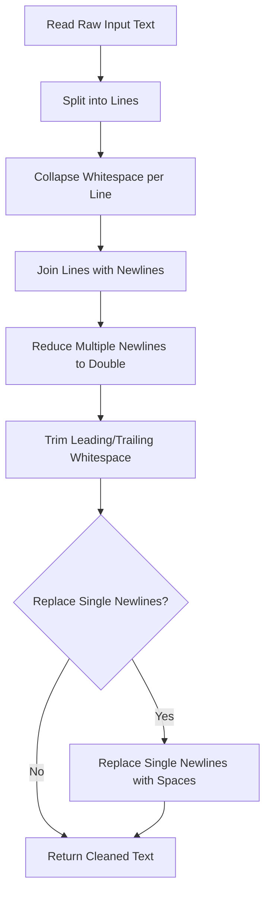
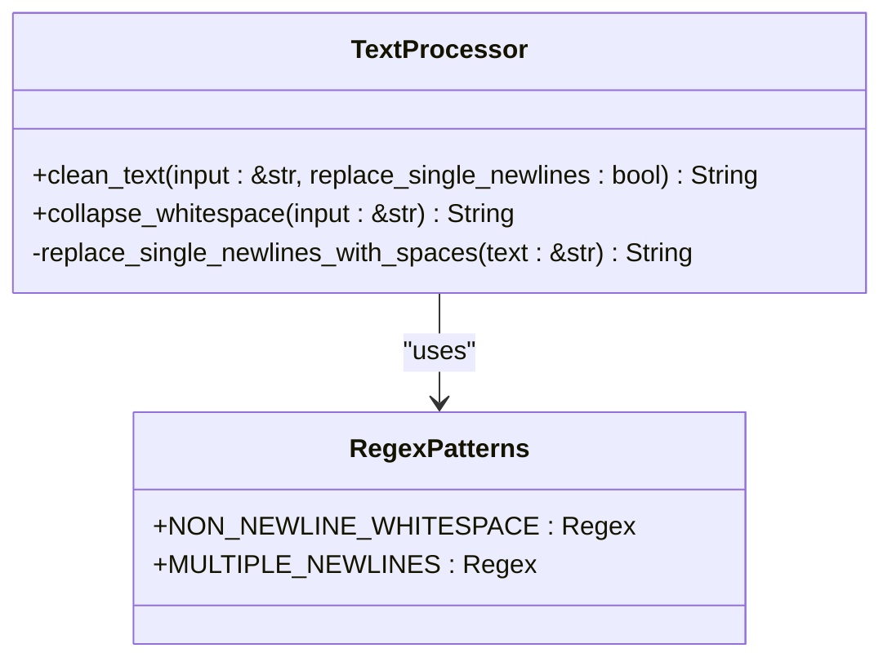
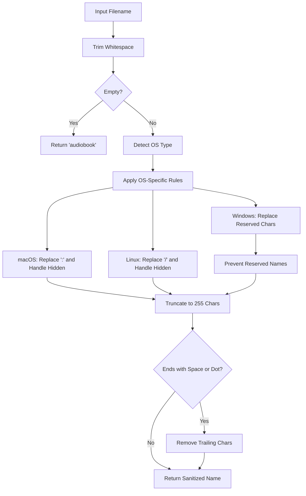
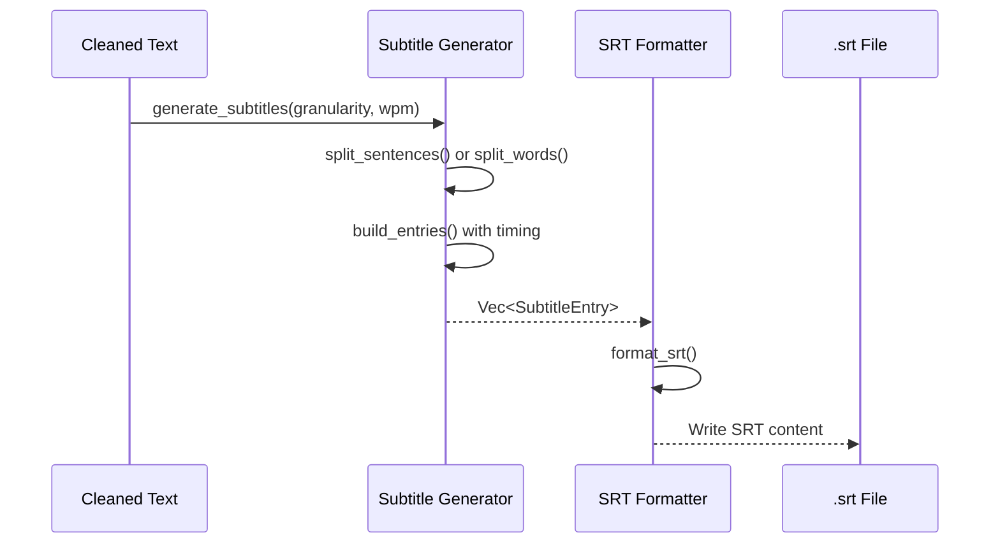
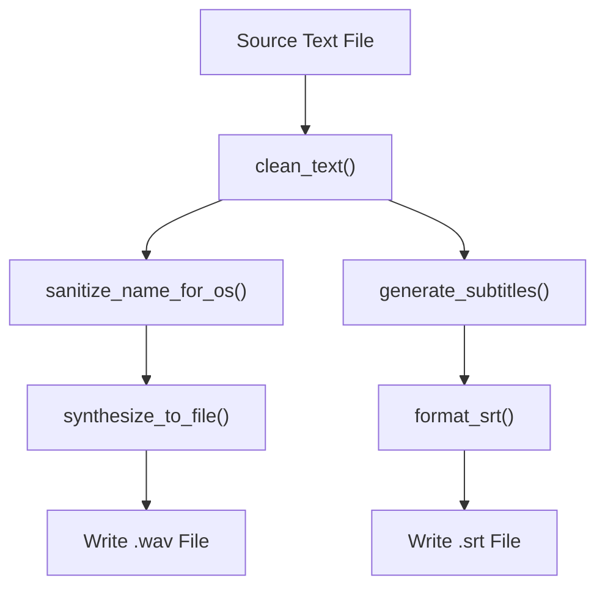

# Text Processing

<cite>
**Referenced Files in This Document**   
- [text.rs](file://src/text.rs)
- [sanitize.rs](file://src/sanitize.rs)
- [pipeline.rs](file://src/pipeline.rs)
- [subtitle.rs](file://src/subtitle.rs)
- [tts.rs](file://src/tts.rs)
- [queue.rs](file://src/queue.rs)
- [example.txt](file://samples/example.txt)
- [long_example.md](file://samples/long_example.md)
</cite>

## Table of Contents
1. [Introduction](#introduction)
2. [Text Cleaning Pipeline](#text-cleaning-pipeline)
3. [Whitespace and Newline Normalization](#whitespace-and-newline-normalization)
4. [Platform-Specific Path Sanitization](#platform-specific-path-sanitization)
5. [Subtitle Synchronization and Chunking](#subtitle-synchronization-and-chunking)
6. [Integration with TTS Synthesis](#integration-with-tts-synthesis)
7. [Input Format Handling](#input-format-handling)
8. [Common Issues and Edge Cases](#common-issues-and-edge-cases)
9. [Performance and Memory Optimization](#performance-and-memory-optimization)
10. [Conclusion](#conclusion)

## Introduction
The text processing subsystem in VoxWeave is responsible for preparing raw input text for downstream tasks such as text-to-speech (TTS) synthesis and subtitle generation. This subsystem ensures consistent formatting, handles platform-specific constraints, and structures text to support synchronized audio and visual outputs. The core functionality is implemented across two primary modules: `text.rs` for content normalization and `sanitize.rs` for file and path safety. These components work in concert within the broader pipeline to transform unstructured text into a reliable input for voice synthesis and multimedia rendering.

**Section sources**
- [text.rs](file://src/text.rs#L1-L70)
- [sanitize.rs](file://src/sanitize.rs#L1-L161)

## Text Cleaning Pipeline
The text cleaning process begins when a user submits a text file for conversion into speech. The pipeline first reads the raw content and passes it through a series of normalization functions defined in `src/text.rs`. The entry point is the `clean_text` function, which orchestrates whitespace collapsing, newline reduction, and optional single newline replacement. This preprocessing ensures that the final text presented to the TTS engine reflects natural speech patterns rather than arbitrary line breaks or spacing from the source document.

The cleaning pipeline operates in three sequential phases: per-line whitespace collapse, multiple newline reduction, and conditional newline-to-space conversion. Each phase is designed to preserve semantic structure while eliminating formatting noise. The result is a clean, uniformly formatted string that maintains paragraph integrity and readability for both audio narration and subtitle display.

**Diagram sources**
- [text.rs](file://src/text.rs#L15-L35)

**Section sources**
- [text.rs](file://src/text.rs#L15-L35)
- [pipeline.rs](file://src/pipeline.rs#L40-L45)

## Whitespace and Newline Normalization
Whitespace normalization is handled by two key functions: `collapse_whitespace` and `clean_text`. The `collapse_whitespace` function removes leading and trailing spaces from each line and replaces sequences of non-newline whitespace characters (such as tabs and multiple spaces) with a single space. This is achieved using a regular expression (`[^\S\n]+`) that matches any whitespace except newlines, ensuring line structure remains intact during cleaning.

Newline handling distinguishes between single line breaks (which may represent soft wraps) and double or triple breaks (which indicate paragraph separation). The `MULTIPLE_NEWLINES` regex (`\n{3,}`) identifies sequences of three or more newlines and reduces them to exactly two, preserving paragraph boundaries while eliminating excessive spacing. When the `replace_single_newlines` flag is enabled, isolated newlines within paragraphs are replaced with spaces, enabling continuous narration across wrapped lines.

This approach allows users to maintain readable source formatting without affecting the final audio output. For example, a markdown file with hard-wrapped lines will be read as a continuous passage, while intentional blank lines between sections will be preserved as pauses.

**Diagram sources**
- [text.rs](file://src/text.rs#L3-L13)
- [text.rs](file://src/text.rs#L15-L45)

**Section sources**
- [text.rs](file://src/text.rs#L3-L45)
- [text.rs](file://src/text.rs#L50-L65)

## Platform-Specific Path Sanitization
The `sanitize.rs` module provides robust filename sanitization tailored to the host operating system. It defines an `OperatingSystem` enum that automatically detects the current platform at compile time using Rust's target configuration attributes. This enables conditional logic for Windows, macOS, Linux, and other systems, ensuring compatibility with each platform's filesystem restrictions.

On Windows, the sanitizer replaces reserved characters (`<`, `>`, `:`, `"`, `|`, `?`, `*`, `\`, `/`) and control characters (ASCII < 32) with underscores. It also prevents filenames from ending in spaces or periods and prefixes names that match reserved device names like `CON`, `AUX`, or `COM1`. On macOS, colons are replaced (as they are path separators), and hidden folders (starting with `.`) are renamed to avoid conflicts. Linux and other Unix-like systems replace forward slashes and control characters, applying similar rules for hidden directories.

The sanitization process also enforces a 255-character limit on filenames, truncating longer names while preserving validity by removing trailing spaces or dots. Empty inputs default to "audiobook", ensuring every output file has a valid name.

**Diagram sources**
- [sanitize.rs](file://src/sanitize.rs#L1-L161)

**Section sources**
- [sanitize.rs](file://src/sanitize.rs#L1-L161)
- [pipeline.rs](file://src/pipeline.rs#L46-L48)

## Subtitle Synchronization and Chunking
Text chunking for subtitle synchronization is managed by the `generate_subtitles` function in `src/subtitle.rs`. This function divides cleaned text into segments based on either sentence boundaries or fixed word counts, depending on the configured `SubtitleGranularity`. Sentence-level chunking uses a regular expression to split text at punctuation marks (`.`, `!`, `?`), preserving complete thoughts in each subtitle entry. Word-based chunking groups text into fixed-size blocks (e.g., every 2 or 5 words), which is useful for fast-paced narration where sentence breaks might be too long.

Each subtitle entry is assigned timing information based on an estimated reading speed (words per minute). The `build_entries` function calculates duration by dividing 60,000 milliseconds by the average WPM, then multiplying by the word count in each chunk. A minimum duration of 500ms ensures visibility, even for short phrases. The cursor advances cumulatively, creating a continuous timeline from the start of the audio to the end.

The resulting `SubtitleEntry` objects contain index, start time, end time, and text, which are then formatted into SRT (SubRip) format with precise timestamp formatting (HH:MM:SS,mmm). This structured output enables accurate synchronization with the generated audio.

**Diagram sources**
- [subtitle.rs](file://src/subtitle.rs#L10-L50)
- [subtitle.rs](file://src/subtitle.rs#L52-L95)

**Section sources**
- [subtitle.rs](file://src/subtitle.rs#L10-L156)
- [pipeline.rs](file://src/pipeline.rs#L41-L44)

## Integration with TTS Synthesis
The text processing pipeline integrates tightly with TTS synthesis through the `convert_path` function in `src/pipeline.rs`. After text cleaning and sanitization, the processed text is passed to a speech engine (e.g., espeak, Kokoro, or Coqui) for audio generation. The cleaned text ensures that the TTS engine receives consistent input free of formatting artifacts that could disrupt pronunciation or pacing.

The pipeline preserves the relationship between text and subtitles by using the same cleaned input for both audio synthesis and subtitle generation. This guarantees alignment between spoken content and on-screen captions. The `ConvertRequest` struct carries configuration such as voice profile, speed, and subtitle settings, enabling coordinated processing across modalities.

If the input text is empty after cleaning, the system skips subtitle generation but still produces an empty audio file to maintain output consistency. This behavior supports edge cases like placeholder files or conditional content without breaking the pipeline.

**Diagram sources**
- [pipeline.rs](file://src/pipeline.rs#L40-L55)
- [tts.rs](file://src/tts.rs#L150-L200)

**Section sources**
- [pipeline.rs](file://src/pipeline.rs#L40-L55)
- [tts.rs](file://src/tts.rs#L150-L200)

## Input Format Handling
VoxWeave processes both plain text and markdown inputs uniformly through the same cleaning pipeline. While no special parsing is applied to markdown syntax (e.g., headers or lists), the normalization process ensures that structural elements like paragraphs and line breaks are preserved in a speech-friendly format. For instance, a markdown document with soft-wrapped lines will be read as continuous prose when `replace_single_newlines` is enabled, while explicit blank lines between sections will create natural pauses.

The system does not interpret markdown semantics (such as bold or italics) for voice modulation, treating all text as plain content. However, this design choice ensures reliability across diverse input formats without requiring complex parsing logic. Users can prepare content in their preferred editor, confident that the output will reflect the intended narrative flow.

Sample files like `example.txt` and `long_example.md` demonstrate how different formatting styles are normalized into consistent audio and subtitle outputs.

**Section sources**
- [example.txt](file://samples/example.txt#L1-L4)
- [long_example.md](file://samples/long_example.md#L1-L20)

## Common Issues and Edge Cases
Several edge cases are addressed by the text processing subsystem. On Windows, filenames containing reserved device names (e.g., "CON.txt") are automatically prefixed with an underscore to prevent filesystem errors. Similarly, inputs with invalid characters or excessive length are sanitized to ensure cross-platform compatibility.

Empty or whitespace-only inputs default to "audiobook" as both filename and content fallback, preventing silent failures. The system handles large text inputs by processing them in memory-efficient ways, avoiding unnecessary copies through the use of `Cow` (Clone-on-Write) in sanitization and streaming-friendly iterators in text splitting.

Paragraph structure is preserved by reducing only excessive newlines (three or more) to double breaks, while single newlines can be optionally replaced with spaces. This maintains readability in the source while enabling natural narration flow.

**Section sources**
- [sanitize.rs](file://src/sanitize.rs#L59-L80)
- [text.rs](file://src/text.rs#L20-L30)
- [sanitize.rs](file://src/sanitize.rs#L127-L160)

## Performance and Memory Optimization
The text processing pipeline is optimized for efficiency, particularly when handling large documents. Regular expressions are compiled once using `Lazy<Regex>` to avoid recompilation overhead. The `split` and `collect` operations in `clean_text` minimize allocations by processing lines incrementally, and `String::with_capacity` is used where possible to pre-allocate buffers.

For very long texts, the system avoids deep recursion or nested processing, relying instead on linear passes over the input. Subtitle chunking uses iterator-based processing (`split_whitespace().chunks()`) to group words without loading the entire text into intermediate collections unnecessarily.

Memory usage scales linearly with input size, and the pipeline is designed to complete processing in a single pass where possible. This makes it suitable for batch processing of extensive literary works or technical documents without excessive resource consumption.

**Section sources**
- [text.rs](file://src/text.rs#L3-L13)
- [subtitle.rs](file://src/subtitle.rs#L70-L95)

## Conclusion
The text processing subsystem in VoxWeave provides a robust foundation for transforming raw text into synchronized audio and subtitle outputs. By combining intelligent whitespace normalization, platform-aware sanitization, and configurable subtitle chunking, it ensures high-quality results across diverse input formats and operating systems. The modular design enables clear separation of concerns, making the system maintainable and extensible. Through careful attention to edge cases and performance, VoxWeave delivers reliable text-to-speech conversion suitable for both casual users and production workflows.