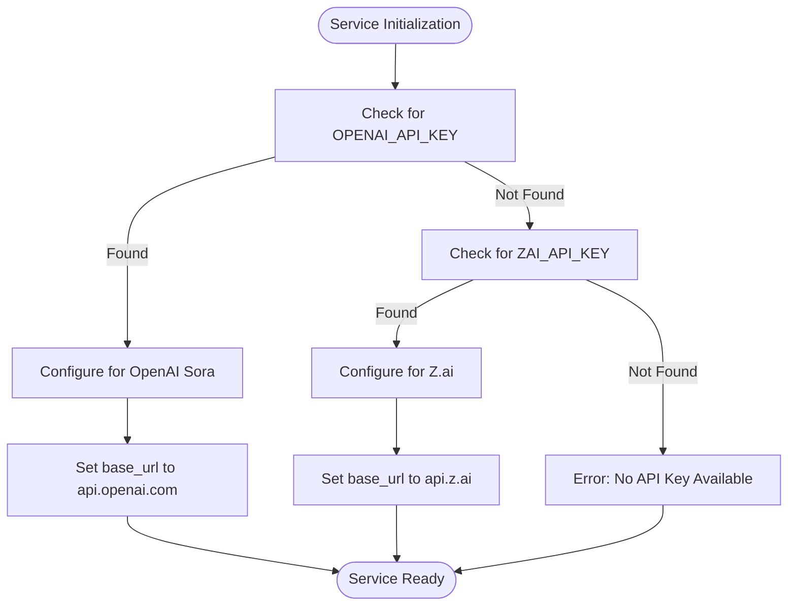
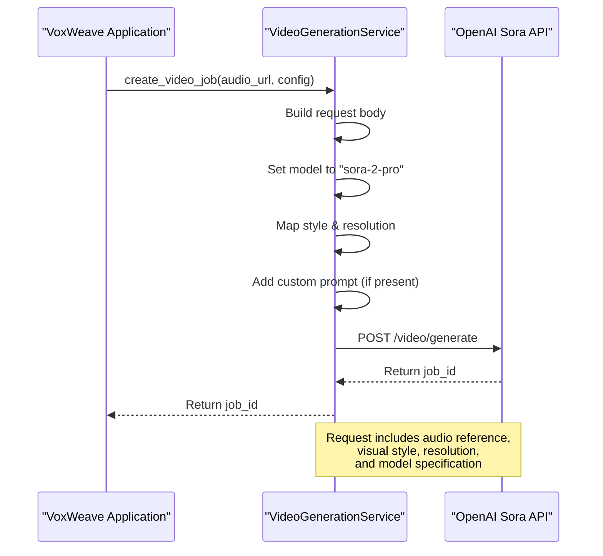
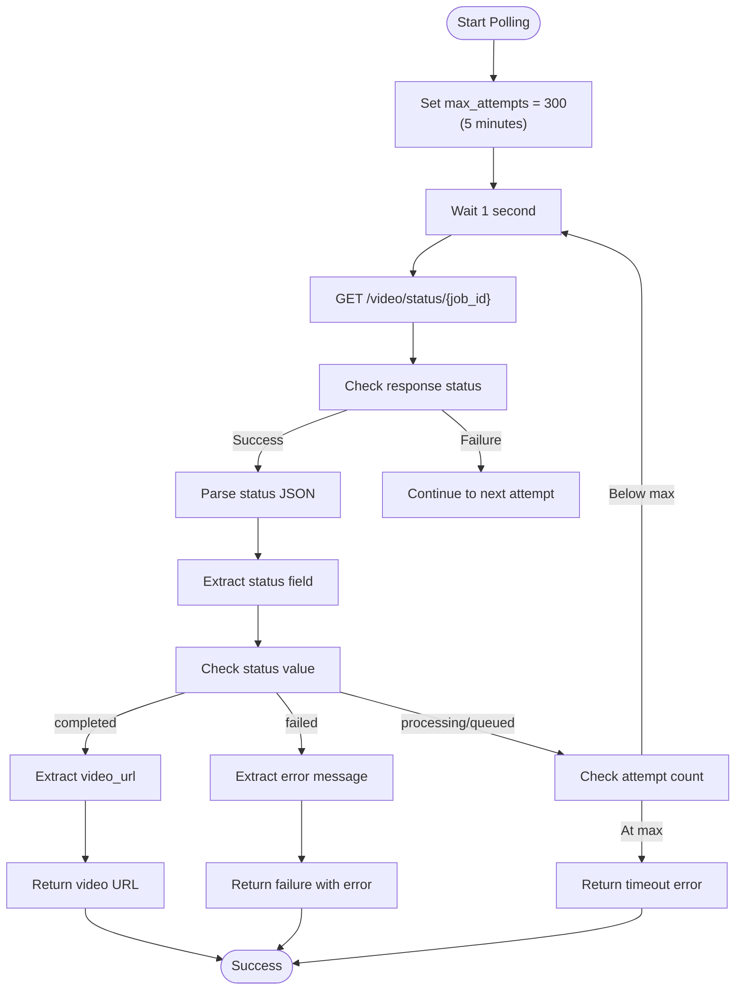

# OpenAI Sora Support

<cite>
**Referenced Files in This Document**   
- [src/video.rs](file://src/video.rs)
</cite>

## Table of Contents
1. [Introduction](#introduction)
2. [Sora Service Initialization](#sora-service-initialization)
3. [Video Job Creation](#video-job-creation)
4. [Status Polling and Progress Tracking](#status-polling-and-progress-tracking)
5. [Integration with Core Pipeline](#integration-with-core-pipeline)
6. [Error Handling and Fallback](#error-handling-and-fallback)
7. [Configuration Requirements](#configuration-requirements)

## Introduction
This document details the implementation of OpenAI Sora video generation support within the VoxWeave application. The system leverages the `VideoGenerationService` in `src/video.rs` to interface with OpenAI's video generation API through the `VideoProvider::OpenAISora` variant. The implementation provides a complete workflow from service initialization to video generation, status monitoring, and final output delivery. The architecture is designed to seamlessly integrate with the existing audio and subtitle pipeline while maintaining compatibility with both CLI and GUI interfaces.

**Section sources**
- [src/video.rs](file://src/video.rs#L1-L50)

## Sora Service Initialization
The `VideoGenerationService` is initialized through two primary methods: direct API key provision via `new()` and environment-based initialization via `from_env()`. The service detects OpenAI Sora availability by checking for the `OPENAI_API_KEY` environment variable. When present, the service configures itself with the OpenAI base URL (`https://api.openai.com/v1`) instead of the default Z.ai endpoint. This environment detection allows seamless switching between video generation providers without code changes. The initialization process prioritizes OpenAI's API key, falling back to ZAI_API_KEY only when the OpenAI key is not available, enabling a graceful degradation strategy.

**Diagram sources**
- [src/video.rs](file://src/video.rs#L50-L65)

**Section sources**
- [src/video.rs](file://src/video.rs#L50-L65)

## Video Job Creation
The `create_video_job` method implements the Sora-specific request structure for video generation. When OpenAI Sora is detected, the request body is configured with the `sora-2-pro` model identifier and includes essential parameters such as audio URL, visual style, resolution, and optional custom prompts. The method constructs a JSON request with the following structure: audio reference, style parameter (converted from `VideoStyle` enum), resolution setting (mapped from `VideoResolution` enum), and model specification. For example, a 1080p resolution request is translated to the dimensions 1920x1080 in the API call. Custom prompts from the `VideoConfig` are included when provided, allowing users to influence the generated content's visual characteristics.

**Diagram sources**
- [src/video.rs](file://src/video.rs#L180-L210)

**Section sources**
- [src/video.rs](file://src/video.rs#L180-L210)

## Status Polling and Progress Tracking
The `poll_video_status` method implements a robust polling mechanism to monitor Sora video generation jobs. The system polls the API every second for up to 5 minutes (300 attempts), providing a reasonable timeout for video generation. The polling loop checks for three primary states: `completed`, `failed`, and `processing`/`queued`. Upon completion, the method extracts the video content URL from the response and returns it for download. The progress tracking system maps Sora's percentage-based progress to a 20-90% range in the application's progress bar, reserving the remaining percentages for upload and download phases. This creates a seamless user experience where progress appears continuous throughout the entire workflow.

**Diagram sources**
- [src/video.rs](file://src/video.rs#L215-L260)

**Section sources**
- [src/video.rs](file://src/video.rs#L215-L260)

## Integration with Core Pipeline
The Sora implementation integrates with VoxWeave's core pipeline through the `generate_video` method, which orchestrates the complete video generation workflow. The process begins with audio file upload, followed by video job creation, status polling, video download, and optional subtitle embedding. Currently, the Sora workflow does not directly incorporate audio and subtitle inputs into the video generation phase; instead, it uses the audio file as a reference for timing and generates visuals independently. Subtitles are handled in a post-processing step through the `embed_subtitles` method, which uses FFmpeg to burn subtitles into the video or provides them as a separate file if FFmpeg is unavailable. This separation allows the system to leverage Sora's advanced video generation capabilities while maintaining compatibility with the existing subtitle system.

**Section sources**
- [src/video.rs](file://src/video.rs#L70-L175)

## Error Handling and Fallback
The implementation includes comprehensive error handling for various failure scenarios in the Sora workflow. API failures are caught and propagated with descriptive messages, including HTTP status codes and error text from the OpenAI API. The 5-minute timeout mechanism prevents indefinite waiting for video generation. When Sora is unavailable (due to missing API key, service outage, or authentication issues), the system can fall back to alternative video generation providers if configured. The `from_env()` method's fallback to ZAI_API_KEY provides a built-in redundancy mechanism. Additionally, the subtitle embedding process includes error handling that allows the workflow to continue with a video-only output if subtitle integration fails, ensuring that partial results are still available to the user.

**Section sources**
- [src/video.rs](file://src/video.rs#L240-L250)

## Configuration Requirements
To enable OpenAI Sora support in VoxWeave, users must set the `OPENAI_API_KEY` environment variable with a valid API key. When this variable is present, the system automatically configures itself to use the OpenAI Sora API instead of alternative video generation services. No additional configuration is required for basic functionality, as the system uses sensible defaults for video style (Cyberpunk), resolution (1080p), and format (MP4). Users can customize the generation process by setting the `prompt` field in `VideoConfig` to influence the visual output. The system supports all resolution options (720p, 1080p, 4K) and formats (MP4, MOV, WEBM) through the standard configuration interface, with appropriate mapping to Sora's capabilities.

**Section sources**
- [src/video.rs](file://src/video.rs#L50-L65)