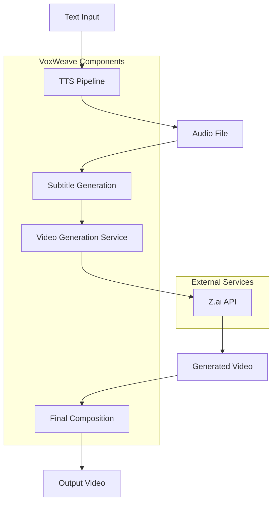
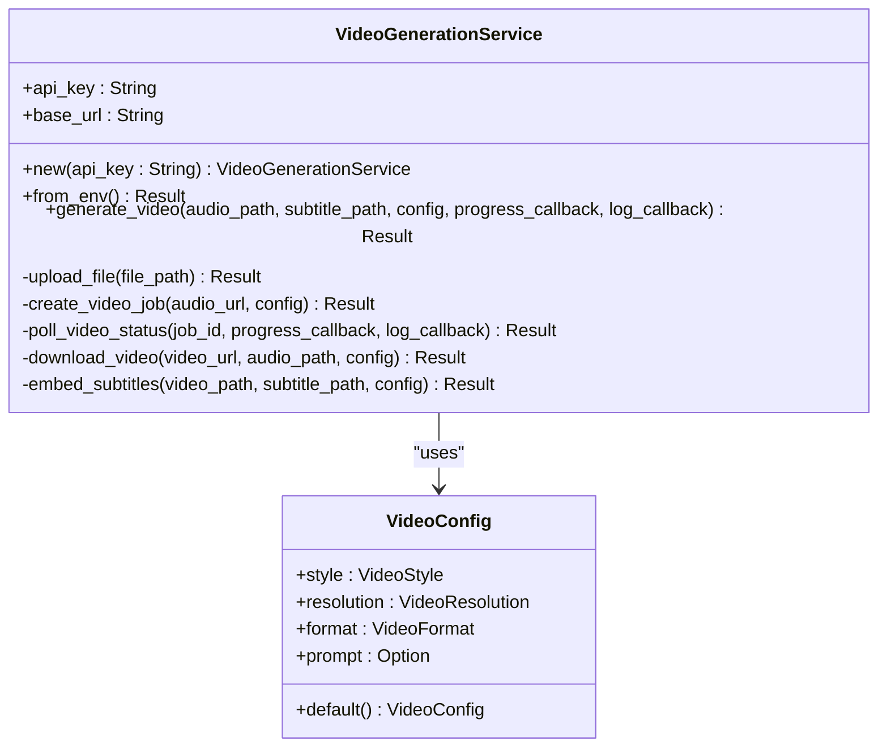
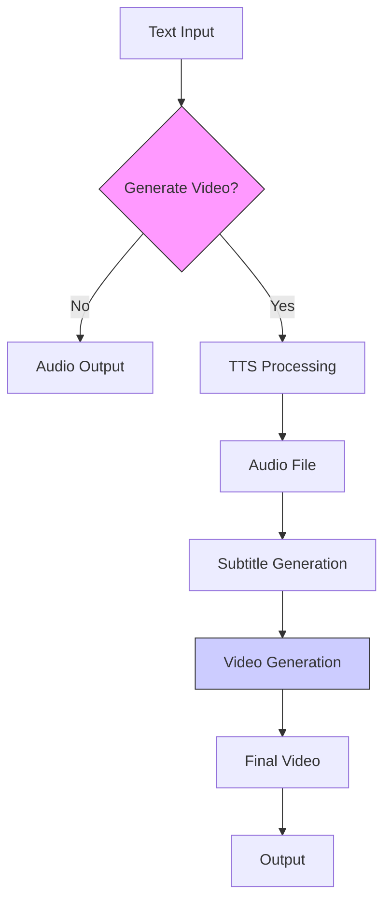
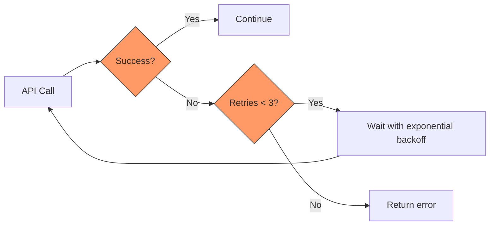

# Video Generation

<cite>
**Referenced Files in This Document**   
- [video.rs](file://src/video.rs)
- [video_generation.rs](file://abogen-ui/crates/ui/services/video_generation.rs)
- [tts.rs](file://src/tts.rs)
- [queue.rs](file://src/queue.rs)
- [ZAI_VIDEO_FEATURE.md](file://abogen-ui/ZAI_VIDEO_FEATURE.md)
- [VIDEO_INTEGRATION_PLAN.md](file://abogen-ui/VIDEO_INTEGRATION_PLAN.md)
- [CLI_VIDEO_GENERATION.md](file://CLI_VIDEO_GENERATION.md)
- [main.rs](file://src/main.rs)
</cite>

## Table of Contents
1. [Introduction](#introduction)
2. [Video Generation Service Architecture](#video-generation-service-architecture)
3. [Core Components](#core-components)
4. [Video Configuration Options](#video-configuration-options)
5. [Video Generation Workflow](#video-generation-workflow)
6. [Integration with TTS Pipeline](#integration-with-tts-pipeline)
7. [UI Integration](#ui-integration)
8. [Error Handling and Fallback Mechanisms](#error-handling-and-fallback-mechanisms)
9. [Performance Considerations](#performance-considerations)
10. [Troubleshooting Guide](#troubleshooting-guide)

## Introduction

The video generation subsystem of VoxWeave enables automated creation of narrated videos with AI-generated visuals using the Z.ai API. This system integrates with the existing TTS pipeline to transform text input into complete video content with synchronized audio, subtitles, and AI-generated visuals. The implementation supports multiple video styles, resolutions, and formats, providing users with extensive customization options for their video content.

**Section sources**
- [video.rs](file://src/video.rs#L1-L50)
- [ZAI_VIDEO_FEATURE.md](file://abogen-ui/ZAI_VIDEO_FEATURE.md#L1-L50)

## Video Generation Service Architecture

The video generation service follows a modular architecture that separates concerns between configuration, service implementation, and integration points. The core service is implemented in Rust with async capabilities using tokio, enabling non-blocking operations for API calls and file operations.



**Diagram sources**
- [video.rs](file://src/video.rs#L1-L50)
- [tts.rs](file://src/tts.rs#L1-L50)

## Core Components

The video generation subsystem consists of several key components that work together to produce the final video output. The primary component is the `VideoGenerationService` struct, which handles all interactions with the Z.ai API. This service manages the complete video generation lifecycle from audio upload to final video download.

The service supports two provider abstractions: Z.AI and OpenAI Sora, with automatic detection based on environment variables. When both `OPENAI_API_KEY` and `ZAI_API_KEY` are present, OpenAI is preferred. The service implementation includes comprehensive error handling and retry mechanisms to ensure reliability in production environments.



**Diagram sources**
- [video.rs](file://src/video.rs#L50-L100)
- [queue.rs](file://src/queue.rs#L1-L20)

**Section sources**
- [video.rs](file://src/video.rs#L50-L150)

## Video Configuration Options

The video generation system provides extensive configuration options to customize the output video according to user requirements. These options are encapsulated in the `VideoConfig` struct, which defines the visual style, resolution, format, and custom prompts for video generation.

### Style Options

The system supports multiple video styles, each providing a distinct visual aesthetic:

| Style | Description | Use Case |
|-------|-------------|---------|
| **Realistic** | Photorealistic visuals with natural lighting | Documentaries, educational content |
| **Anime** | Anime/manga art style with vibrant colors | Animated content, youth-oriented videos |
| **3D** | 3D rendered graphics with depth effects | Product demonstrations, technical visualizations |
| **Cinematic** | Movie-like cinematography and dramatic lighting | Professional productions, storytelling |
| **Biotech** | Scientific/biotech themed visuals with DNA particles | Science communication, medical content |
| **Cyberpunk** | Futuristic neon aesthetics with digital rain effects | Tech content, futuristic themes |
| **Educational** | Clean, professional style with minimal distractions | Classroom materials, tutorials |

### Resolution and Format Options

The system supports three resolution options and multiple output formats:

**Resolutions:**
- **720p (1280×720)**: HD quality, faster processing
- **1080p (1920×1080)**: Full HD quality, balanced performance
- **4K (3840×2160)**: Ultra HD quality, highest visual fidelity

**Formats:**
- **MP4**: Widely compatible, efficient compression
- **MOV**: High quality, preferred for editing
- **WebM**: Web-optimized, smaller file sizes

### Custom Prompts

Users can provide custom prompts to influence the visual generation process. These prompts are passed directly to the Z.ai API and can include specific instructions about scene composition, camera movements, or visual elements to include.

**Section sources**
- [video.rs](file://src/video.rs#L10-L40)
- [queue.rs](file://src/queue.rs#L1-L67)
- [ZAI_VIDEO_FEATURE.md](file://abogen-ui/ZAI_VIDEO_FEATURE.md#L50-L150)

## Video Generation Workflow

The video generation process follows a structured workflow with five distinct phases: audio upload, job creation, status polling, video download, and subtitle embedding. This workflow ensures reliable video generation with proper error handling and progress tracking.

```mermaid
sequenceDiagram
participant Client
participant VideoService
participant ZAI_API
participant Storage
Client->>VideoService : generate_video()
VideoService->>VideoService : Upload audio file
VideoService->>ZAI_API : POST /upload
ZAI_API-->>VideoService : File URL
VideoService->>ZAI_API : POST /video/generate
ZAI_API-->>VideoService : Job ID
loop Poll every 1s
VideoService->>ZAI_API : GET /video/status/{job_id}
ZAI_API-->>VideoService : Status & Progress
alt Processing
VideoService->>Client : Update progress
else Completed
break
end
end
VideoService->>ZAI_API : GET video_url
ZAI_API-->>Storage : Video file
VideoService->>Storage : Download video
alt Subtitles provided
VideoService->>VideoService : Embed subtitles
end
VideoService-->>Client : Video path
```

**Diagram sources**
- [video.rs](file://src/video.rs#L150-L300)

**Section sources**
- [video.rs](file://src/video.rs#L150-L350)

### Job Creation Process

The `create_video_job` function initiates the video generation process by sending a request to the Z.ai API with the necessary parameters:

1. The audio file URL obtained from the upload phase
2. Video style configuration
3. Resolution settings
4. Optional custom prompt

The function constructs a JSON request body with these parameters and sends it to the `/video/generate` endpoint. It includes error handling for API failures and validates the response to extract the job ID for subsequent polling.

### Polling Mechanism

The `poll_video_status` function implements a polling mechanism to monitor the video generation progress:

- **Polling interval**: 1 second
- **Maximum attempts**: 300 (5-minute timeout)
- **Progress updates**: Forwarded to the progress callback
- **Status handling**: Processes "queued", "processing", "completed", and "failed" states

The function uses exponential backoff in case of temporary network issues and provides detailed error messages for failed jobs.

**Section sources**
- [video.rs](file://src/video.rs#L194-L283)

## Integration with TTS Pipeline

The video generation service is tightly integrated with the TTS pipeline to create a seamless text-to-video workflow. The integration follows the sequence: text → TTS audio → subtitles → video generation.

When a video generation request is initiated, the system first generates audio using the configured TTS engine (espeak, Kokoro, or Coqui). Simultaneously, it generates subtitle files with precise timing information. These assets are then passed to the video generation service as inputs.

The integration is implemented in the main application logic, where the video generation step is conditionally executed based on user configuration. The service coordinates the entire pipeline, ensuring proper synchronization between audio, subtitles, and video elements.



**Diagram sources**
- [main.rs](file://src/main.rs#L300-L400)
- [tts.rs](file://src/tts.rs#L1-L50)

**Section sources**
- [main.rs](file://src/main.rs#L300-L422)
- [tts.rs](file://src/tts.rs#L1-L100)

## UI Integration

The video generation features are exposed through both command-line and graphical user interfaces, providing flexibility for different user workflows.

### Command-Line Interface

The CLI provides comprehensive options for video generation:

```
voxweave video [OPTIONS] <INPUT>
  --style <STYLE>            Video style [default: cyberpunk]
  --resolution <RESOLUTION>  Video resolution [default: 1080p]
  --format <FORMAT>          Video format [default: mp4]
  --prompt <PROMPT>          Custom visual prompt
```

The CLI implementation in `main.rs` parses these options and configures the `VideoConfig` accordingly before invoking the generation service.

### Graphical User Interface

The desktop UI includes a dedicated video generation section with:

- Checkbox to enable video generation
- Dropdown for video style selection
- Dropdown for resolution selection
- Text area for custom prompts
- Real-time progress visualization
- Log output panel

The UI components are implemented in the `abogen-ui` crate, with the `video_generation.rs` service handling the backend integration.

**Section sources**
- [main.rs](file://src/main.rs#L300-L422)
- [VIDEO_INTEGRATION_PLAN.md](file://abogen-ui/VIDEO_INTEGRATION_PLAN.md#L1-L200)
- [CLI_VIDEO_GENERATION.md](file://CLI_VIDEO_GENERATION.md#L1-L100)

## Error Handling and Fallback Mechanisms

The video generation system implements comprehensive error handling to ensure reliability and provide meaningful feedback to users.

### Common Issues and Solutions

**API Rate Limits:**
- Implement exponential backoff in retry logic
- Limit concurrent requests
- Cache responses when possible

**Authentication Failures:**
- Validate API keys on service initialization
- Provide clear error messages about missing environment variables
- Support multiple API providers as fallback

**Video Generation Timeouts:**
- Set reasonable timeout limits (5 minutes)
- Provide progress updates during polling
- Allow resumption from last known state

**Subtitle Embedding Failures:**
- Fallback to external subtitle files
- Copy original video if embedding fails
- Log detailed error information

The system includes a retry mechanism with exponential backoff for API calls, attempting up to three times before failing. This helps mitigate transient network issues and API server load.



**Diagram sources**
- [video_generation.rs](file://abogen-ui/crates/ui/services/video_generation.rs#L400-L450)

**Section sources**
- [video.rs](file://src/video.rs#L239-L283)
- [video_generation.rs](file://abogen-ui/crates/ui/services/video_generation.rs#L400-L486)

## Performance Considerations

The video generation system is designed with performance and resource usage in mind, addressing key considerations for large video files and network bandwidth.

### Processing Times

Generation times vary based on resolution and content length:

| Resolution | Average Time | Use Case |
|----------|-------------|---------|
| 720p | 1-2 minutes | Quick turnaround, web content |
| 1080p | 2-4 minutes | Standard quality, general use |
| 4K | 4-5 minutes | High quality, professional output |

### Network Bandwidth

The system optimizes network usage by:
- Streaming uploads and downloads
- Compressing audio files before upload
- Using efficient video codecs
- Implementing progressive loading

### Resource Management

For large video files, the system:
- Uses asynchronous I/O operations
- Implements memory-efficient streaming
- Provides progress callbacks for long operations
- Supports cancellation of ongoing operations

The implementation uses tokio for async operations, allowing efficient handling of multiple concurrent video generation tasks without blocking the main thread.

**Section sources**
- [video.rs](file://src/video.rs#L300-L400)
- [CLI_VIDEO_GENERATION.md](file://CLI_VIDEO_GENERATION.md#L200-L250)

## Troubleshooting Guide

This section addresses common issues encountered when using the video generation subsystem and provides solutions.

### Environment Configuration

**Issue:** "Neither OPENAI_API_KEY nor ZAI_API_KEY environment variable is set"
**Solution:** Set the appropriate API key environment variable:
```bash
export ZAI_API_KEY=your_api_key_here
```

### Dependency Requirements

Ensure the following dependencies are installed:
- **ZAI_API_KEY** or **OPENAI_API_KEY** environment variable
- **video-generation** feature enabled
- **real-tts** feature enabled for audio generation
- **MLT** and **FFmpeg** installed for final composition

### Common Errors

**Upload Failed:**
- Check network connectivity
- Verify file permissions
- Ensure file size is within API limits

**Video Generation Failed:**
- Check API key validity
- Verify service availability
- Review custom prompt for invalid characters

**Subtitle Embedding Failed:**
- Install FFmpeg if not available
- Check write permissions for output directory
- Verify subtitle file format

The system provides detailed logging through the log callback mechanism, with different log levels (Info, Notice, Warning, Error) to help diagnose issues.

**Section sources**
- [video.rs](file://src/video.rs#L1-L50)
- [ZAI_VIDEO_FEATURE.md](file://abogen-ui/ZAI_VIDEO_FEATURE.md#L150-L170)
- [CLI_VIDEO_GENERATION.md](file://CLI_VIDEO_GENERATION.md#L300-L330)