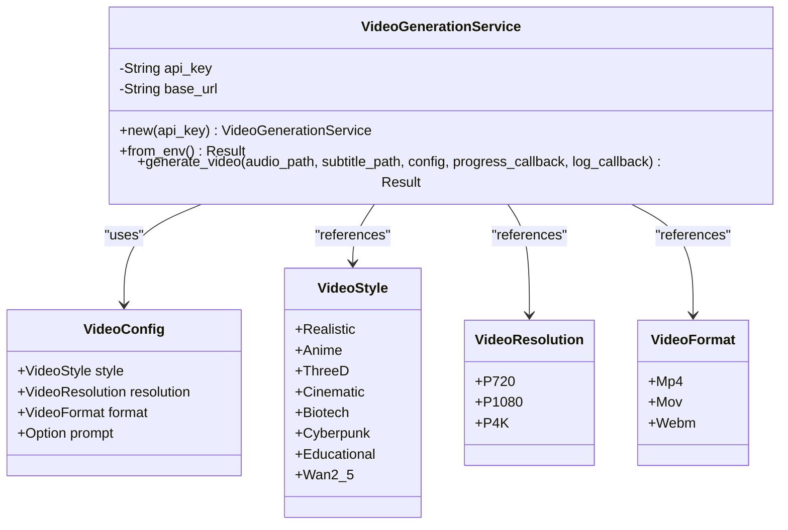
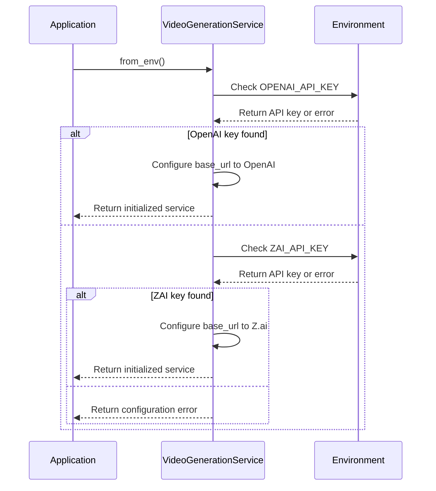
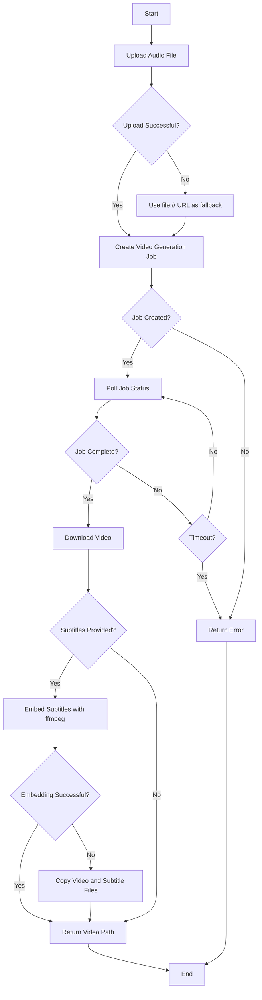
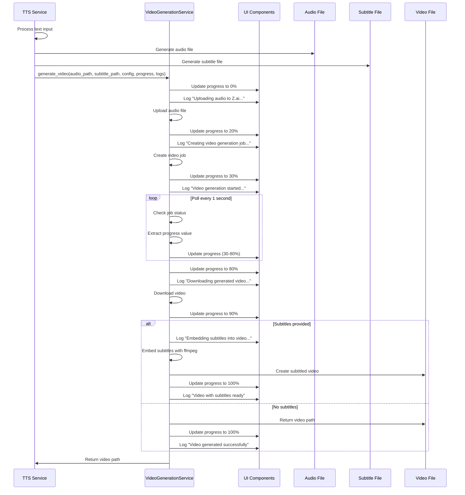
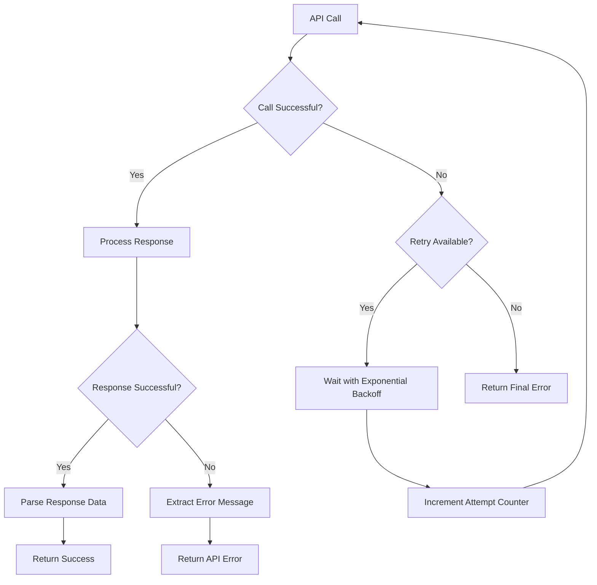

# Video Service Architecture

<cite>
**Referenced Files in This Document**   
- [src/video.rs](file://src/video.rs)
- [abogen-ui/crates/ui/services/video_generation.rs](file://abogen-ui/crates/ui/services/video_generation.rs)
- [src/queue.rs](file://src/queue.rs)
- [abogen-ui/crates/ui/lib.rs](file://abogen-ui/crates/ui/lib.rs)
- [abogen-ui/crates/ui/services/tts_service.rs](file://abogen-ui/crates/ui/services/tts_service.rs)
</cite>

## Table of Contents
1. [Introduction](#introduction)
2. [Core Components](#core-components)
3. [Service Initialization and Provider Abstraction](#service-initialization-and-provider-abstraction)
4. [Video Generation Workflow](#video-generation-workflow)
5. [Integration with TTS Pipeline](#integration-with-tts-pipeline)
6. [Error Handling and Resilience](#error-handling-and-resilience)
7. [Performance Considerations](#performance-considerations)

## Introduction
The VoxWeave video generation service provides a robust architecture for creating AI-generated videos from text-to-speech audio with synchronized subtitles. The system integrates with external video generation APIs (Z.ai and OpenAI) to produce high-quality videos with various visual styles, resolutions, and formats. This document details the architectural design of the `VideoGenerationService`, its configuration model, lifecycle methods, and integration with the broader VoxWeave pipeline.

## Core Components

The video generation system consists of two primary implementations: a core library version in `src/video.rs` and a UI-layer version in `abogen-ui/crates/ui/services/video_generation.rs`. Both share a common design pattern but differ in their error handling and callback mechanisms to accommodate their respective environments.

The `VideoConfig` struct defines the video generation parameters, including style, resolution, format, and an optional prompt. The `VideoGenerationService` struct manages the API interaction, handling authentication, job creation, status polling, and result processing. The service supports multiple video styles such as Cyberpunk, Realistic, Anime, and Educational, each providing distinct visual aesthetics for the generated content.

**Diagram sources**
- [src/video.rs](file://src/video.rs#L9-L80)
- [src/queue.rs](file://src/queue.rs#L1-L67)

**Section sources**
- [src/video.rs](file://src/video.rs#L9-L80)
- [src/queue.rs](file://src/queue.rs#L1-L67)

## Service Initialization and Provider Abstraction

The `VideoGenerationService` supports flexible initialization through the `from_env()` method, which attempts to retrieve API credentials from environment variables. The service first checks for `OPENAI_API_KEY` and falls back to `ZAI_API_KEY` if the former is not available. This provider abstraction allows the system to work with multiple video generation backends without requiring code changes.

When initialized with `OPENAI_API_KEY`, the service configures its base URL to `https://api.openai.com/v1`, while the `ZAI_API_KEY` uses `https://api.z.ai/v1`. This design enables seamless switching between providers based on available credentials and service preferences. The initialization process ensures that the service can only be created when valid API credentials are present, preventing runtime errors due to missing authentication.

**Diagram sources**
- [src/video.rs](file://src/video.rs#L50-L64)

**Section sources**
- [src/video.rs](file://src/video.rs#L50-L64)

## Video Generation Workflow

The video generation process follows a five-step workflow that ensures reliable processing from audio input to final video output. This workflow is implemented in the `generate_video` method of the `VideoGenerationService` and is designed to provide progress feedback and handle potential failures at each stage.

### Step 1: File Upload
The process begins with uploading the audio file to the video generation service. The service reads the audio file from the specified path and sends it as a multipart form request to the `/upload` endpoint. The upload includes proper MIME type specification and file metadata. For large files or when the upload endpoint is unavailable, the system implements a fallback mechanism that uses `file://` URLs to reference local files directly.

### Step 2: Job Creation
After successful upload, the service creates a video generation job by sending a JSON request to the `/video/generate` endpoint. The request includes the audio URL, video style, resolution, and format from the `VideoConfig`. An optional prompt can be included to guide the visual generation process. The UI-layer implementation includes retry logic with exponential backoff to handle transient API failures.

### Step 3: Status Polling
The service polls the job status endpoint (`/video/status/{job_id}`) at one-second intervals, with a maximum timeout of five minutes (300 attempts). During polling, the service extracts progress information from the response and updates the progress callback. The polling continues until the job completes successfully, fails, or times out. The progress is mapped from the API's percentage to a 0-100 scale for consistent UI representation.

### Step 4: Video Download
Once the job completes, the service downloads the generated video from the provided URL. The download process streams the video data and writes it to a file named after the original audio file with the specified format extension. The output directory is determined by the parent directory of the input audio file.

### Step 5: Subtitle Embedding
If a subtitle file is provided, the service attempts to embed it into the video using `ffmpeg`. The embedding process uses the `subtitles` video filter to render the subtitles directly into the video stream. If `ffmpeg` is not available on the system, the service falls back to copying both the video and subtitle files to the output directory, allowing external players to display the subtitles.

**Diagram sources**
- [src/video.rs](file://src/video.rs#L100-L193)

**Section sources**
- [src/video.rs](file://src/video.rs#L100-L193)

## Integration with TTS Pipeline

The video generation service integrates seamlessly with the TTS pipeline, forming a complete text-to-video workflow. The integration occurs after the TTS processing and subtitle generation stages, using the generated audio file and subtitle file as inputs to the video generation process.

The UI layer coordinates this integration through the `tts_service.rs` module, which manages the processing queue. When a queue item has video generation enabled, the service first generates the TTS audio, then creates subtitles, and finally invokes the `VideoGenerationService` with the appropriate parameters. The service receives the audio path, optional subtitle path, video configuration, and callback functions for progress and logging.

The `generate_video` method in the UI layer uses Dioxus signals for state management, allowing real-time updates to the progress bar and log panel in the user interface. Progress updates are written to a `Signal<u8>` that is bound to the UI's progress bar component, while log messages are appended to a `Signal<Vec<LogEntry>>` that populates the log panel.

**Diagram sources**
- [abogen-ui/crates/ui/services/tts_service.rs](file://abogen-ui/crates/ui/services/tts_service.rs#L453-L485)
- [abogen-ui/crates/ui/services/video_generation.rs](file://abogen-ui/crates/ui/services/video_generation.rs#L149-L178)

**Section sources**
- [abogen-ui/crates/ui/services/tts_service.rs](file://abogen-ui/crates/ui/services/tts_service.rs#L453-L485)
- [abogen-ui/crates/ui/services/video_generation.rs](file://abogen-ui/crates/ui/services/video_generation.rs#L149-L178)

## Error Handling and Resilience

The video generation service implements comprehensive error handling strategies to ensure reliability across network operations and external command execution. The core library uses the `anyhow` crate for error propagation, providing detailed context for debugging, while the UI layer converts errors to strings for user-friendly display.

Network operations include multiple layers of error handling. The `upload_file` method handles file reading errors, HTTP request failures, and response parsing issues. The `create_video_job` method validates the API response and extracts meaningful error messages from the server. The `poll_video_status` method continues polling even when individual status requests fail, allowing for temporary network disruptions.

For external command execution, the `embed_subtitles` method gracefully handles the absence of `ffmpeg` by falling back to copying the video and subtitle files separately. This ensures that video generation completes even when subtitle embedding is not possible. The UI-layer implementation includes retry logic with exponential backoff for API calls, attempting up to three times before failing.

The service also implements timeout protection during status polling, limiting the maximum wait time to five minutes. This prevents indefinite blocking when jobs fail to complete. When subtitle embedding fails, the service logs a notice-level message and returns the video without subtitles rather than failing the entire process.

**Diagram sources**
- [abogen-ui/crates/ui/services/video_generation.rs](file://abogen-ui/crates/ui/services/video_generation.rs#L416-L458)

**Section sources**
- [abogen-ui/crates/ui/services/video_generation.rs](file://abogen-ui/crates/ui/services/video_generation.rs#L416-L458)

## Performance Considerations

The video generation service addresses several performance considerations for handling large video payloads and API rate limiting. The five-minute timeout for status polling balances user experience with server resource constraints, preventing indefinite waits while allowing sufficient time for video processing.

For large video files, the service uses streaming downloads rather than loading the entire file into memory. The download process writes data directly to disk as it is received, minimizing memory usage. The upload process similarly streams the audio file content without loading it entirely into memory.

The UI-layer implementation includes rate limiting considerations through its retry strategy, which uses exponential backoff to avoid overwhelming the API server with repeated requests during failures. The initial retry delay is one second, doubling with each subsequent attempt, which helps prevent cascading failures during service outages.

The service architecture separates concerns between the core logic and UI integration, allowing for efficient resource utilization. The core library focuses on API interaction and file operations, while the UI layer handles state management and user feedback. This separation enables the service to be used in both CLI and GUI contexts with appropriate adaptations for each environment.

When `ffmpeg` is available for subtitle embedding, the service leverages hardware acceleration and optimized encoding settings to minimize processing time. The use of `libx264` for video encoding and stream copying for audio ensures efficient processing without unnecessary transcoding.

**Section sources**
- [src/video.rs](file://src/video.rs#L239-L283)
- [abogen-ui/crates/ui/services/video_generation.rs](file://abogen-ui/crates/ui/services/video_generation.rs#L211-L248)