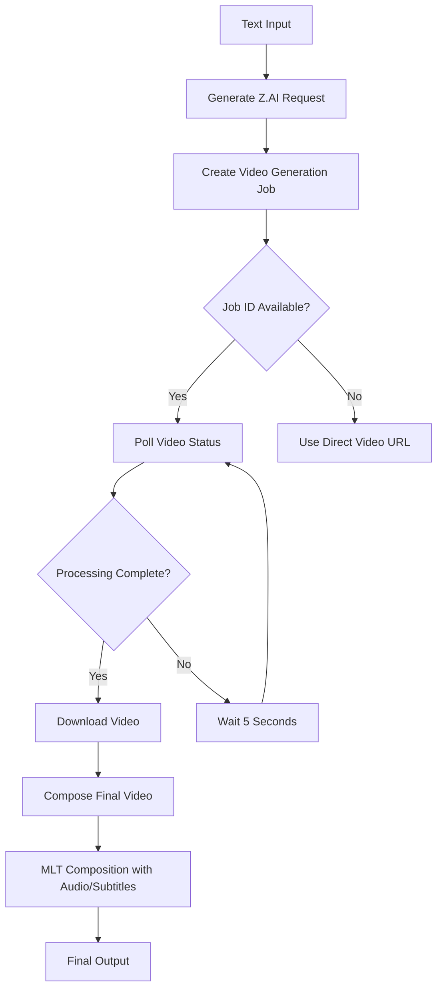
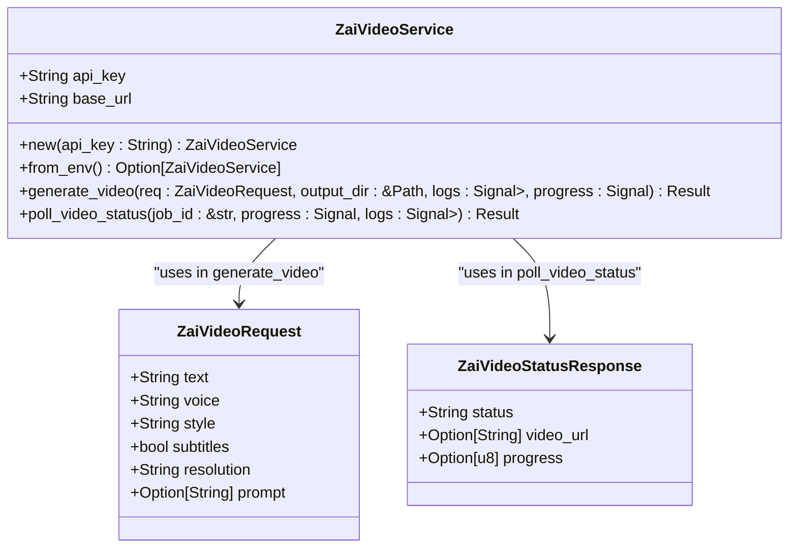
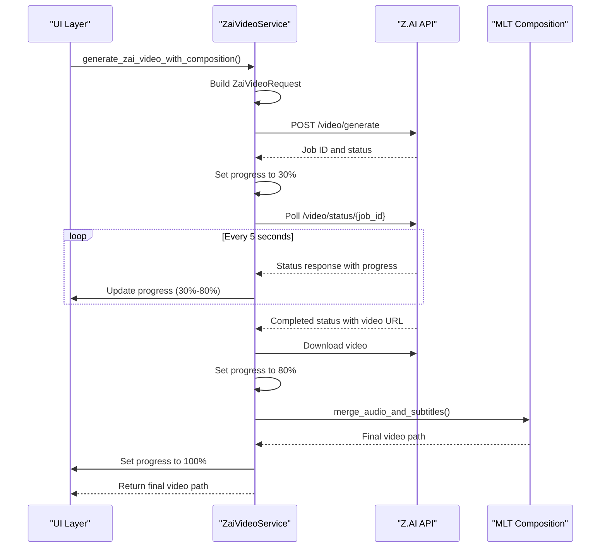
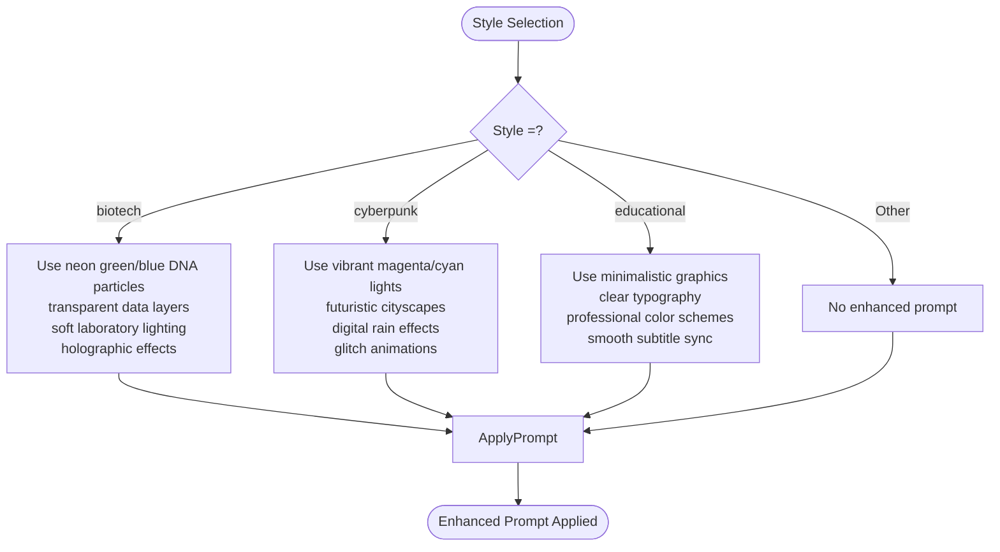
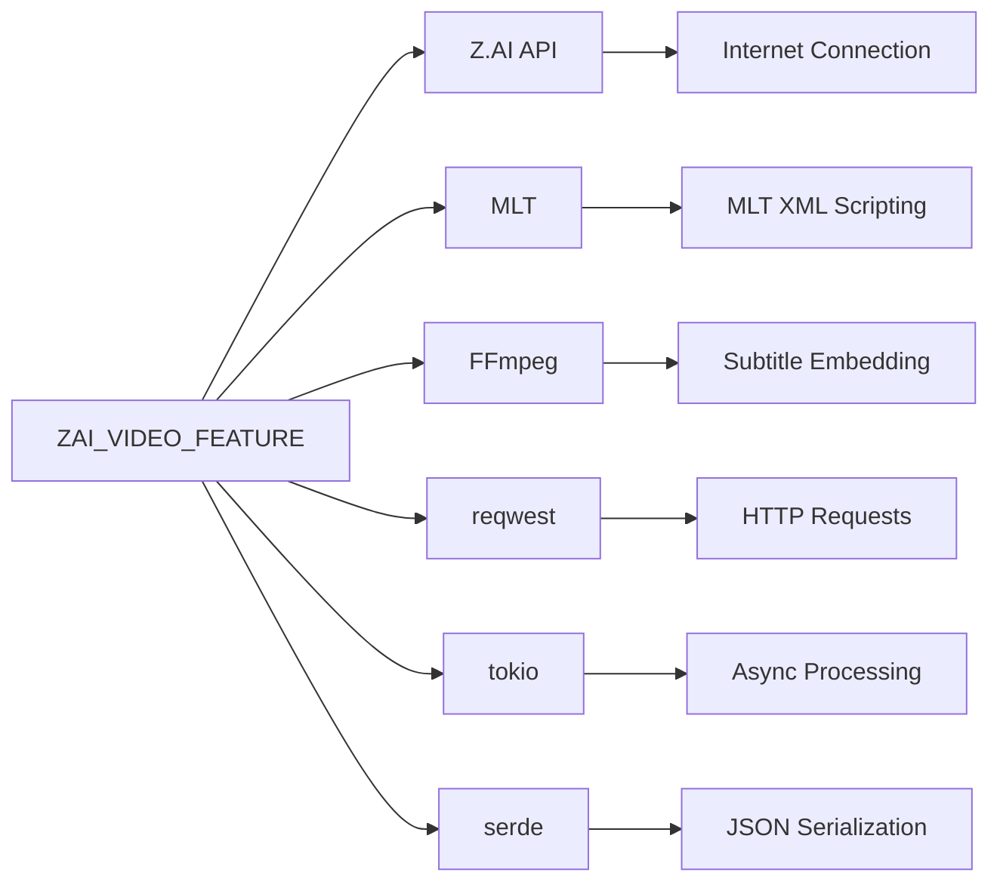

# Z.AI Integration

<cite>
**Referenced Files in This Document**   
- [zai_video.rs](file://abogen-ui/crates/ui/services/zai_video.rs)
- [state.rs](file://abogen-ui/crates/ui/state.rs)
- [mlt_video.rs](file://abogen-ui/crates/ui/services/mlt_video.rs)
- [ZAI_VIDEO_FEATURE.md](file://abogen-ui/ZAI_VIDEO_FEATURE.md)
- [VIDEO_INTEGRATION_PLAN.md](file://abogen-ui/VIDEO_INTEGRATION_PLAN.md)
</cite>

## Table of Contents
1. [Introduction](#introduction)
2. [Core Components](#core-components)
3. [Architecture Overview](#architecture-overview)
4. [Detailed Component Analysis](#detailed-component-analysis)
5. [Dependency Analysis](#dependency-analysis)
6. [Performance Considerations](#performance-considerations)
7. [Troubleshooting Guide](#troubleshooting-guide)
8. [Configuration Guidance](#configuration-guidance)

## Introduction
The Z.AI integration in VoxWeave enables automated video generation using the Z.AI API, combining AI-generated visuals with locally produced TTS audio and subtitles. This feature transforms text input into fully synchronized multimedia content through a sophisticated pipeline that orchestrates API communication, video processing, and final composition. The integration supports multiple visual styles including cyberpunk, biotech, and educational themes, with configurable resolution and optional custom prompts. The system is designed to work seamlessly across both CLI and GUI interfaces, providing real-time progress updates and robust error handling.

## Core Components

The Z.AI video generation functionality is implemented through several key components that work together to produce the final video output. The core implementation resides in `zai_video.rs`, which contains the `ZaiVideoService` struct responsible for API communication and job orchestration. This service interacts with the UI layer through `Signal` types for real-time updates and integrates with the MLT-based composition system for final video assembly. The data models `ZaiVideoRequest` and `ZaiVideoStatusResponse` define the contract with the Z.AI API, while the `generate_zai_video_with_composition` function coordinates the complete workflow from text input to final video output.

**Section sources**
- [zai_video.rs](file://abogen-ui/crates/ui/services/zai_video.rs#L0-L357)
- [state.rs](file://abogen-ui/crates/ui/state.rs#L0-L258)

## Architecture Overview

The Z.AI video generation architecture follows a multi-stage pipeline that begins with text input and culminates in a fully composed video file. The process starts with the creation of a video generation job via the Z.AI API, followed by asynchronous polling for completion status. Once the video is generated, it is downloaded and combined with local audio and subtitle tracks using the MLT (Media Lovin' Toolkit) framework. The architecture is designed to be modular, allowing for fallback mechanisms and integration with different video generation services based on the selected style.

**Diagram sources **
- [zai_video.rs](file://abogen-ui/crates/ui/services/zai_video.rs#L0-L357)
- [mlt_video.rs](file://abogen-ui/crates/ui/services/mlt_video.rs#L0-L349)

## Detailed Component Analysis

### ZaiVideoService Analysis
The `ZaiVideoService` struct is the primary interface for communicating with the Z.AI API. It encapsulates the API key and base URL, providing methods for video generation and status polling. The service follows a stateless design, with all configuration passed through method parameters. It handles authentication via bearer tokens and manages the complete lifecycle of a video generation job.

#### Class Diagram

**Diagram sources **
- [zai_video.rs](file://abogen-ui/crates/ui/services/zai_video.rs#L0-L357)

### Data Models Analysis
The integration uses several data structures to define the video generation parameters and API responses. The `ZaiVideoRequest` model contains all necessary information for creating a video generation job, while the `ZaiVideoStatusResponse` provides status updates during processing.

#### Table of ZaiVideoRequest Fields
| Field | Type | Description | Example Values |
|-------|------|-------------|----------------|
| text | String | Input text to be narrated | "Hello world" |
| voice | String | Voice identifier for TTS | "af_alloy" |
| style | String | Visual style for video | "cyberpunk", "biotech" |
| subtitles | bool | Whether to include subtitles | true, false |
| resolution | String | Video resolution | "1080p", "4k" |
| prompt | Option[String] | Custom generation prompt | "Narrate with cyberpunk aesthetics" |

#### Table of ZaiVideoStatusResponse Fields
| Field | Type | Description | Example Values |
|-------|------|-------------|----------------|
| status | String | Current job status | "processing", "completed" |
| video_url | Option[String] | URL of generated video | "https://..." |
| progress | Option[u8] | Progress percentage | 0-100 |

**Section sources**
- [zai_video.rs](file://abogen-ui/crates/ui/services/zai_video.rs#L0-L357)

### Video Generation Pipeline Analysis
The complete video generation process involves multiple stages that transform text input into a final composed video. The pipeline coordinates API calls, file downloads, and local video processing to create a seamless user experience.

#### Sequence Diagram

**Diagram sources **
- [zai_video.rs](file://abogen-ui/crates/ui/services/zai_video.rs#L0-L357)
- [mlt_video.rs](file://abogen-ui/crates/ui/services/mlt_video.rs#L0-L349)

### Style-to-Prompt Mapping Analysis
The integration includes predefined prompt templates for specific visual styles, enhancing the quality and consistency of generated videos. These prompts provide detailed instructions to the Z.AI API about the desired visual aesthetics and effects.

#### Flowchart

**Diagram sources **
- [zai_video.rs](file://abogen-ui/crates/ui/services/zai_video.rs#L0-L357)
- [ZAI_VIDEO_FEATURE.md](file://abogen-ui/ZAI_VIDEO_FEATURE.md#L0-L168)

## Dependency Analysis

The Z.AI integration depends on several external services and libraries to function properly. The primary dependency is the Z.AI API itself, which handles the AI video generation. The system also relies on MLT (Media Lovin' Toolkit) for video composition, FFmpeg for media processing, and reqwest for HTTP communication. These dependencies are managed through Rust's cargo system with appropriate feature flags.

**Diagram sources **
- [zai_video.rs](file://abogen-ui/crates/ui/services/zai_video.rs#L0-L357)
- [mlt_video.rs](file://abogen-ui/crates/ui/services/mlt_video.rs#L0-L349)
- [VIDEO_INTEGRATION_PLAN.md](file://abogen-ui/VIDEO_INTEGRATION_PLAN.md#L0-L304)

## Performance Considerations

The Z.AI video generation process involves several performance-critical aspects that affect user experience. Network bandwidth is a key factor during video download, with 4K resolution videos requiring significant bandwidth. The polling mechanism uses 5-second intervals, which balances API usage with timely status updates. The 10-minute timeout for job completion ensures that failed jobs don't hang indefinitely. Local composition with MLT can be CPU-intensive, especially for high-resolution videos. The system maps processing progress from 30% to 80% during the API generation phase, providing users with meaningful feedback during the longest part of the process.

**Section sources**
- [zai_video.rs](file://abogen-ui/crates/ui/services/zai_video.rs#L0-L357)

## Troubleshooting Guide

Common issues with the Z.AI integration include API authentication failures, job timeouts, and subtitle synchronization problems. Authentication failures typically occur when the ZAI_API_KEY environment variable is not set or contains an invalid key. Job timeouts may happen with complex requests or API service issues, and can be mitigated by simplifying the input or retrying the request. Subtitle synchronization issues can arise from timing mismatches between the TTS audio and video generation, which the MLT composition system attempts to resolve through precise timing calculations.

**Section sources**
- [zai_video.rs](file://abogen-ui/crates/ui/services/zai_video.rs#L0-L357)
- [VIDEO_CLI_IMPLEMENTATION.md](file://abogen-ui/VIDEO_CLI_IMPLEMENTATION.md#L286-L313)

## Configuration Guidance

Proper configuration of the Z.AI integration requires setting the ZAI_API_KEY environment variable with a valid API key from the Z.AI service. This can be done using the export command in Unix-like systems or the set command in Windows. The integration also supports configuration through the UI layer, where users can select video style, resolution, and provide custom prompts. For CLI usage, additional parameters are available for fine-tuning the video generation process.

**Section sources**
- [zai_video.rs](file://abogen-ui/crates/ui/services/zai_video.rs#L0-L357)
- [VIDEO_INTEGRATION_PLAN.md](file://abogen-ui/VIDEO_INTEGRATION_PLAN.md#L0-L304)