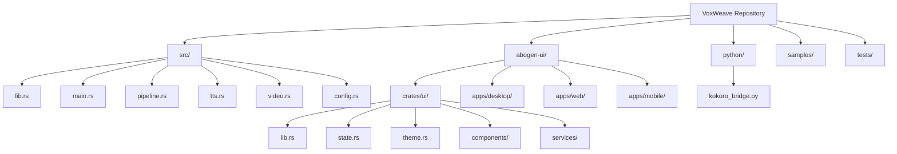
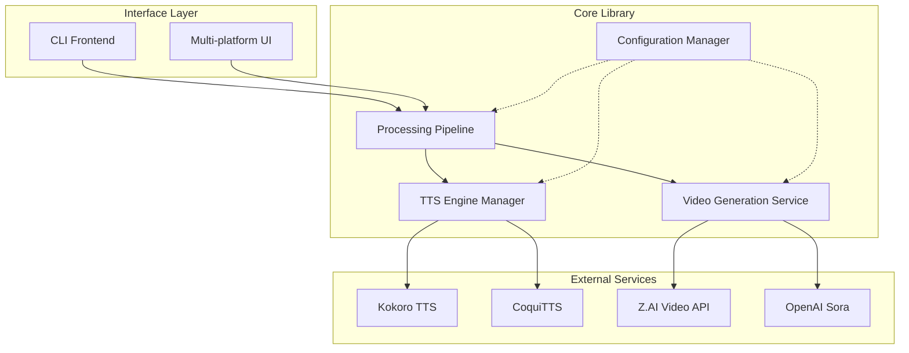
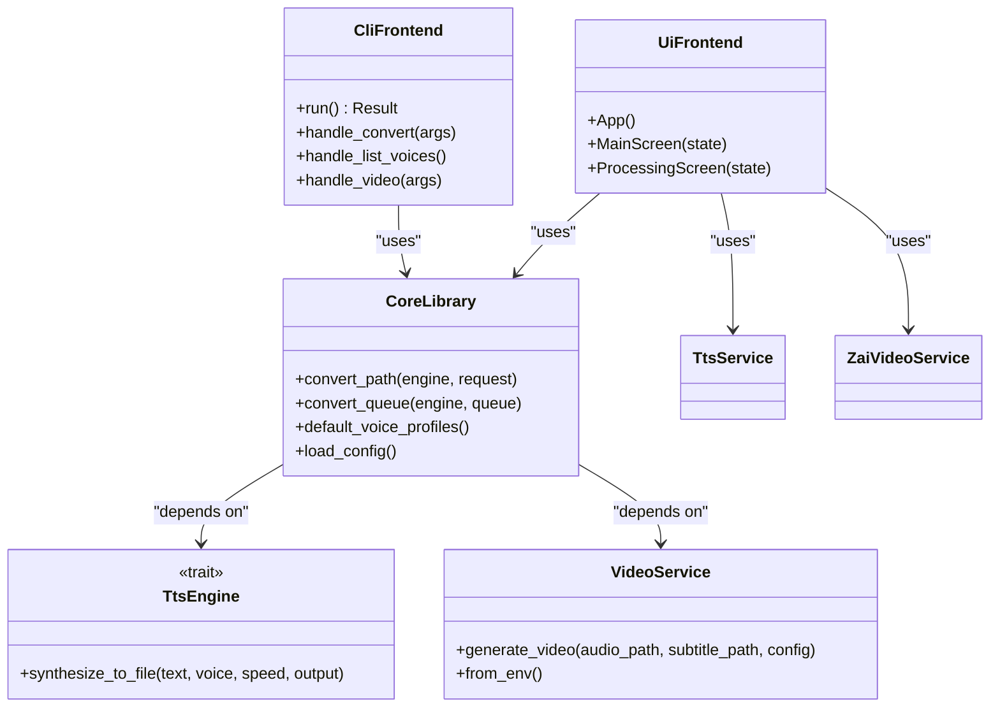
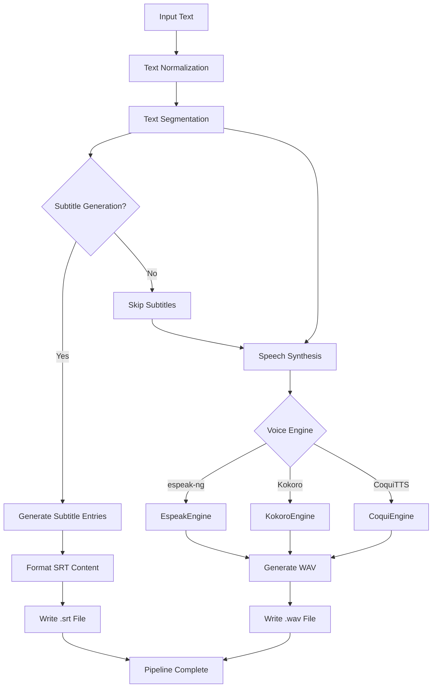
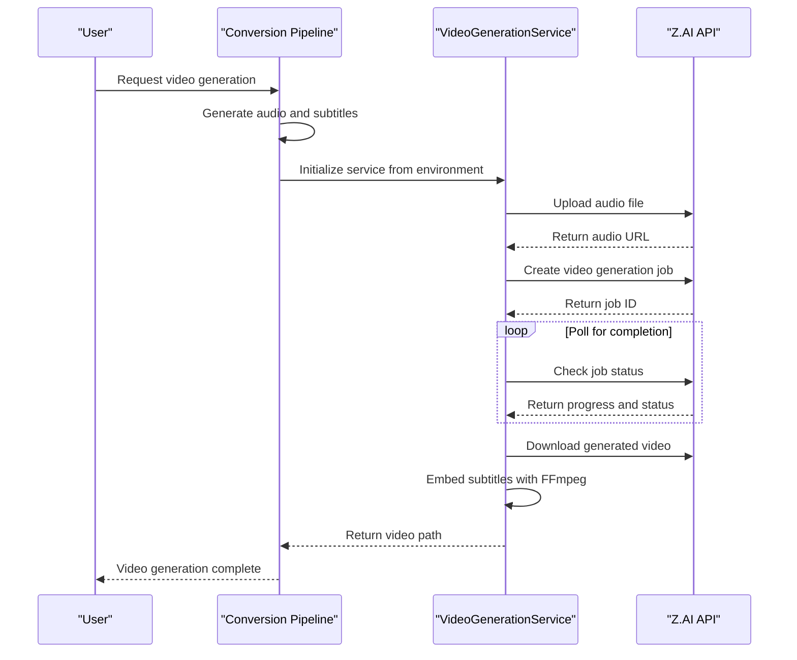
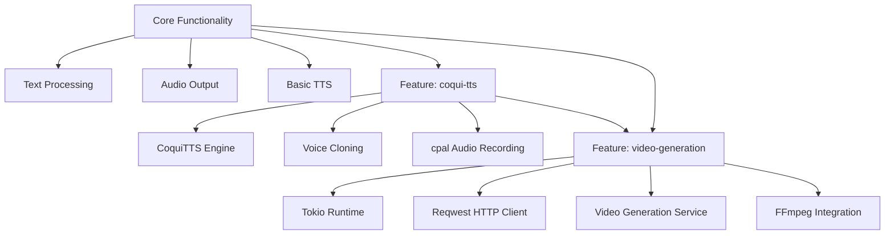
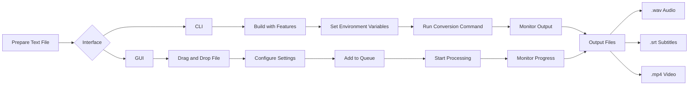

# Project Overview

<cite>
**Referenced Files in This Document**   
- [main.rs](file://src/main.rs)
- [lib.rs](file://src/lib.rs)
- [pipeline.rs](file://src/pipeline.rs)
- [tts.rs](file://src/tts.rs)
- [coqui_tts.rs](file://src/coqui_tts.rs)
- [video.rs](file://src/video.rs)
- [config.rs](file://src/config.rs)
- [queue.rs](file://src/queue.rs)
- [Cargo.toml](file://Cargo.toml)
- [abogen-ui/crates/ui/lib.rs](file://abogen-ui/crates/ui/lib.rs)
- [abogen-ui/crates/ui/state.rs](file://abogen-ui/crates/ui/state.rs)
- [abogen-ui/crates/ui/theme.rs](file://abogen-ui/crates/ui/theme.rs)
- [abogen-ui/crates/ui/services/tts_service.rs](file://abogen-ui/crates/ui/services/tts_service.rs)
- [abogen-ui/crates/ui/services/zai_video.rs](file://abogen-ui/crates/ui/services/zai_video.rs)
- [abogen-ui/apps/desktop/src/main.rs](file://abogen-ui/apps/desktop/src/main.rs)
- [abogen-ui/apps/web/Cargo.toml](file://abogen-ui/apps/web/Cargo.toml)
- [abogen-ui/apps/mobile/Cargo.toml](file://abogen-ui/apps/mobile/Cargo.toml)
</cite>

## Table of Contents
1. [Introduction](#introduction)
2. [Project Structure](#project-structure)
3. [Core Architecture](#core-architecture)
4. [CLI and UI Integration](#cli-and-ui-integration)
5. [Text-to-Speech Pipeline](#text-to-speech-pipeline)
6. [Video Generation System](#video-generation-system)
7. [Feature Flags and Modular Design](#feature-flags-and-modular-design)
8. [Workflow Examples](#workflow-examples)
9. [Configuration and Environment](#configuration-and-environment)
10. [Conclusion](#conclusion)

## Introduction

VoxWeave is a full-stack Rust application designed for converting text content into narrated videos with AI-generated visuals and synchronized subtitles. The platform combines text-to-speech (TTS) technology with AI video generation to create engaging multimedia content from plain text or markdown files. Built with a modular architecture, VoxWeave supports multiple TTS engines, voice cloning capabilities, and various video styles, making it a versatile tool for content creators, educators, and developers.

The system features a dual interface approach, providing both a command-line interface (CLI) for scriptable automation and a multi-platform graphical user interface built with Dioxus. The UI supports desktop, web, and mobile platforms from a single codebase, featuring a distinctive cyberpunk-themed design with neon aesthetics. At its core, VoxWeave processes text through a sophisticated pipeline that handles text normalization, speech synthesis, subtitle generation, and video composition, all orchestrated through an asynchronous processing model.

**Section sources**
- [README.md](file://README.md#L1-L133)

## Project Structure

The VoxWeave repository is organized into several key components that reflect its modular design. The core functionality resides in the `src/` directory, which contains the primary Rust library and binary. This core includes modules for text processing, TTS engines, subtitle generation, and video composition. The `abogen-ui/` directory houses the multi-platform user interface built with Dioxus, structured as a workspace with separate applications for desktop, web, and mobile platforms.

The core library modules are organized by functionality: `text.rs` handles text normalization, `tts.rs` manages speech synthesis engines, `subtitle.rs` generates timed subtitles, `pipeline.rs` orchestrates the conversion process, and `video.rs` handles AI video generation. The UI components are similarly organized, with reusable UI elements in the `components/` directory, application state management in `state.rs`, and service integrations in the `services/` directory. Configuration files and scripts support development, testing, and deployment workflows.

**Diagram sources **
- [src/lib.rs](file://src/lib.rs#L1-L14)
- [abogen-ui/crates/ui/lib.rs](file://abogen-ui/crates/ui/lib.rs#L1-L614)
- [README.md](file://README.md#L100-L133)

**Section sources**
- [project_structure](file://#L1-L50)
- [README.md](file://README.md#L100-L133)

## Core Architecture

VoxWeave's architecture follows a modular, service-oriented design pattern with a clear separation between the core processing engine and interface layers. The system is built around an asynchronous processing pipeline that handles text-to-speech conversion and video generation through a series of coordinated steps. At the heart of the architecture is the core library (`voxweave` crate), which exposes a clean API for text processing, speech synthesis, and video generation that can be consumed by both the CLI and UI components.

The processing pipeline follows a consistent pattern: input text is first normalized and cleaned, then segmented for subtitle generation, followed by speech synthesis to create audio output, and finally combined with AI-generated visuals to produce the final video. Each stage of the pipeline is designed to be independent yet composable, allowing for flexible configuration and extension. The system uses Rust's powerful type system and trait-based design to abstract different TTS engines and video generation services behind common interfaces, enabling seamless switching between different implementations.

The architecture leverages Rust's async/await model through the Tokio runtime for efficient handling of I/O operations, particularly important for network requests to external AI services. Error handling is implemented consistently across components using the `anyhow` and `thiserror` crates, providing rich context for debugging while maintaining clean error propagation. Configuration is managed through a combination of environment variables, configuration files, and command-line arguments, with sensible defaults to simplify usage.

**Diagram sources **
- [src/lib.rs](file://src/lib.rs#L1-L14)
- [src/main.rs](file://src/main.rs#L1-L418)
- [src/pipeline.rs](file://src/pipeline.rs#L1-L140)
- [src/tts.rs](file://src/tts.rs#L1-L523)
- [src/video.rs](file://src/video.rs#L1-L463)

**Section sources**
- [src/lib.rs](file://src/lib.rs#L1-L14)
- [src/main.rs](file://src/main.rs#L1-L418)
- [src/pipeline.rs](file://src/pipeline.rs#L1-L140)

## CLI and UI Integration

VoxWeave provides dual access points through a command-line interface and a multi-platform graphical user interface, both built on the same core library. The CLI, implemented in `src/main.rs`, uses the `clap` crate for argument parsing and provides a straightforward interface for converting text files to audio and video content. It supports various subcommands including `convert` for text-to-speech conversion, `list-voices` for enumerating available voices, and `video` for generating narrated videos when the video-generation feature is enabled.

The graphical interface, built with Dioxus 0.5, offers a richer user experience with drag-and-drop file handling, real-time processing feedback, and advanced configuration options. The UI is structured as a workspace with three platform-specific applications: desktop (using Dioxus Desktop), web (using WASM and Trunk), and mobile (using Dioxus Mobile). All platforms share a common UI component library that includes elements like the neon-styled buttons, audio recorder, and log panel, ensuring a consistent user experience across devices.

Both interfaces depend on the shared core library, which exposes the `convert_path` function and other utilities through the public API defined in `src/lib.rs`. The UI implements its own service layer in the `services/` directory that wraps the core functionality with additional features like queue management, progress tracking, and error handling tailored to the interactive experience. The state management system in `state.rs` maintains application state across components, including selected files, voice preferences, and processing progress.

**Diagram sources **
- [src/main.rs](file://src/main.rs#L1-L418)
- [src/lib.rs](file://src/lib.rs#L1-L14)
- [abogen-ui/crates/ui/lib.rs](file://abogen-ui/crates/ui/lib.rs#L1-L614)
- [abogen-ui/crates/ui/services/tts_service.rs](file://abogen-ui/crates/ui/services/tts_service.rs#L1-L539)
- [abogen-ui/crates/ui/services/zai_video.rs](file://abogen-ui/crates/ui/services/zai_video.rs#L1-L335)

**Section sources**
- [src/main.rs](file://src/main.rs#L1-L418)
- [abogen-ui/crates/ui/lib.rs](file://abogen-ui/crates/ui/lib.rs#L1-L614)
- [abogen-ui/crates/ui/state.rs](file://abogen-ui/crates/ui/state.rs#L1-L254)

## Text-to-Speech Pipeline

The text-to-speech pipeline in VoxWeave is a sophisticated system that transforms raw text into high-quality audio output through a series of processing stages. The pipeline begins with text normalization in the `text.rs` module, which cleans and prepares the input text by removing extra whitespace, handling special characters, and applying language-specific formatting rules. This normalized text is then segmented for subtitle generation based on the configured granularity (sentence, paragraph, or word count).

The core of the TTS system is implemented in the `tts.rs` module, which defines a trait-based architecture for speech engines. This design allows multiple TTS backends to be integrated through a common interface, with current support for espeak-ng, Kokoro, and CoquiTTS. Each engine implements the `SpeechEngine` trait, which requires a `synthesize_to_file` method that takes text, voice profile, speed, and output path parameters. The system selects the appropriate engine based on the voice profile specified in the conversion request.

Voice management is handled through the `VoiceProfile` struct, which contains metadata about each available voice including ID, description, engine type, and language. The system maintains a registry of voice profiles that can be extended through configuration or feature flags. For voice cloning, the CoquiTTS engine supports custom voices by specifying a reference audio file path in the voice profile's command field. The pipeline also handles audio format conversion and subtitle generation, producing both WAV audio files and SRT subtitle files as output.

**Diagram sources **
- [src/pipeline.rs](file://src/pipeline.rs#L1-L140)
- [src/tts.rs](file://src/tts.rs#L1-L523)
- [src/coqui_tts.rs](file://src/coqui_tts.rs#L1-L116)
- [src/subtitle.rs](file://src/subtitle.rs#L1-L155)

**Section sources**
- [src/pipeline.rs](file://src/pipeline.rs#L1-L140)
- [src/tts.rs](file://src/tts.rs#L1-L523)
- [src/coqui_tts.rs](file://src/coqui_tts.rs#L1-L116)

## Video Generation System

The video generation system in VoxWeave extends the text-to-speech capabilities by creating narrated videos with AI-generated visuals synchronized to the audio and subtitles. This feature is implemented in the `video.rs` module and is available when the `video-generation` feature flag is enabled. The system integrates with external AI video generation services, primarily Z.AI and OpenAI Sora, to create high-quality video content from text input.

The video generation process follows a multi-stage workflow: first, the system generates audio and subtitles from the input text using the standard TTS pipeline; then, it uploads the audio file to the video generation service; next, it creates a video generation job with the specified style, resolution, and format; after that, it polls for job completion; and finally, it downloads the generated video and optionally embeds subtitles using FFmpeg. The `VideoGenerationService` struct manages this entire process, handling authentication, API requests, and error recovery.

The system supports multiple video styles including realistic, anime, 3D, cinematic, biotech, cyberpunk, and educational, each producing distinct visual aesthetics. Video resolution can be specified as 720p, 1080p, or 4K, with output formats including MP4, MOV, and WebM. The UI provides additional features through the `zai_video.rs` service, which implements enhanced video generation with MLT composition, allowing for more sophisticated video editing and effects. The system requires API keys for the video generation services, which are provided through environment variables.

**Diagram sources **
- [src/video.rs](file://src/video.rs#L1-L463)
- [abogen-ui/crates/ui/services/zai_video.rs](file://abogen-ui/crates/ui/services/zai_video.rs#L1-L335)
- [src/pipeline.rs](file://src/pipeline.rs#L1-L140)

**Section sources**
- [src/video.rs](file://src/video.rs#L1-L463)
- [abogen-ui/crates/ui/services/zai_video.rs](file://abogen-ui/crates/ui/services/zai_video.rs#L1-L335)

## Feature Flags and Modular Design

VoxWeave employs a feature-based modular design that allows users to enable or disable specific functionality based on their needs and system capabilities. This approach is implemented through Rust's feature system in the `Cargo.toml` file, where optional components are gated behind feature flags. The core functionality is available by default, while advanced features like CoquiTTS support and video generation must be explicitly enabled during compilation.

The `Cargo.toml` file defines three main features: `default` (basic TTS with espeak-ng and Kokoro), `coqui-tts` (enables CoquiTTS with voice cloning support), and `video-generation` (enables AI video generation). The `video-generation` feature also enables the Tokio runtime and Reqwest HTTP client, which are required for asynchronous operations and API calls. This modular design allows the core library to remain lightweight for basic text-to-speech use cases while providing extensibility for more advanced multimedia generation.

The codebase uses conditional compilation with `#[cfg(feature = "...")]` attributes to include feature-specific code only when the corresponding feature is enabled. For example, the `coqui_tts.rs` module is only compiled and exposed when the `coqui-tts` feature is active, and the video generation functionality in `main.rs` is only available when `video-generation` is enabled. This approach prevents unnecessary dependencies and reduces binary size for users who don't need the advanced features.

**Diagram sources **
- [Cargo.toml](file://Cargo.toml#L1-L27)
- [src/lib.rs](file://src/lib.rs#L1-L14)
- [src/main.rs](file://src/main.rs#L1-L418)

**Section sources**
- [Cargo.toml](file://Cargo.toml#L1-L27)
- [src/lib.rs](file://src/lib.rs#L1-L14)
- [README.md](file://README.md#L70-L95)

## Workflow Examples

VoxWeave supports several common workflows for converting text content into narrated videos, ranging from simple command-line operations to complex multi-file processing through the graphical interface. A typical workflow begins with preparing a text or markdown file, which can contain plain text, formatted content, or structured information that will be converted into speech and video.

For command-line usage, a basic workflow involves building the application with the desired features and then running conversion commands. To convert a markdown file to a narrated video with cyberpunk styling, a user would first build with video generation support: `cargo build --features video-generation`. Then, they would set the ZAI_API_KEY environment variable and run the video command: `export ZAI_API_KEY=your_api_key_here && voxweave video samples/example.txt --style cyberpunk --resolution 1080p`. This command processes the text through the TTS pipeline to generate audio and subtitles, then sends the audio to the Z.AI service to generate a video with cyberpunk-themed visuals.

In the graphical interface, the workflow is more interactive. Users can drag and drop a text file into the drop zone, configure settings such as voice selection, speed, subtitle generation, and video options, add the item to the processing queue, and start the conversion process. The UI displays real-time logs and progress updates, allowing users to monitor the pipeline stages as they complete. Multiple files can be processed in sequence by adding them to the queue, and the system maintains state between sessions, remembering recent files and user preferences.

**Diagram sources **
- [QUICKSTART.md](file://QUICKSTART.md#L1-L223)
- [CLI_VIDEO_GENERATION.md](file://CLI_VIDEO_GENERATION.md#L1-L50)
- [abogen-ui/README.md](file://abogen-ui/README.md#L50-L100)

**Section sources**
- [QUICKSTART.md](file://QUICKSTART.md#L1-L223)
- [abogen-ui/README.md](file://abogen-ui/README.md#L50-L100)

## Configuration and Environment

VoxWeave uses a hierarchical configuration system that combines environment variables, configuration files, and command-line arguments to provide flexible control over the application's behavior. The system prioritizes configuration sources in the following order: command-line arguments override environment variables, which in turn override configuration file settings, with hardcoded defaults as the fallback.

Environment variables are used extensively to configure external dependencies and service integrations. For espeak-ng, the `VOXWEAVE_ESPEAK_COMMAND` variable allows overriding the executable name. For Kokoro TTS, variables like `VOXWEAVE_KOKORO_PYTHON`, `VOXWEAVE_KOKORO_DEVICE`, and `VOXWEAVE_KOKORO_SAMPLE_RATE` control the Python interpreter, inference device, and audio quality. CoquiTTS uses similar variables including `VOXWEAVE_COQUI_PYTHON`, `VOXWEAVE_COQUI_MODEL`, and `VOXWEAVE_COQUI_DEVICE`. Video generation requires API keys set through `ZAI_API_KEY` or `OPENAI_API_KEY` environment variables.

Configuration files are stored in the platform-appropriate application data directory under `com/voxweave/voxweave`, with the location customizable via the `VOXWEAVE_CONFIG_DIR` environment variable. The configuration persists user preferences such as the default voice, recent files, and text processing options. The system automatically creates and manages the configuration file, updating it with user choices during operation. This layered approach allows for both user-friendly defaults and advanced customization for developers and power users.

**Section sources**
- [README.md](file://README.md#L30-L70)
- [src/config.rs](file://src/config.rs#L1-L100)
- [src/main.rs](file://src/main.rs#L1-L418)

## Conclusion

VoxWeave represents a comprehensive solution for converting text content into narrated videos with AI-generated visuals, combining robust text-to-speech technology with advanced video generation capabilities. The platform's modular architecture, built on Rust's strong type system and async capabilities, provides a solid foundation for both command-line automation and interactive graphical use. By supporting multiple TTS engines, voice cloning, and various video styles, VoxWeave offers flexibility for diverse use cases ranging from content creation to accessibility applications.

The dual interface design—featuring both a CLI for developers and scripts, and a multi-platform GUI for general users—ensures broad accessibility while maintaining a consistent core functionality. The use of feature flags allows users to tailor the application to their specific needs, reducing dependencies and binary size for simpler use cases while enabling advanced multimedia generation when required. The cyberpunk-themed UI provides a distinctive visual identity that enhances the user experience across desktop, web, and mobile platforms.

As AI video generation technology continues to evolve, VoxWeave's service-oriented architecture positions it well for integration with new providers and capabilities. The clear separation between the core processing pipeline and interface layers makes it straightforward to extend functionality, add new TTS engines, or support additional video styles. This design philosophy ensures that VoxWeave can adapt to changing requirements while maintaining stability and performance for its core text-to-speech and video generation workflows.