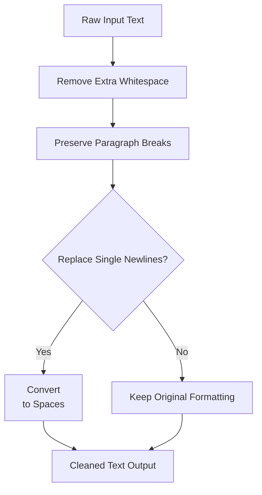
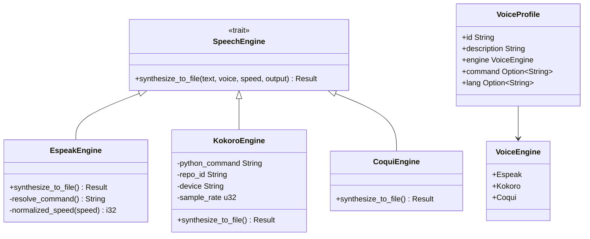
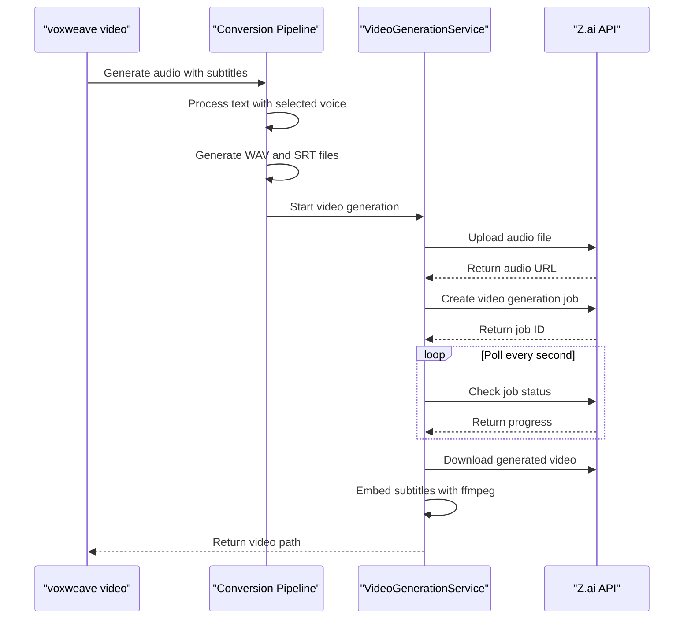

# CLI Workflow

<cite>
**Referenced Files in This Document**   
- [Cargo.toml](file://Cargo.toml)
- [README.md](file://README.md)
- [VIDEO_CLI_QUICKREF.md](file://VIDEO_CLI_QUICKREF.md)
- [CLI_VIDEO_GENERATION.md](file://CLI_VIDEO_GENERATION.md)
- [main.rs](file://src/main.rs)
- [text.rs](file://src/text.rs)
- [tts.rs](file://src/tts.rs)
- [subtitle.rs](file://src/subtitle.rs)
- [video.rs](file://src/video.rs)
- [kokoro_bridge.py](file://python/kokoro_bridge.py)
- [long_example.md](file://samples/long_example.md)
</cite>

## Table of Contents
1. [Introduction](#introduction)
2. [Build Process and Feature Flags](#build-process-and-feature-flags)
3. [Environment Configuration](#environment-configuration)
4. [Core Commands Overview](#core-commands-overview)
5. [Text Processing and Input Format](#text-processing-and-input-format)
6. [Audio Generation Pipeline](#audio-generation-pipeline)
7. [Video Generation Workflow](#video-generation-workflow)
8. [Common Issues and Troubleshooting](#common-issues-and-troubleshooting)
9. [Performance Optimization](#performance-optimization)
10. [Conclusion](#conclusion)

## Introduction
VoxWeave provides a comprehensive CLI for generating narrated audio and AI-generated videos from text input. The workflow integrates text processing, speech synthesis, subtitle generation, and video composition into a unified pipeline. This document details the end-to-end process from setup to execution, covering both audio-only conversion and full video generation capabilities.

## Build Process and Feature Flags
The VoxWeave CLI supports optional features that must be explicitly enabled during compilation. The build process uses Cargo feature flags to include specific functionality.

To enable CoquiTTS with voice cloning support:
```bash
cargo build --features coqui-tts
```

To enable AI video generation:
```bash
cargo build --features video-generation
```

Both features can be enabled simultaneously:
```bash
cargo build --features "coqui-tts video-generation"
```

The feature configuration is defined in `Cargo.toml`, where `video-generation` automatically includes required dependencies like `tokio` and `reqwest` for asynchronous operations and HTTP communication with external APIs.

**Section sources**
- [Cargo.toml](file://Cargo.toml#L1-L26)

## Environment Configuration
Proper environment configuration is essential for accessing external services and customizing engine behavior.

### API Key Configuration
Video generation requires authentication with external AI services:
```bash
export ZAI_API_KEY=your_api_key_here
export OPENAI_API_KEY=your_openai_key_here
```

The system checks for `OPENAI_API_KEY` first, falling back to `ZAI_API_KEY` if not present.

### Engine-Specific Configuration
Each TTS engine supports environment variables for customization:

**CoquiTTS Settings:**
- `VOXWEAVE_COQUI_PYTHON`: Python interpreter path (default: `python3`)
- `VOXWEAVE_COQUI_MODEL`: TTS model identifier (default: `tts_models/multilingual/multi-dataset/xtts_v2`)
- `VOXWEAVE_COQUI_DEVICE`: Inference device (`cpu`, `cuda`, `mps`)
- `VOXWEAVE_COQUI_SAMPLE_RATE`: Audio sample rate (default: `24000`)
- `VOXWEAVE_COQUI_LANGUAGE`: Default language (default: `en`)

**Kokoro Settings:**
- `VOXWEAVE_KOKORO_PYTHON`: Python interpreter for Kokoro
- `VOXWEAVE_KOKORO_REPO_ID`: Hugging Face model repository ID
- `VOXWEAVE_KOKORO_DEVICE`: Device for inference
- `VOXWEAVE_KOKORO_SAMPLE_RATE`: Audio sample rate
- `VOXWEAVE_KOKORO_SPLIT_PATTERN`: Sentence splitting regex

**Section sources**
- [README.md](file://README.md#L100-L132)

## Core Commands Overview
The VoxWeave CLI provides several subcommands for different operations.

### Audio Conversion
The `voxweave convert` command generates audio from text input:
```bash
voxweave convert input.txt --voice af_bella --output ./output --speed 1.2
```

Key flags:
- `--voice`: Specifies voice identifier (use `voxweave list-voices` to see options)
- `--output`: Output directory (defaults to input file directory)
- `--speed`: Playback speed multiplier (1.0 = normal)
- `--subtitles`: Subtitle granularity (`sentence`, `words`, or `disabled`)
- `--words`: Number of words per subtitle chunk
- `--mock`: Run without generating audio (for testing)

### Video Generation
The `voxweave video` command creates AI-generated videos with narrated audio:
```bash
voxweave video input.txt --style cinematic --resolution 1080p --format mp4
```

Key flags:
- `--style`: Video visual style (`realistic`, `anime`, `3d`, `cinematic`, `biotech`, `cyberpunk`, `educational`)
- `--resolution`: Output resolution (`720p`, `1080p`, `4k`)
- `--format`: Video format (`mp4`, `mov`, `webm`)
- `--prompt`: Custom visual prompt to guide AI generation
- `--voice`: Voice for narration (same as convert command)

**Section sources**
- [VIDEO_CLI_QUICKREF.md](file://VIDEO_CLI_QUICKREF.md#L0-L171)
- [CLI_VIDEO_GENERATION.md](file://CLI_VIDEO_GENERATION.md#L0-L323)

## Text Processing and Input Format
VoxWeave processes text input through a normalization pipeline that prepares content for speech synthesis.

### Text Normalization
The text processing pipeline in `src/text.rs` performs several operations:
- Collapses multiple whitespace characters into single spaces
- Preserves intentional paragraph breaks
- Optionally replaces single newlines with spaces
- Removes leading/trailing whitespace



**Diagram sources**
- [text.rs](file://src/text.rs#L0-L70)

### Input Examples
The `samples/long_example.md` file demonstrates proper input format with embedded voice directives and multi-paragraph narration. Markdown files are processed by preserving section headers and paragraph structure while removing formatting syntax for audio generation.

**Section sources**
- [text.rs](file://src/text.rs#L0-L70)
- [long_example.md](file://samples/long_example.md#L0-L19)

## Audio Generation Pipeline
The audio generation process follows a structured pipeline from text input to audio output.

### TTS Engine Selection
The system supports multiple TTS engines that are selected based on voice profiles:
- **Espeak-ng**: Default engine, requires `espeak-ng` in PATH
- **Kokoro**: Python-based engine with natural-sounding voices
- **CoquiTTS**: Advanced engine with voice cloning capabilities

Engine selection is determined by the `VoiceEngine` enum in `src/tts.rs`, which routes requests to the appropriate implementation based on the selected voice.



**Diagram sources**
- [tts.rs](file://src/tts.rs#L0-L522)

### Kokoro Integration
For Kokoro voices, VoxWeave communicates with Python through a bridge script. The `kokoro_bridge.py` script receives JSON input containing text, voice parameters, and output path, then uses the Kokoro library to generate audio.

The bridge handles:
- Loading the KPipeline with specified language and device
- Processing text input with configurable split patterns
- Generating audio segments and concatenating them
- Writing WAV output with proper PCM encoding
- Returning duration information via stdout

**Section sources**
- [tts.rs](file://src/tts.rs#L0-L522)
- [kokoro_bridge.py](file://python/kokoro_bridge.py#L0-L89)

## Video Generation Workflow
The video generation process combines audio synthesis with AI-generated visuals through a multi-stage pipeline.

### End-to-End Process


**Diagram sources**
- [main.rs](file://src/main.rs#L0-L417)
- [video.rs](file://src/video.rs#L0-L462)

### Internal Flow
The video generation workflow follows these steps:

1. **Audio Generation**: Reuses the existing `convert` pipeline to generate narrated audio and subtitle files
2. **File Upload**: Uploads the audio file to Z.ai API storage
3. **Job Creation**: Creates a video generation job with specified style, resolution, and format
4. **Status Polling**: Periodically checks job status until completion (with 5-minute timeout)
5. **Video Download**: Retrieves the generated video from the API
6. **Subtitle Integration**: Uses ffmpeg to embed subtitles into the video (if available)

The `VideoGenerationService` in `src/video.rs` handles all API interactions, including error handling and fallback mechanisms when services are unavailable.

**Section sources**
- [main.rs](file://src/main.rs#L0-L417)
- [video.rs](file://src/video.rs#L0-L462)

## Common Issues and Troubleshooting
Several common issues may arise during CLI usage, with specific solutions for each.

### Missing Dependencies
**Issue**: Python packages not installed for CoquiTTS or Kokoro
**Solution**: Install required packages:
```bash
pip install TTS torch numpy  # For CoquiTTS
pip install kokoro numpy torch  # For Kokoro
```

### Voice Configuration Problems
**Issue**: "voice not found" error
**Solution**: List available voices and verify spelling:
```bash
voxweave list-voices
```

Ensure the build includes the required feature flag for the desired voice engine.

### API and Authentication Issues
**Issue**: "ZAI_API_KEY environment variable not set"
**Solution**: Set the API key:
```bash
export ZAI_API_KEY=your_api_key_here
```

**Issue**: Video generation timeout
**Solution**: Try with shorter text input or check API service status.

### Subtitle Embedding Failures
**Issue**: "ffmpeg failed" error
**Solution**: Install ffmpeg:
```bash
brew install ffmpeg  # macOS
sudo apt install ffmpeg  # Ubuntu/Debian
```

Without ffmpeg, subtitles will be available as a separate .srt file.

**Section sources**
- [README.md](file://README.md#L0-L132)
- [CLI_VIDEO_GENERATION.md](file://CLI_VIDEO_GENERATION.md#L0-L323)

## Performance Optimization
Several strategies can improve performance and efficiency when using the VoxWeave CLI.

### GPU Acceleration
For CoquiTTS voice generation, configure GPU usage:
```bash
# Apple Silicon
export VOXWEAVE_COQUI_DEVICE="mps"
# NVIDIA GPU
export VOXWEAVE_COQUI_DEVICE="cuda"
```

### Batch Processing
Process multiple files efficiently:
```bash
# Sequential processing
for file in content/*.txt; do
  voxweave video "$file" --style educational --resolution 1080p
done

# Parallel processing with GNU parallel
parallel voxweave video {} --style cinematic ::: content/*.txt
```

### Resource Management
- Use `720p` resolution for testing, `4K` only for final production
- Add delays between batch requests to avoid rate limiting
- Monitor API usage through the Z.ai dashboard
- Use the `--mock` flag for rapid testing of text processing without audio generation

**Section sources**
- [VIDEO_CLI_QUICKREF.md](file://VIDEO_CLI_QUICKREF.md#L0-L171)

## Conclusion
The VoxWeave CLI provides a robust workflow for converting text to narrated audio and AI-generated videos. The system integrates multiple TTS engines, supports voice cloning, and generates high-quality videos through external AI services. By following the build, configuration, and execution patterns outlined in this document, users can effectively leverage VoxWeave for automated content creation workflows.