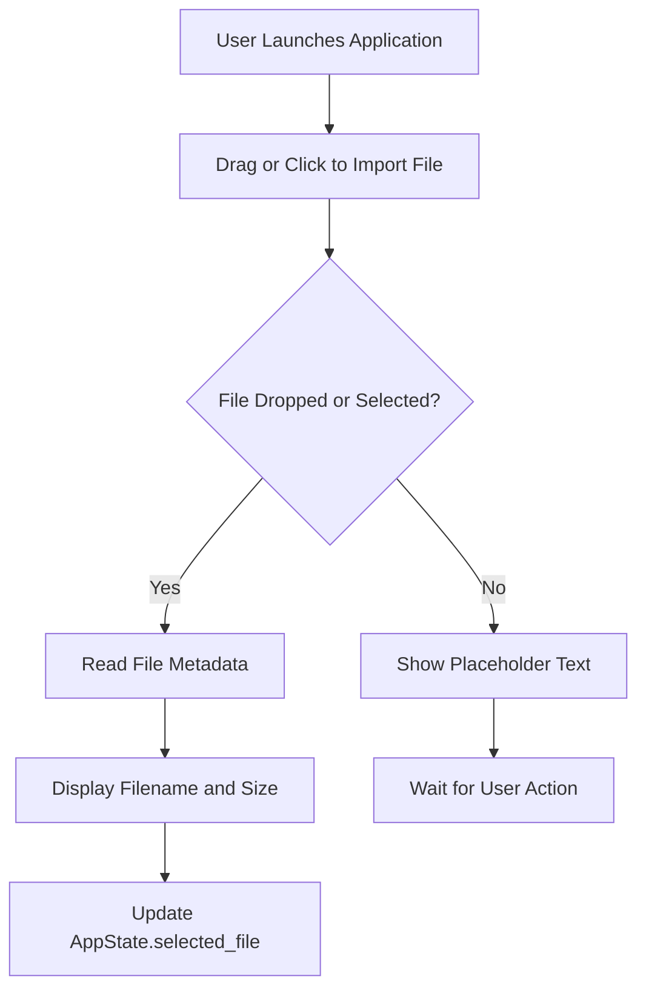
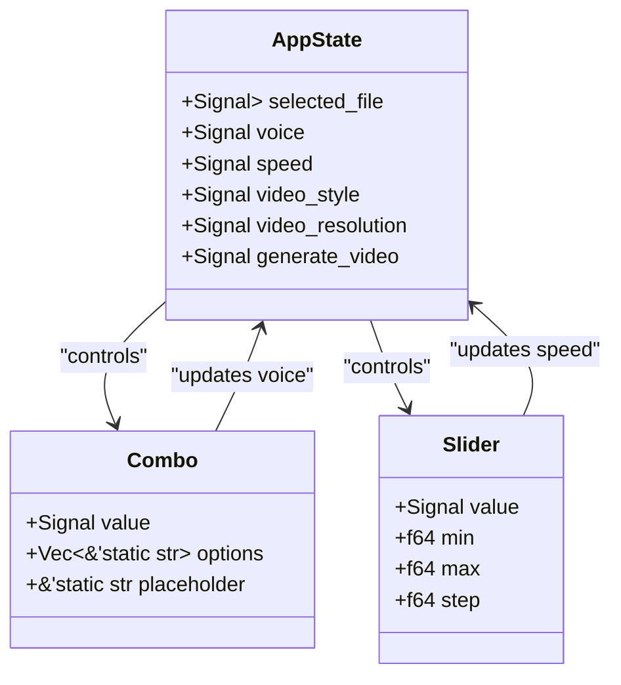
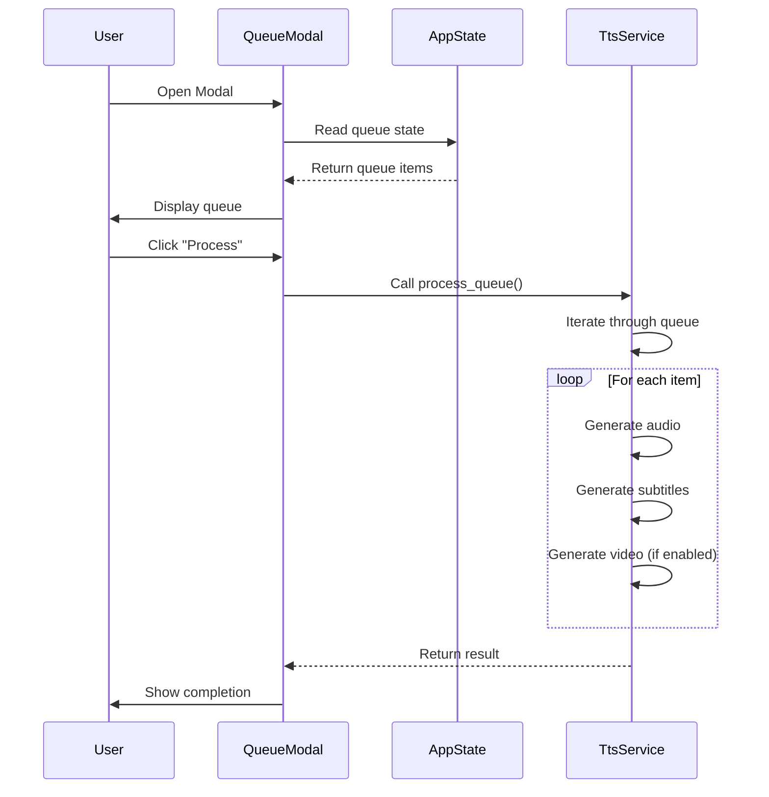
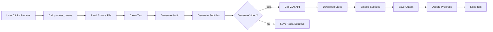

# UI Workflow

<cite>
**Referenced Files in This Document**   
- [main.rs](file://abogen-ui/apps/web/src/main.rs)
- [drop_zone.rs](file://abogen-ui/crates/ui/components/drop_zone.rs)
- [combo.rs](file://abogen-ui/crates/ui/components/combo.rs)
- [slider.rs](file://abogen-ui/crates/ui/components/slider.rs)
- [queue_modal.rs](file://abogen-ui/crates/ui/components/queue_modal.rs)
- [state.rs](file://abogen-ui/crates/ui/state.rs)
- [header.rs](file://abogen-ui/crates/ui/components/header.rs)
- [log_panel.rs](file://abogen-ui/crates/ui/components/log_panel.rs)
- [progress_bar.rs](file://abogen-ui/crates/ui/components/progress_bar.rs)
- [tts_service.rs](file://abogen-ui/crates/ui/services/tts_service.rs)
- [video_generation.rs](file://abogen-ui/crates/ui/services/video_generation.rs)
- [theme.rs](file://abogen-ui/crates/ui/theme.rs)
</cite>

## Table of Contents
1. [Introduction](#introduction)
2. [Application Launch and Initialization](#application-launch-and-initialization)
3. [File Import and Parsing Workflow](#file-import-and-parsing-workflow)
4. [Configuration Interface](#configuration-interface)
5. [Queue Management System](#queue-management-system)
6. [Processing Execution Flow](#processing-execution-flow)
7. [Real-Time Feedback Mechanisms](#real-time-feedback-mechanisms)
8. [UI Advantages and Cyberpunk Design](#ui-advantages-and-cyberpunk-design)
9. [Common User Pitfalls and Troubleshooting](#common-user-pitfalls-and-troubleshooting)
10. [Iterative Testing and Debugging Tips](#iterative-testing-and-debugging-tips)

## Introduction
This document details the user interface workflow of VoxWeave, a Dioxus-based multi-platform application designed for text-to-speech and video generation. The UI is built with a cyberpunk aesthetic and provides users with an intuitive, responsive experience across desktop, web, and mobile platforms. The workflow begins with application launch and progresses through file import, configuration, queue management, processing execution, and real-time feedback.

## Application Launch and Initialization
The VoxWeave application is initialized through Dioxus's `launch` function, which starts the main application component. This initialization is consistent across all platforms—desktop, web, and mobile—ensuring a unified user experience. The web version specifically uses `dioxus::launch(App)` in `abogen-ui/apps/web/src/main.rs`, which integrates with Trunk for web deployment. Upon launch, the app loads the cyberpunk-themed UI defined in `theme.rs`, setting the visual tone with neon colors, Rajdhani font, and glowing effects.

**Section sources**
- [main.rs](file://abogen-ui/apps/web/src/main.rs)
- [theme.rs](file://abogen-ui/crates/ui/theme.rs)

## File Import and Parsing Workflow
Users begin by importing text files via a drag-and-drop interface powered by the `DropZone` component. This component supports `.txt`, `.epub`, and `.pdf` formats and provides visual feedback during file selection. When a file is dropped or selected, the system reads its metadata and displays the filename and size within the drop zone. Real-time parsing feedback is provided through log entries in the `LogPanel`, indicating successful file selection or warning of metadata read failures.

The `DropZone` component handles both web and desktop platforms differently: on web, it uses the browser's file API through `evt.files()`, while on desktop, it accesses the filesystem directly. This ensures cross-platform compatibility while maintaining a consistent user experience.



**Diagram sources**
- [drop_zone.rs](file://abogen-ui/crates/ui/components/drop_zone.rs)
- [state.rs](file://abogen-ui/crates/ui/state.rs)

**Section sources**
- [drop_zone.rs](file://abogen-ui/crates/ui/components/drop_zone.rs)

## Configuration Interface
After file import, users configure processing options through a series of UI components:

- **Voice Selection**: The `Combo` component allows users to select from available voices, displaying both the voice name and language. It includes search functionality and filters results dynamically.
- **Speed Adjustment**: The `Slider` component controls speech speed with a range input, displaying the current value (e.g., "1.20x") in real time.
- **Style Selection**: Users choose video generation style (e.g., Realistic, Anime, Cyberpunk) through a dropdown or similar UI element.
- **Resolution Toggles**: Video resolution (720p, 1080p, 4K) is selected via toggle buttons or a dropdown.

These configuration options are stored in `AppState` as reactive signals, ensuring that changes are immediately reflected in the UI and preserved across sessions.



**Diagram sources**
- [combo.rs](file://abogen-ui/crates/ui/components/combo.rs)
- [slider.rs](file://abogen-ui/crates/ui/components/slider.rs)
- [state.rs](file://abogen-ui/crates/ui/state.rs)

**Section sources**
- [combo.rs](file://abogen-ui/crates/ui/components/combo.rs)
- [slider.rs](file://abogen-ui/crates/ui/components/slider.rs)
- [state.rs](file://abogen-ui/crates/ui/state.rs)

## Queue Management System
The queue system, implemented in `state.rs` and visualized through `QueueModal`, allows users to manage multiple processing jobs. Users can add files to the queue, rearrange their order, remove items, and process the entire queue at once. Each queued item contains all configuration options: voice, speed, subtitle settings, video generation preferences, and save location.

The `QueueModal` component displays the current queue in a scrollable panel, with move up/down buttons for reordering and a remove button for deletion. When the user initiates processing, the entire queue is passed to the `process_queue` function in `tts_service.rs`, which handles each item sequentially.



**Diagram sources**
- [queue_modal.rs](file://abogen-ui/crates/ui/components/queue_modal.rs)
- [state.rs](file://abogen-ui/crates/ui/state.rs)
- [tts_service.rs](file://abogen-ui/crates/ui/services/tts_service.rs)

**Section sources**
- [queue_modal.rs](file://abogen-ui/crates/ui/components/queue_modal.rs)
- [state.rs](file://abogen-ui/crates/ui/state.rs)

## Processing Execution Flow
Processing is triggered from the `Header` component, which contains the main action buttons. When the user clicks "Process," the UI state orchestrates calls to backend services:

1. The `process_queue` function in `tts_service.rs` is called with the current `AppState`.
2. For each queued item, the system reads the source file and cleans the text.
3. Audio is generated using either the Kokoro or Coqui TTS engine, depending on the voice selection.
4. Subtitles are generated if enabled, in the selected format (SRT, ASS, VTT).
5. If video generation is enabled, the `VideoGenerationService` creates a video using the Z.AI API, combining audio, subtitles, and visual style.

The entire process runs asynchronously, with progress updates and log entries streamed back to the UI in real time.



**Diagram sources**
- [header.rs](file://abogen-ui/crates/ui/components/header.rs)
- [tts_service.rs](file://abogen-ui/crates/ui/services/tts_service.rs)
- [video_generation.rs](file://abogen-ui/crates/ui/services/video_generation.rs)

**Section sources**
- [header.rs](file://abogen-ui/crates/ui/components/header.rs)
- [tts_service.rs](file://abogen-ui/crates/ui/services/tts_service.rs)

## Real-Time Feedback Mechanisms
During processing, users receive real-time feedback through two primary components:

- **LogPanel**: Displays a chronological log of processing events, color-coded by severity (info, notice, error). Each log entry includes a timestamp and message, such as "Generating audio with Kokoro TTS..." or "Video generation failed."
- **ProgressBar**: Shows overall progress as a percentage, updating after each major step (audio generation, subtitle creation, video rendering).

These components are updated via reactive signals in `AppState`, ensuring immediate UI updates without blocking the main thread. The progress bar advances in stages: 40% after audio generation, 50% after format conversion, 70% after subtitles, and 100% upon completion.

```mermaid
flowchart TD
A[Start Processing] --> B[Update is_processing = true]
B --> C[Add Log Entry: "Processing item 1/3"]
C --> D[Generate Audio]
D --> E[Update progress = 40%]
E --> F[Convert Format]
F --> G[Update progress = 50%]
G --> H[Generate Subtitles]
H --> I[Update progress = 70%]
I --> J[Generate Video]
J --> K[Update progress = 100%]
K --> L[Add Log Entry: "Completed"]
L --> M[Set is_processing = false]
```

**Diagram sources**
- [log_panel.rs](file://abogen-ui/crates/ui/components/log_panel.rs)
- [progress_bar.rs](file://abogen-ui/crates/ui/components/progress_bar.rs)
- [state.rs](file://abogen-ui/crates/ui/state.rs)

**Section sources**
- [log_panel.rs](file://abogen-ui/crates/ui/components/log_panel.rs)
- [progress_bar.rs](file://abogen-ui/crates/ui/components/progress_bar.rs)

## UI Advantages and Cyberpunk Design
The VoxWeave UI leverages its cyberpunk theme to enhance usability and user engagement:

- **Audio Preview**: Users can preview generated audio directly in the interface, with visual waveform feedback.
- **Visual Progress Tracking**: The neon-styled progress bar provides clear, aesthetically pleasing feedback during long operations.
- **Error Visualization**: Errors are highlighted in magenta/red with descriptive messages, making troubleshooting intuitive.
- **Responsive Design**: The UI adapts to different screen sizes, with mobile-optimized controls and layout.

The theme is defined in `theme.rs`, which includes custom CSS variables for colors, fonts, and shadows. Components like `NeonButton` and `Panel` use these variables to maintain visual consistency across the application.

**Section sources**
- [theme.rs](file://abogen-ui/crates/ui/theme.rs)

## Common User Pitfalls and Troubleshooting
Users may encounter several common issues:

- **Failed File Drops**: On some systems, file drop permissions may be restricted. Users should ensure the application has filesystem access, especially on mobile platforms.
- **Stalled Queues**: API timeouts with Z.AI can cause processing to stall. The system includes retry logic with exponential backoff, but users may need to restart processing if failures persist.
- **Misconfigured Voice Settings**: Selecting a voice format not supported by the backend (e.g., FLAC on web) may result in conversion notices. Users should verify format compatibility in the documentation.

Error messages are logged in real time, and the UI provides clear indicators when operations fail, allowing users to adjust settings and retry.

**Section sources**
- [tts_service.rs](file://abogen-ui/crates/ui/services/tts_service.rs)
- [video_generation.rs](file://abogen-ui/crates/ui/services/video_generation.rs)

## Iterative Testing and Debugging Tips
For developers and power users, the UI supports iterative testing through:

- **Queue Reuse**: Processed items remain in the queue, allowing users to modify settings and reprocess without re-importing files.
- **Log Analysis**: The `LogPanel` provides detailed output for diagnosing issues, including API response codes and error messages.
- **State Inspection**: The reactive state system allows developers to inspect `AppState` values during runtime for debugging.

Users are encouraged to test with small text files first, verify audio output, and gradually enable video generation to ensure all components function correctly.

**Section sources**
- [state.rs](file://abogen-ui/crates/ui/state.rs)
- [log_panel.rs](file://abogen-ui/crates/ui/components/log_panel.rs)