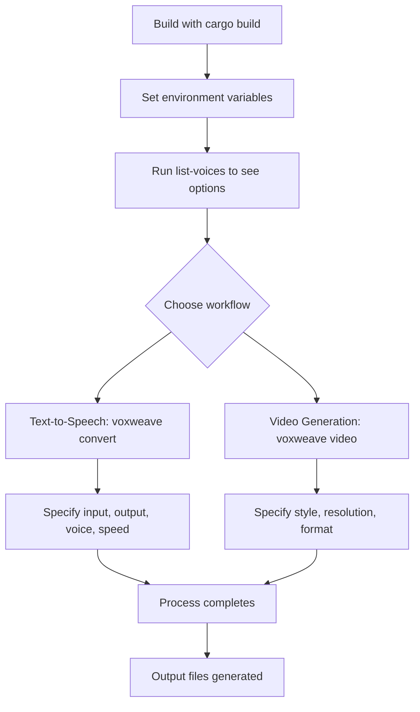
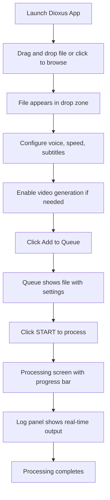
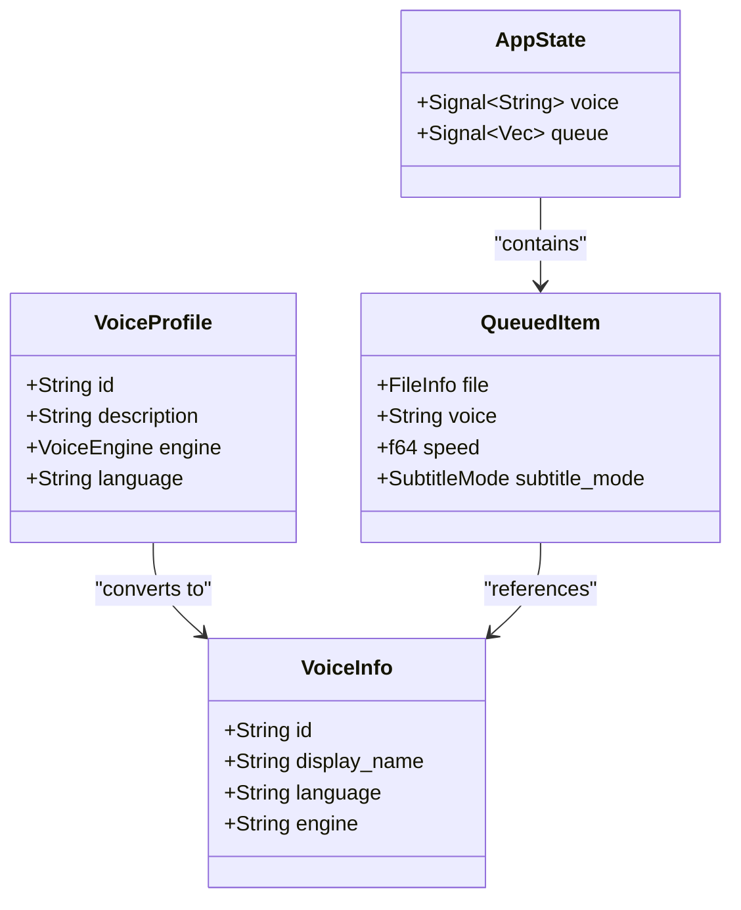
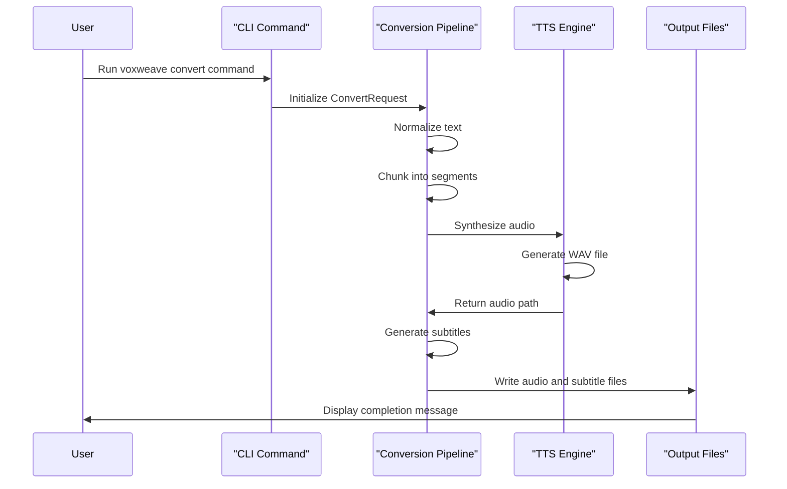
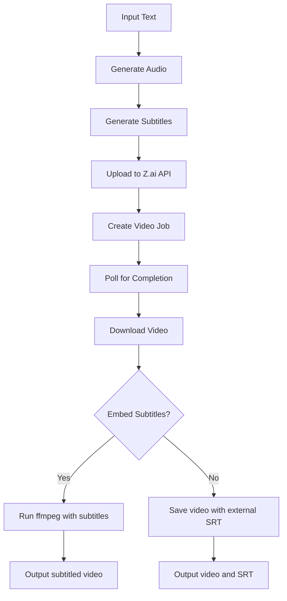
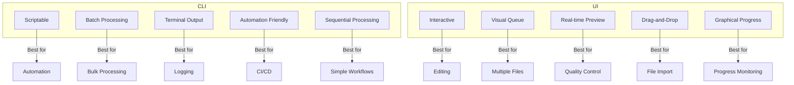

# User Workflows

<cite>
**Referenced Files in This Document**   
- [README.md](file://README.md)
- [QUICKSTART.md](file://QUICKSTART.md)
- [CLI_VIDEO_GENERATION.md](file://CLI_VIDEO_GENERATION.md)
- [VIDEO_CLI_QUICKREF.md](file://VIDEO_CLI_QUICKREF.md)
- [src/main.rs](file://src/main.rs)
- [abogen-ui/crates/ui/state.rs](file://abogen-ui/crates/ui/state.rs)
- [abogen-ui/crates/ui/services/tts_service.rs](file://abogen-ui/crates/ui/services/tts_service.rs)
- [abogen-ui/crates/ui/services/video_generation.rs](file://abogen-ui/crates/ui/services/video_generation.rs)
- [abogen-ui/crates/ui/components/drop_zone.rs](file://abogen-ui/crates/ui/components/drop_zone.rs)
- [abogen-ui/crates/ui/components/log_panel.rs](file://abogen-ui/crates/ui/components/log_panel.rs)
- [abogen-ui/crates/ui/components/queue_modal.rs](file://abogen-ui/crates/ui/components/queue_modal.rs)
- [abogen-ui/crates/ui/components/progress_bar.rs](file://abogen-ui/crates/ui/components/progress_bar.rs)
- [abogen-ui/crates/ui/lib.rs](file://abogen-ui/crates/ui/lib.rs)
- [samples/long_example.md](file://samples/long_example.md)
</cite>

## Table of Contents
1. [Introduction](#introduction)
2. [Installation and Setup](#installation-and-setup)
3. [CLI User Workflow](#cli-user-workflow)
4. [UI User Workflow](#ui-user-workflow)
5. [Voice Selection and Configuration](#voice-selection-and-configuration)
6. [Text-to-Speech Conversion](#text-to-speech-conversion)
7. [Video Generation](#video-generation)
8. [Workflow Comparison](#workflow-comparison)
9. [Common Issues and Troubleshooting](#common-issues-and-troubleshooting)
10. [Performance Tips](#performance-tips)

## Introduction
VoxWeave provides two primary interfaces for text-to-speech and video generation: a command-line interface (CLI) for scriptable automation and a graphical user interface (UI) for interactive processing. This document details practical usage patterns for both workflows, from initial setup to advanced video generation. The CLI offers batch processing capabilities and integration with shell scripts, while the UI provides real-time feedback, drag-and-drop functionality, and visual queue management. Both interfaces support the same core features including voice selection, subtitle generation, and AI-powered video creation, but differ in their approach to user interaction and workflow management.

## Installation and Setup
To begin using VoxWeave, first build the application from source. For basic text-to-speech functionality, run `cargo build`. To enable CoquiTTS with voice cloning support, build with the `coqui-tts` feature flag: `cargo build --features coqui-tts`. For video generation capabilities, build with the `video-generation` feature: `cargo build --features video-generation`. After building, ensure required dependencies are installed: `espeak-ng` for basic TTS, Python 3.9+ with `pip install kokoro numpy torch` for Kokoro voices, and `pip install TTS torch numpy` for CoquiTTS. When using video generation, set the Z.ai API key as an environment variable with `export ZAI_API_KEY=your_api_key_here`. The application will create configuration files under the `com/voxweave/voxweave` directory in your system's application data location, which can be overridden with the `VOXWEAVE_CONFIG_DIR` environment variable.

**Section sources**
- [README.md](file://README.md#L1-L132)
- [QUICKSTART.md](file://QUICKSTART.md#L1-L222)

## CLI User Workflow
The CLI workflow follows a sequential command pattern starting with installation and progressing through text-to-speech conversion to video generation. After building the application, users can immediately test functionality with mock mode, which processes text without generating audio: `voxweave convert samples/example.txt --mock --voice en-us`. For actual audio conversion, use the `convert` command with an input file and output directory: `voxweave convert input.txt --output ./output --voice af_alloy`. The CLI supports various voice options, speed adjustments with the `--speed` flag, and subtitle generation with `--subtitles sentence` or `--subtitles words`. For video generation, use the `video` subcommand: `voxweave video input.txt --style cinematic --resolution 1080p`. Users can list available voices with `voxweave list-voices` and access detailed help with `voxweave --help` or `voxweave convert --help`.

**Diagram sources **
- [src/main.rs](file://src/main.rs#L1-L417)
- [CLI_VIDEO_GENERATION.md](file://CLI_VIDEO_GENERATION.md#L1-L323)

## UI User Workflow
The UI workflow provides an interactive experience through the Dioxus application, accessible via desktop, mobile, or web platforms. Users begin by launching the application, which presents a drag-and-drop interface for file import. The main screen features a dashed panel where users can either drag a text file or click to browse their file system. Once a file is selected, its name and size appear below the drop zone. Users then configure processing options including voice selection, playback speed, subtitle settings, and output formats. The UI includes a queue system where multiple files can be added for batch processing. When ready, users click the "START" button to begin processing, which transitions to a processing screen showing a progress bar and log panel. The queue can be managed through a modal dialog that allows reordering, removing, or clearing items. Video generation options are available as a checkbox with configurable style, resolution, and custom prompts.

**Diagram sources **
- [abogen-ui/crates/ui/lib.rs](file://abogen-ui/crates/ui/lib.rs#L1-L639)
- [abogen-ui/crates/ui/components/drop_zone.rs](file://abogen-ui/crates/ui/components/drop_zone.rs#L1-L234)

## Voice Selection and Configuration
VoxWeave supports multiple voice engines with distinct selection mechanisms for CLI and UI users. In the CLI, voices are specified by ID using the `--voice` flag. Voice IDs follow a pattern of language and gender markers, such as `af_alloy` for American English female or `am_eric` for American English male. Users can list all available voices with `voxweave list-voices`, which displays the ID, engine type, and description. The UI presents voices in a searchable combobox that displays both the display name and language. The combobox supports filtering by typing, making it easy to find specific voices among the 68+ options. Both interfaces support the same voice set, including Kokoro voices for various languages and genders, with CoquiTTS voices available when built with the appropriate feature flag. The default voice is `af_heart`, but users can change this through the interface or by setting a default in the configuration.

**Diagram sources **
- [src/main.rs](file://src/main.rs#L1-L417)
- [abogen-ui/crates/ui/state.rs](file://abogen-ui/crates/ui/state.rs#L1-L255)
- [abogen-ui/crates/ui/services/voices.rs](file://abogen-ui/crates/ui/services/voices.rs#L1-L216)

## Text-to-Speech Conversion
Text-to-speech conversion in VoxWeave follows a consistent pipeline regardless of interface. The process begins with text normalization, which collapses stray whitespace and handles newlines according to user preferences. The normalized text is then chunked into segments for audio generation, with subtitle timing based on either sentence boundaries or fixed word counts. For CLI users, the conversion is initiated with the `voxweave convert` command followed by the input file path and options. The `--mock` flag is particularly useful for testing as it skips actual audio generation while validating the processing pipeline. UI users configure conversion settings through the interface controls before adding files to the queue. Both interfaces support advanced features like voice cloning when built with the `coqui-tts` feature, allowing users to generate speech in custom voices based on reference audio. The output includes both audio files (WAV, MP3, or FLAC) and subtitle files (SRT, ASS, or VTT) when enabled.

**Diagram sources **
- [src/main.rs](file://src/main.rs#L1-L417)
- [abogen-ui/crates/ui/services/tts_service.rs](file://abogen-ui/crates/ui/services/tts_service.rs#L1-L540)

## Video Generation
Video generation in VoxWeave combines AI-generated visuals with narrated audio to create professional-quality videos. The process begins with audio generation from the input text, followed by subtitle creation and video synthesis through the Z.ai API. CLI users initiate video generation with the `voxweave video` command, specifying options such as style (`--style cinematic`), resolution (`--resolution 1080p`), and format (`--format mp4`). The UI provides these options through dropdown menus in the video generation section, with a checkbox to enable video creation. Both interfaces support custom visual prompts to guide the AI in generating specific types of content. The video generation pipeline uploads the audio to Z.ai, creates a video job with the specified parameters, polls for completion, downloads the generated video, and optionally embeds subtitles using ffmpeg. Output files include the audio, subtitles, video, and a subtitled video version when ffmpeg is available.

**Diagram sources **
- [CLI_VIDEO_GENERATION.md](file://CLI_VIDEO_GENERATION.md#L1-L323)
- [abogen-ui/crates/ui/services/video_generation.rs](file://abogen-ui/crates/ui/services/video_generation.rs#L1-L488)

## Workflow Comparison
The CLI and UI workflows offer complementary approaches to text-to-speech and video generation, each suited to different use cases. The CLI excels in automation, batch processing, and integration with other tools, making it ideal for scripting, CI/CD pipelines, and server environments. Its strength lies in its ability to process multiple files through shell loops and integrate with other command-line tools. The UI, on the other hand, provides a more accessible and interactive experience with real-time audio previews, visual progress tracking, and intuitive drag-and-drop functionality. It is better suited for interactive editing, visual queue management, and users who prefer graphical interfaces. Key differences include the CLI's scriptable batch processing versus the UI's visual queue management, the CLI's text-based progress output versus the UI's graphical progress bar, and the UI's real-time log panel versus the CLI's terminal output.

**Diagram sources **
- [CLI_VIDEO_GENERATION.md](file://CLI_VIDEO_GENERATION.md#L1-L323)
- [abogen-ui/crates/ui/lib.rs](file://abogen-ui/crates/ui/lib.rs#L1-L639)

## Common Issues and Troubleshooting
Users may encounter several common issues when working with VoxWeave. For CLI users, the most frequent problem is the "ZAI_API_KEY environment variable not set" error when attempting video generation. This is resolved by setting the API key with `export ZAI_API_KEY=your_api_key_here`. Another common issue is "voice not found" errors, which can be addressed by running `voxweave list-voices` to verify available voice IDs. UI users may experience issues with file import, particularly if the file type is not supported (.txt, .epub, .pdf). Missing Python dependencies for Kokoro or CoquiTTS can cause audio generation to fail, requiring installation of the necessary packages with pip. The "ffmpeg failed" error during subtitle embedding indicates that ffmpeg is not installed or not in the system PATH, which can be resolved by installing ffmpeg through the system package manager. For both interfaces, video generation timeouts can occur with long input texts, which can be mitigated by using shorter content or lower resolutions.

**Section sources**
- [CLI_VIDEO_GENERATION.md](file://CLI_VIDEO_GENERATION.md#L1-L323)
- [abogen-ui/crates/ui/services/tts_service.rs](file://abogen-ui/crates/ui/services/tts_service.rs#L1-L540)
- [abogen-ui/crates/ui/services/video_generation.rs](file://abogen-ui/crates/ui/services/video_generation.rs#L1-L488)

## Performance Tips
To optimize performance in VoxWeave, users should leverage several built-in features and best practices. The `--mock` flag is invaluable for testing workflows without the overhead of actual audio generation, providing fast feedback during development. For video generation, starting with 720p resolution reduces processing time significantly compared to 1080p or 4K, with the option to use higher resolutions for final production. When using the UI, enabling GPU acceleration (when available) can speed up processing, particularly for CoquiTTS voice cloning. CLI users should implement delays between batch requests to avoid API rate limits, especially when processing multiple files. For long-running processes, monitoring the Z.ai dashboard for API usage helps prevent quota exhaustion. Additionally, users can improve performance by preprocessing text to remove unnecessary formatting or by using simpler voice models for draft versions before switching to higher-quality voices for final output.

**Section sources**
- [CLI_VIDEO_GENERATION.md](file://CLI_VIDEO_GENERATION.md#L1-L323)
- [abogen-ui/crates/ui/services/gpu_probe.rs](file://abogen-ui/crates/ui/services/gpu_probe.rs#L1-L26)