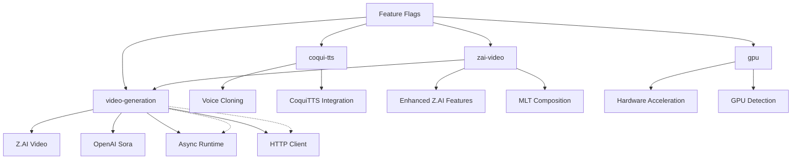
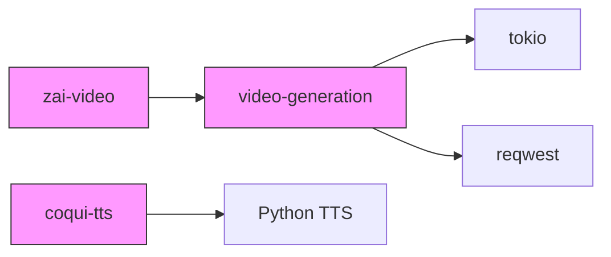

# Feature Flags & Conditional Compilation

<cite>
**Referenced Files in This Document**   
- [Cargo.toml](file://Cargo.toml)
- [src/coqui_tts.rs](file://src/coqui_tts.rs)
- [src/lib.rs](file://src/lib.rs)
- [src/video.rs](file://src/video.rs)
- [abogen-ui/crates/ui/services/gpu_probe.rs](file://abogen-ui/crates/ui/services/gpu_probe.rs)
- [abogen-ui/apps/desktop/Cargo.toml](file://abogen-ui/apps/desktop/Cargo.toml)
- [CLI_VIDEO_GENERATION.md](file://CLI_VIDEO_GENERATION.md)
- [COQUI_TTS_IMPLEMENTATION.md](file://COQUI_TTS_IMPLEMENTATION.md)
- [generate_video.sh](file://generate_video.sh)
</cite>

## Table of Contents
1. [Introduction](#introduction)
2. [Core Feature Flags](#core-feature-flags)
3. [Feature-Driven Dependency Management](#feature-driven-dependency-management)
4. [Conditional Compilation in Code](#conditional-compilation-in-code)
5. [Workspace Feature Propagation](#workspace-feature-propagation)
6. [Build Commands and Combinations](#build-commands-and-combinations)
7. [Performance and Trade-offs](#performance-and-trade-offs)
8. [Common Issues and Troubleshooting](#common-issues-and-troubleshooting)

## Introduction
The VoxWeave workspace employs a modular feature flag system to enable selective activation of advanced functionality. This approach allows users to customize their build with specific capabilities such as voice cloning, video generation, and hardware acceleration, while maintaining minimal binary size and compilation time for basic use cases. The feature system controls both dependency inclusion and conditional compilation of code paths across the workspace.

**Section sources**
- [Cargo.toml](file://Cargo.toml)
- [src/lib.rs](file://src/lib.rs)

## Core Feature Flags
The VoxWeave system implements four primary feature flags that control major functionality modules:

### coqui-tts
Enables voice cloning capabilities and integration with CoquiTTS, a deep learning-based text-to-speech system. When activated, this feature enables the `CoquiEngine` implementation for speech synthesis with support for voice cloning from reference audio samples. The feature is controlled through the `coqui-tts` flag in Cargo.toml.

### video-generation
Activates support for video generation services including Z.AI and OpenAI Sora. This feature enables the video generation pipeline and includes required async runtime (tokio) and HTTP client (reqwest) dependencies. It provides the foundation for AI-generated video content from audio and text inputs.

### zai-video
Extends Z.AI-specific video generation features beyond the base video-generation capability. This feature enables enhanced styling, composition, and integration options specific to the Z.AI platform, including MLT-based video composition with subtitles and audio.

### gpu
Enables hardware acceleration support throughout the application. When activated, components can utilize GPU resources for accelerated processing. The feature is detected at runtime through the `probe_gpu()` function, which returns availability based on the compilation flag state.



**Diagram sources**
- [Cargo.toml](file://Cargo.toml)
- [src/coqui_tts.rs](file://src/coqui_tts.rs)
- [src/video.rs](file://src/video.rs)
- [abogen-ui/crates/ui/services/gpu_probe.rs](file://abogen-ui/crates/ui/services/gpu_probe.rs)

**Section sources**
- [Cargo.toml](file://Cargo.toml)
- [src/coqui_tts.rs](file://src/coqui_tts.rs)
- [src/video.rs](file://src/video.rs)
- [abogen-ui/crates/ui/services/gpu_probe.rs](file://abogen-ui/crates/ui/services/gpu_probe.rs)

## Feature-Driven Dependency Management
The feature system controls optional dependencies in the Cargo.toml configuration, ensuring that external crates are only included when their corresponding features are activated.

### Conditional Dependencies
The `video-generation` feature activates two critical dependencies:
- **tokio**: Async runtime with specific features (rt, rt-multi-thread, fs, io-util, time, process)
- **reqwest**: HTTP client with multipart and JSON support

These dependencies are marked as optional in the Cargo.toml file and are only compiled when the `video-generation` feature is enabled, preventing unnecessary bloat in builds that don't require video capabilities.

### Dependency Chain
The feature system establishes a dependency hierarchy where certain features require others:
- `zai-video` requires `video-generation` as a prerequisite
- `video-generation` automatically includes tokio and reqwest
- `coqui-tts` operates independently but requires Python TTS installation

This cascading dependency model ensures that all required components are available when complex features are activated.



**Diagram sources**
- [Cargo.toml](file://Cargo.toml)

**Section sources**
- [Cargo.toml](file://Cargo.toml)

## Conditional Compilation in Code
The feature flags control code inclusion through Rust's conditional compilation attributes, ensuring that functionality is only compiled when explicitly enabled.

### Module-Level Compilation
In src/lib.rs, modules are conditionally compiled based on feature activation:
- `coqui_tts` module is included only when `coqui-tts` feature is enabled
- `video` module is included only when `video-generation` feature is enabled

This prevents the compilation of unused code paths and reduces binary size.

### Implementation-Specific Compilation
The `CoquiEngine` implementation in src/coqui_tts.rs uses the `#[cfg(feature = "coqui-tts")]` attribute to wrap its Default trait implementation and SpeechEngine methods. This ensures that the Coqui-specific code is only compiled when the feature is activated.

Similarly, the GPU detection service uses conditional compilation:
```rust
#[cfg(feature = "gpu")]
pub fn probe_gpu() -> bool {
    true
}

#[cfg(not(feature = "gpu"))]
pub fn probe_gpu() -> bool {
    false
}
```

This pattern allows the same API to be used throughout the codebase while the implementation varies based on compilation features.

```mermaid
classDiagram
class CoquiEngine {
+python_command : String
+model_name : String
+device : String
+sample_rate : u32
+language : String
}
class VideoGenerationService {
+api_key : String
+base_url : String
+provider : VideoProvider
}
class VideoConfig {
+style : VideoStyle
+resolution : VideoResolution
+format : VideoFormat
+prompt : Option~String~
}
class VideoProvider {
+ZAI
+OpenAISora
}
VideoGenerationService --> VideoConfig : "uses"
VideoGenerationService --> VideoProvider : "depends on"
note right of CoquiEngine
Only compiled when
feature "coqui-tts" is enabled
end note
note right of VideoGenerationService
Only compiled when
feature "video-generation" is enabled
end note
```

**Diagram sources**
- [src/coqui_tts.rs](file://src/coqui_tts.rs)
- [src/video.rs](file://src/video.rs)
- [src/lib.rs](file://src/lib.rs)

**Section sources**
- [src/coqui_tts.rs](file://src/coqui_tts.rs)
- [src/lib.rs](file://src/lib.rs)
- [src/video.rs](file://src/video.rs)

## Workspace Feature Propagation
The feature system extends across the entire workspace, with features being propagated from the core library to dependent applications.

### Desktop Application Configuration
The desktop application in abogen-ui/apps/desktop/Cargo.toml explicitly enables multiple features:
- `video-generation`
- `real-tts` 
- `zai-video`
- `coqui-tts`

This comprehensive feature set enables the full functionality of the desktop application, including video generation, text-to-speech, and voice cloning capabilities.

### Feature Dependencies
Documentation in ZAI_VIDEO_FEATURE.md confirms that `zai-video` requires both `video-generation` and `real-tts` features to function properly, establishing a clear dependency chain across the workspace.

The modular design allows different applications within the workspace to enable only the features they require, optimizing resource usage and compilation time.

**Section sources**
- [abogen-ui/apps/desktop/Cargo.toml](file://abogen-ui/apps/desktop/Cargo.toml)
- [ZAI_VIDEO_FEATURE.md](file://abogen-ui/ZAI_VIDEO_FEATURE.md)

## Build Commands and Combinations
The feature system enables flexible build configurations through command-line feature specification.

### Basic Build Commands
To build with video generation support:
```bash
cargo build --features video-generation --release
```

To run video generation with specific features:
```bash
cargo run --features video-generation --release -- video input.txt
```

### Feature Combinations
Multiple features can be combined using comma-separated syntax:
```bash
--features 'coqui-tts,video-generation'
```

The generate_video.sh script demonstrates a practical build command that activates video generation:
```bash
cargo build --features video-generation --release
```

### Environment Requirements
Certain features require environment variables to function:
- `ZAI_API_KEY` for video generation services
- `VOXWEAVE_COQUI_PYTHON`, `VOXWEAVE_COQUI_MODEL`, `VOXWEAVE_COQUI_DEVICE` for CoquiTTS configuration

**Section sources**
- [generate_video.sh](file://generate_video.sh)
- [CLI_VIDEO_GENERATION.md](file://CLI_VIDEO_GENERATION.md)
- [COQUI_TTS_IMPLEMENTATION.md](file://COQUI_TTS_IMPLEMENTATION.md)

## Performance and Trade-offs
The feature flag system involves important trade-offs between functionality, binary size, and compilation time.

### Binary Size Impact
Enabling additional features increases binary size significantly:
- Base build: minimal size
- With `coqui-tts`: +Python integration overhead
- With `video-generation`: +tokio and reqwest dependencies (~5-10MB increase)
- Full feature set: maximum binary size

### Compilation Time
Feature combinations affect compilation duration:
- Single features: moderate compilation time
- Multiple features: increased compilation due to dependency resolution
- Full workspace: longest compilation time

### Runtime Performance
- `gpu` feature enables hardware acceleration when available
- `video-generation` requires async runtime overhead
- `coqui-tts` introduces Python subprocess communication latency

The modular design allows users to optimize for their specific use case, balancing functionality needs with performance requirements.

**Section sources**
- [Cargo.toml](file://Cargo.toml)
- [src/coqui_tts.rs](file://src/coqui_tts.rs)
- [src/video.rs](file://src/video.rs)

## Common Issues and Troubleshooting
Several common issues arise from improper feature management and configuration.

### Missing Features at Runtime
Attempting to use functionality without enabling the corresponding feature flag results in compilation errors or silent deactivation. For example, using video generation without `video-generation` feature will fail to compile.

### Incorrect Feature Activation
Common mistakes include:
- Forgetting to enable dependent features (e.g., `zai-video` without `video-generation`)
- Not setting required environment variables
- Missing external dependencies (Python TTS for `coqui-tts`)

### Resolution Strategies
1. Verify feature flags in build commands
2. Check environment variables are set
3. Ensure external dependencies are installed
4. Validate feature propagation in workspace members

The test_coqui.py script provides a diagnostic tool for verifying CoquiTTS Python dependencies, helping identify configuration issues before compilation.

**Section sources**
- [test_coqui.py](file://test_coqui.py)
- [COQUI_TTS_IMPLEMENTATION.md](file://COQUI_TTS_IMPLEMENTATION.md)
- [CLI_VIDEO_GENERATION.md](file://CLI_VIDEO_GENERATION.md)