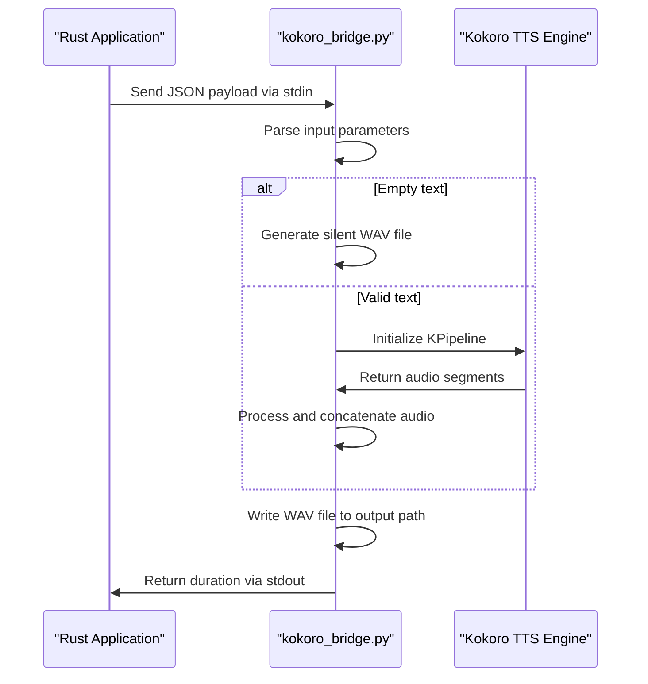
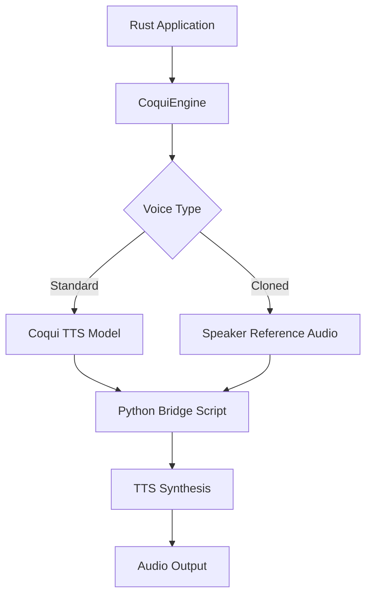
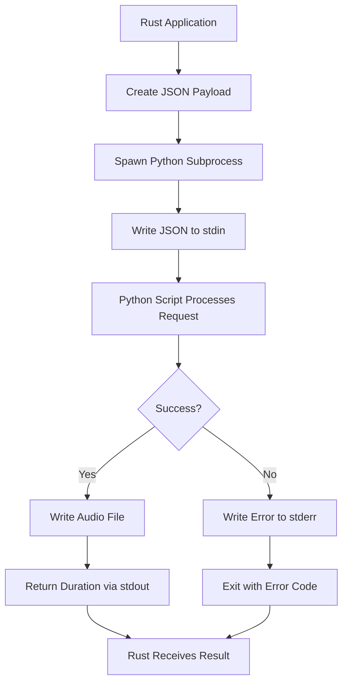

# Python Integration & TTS Bridges

<cite>
**Referenced Files in This Document**   
- [kokoro_bridge.py](file://python/kokoro_bridge.py)
- [test_coqui.py](file://test_coqui.py)
- [coqui_tts.rs](file://src/coqui_tts.rs)
- [tts.rs](file://src/tts.rs)
</cite>

## Table of Contents
1. [Introduction](#introduction)
2. [Kokoro Bridge Implementation](#kokoro-bridge-implementation)
3. [CoquiTTS Integration](#coquitts-integration)
4. [Audio Processing with NumPy and Wave](#audio-processing-with-numpy-and-wave)
5. [Subprocess Communication Protocol](#subprocess-communication-protocol)
6. [Environment Configuration](#environment-configuration)
7. [Troubleshooting Guide](#troubleshooting-guide)

## Introduction
This document details the Python integration layer for TTS engine bridging in the VoxWeave project. It focuses on the kokoro_bridge.py and test_coqui.py scripts that enable communication between Rust and Python TTS engines. The integration allows for text-to-speech synthesis through subprocess interfaces, supporting both the Kokoro and CoquiTTS engines with voice cloning capabilities.

**Section sources**
- [kokoro_bridge.py](file://python/kokoro_bridge.py#L1-L89)
- [test_coqui.py](file://test_coqui.py#L1-L140)
- [coqui_tts.rs](file://src/coqui_tts.rs#L1-L115)

## Kokoro Bridge Implementation

The kokoro_bridge.py script serves as a subprocess interface between Rust and the Kokoro TTS engine, processing JSON input and returning audio duration via stdout. The bridge accepts parameters including text, voice, speed, and output path, enabling seamless integration with the Rust application.

The implementation handles both normal text synthesis and silent output generation when empty text is provided. For silent output, the script creates a WAV file with no audio frames while maintaining the proper sample rate configuration.



**Diagram sources**
- [kokoro_bridge.py](file://python/kokoro_bridge.py#L1-L89)

**Section sources**
- [kokoro_bridge.py](file://python/kokoro_bridge.py#L1-L89)

## CoquiTTS Integration

The CoquiTTS integration enables advanced text-to-speech capabilities with voice cloning support. The system uses the test_coqui.py script to verify installation and functionality of the CoquiTTS dependencies, including torch, TTS, and numpy.

The integration follows a two-step verification process:
1. Import testing for required packages
2. Model initialization testing for the xtts_v2 model

When the CoquiEngine in coqui_tts.rs invokes the Python bridge, it passes a JSON payload containing text, output path, sample rate, model name, device specification, language, speed, and optional speaker reference audio for voice cloning.



**Diagram sources**
- [test_coqui.py](file://test_coqui.py#L1-L140)
- [coqui_tts.rs](file://src/coqui_tts.rs#L1-L115)

**Section sources**
- [test_coqui.py](file://test_coqui.py#L1-L140)
- [coqui_tts.rs](file://src/coqui_tts.rs#L1-L115)

## Audio Processing with NumPy and Wave

The integration layer utilizes numpy and wave libraries for comprehensive audio processing. The kokoro_bridge.py script handles sample rate configuration, PCM encoding, and audio data manipulation through numpy arrays.

Key audio processing steps include:
- Converting audio data to numpy arrays with float32 precision
- Clipping audio values to the range [-1.0, 1.0]
- Converting to 16-bit signed integer PCM format
- Writing properly formatted WAV files with correct channel, sample width, and frame rate settings

The _coerce_numpy function ensures compatibility between different audio data types, handling torch tensors and numpy arrays gracefully by detaching tensors, moving them to CPU, and converting to numpy format when necessary.

**Section sources**
- [kokoro_bridge.py](file://python/kokoro_bridge.py#L1-L89)

## Subprocess Communication Protocol

The communication between Rust and Python components follows a standardized JSON-based protocol. The Rust application (coqui_tts.rs) spawns a Python subprocess and communicates via stdin/stdout using JSON serialization.

The JSON payload structure includes:
- text: Input text for synthesis
- output: File path for audio output
- sample_rate: Audio sample rate (defaults to 24000)
- model_name: TTS model identifier
- device: Processing device (cpu, cuda, mps)
- language: Target language code
- speed: Speech speed multiplier
- speaker_wav: Path to reference audio for voice cloning

Error handling is implemented through stderr output and process exit codes. The bridge scripts write error messages to stderr and exit with non-zero status when dependencies cannot be imported or TTS generation fails.



**Diagram sources**
- [coqui_tts.rs](file://src/coqui_tts.rs#L1-L115)
- [kokoro_bridge.py](file://python/kokoro_bridge.py#L1-L89)

**Section sources**
- [coqui_tts.rs](file://src/coqui_tts.rs#L1-L115)
- [kokoro_bridge.py](file://python/kokoro_bridge.py#L1-L89)

## Environment Configuration

The integration supports configuration through environment variables, allowing customization of Python execution and TTS engine behavior:

- VOXWEAVE_COQUI_PYTHON: Python command (default: python3)
- VOXWEAVE_COQUI_MODEL: TTS model identifier (default: tts_models/multilingual/multi-dataset/xtts_v2)
- VOXWEAVE_COQUI_DEVICE: Processing device (default: cpu)
- VOXWEAVE_COQUI_SAMPLE_RATE: Audio sample rate (default: 24000)
- VOXWEAVE_COQUI_LANGUAGE: Default language (default: en)

These environment variables are read by the CoquiEngine's Default implementation, providing flexible configuration without requiring code changes.

**Section sources**
- [coqui_tts.rs](file://src/coqui_tts.rs#L1-L115)

## Troubleshooting Guide

Common issues and their solutions for the Python-Rust TTS integration:

### Missing Python Dependencies
**Issue**: "failed to import coqui dependencies" error
**Solution**: Install required packages using pip:
```bash
pip install TTS torch numpy
```

For GPU acceleration:
```bash
# NVIDIA CUDA
pip install torch torchvision torchaudio --index-url https://download.pytorch.org/whl/cu118

# Apple Silicon MPS
pip install torch torchvision torchaudio
```

### CUDA Setup Issues
**Issue**: "CUDA out of memory" or CUDA initialization failures
**Solution**: Switch to CPU mode by setting:
```bash
export VOXWEAVE_COQUI_DEVICE="cpu"
```

### Model Download Failures
**Issue**: Slow or failed model downloads
**Solution**: The XTTS v2 model is approximately 1.8GB and downloads on first use. Ensure stable internet connection and sufficient storage space. The download occurs automatically when the model is first initialized.

### Speaker Reference Audio Issues
**Issue**: "Speaker reference audio not found" error
**Solution**: Verify that the audio file path exists and is accessible. Ensure the file is in WAV format and the path is correctly specified in the voice profile's command field.

### Microphone Access Issues
**Issue**: "No input device available" error
**Solution**: Check microphone permissions in system settings:
- macOS: System Preferences → Security & Privacy → Microphone
- Ensure the application has microphone access permissions

**Section sources**
- [test_coqui.py](file://test_coqui.py#L1-L140)
- [coqui_tts.rs](file://src/coqui_tts.rs#L1-L115)
- [kokoro_bridge.py](file://python/kokoro_bridge.py#L1-L89)