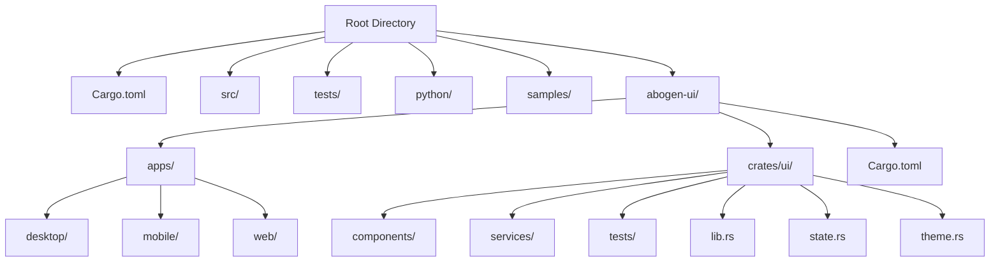
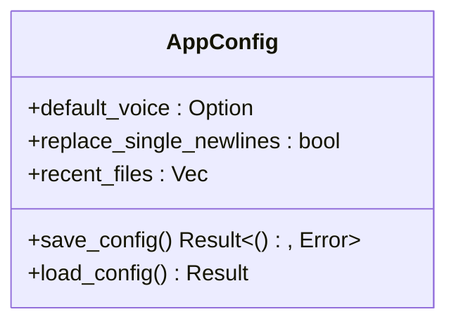
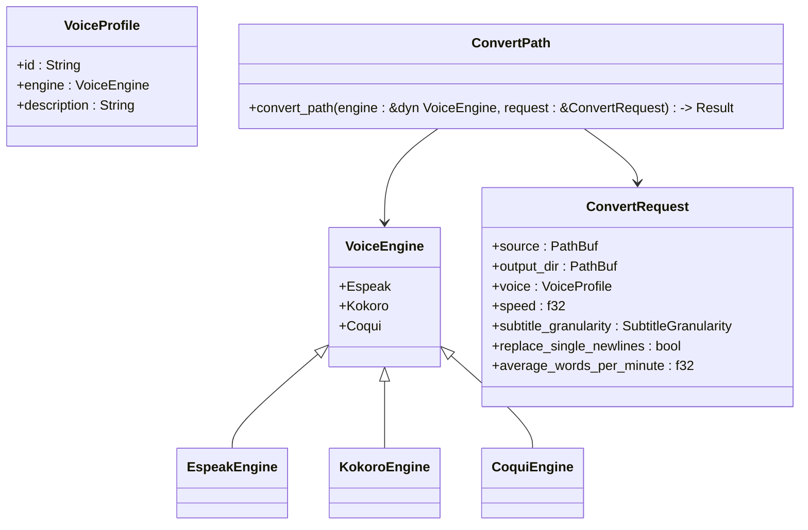
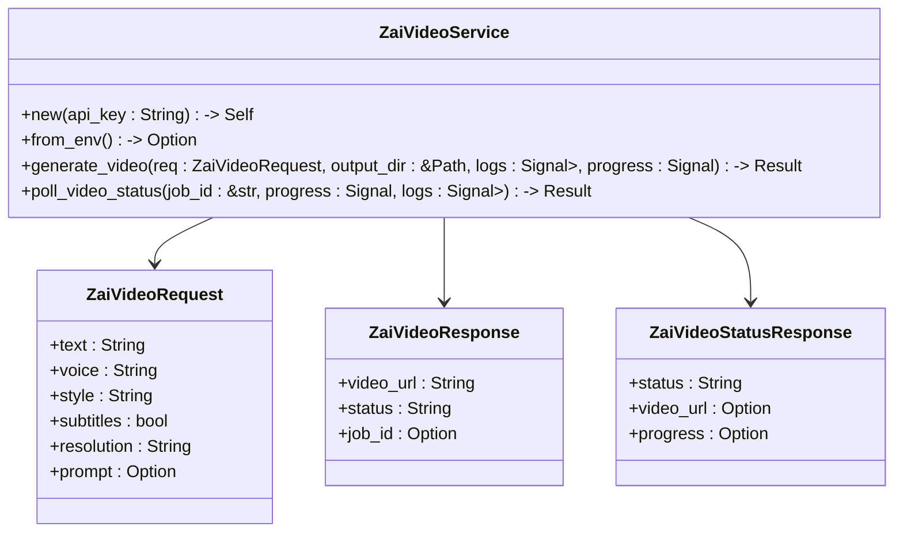

# Rust Dependencies

<cite>
**Referenced Files in This Document**   
- [Cargo.toml](file://Cargo.toml)
- [abogen-ui/Cargo.toml](file://abogen-ui/Cargo.toml)
- [abogen-ui/crates/ui/Cargo.toml](file://abogen-ui/crates/ui/Cargo.toml)
- [src/main.rs](file://src/main.rs)
- [src/lib.rs](file://src/lib.rs)
- [abogen-ui/crates/ui/lib.rs](file://abogen-ui/crates/ui/lib.rs)
- [abogen-ui/crates/ui/state.rs](file://abogen-ui/crates/ui/state.rs)
- [abogen-ui/crates/ui/services/zai_video.rs](file://abogen-ui/crates/ui/services/zai_video.rs)
- [src/video.rs](file://src/video.rs)
</cite>

## Table of Contents
1. [Introduction](#introduction)
2. [Project Structure](#project-structure)
3. [Core Components](#core-components)
4. [Architecture Overview](#architecture-overview)
5. [Detailed Component Analysis](#detailed-component-analysis)
6. [Dependency Analysis](#dependency-analysis)
7. [Performance Considerations](#performance-considerations)
8. [Troubleshooting Guide](#troubleshooting-guide)
9. [Conclusion](#conclusion)

## Introduction
This document provides a comprehensive overview of the Rust dependencies used in the VoxWeave project, with a focus on the core and UI crates. It details the primary crates that enable cross-platform UI development, CLI argument parsing, asynchronous runtime operations, API communication, data serialization, and robust error handling. The integration of optional features and conditional compilation is also explained, along with best practices for dependency management and version compatibility across the workspace.

## Project Structure
The VoxWeave project is organized into multiple directories, each serving a specific purpose. The root directory contains the main application logic and configuration, while the `abogen-ui` directory houses the UI components and applications for different platforms. The `python` directory includes bridge scripts, and the `samples` directory contains example files. The `src` directory holds the core Rust modules, and the `tests` directory includes integration tests.



**Diagram sources**
- [Cargo.toml](file://Cargo.toml)
- [abogen-ui/Cargo.toml](file://abogen-ui/Cargo.toml)
- [abogen-ui/crates/ui/Cargo.toml](file://abogen-ui/crates/ui/Cargo.toml)

**Section sources**
- [Cargo.toml](file://Cargo.toml)
- [abogen-ui/Cargo.toml](file://abogen-ui/Cargo.toml)
- [abogen-ui/crates/ui/Cargo.toml](file://abogen-ui/crates/ui/Cargo.toml)

## Core Components
The core components of the VoxWeave project are built around a set of well-defined Rust crates that provide essential functionality. These components include the main application logic, configuration management, text-to-speech processing, and video generation services. The use of modular design principles ensures that each component is loosely coupled and can be developed and tested independently.

**Section sources**
- [src/main.rs](file://src/main.rs)
- [src/lib.rs](file://src/lib.rs)
- [abogen-ui/crates/ui/lib.rs](file://abogen-ui/crates/ui/lib.rs)

## Architecture Overview
The architecture of the VoxWeave project is designed to be modular and scalable, with a clear separation of concerns between the core logic and the UI components. The core crate provides the business logic and data processing capabilities, while the UI crate handles user interaction and presentation. The use of a workspace in Cargo allows for shared dependencies and consistent versioning across the project.

```mermaid
graph TD
Core[Core Crate] --> Config[Configuration]
Core --> TTS[Text-to-Speech]
Core --> Video[Video Generation]
Core --> Queue[Processing Queue]
UI[UI Crate] --> Dioxus[Dioxus Framework]
UI --> State[Application State]
UI --> Services[Service Integrations]
Core < --> UI
UI --> Web[Web App]
UI --> Desktop[Desktop App]
UI --> Mobile[Mobile App]
```

**Diagram sources**
- [Cargo.toml](file://Cargo.toml)
- [abogen-ui/Cargo.toml](file://abogen-ui/Cargo.toml)
- [abogen-ui/crates/ui/Cargo.toml](file://abogen-ui/crates/ui/Cargo.toml)

## Detailed Component Analysis
### Core Crate Analysis
The core crate is responsible for the main functionality of the VoxWeave application, including configuration management, text-to-speech processing, and video generation. It uses a combination of synchronous and asynchronous operations to handle different tasks efficiently.

#### Configuration Management
The configuration management module loads and saves application settings, ensuring that user preferences are persisted across sessions. It uses the `serde` crate for serialization and deserialization of configuration data.



**Diagram sources**
- [src/config.rs](file://src/config.rs)

#### Text-to-Speech Processing
The text-to-speech processing module supports multiple engines, including eSpeak, Kokoro, and CoquiTTS. The use of feature flags allows for conditional compilation of CoquiTTS support, which requires additional dependencies.



**Diagram sources**
- [src/tts.rs](file://src/tts.rs)
- [src/coqui_tts.rs](file://src/coqui_tts.rs)

#### Video Generation
The video generation module integrates with external APIs to create videos from audio and subtitle files. It supports multiple providers, including Z.AI and OpenAI Sora, and uses the `reqwest` crate for HTTP requests.

```mermaid
classDiagram
class VideoProvider {
+ZAI
+OpenAISora
}
class VideoConfig {
+style : VideoStyle
+resolution : VideoResolution
+format : VideoFormat
+prompt : Option<String>
}
class VideoGenerationService {
+new(api_key : String) -> Self
+new_sora(api_key : String) -> Self
+from_env() -> Result<Self, Error>
+generate_video(audio_path : &Path, subtitle_path : Option<&Path>, config : &VideoConfig, progress_callback : Option<F>, log_callback : Option<G>) -> Result<PathBuf, Error>
}
VideoGenerationService --> VideoProvider
VideoGenerationService --> VideoConfig
```

**Diagram sources**
- [src/video.rs](file://src/video.rs)

### UI Crate Analysis
The UI crate is built using the Dioxus framework, which provides a reactive and declarative approach to building user interfaces. It supports multiple platforms, including web, desktop, and mobile, and uses a component-based architecture to ensure reusability and maintainability.

#### Application State
The application state is managed using signals, which allow for reactive updates to the UI. The state includes information about the selected file, the processing queue, and various user preferences.

```mermaid
classDiagram
class AppState {
+selected_file : Signal<Option<FileInfo>>
+queue : Signal<Vec<QueuedItem>>
+voice : Signal<String>
+speed : Signal<f64>
+subtitle_mode : Signal<SubtitleMode>
+voice_format : Signal<VoiceFormat>
+subtitle_format : Signal<SubtitleFormat>
+replace_newlines : Signal<bool>
+save_location : Signal<SaveLocation>
+use_gpu : Signal<bool>
+generate_video : Signal<bool>
+video_style : Signal<VideoStyle>
+video_resolution : Signal<VideoResolution>
+video_format : Signal<VideoFormat>
+video_prompt : Signal<Option<String>>
+subtitle_display_style : Signal<SubtitleDisplayStyle>
+show_ipa_transcription : Signal<bool>
+is_processing : Signal<bool>
+progress : Signal<u8>
+logs : Signal<Vec<LogEntry>>
+cancel_token : Signal<Option<()>>
}
class FileInfo {
+name : String
+path : String
+size : u64
}
class QueuedItem {
+file : FileInfo
+voice : String
+speed : f64
+subtitle_mode : SubtitleMode
+voice_format : VoiceFormat
+subtitle_format : SubtitleFormat
+replace_newlines : bool
+use_gpu : bool
+generate_video : bool
+video_style : VideoStyle
+video_resolution : VideoResolution
+video_format : VideoFormat
+video_prompt : Option<String>
+save_location : SaveLocation
}
class LogEntry {
+message : String
+level : LogLevel
}
AppState --> FileInfo
AppState --> QueuedItem
AppState --> LogEntry
```

**Diagram sources**
- [abogen-ui/crates/ui/state.rs](file://abogen-ui/crates/ui/state.rs)

#### Service Integrations
The UI crate includes services for interacting with external APIs, such as the Z.AI video generation service. These services are designed to be asynchronous and use callbacks to update the UI with progress and log information.



**Diagram sources**
- [abogen-ui/crates/ui/services/zai_video.rs](file://abogen-ui/crates/ui/services/zai_video.rs)

## Dependency Analysis
The VoxWeave project relies on a set of well-maintained Rust crates to provide essential functionality. These dependencies are carefully selected to ensure compatibility, performance, and ease of use.

### Primary Dependencies
- **Dioxus 0.7**: A cross-platform UI framework that supports web, desktop, and mobile applications. It provides a reactive and declarative approach to building user interfaces.
- **clap 4**: A powerful CLI argument parsing library that supports derive macros for easy command-line interface creation.
- **tokio 1**: An asynchronous runtime that enables non-blocking I/O operations, process spawning, and filesystem access.
- **reqwest 0.11**: An HTTP client library that supports multipart and JSON requests, used for API communication with the Z.AI video generation service.
- **serde 1**: A serialization framework that supports derive features for easy serialization of configuration and API payloads.
- **anyhow/thiserror**: Libraries for robust error handling, providing context and backtraces for better debugging.

### Optional Features
The project uses optional features to enable conditional compilation of certain dependencies. For example, the `video-generation` feature activates `tokio` and `reqwest`, allowing for video generation capabilities when needed.

```toml
[features]
default = []
coqui-tts = []
video-generation = ["tokio", "reqwest"]
```

**Diagram sources**
- [Cargo.toml](file://Cargo.toml)
- [abogen-ui/crates/ui/Cargo.toml](file://abogen-ui/crates/ui/Cargo.toml)

**Section sources**
- [Cargo.toml](file://Cargo.toml)
- [abogen-ui/crates/ui/Cargo.toml](file://abogen-ui/crates/ui/Cargo.toml)

## Performance Considerations
The use of asynchronous operations in the VoxWeave project ensures that the application remains responsive and efficient, even when performing I/O-bound tasks. The `tokio` runtime is used to handle file operations, HTTP requests, and process spawning, allowing for non-blocking execution. The `reqwest` library is optimized for performance and supports connection pooling, which reduces the overhead of establishing new connections.

## Troubleshooting Guide
When encountering issues with the VoxWeave project, the following steps can help diagnose and resolve common problems:
- Ensure that the required environment variables (e.g., `ZAI_API_KEY`) are set.
- Verify that the necessary dependencies are installed and up to date.
- Check the logs for error messages and stack traces.
- Use the `--verbose` flag to get more detailed output from the CLI.
- Consult the documentation and issue tracker for known issues and solutions.

**Section sources**
- [src/main.rs](file://src/main.rs)
- [src/video.rs](file://src/video.rs)
- [abogen-ui/crates/ui/services/zai_video.rs](file://abogen-ui/crates/ui/services/zai_video.rs)

## Conclusion
The Rust dependencies used in the VoxWeave project provide a solid foundation for building a cross-platform text-to-speech and video generation application. The use of well-maintained crates and a modular architecture ensures that the project is maintainable, scalable, and performant. By following best practices for dependency management and version compatibility, the project can continue to evolve and meet the needs of its users.