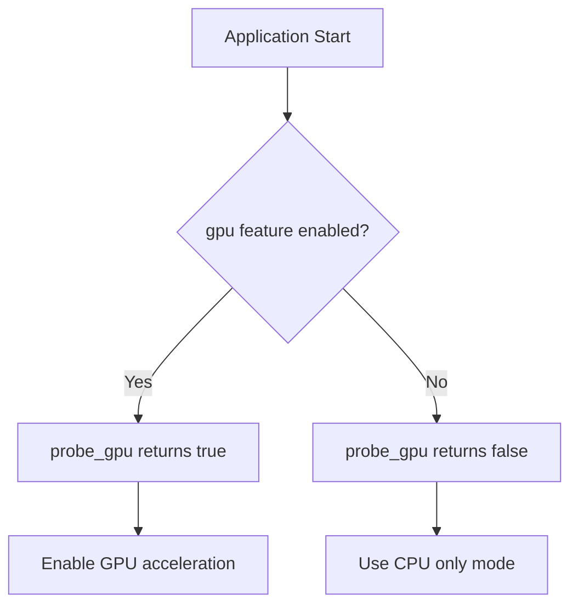
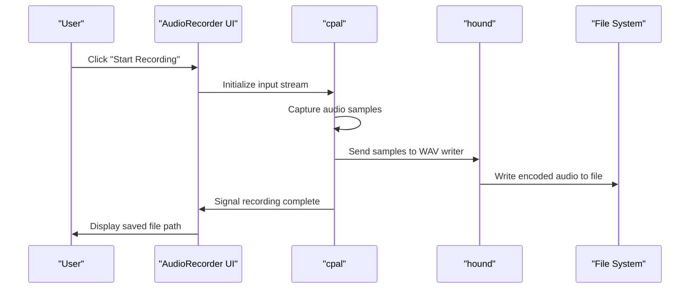
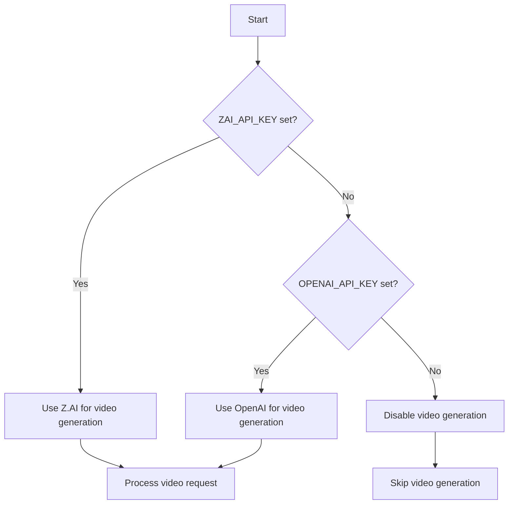

# System Requirements & External Tools

<cite>
**Referenced Files in This Document**   
- [README.md](file://README.md)
- [Cargo.toml](file://Cargo.toml)
- [src/coqui_tts.rs](file://src/coqui_tts.rs)
- [python/kokoro_bridge.py](file://python/kokoro_bridge.py)
- [abogen-ui/crates/ui/services/gpu_probe.rs](file://abogen-ui/crates/ui/services/gpu_probe.rs)
- [abogen-ui/crates/ui/components/audio_recorder.rs](file://abogen-ui/crates/ui/components/audio_recorder.rs)
- [abogen-ui/crates/ui/services/tts_service.rs](file://abogen-ui/crates/ui/services/tts_service.rs)
- [verify.sh](file://verify.sh)
- [COQUI_USAGE_GUIDE.md](file://COQUI_USAGE_GUIDE.md)
- [src/tts.rs](file://src/tts.rs)
- [src/video.rs](file://src/video.rs)
- [abogen-ui/crates/ui/services/zai_video.rs](file://abogen-ui/crates/ui/services/zai_video.rs)
</cite>

## Table of Contents
1. [Introduction](#introduction)
2. [Text-to-Speech Dependencies](#text-to-speech-dependencies)
3. [GPU Acceleration Support](#gpu-acceleration-support)
4. [Audio System Dependencies](#audio-system-dependencies)
5. [Environment Variables](#environment-variables)
6. [Verification and Integration Testing](#verification-and-integration-testing)
7. [Common System Issues and Solutions](#common-system-issues-and-solutions)

## Introduction
VoxWeave is a Rust-first text-to-speech pipeline that relies on several external tools and runtime environments to provide comprehensive TTS functionality. This document details the system-level requirements for running VoxWeave, including dependencies for fallback TTS, GPU acceleration, audio recording, and environment configuration. The system supports multiple TTS engines, with espeak-ng serving as the fallback option, and provides advanced features like voice cloning and AI video generation when additional dependencies are installed.

## Text-to-Speech Dependencies

### espeak-ng Installation
The espeak-ng speech synthesizer is required as the default fallback TTS engine. It must be available in the system PATH or its location specified via environment variable.

**Installation Commands:**
```bash
# Ubuntu/Debian
sudo apt install espeak-ng

# macOS
brew install espeak-ng

# Arch Linux
sudo pacman -S espeak-ng

# Fedora
sudo dnf install espeak-ng
```

The system checks for espeak-ng availability during voice enumeration and conversion processes. If espeak-ng is not found, the system will fail to list built-in voices and perform basic TTS operations.

**Environment Override:**
- `VOXWEAVE_ESPEAK_COMMAND`: Override the espeak-ng executable name or path

**Section sources**
- [README.md](file://README.md#L20-L25)
- [src/tts.rs](file://src/tts.rs#L101-L150)

## GPU Acceleration Support

### CUDA and MPS Configuration
VoxWeave supports GPU-accelerated inference through the 'gpu' feature flag, enabling hardware acceleration for CoquiTTS and video processing pipelines. The system automatically detects available GPU backends based on the target platform.

**Feature Flag:**
- `gpu`: Enables GPU acceleration support in the build configuration

**Platform-Specific GPU Support:**

#### NVIDIA CUDA (Linux/Windows)
For NVIDIA GPUs, CUDA acceleration is enabled by setting the device to "cuda" in the CoquiTTS configuration. This requires:
- NVIDIA GPU with CUDA support
- CUDA toolkit installed
- PyTorch with CUDA support

```bash
# Install PyTorch with CUDA support
pip install torch torchvision torchaudio --index-url https://download.pytorch.org/whl/cu118
```

#### Apple Silicon MPS
For Apple Silicon Macs, Metal Performance Shaders (MPS) provide GPU acceleration. This is automatically detected and used when available.

```bash
# Configure CoquiTTS to use MPS
export VOXWEAVE_COQUI_DEVICE="mps"
```

The gpu_probe service returns true when the gpu feature is enabled, indicating that GPU acceleration is available for use by the TTS and video generation components.



**Diagram sources**
- [abogen-ui/crates/ui/services/gpu_probe.rs](file://abogen-ui/crates/ui/services/gpu_probe.rs#L0-L24)
- [COQUI_USAGE_GUIDE.md](file://COQUI_USAGE_GUIDE.md#L433-L487)

**Section sources**
- [abogen-ui/crates/ui/services/gpu_probe.rs](file://abogen-ui/crates/ui/services/gpu_probe.rs#L0-L24)
- [COQUI_USAGE_GUIDE.md](file://COQUI_USAGE_GUIDE.md#L433-L487)
- [src/coqui_tts.rs](file://src/coqui_tts.rs#L0-L115)

## Audio System Dependencies

### cpal and hound Integration
For voice cloning functionality, VoxWeave uses cpal for audio input capture and hound for WAV file encoding. These dependencies are conditionally compiled when the coqui-tts feature is enabled.

**Audio Recording Workflow:**
1. Access the default input device via cpal
2. Configure recording parameters (sample rate, channels)
3. Capture audio data in real-time
4. Encode and write to WAV file using hound
5. Save recording for voice cloning reference

The AudioRecorder component provides a user interface for capturing voice samples, with recordings saved to the Desktop directory by default. The component is only available when the coqui-tts feature is enabled during compilation.



**Diagram sources**
- [abogen-ui/crates/ui/components/audio_recorder.rs](file://abogen-ui/crates/ui/components/audio_recorder.rs#L25-L141)
- [abogen-ui/crates/ui/components/audio_recorder.rs](file://abogen-ui/crates/ui/components/audio_recorder.rs#L275-L325)

**Section sources**
- [abogen-ui/crates/ui/components/audio_recorder.rs](file://abogen-ui/crates/ui/components/audio_recorder.rs#L25-L141)
- [abogen-ui/Cargo.lock](file://abogen-ui/Cargo.lock#L794-L851)

## Environment Variables

### API Keys and Configuration
VoxWeave requires several environment variables for external service integration and system configuration.

**TTS and Voice Cloning:**
- `VOXWEAVE_COQUI_PYTHON`: Python command for CoquiTTS (default: python3)
- `VOXWEAVE_COQUI_MODEL`: TTS model identifier (default: tts_models/multilingual/multi-dataset/xtts_v2)
- `VOXWEAVE_COQUI_DEVICE`: Inference device (cpu, cuda, mps)
- `VOXWEAVE_COQUI_SAMPLE_RATE`: Audio sample rate (default: 24000)
- `VOXWEAVE_COQUI_LANGUAGE`: Default language for synthesis (default: en)

**Video Generation:**
- `ZAI_API_KEY`: API key for Z.AI video generation service
- `OPENAI_API_KEY`: API key for OpenAI video generation service (fallback)

**Python Path Configuration:**
- `VOXWEAVE_KOKORO_PYTHON`: Python interpreter path for Kokoro bridge
- `VOXWEAVE_COQUI_PYTHON`: Python interpreter path for CoquiTTS

When both ZAI_API_KEY and OPENAI_API_KEY are set, the system prioritizes OpenAI for video generation. If neither is set, video generation features are disabled.



**Diagram sources**
- [src/video.rs](file://src/video.rs#L45-L81)
- [abogen-ui/crates/ui/services/zai_video.rs](file://abogen-ui/crates/ui/services/zai_video.rs#L49-L94)

**Section sources**
- [src/video.rs](file://src/video.rs#L45-L81)
- [abogen-ui/crates/ui/services/zai_video.rs](file://abogen-ui/crates/ui/services/zai_video.rs#L49-L94)
- [COQUI_USAGE_GUIDE.md](file://COQUI_USAGE_GUIDE.md#L433-L487)

## Verification and Integration Testing

### System Verification with verify.sh
The verify.sh script provides comprehensive system verification, testing all critical components and integrations.

**Verification Steps:**
1. **Build Test**: Compiles the project to ensure all dependencies are available
2. **Unit Tests**: Runs the complete test suite (17 tests)
3. **CLI Interface**: Checks help command functionality
4. **Voice Listing**: Verifies TTS engine can enumerate available voices
5. **Conversion Test**: Performs mock conversion to validate pipeline

```bash
#!/bin/bash
# verify.sh - Final Verification Test

# Test 1: Build compilation
cargo build --quiet

# Test 2: Unit tests
cargo test --lib --quiet

# Test 3: CLI help command
./target/debug/voxweave --help

# Test 4: List voices
./target/debug/voxweave list-voices

# Test 5: Convert with mock
./target/debug/voxweave convert samples/example.txt --mock --voice en-us --output samples/test_output
```

A successful verification indicates the system is fully operational with all dependencies properly configured.

**Section sources**
- [verify.sh](file://verify.sh#L0-L140)
- [QUICKSTART.md](file://QUICKSTART.md#L192-L216)

## Common System Issues and Solutions

### Missing Binaries and PATH Issues
**Issue**: "espeak-ng not found" or similar command execution errors
**Solution**: Ensure espeak-ng is installed and in PATH, or set VOXWEAVE_ESPEAK_COMMAND

**Issue**: Python dependencies not found
**Solution**: Install required Python packages:
```bash
pip install TTS torch numpy
```

### Permission Errors
**Microphone Access**: On macOS, grant microphone permission in System Preferences → Security & Privacy → Microphone
**File System Access**: Ensure the application has write permissions to output directories

### GPU Configuration Problems
**CUDA Out of Memory**: Reduce batch size or switch to CPU mode:
```bash
export VOXWEAVE_COQUI_DEVICE="cpu"
```

**MPS Not Available**: Ensure running on Apple Silicon Mac with macOS 12.0+ and PyTorch 1.13+

### Python Path Configuration
When multiple Python versions are installed, explicitly set the Python command:
```bash
export VOXWEAVE_COQUI_PYTHON="/usr/bin/python3.9"
export VOXWEAVE_KOKORO_PYTHON="/usr/bin/python3.9"
```

### Verification Failure Troubleshooting
If verify.sh fails, check:
1. Rust toolchain is properly installed (rustc 1.80+)
2. espeak-ng is available in PATH
3. Python 3.9+ is installed with required packages
4. Environment variables are correctly set
5. Build artifacts are not corrupted (try cargo clean)

**Section sources**
- [README.md](file://README.md#L20-L25)
- [COQUI_USAGE_GUIDE.md](file://COQUI_USAGE_GUIDE.md#L433-L487)
- [verify.sh](file://verify.sh#L0-L140)
- [src/tts.rs](file://src/tts.rs#L0-L58)