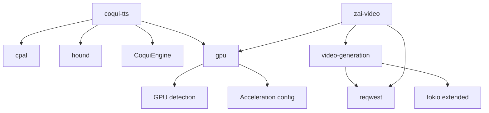
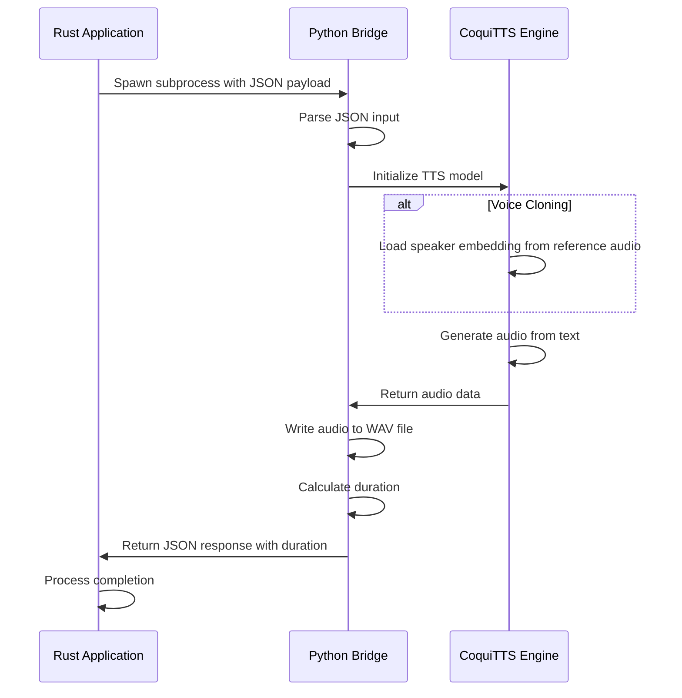

# Technology Stack & Dependencies

<cite>
**Referenced Files in This Document**   
- [Cargo.toml](file://Cargo.toml)
- [src/coqui_tts.rs](file://src/coqui_tts.rs)
- [src/tts.rs](file://src/tts.rs)
- [abogen-ui/crates/ui/Cargo.toml](file://abogen-ui/crates/ui/Cargo.toml)
- [abogen-ui/apps/desktop/Cargo.toml](file://abogen-ui/apps/desktop/Cargo.toml)
- [abogen-ui/crates/ui/components/audio_recorder.rs](file://abogen-ui/crates/ui/components/audio_recorder.rs)
- [abogen-ui/crates/ui/services/tts_service.rs](file://abogen-ui/crates/ui/services/tts_service.rs)
- [python/kokoro_bridge.py](file://python/kokoro_bridge.py)
- [test_coqui.py](file://test_coqui.py)
- [COQUI_TTS_IMPLEMENTATION.md](file://COQUI_TTS_IMPLEMENTATION.md)
- [VIDEO_CLI_IMPLEMENTATION.md](file://VIDEO_CLI_IMPLEMENTATION.md)
- [abogen-ui/ZAI_VIDEO_FEATURE.md](file://abogen-ui/ZAI_VIDEO_FEATURE.md)
</cite>

## Table of Contents
1. [Introduction](#introduction)
2. [Core Rust Dependencies](#core-rust-dependencies)
3. [Python TTS Dependencies](#python-tts-dependencies)
4. [System Requirements](#system-requirements)
5. [Feature Flags](#feature-flags)
6. [Python Bridge Integration](#python-bridge-integration)
7. [Version Compatibility and Installation](#version-compatibility-and-installation)
8. [Conclusion](#conclusion)

## Introduction
The VoxWeave application is a Rust-based platform with a Dioxus UI framework and Python bridges for advanced voice synthesis capabilities. This document details the technology stack, focusing on the integration of Rust and Python components for text-to-speech (TTS), voice cloning, and video generation. The architecture leverages feature flags to enable optional functionality, allowing users to customize their build based on hardware capabilities and use cases. The system combines local audio processing with remote API calls to Z.AI for video generation, creating a comprehensive multimedia pipeline.

## Core Rust Dependencies

### Dioxus 0.5 for Cross-Platform UI
Dioxus serves as the primary UI framework for VoxWeave, enabling cross-platform application development. It supports desktop, mobile, and web targets through a unified codebase. The framework is integrated with the `abogen-ui` crate, which provides a cyberpunk-themed interface with components like `AudioRecorder`, `NeonButton`, and `LogPanel`. Dioxus handles state management, event handling, and rendering across all platforms, with platform-specific features enabled through conditional compilation.

### clap for CLI Argument Parsing
The `clap` crate provides command-line interface argument parsing for the VoxWeave CLI. It enables users to specify input files, output directories, voice profiles, and generation parameters through command-line options. The library's derive feature simplifies the creation of complex command structures with subcommands like `convert` and `video`, each with their own set of configurable options for audio and video generation workflows.

### tokio for Async Runtime
Tokio serves as the asynchronous runtime for VoxWeave, enabling non-blocking I/O operations and concurrent processing. It's used extensively for network requests to the Z.AI API during video generation, file system operations, and process management when interfacing with Python bridges. The runtime features include multi-threaded execution, file system access, time-based operations, and process spawning, which are essential for maintaining responsive UI performance while executing long-running tasks.

### reqwest for HTTP API Calls to Z.AI
Reqwest is the HTTP client library used for communicating with the Z.AI API to generate AI-powered videos. It supports multipart form data for file uploads and JSON serialization for API requests. The library is conditionally compiled with the `video-generation` and `zai-video` feature flags, allowing the application to make authenticated POST requests to create video generation jobs and GET requests to poll job status. This integration enables the creation of videos with synchronized narration, subtitles, and AI-generated visuals.

### serde for Serialization
Serde provides serialization and deserialization capabilities for JSON data exchange between Rust and Python components. It's used to serialize TTS parameters (text, voice, speed, output path) into JSON payloads that are passed to Python bridge scripts via stdin. The library also deserializes JSON responses containing metadata like audio duration. Serde's derive feature simplifies the implementation of serialization for complex types like `VoiceProfile` and `SubtitleEntry`, ensuring type-safe data exchange across the Rust-Python boundary.

### cpal and hound for Audio Recording
The `cpal` and `hound` crates enable microphone audio recording for voice cloning functionality. Cpal provides cross-platform access to audio input devices, capturing raw audio samples in various formats (F32, I16, U16). Hound handles the encoding of these samples into WAV format with appropriate headers and metadata. Together, they form the foundation of the `AudioRecorder` component, which captures 5-second voice samples for CoquiTTS voice cloning. These dependencies are conditionally compiled with the `coqui-tts` feature flag, making them optional for users who don't require voice cloning capabilities.

**Section sources**
- [Cargo.toml](file://Cargo.toml#L1-L27)
- [abogen-ui/crates/ui/Cargo.toml](file://abogen-ui/crates/ui/Cargo.toml#L1-L35)
- [abogen-ui/crates/ui/components/audio_recorder.rs](file://abogen-ui/crates/ui/components/audio_recorder.rs#L1-L328)
- [src/tts.rs](file://src/tts.rs#L1-L523)

## Python TTS Dependencies

### TTS for Coqui Voice Synthesis
The CoquiTTS library provides the core voice synthesis engine for advanced TTS capabilities, including voice cloning. It's accessed through the `TTS.api` module, which loads pre-trained models like `tts_models/multilingual/multi-dataset/xtts_v2` for multilingual text-to-speech conversion. The library supports both standard voice synthesis and voice cloning by providing a reference audio file (`speaker_wav`) during synthesis. This enables personalized voice generation that mimics a specific speaker's characteristics.

### torch for Deep Learning Inference
PyTorch serves as the deep learning framework powering CoquiTTS, handling the neural network inference required for voice synthesis. It manages GPU acceleration through CUDA (NVIDIA) or MPS (Apple Silicon) when available, significantly improving synthesis speed. The framework loads the XTTS model weights and performs the forward pass to generate mel-spectrograms from text input, which are then converted to audio waveforms. Torch also handles the voice cloning process by extracting speaker embeddings from reference audio.

### numpy for Audio Data Processing
NumPy provides the numerical computing foundation for audio data manipulation in the Python bridge scripts. It handles the conversion of audio tensors from PyTorch to numpy arrays, concatenation of audio segments, clipping of audio values to prevent distortion, and conversion to 16-bit integer format for WAV file storage. The library's efficient array operations ensure smooth processing of audio data during synthesis, particularly when combining multiple audio segments or applying post-processing effects.

**Section sources**
- [test_coqui.py](file://test_coqui.py#L1-L141)
- [python/kokoro_bridge.py](file://python/kokoro_bridge.py#L1-L90)
- [src/coqui_tts.rs](file://src/coqui_tts.rs#L1-L116)
- [src/tts.rs](file://src/tts.rs#L1-L523)

## System Requirements

### espeak-ng Installation
The espeak-ng speech engine is required for basic text-to-speech functionality when using the default `espeak` voice engine. It must be installed on the system and available in the PATH as either `espeak` or the command specified in the `VOXWEAVE_ESPEAK_COMMAND` environment variable. This dependency provides fallback TTS capabilities when Python bridges are not available or when minimal system requirements are needed. The engine supports multiple languages and voices through voice files that can be specified in the `VoiceProfile` configuration.

### GPU Acceleration Support
VoxWeave supports hardware acceleration through multiple technologies:
- **CUDA**: For NVIDIA GPUs, enabling GPU-accelerated inference in CoquiTTS through PyTorch
- **MPS**: For Apple Silicon (M1/M2) Macs, providing GPU acceleration through Apple's Metal Performance Shaders
- **CPU Fallback**: When no GPU is available, the system automatically falls back to CPU-based processing

GPU acceleration is controlled through the `VOXWEAVE_COQUI_DEVICE` environment variable, which can be set to `cuda`, `mps`, or `cpu`. The `gpu` feature flag enables additional GPU probing functionality in the UI to detect available hardware acceleration options. This allows for significantly faster voice synthesis and cloning operations, particularly with large models like XTTS.

**Section sources**
- [COQUI_TTS_IMPLEMENTATION.md](file://COQUI_TTS_IMPLEMENTATION.md#L1-L153)
- [src/coqui_tts.rs](file://src/coqui_tts.rs#L1-L116)
- [abogen-ui/crates/ui/Cargo.toml](file://abogen-ui/crates/ui/Cargo.toml#L1-L35)

## Feature Flags

### 'coqui-tts' for Voice Cloning
The `coqui-tts` feature enables voice cloning functionality by including the necessary Rust and Python dependencies. When activated, it compiles the `CoquiEngine` implementation, includes the `cpal` and `hound` crates for audio recording, and embeds the CoquiTTS bridge script. This feature allows users to capture voice samples through the `AudioRecorder` component and use them to create cloned voices that mimic specific speakers. The feature is required for any voice cloning operations and enables the `VoiceEngine::Coqui` variant in the TTS pipeline.

### 'video-generation' for Z.AI Integration
The `video-generation` feature enables basic video generation capabilities by including the `reqwest` and extended `tokio` dependencies. It activates the video command in the CLI and the video generation service in the UI, allowing users to create videos from text input by leveraging the Z.AI API. This feature handles the complete video generation pipeline: audio synthesis, subtitle generation, API communication, job polling, and video download. It serves as a prerequisite for more advanced video features.

### 'zai-video' for Enhanced Video Features
The `zai-video` feature builds upon `video-generation` to provide enhanced video capabilities, including style selection, custom prompts, and MLT-based composition. It enables the generation of videos with specific visual styles (cyberpunk, biotech, educational) and the integration of locally generated audio and subtitles with remotely generated video content. This feature requires both `reqwest` and `video-generation`, creating a dependency chain that ensures all necessary components are available for advanced video workflows.

### 'gpu' for Hardware Acceleration
The `gpu` feature enables GPU detection and acceleration capabilities in the application. It includes functionality to probe available GPU hardware (CUDA, MPS) and configure the TTS engines to utilize GPU acceleration when possible. This feature improves performance for computationally intensive operations like voice synthesis and cloning, particularly with large neural network models. It works in conjunction with the `coqui-tts` feature to maximize performance when both voice cloning and GPU acceleration are enabled.



**Diagram sources**
- [Cargo.toml](file://Cargo.toml#L1-L27)
- [abogen-ui/crates/ui/Cargo.toml](file://abogen-ui/crates/ui/Cargo.toml#L1-L35)
- [abogen-ui/apps/desktop/Cargo.toml](file://abogen-ui/apps/desktop/Cargo.toml#L1-L14)

**Section sources**
- [Cargo.toml](file://Cargo.toml#L1-L27)
- [abogen-ui/crates/ui/Cargo.toml](file://abogen-ui/crates/ui/Cargo.toml#L1-L35)
- [abogen-ui/apps/desktop/Cargo.toml](file://abogen-ui/apps/desktop/Cargo.toml#L1-L14)

## Python Bridge Integration

### Bridge Scripts Architecture
The Python bridge architecture enables seamless integration between Rust and Python components through stdin/stdout communication. Two primary bridge scripts are implemented:
- `kokoro_bridge.py`: Handles basic TTS synthesis with the Kokoro engine
- Embedded CoquiTTS script: Handles advanced TTS with voice cloning capabilities

These scripts are invoked as subprocesses from Rust, receiving JSON payloads via stdin and returning results via stdout. This architecture isolates Python dependencies from the main Rust application, allowing for flexible updates and maintenance of the TTS engines without recompiling the entire application.

### JSON-Based Communication Protocol
The communication protocol between Rust and Python follows a standardized JSON format:
- **Input Payload**: Contains text to synthesize, output path, sample rate, model name, device, language, speed, and optional speaker reference
- **Output Response**: Contains duration metadata and success status
- **Error Handling**: Errors are communicated through stderr with descriptive messages

The protocol enables type-safe data exchange with serde serialization in Rust and standard JSON libraries in Python. This approach ensures robust error handling and allows for future extension of the protocol with additional parameters without breaking compatibility.



**Diagram sources**
- [python/kokoro_bridge.py](file://python/kokoro_bridge.py#L1-L90)
- [src/coqui_tts.rs](file://src/coqui_tts.rs#L1-L116)
- [src/tts.rs](file://src/tts.rs#L1-L523)

**Section sources**
- [python/kokoro_bridge.py](file://python/kokoro_bridge.py#L1-L90)
- [src/coqui_tts.rs](file://src/coqui_tts.rs#L1-L116)
- [src/tts.rs](file://src/tts.rs#L1-L523)

## Version Compatibility and Installation

### Cargo.toml Dependency Structure
The workspace uses a hierarchical dependency structure with optional features to manage complexity:

```toml
[dependencies]
clap = { version = "4", features = ["derive"] }
serde = { version = "1", features = ["derive"] }
tokio = { version = "1", features = ["rt", "rt-multi-thread", "fs", "io-util", "time", "process"], optional = true }
reqwest = { version = "0.11", features = ["multipart", "json"], optional = true }

[features]
default = []
coqui-tts = []
video-generation = ["tokio", "reqwest"]
```

This structure shows how optional dependencies are activated through feature flags, with `video-generation` depending on both `tokio` and `reqwest`. The `coqui-tts` feature has no direct dependencies listed in the root Cargo.toml as they are managed in the UI crate, demonstrating a layered approach to feature management across the workspace.

### Installation Requirements
To install and use VoxWeave with full functionality:

1. **Rust Dependencies**: Install via Cargo with appropriate feature flags:
```bash
cargo build --features "coqui-tts video-generation zai-video gpu"
```

2. **Python Dependencies**: Install through pip:
```bash
pip install TTS torch numpy
```

3. **System Dependencies**: 
   - Install espeak-ng: `brew install espeak-ng` (macOS) or `sudo apt-get install espeak-ng` (Linux)
   - Install FFmpeg for subtitle embedding: `brew install ffmpeg` or `sudo apt-get install ffmpeg`

4. **Environment Variables**: Configure optional settings:
```bash
export VOXWEAVE_COQUI_PYTHON="python3"
export VOXWEAVE_COQUI_DEVICE="cuda"  # or "mps" for Apple Silicon
export ZAI_API_KEY="your_api_key_here"
```

**Section sources**
- [Cargo.toml](file://Cargo.toml#L1-L27)
- [abogen-ui/crates/ui/Cargo.toml](file://abogen-ui/crates/ui/Cargo.toml#L1-L35)
- [test_coqui.py](file://test_coqui.py#L1-L141)
- [COQUI_TTS_IMPLEMENTATION.md](file://COQUI_TTS_IMPLEMENTATION.md#L1-L153)

## Conclusion
The VoxWeave technology stack represents a sophisticated integration of Rust and Python ecosystems, combining the performance and safety of Rust with the machine learning capabilities of Python. The architecture leverages feature flags to create a modular system where users can enable only the components they need, from basic text-to-speech to advanced voice cloning and AI video generation. The Dioxus UI provides a consistent cross-platform experience, while the Python bridge pattern enables flexible integration with state-of-the-art TTS models. System requirements are clearly defined, with fallbacks available for users without GPU acceleration or specific system dependencies. This design allows VoxWeave to serve both casual users who need simple audio generation and power users who require advanced voice cloning and video production capabilities.